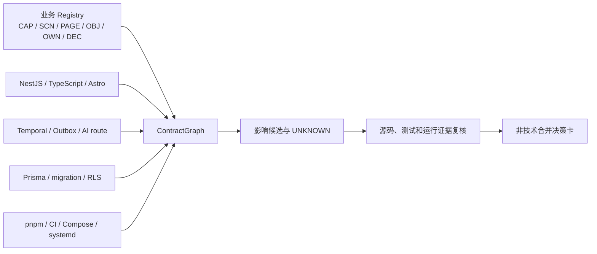

# ContractGraph 使用与边界

> 文档 ID：`GUIDE-AIDEV-004`
> 层级：`L5 / Guide`
> 生命周期：`GUIDE`
> 维护 Owner：`OWN-DOC-GOV（当前 UNASSIGNED）`
> 产品批准：[`DEC-AIDEV-003`](../governance/conflict-register.md#11-aidev-gate-1-已批准决策)
> 最后核验：2026-07-25，`origin/main@85ea6e6b4f0e00785ce17f9ba0301ce6206b535c` + `codex/contract-graph` 实施候选

## 1. 结论

ContractGraph 是当前 worktree 的可丢弃影响地图，不是项目真值。它先回答“这个改动可能影响哪些 Capability、场景、API、事件、工作流、数据、测试和部署入口”，再由 Codex 回到当前源码、机器合同、测试与运行证据核实。



`OWN-*` 是责任帽，不是实际人员。仓库没有记录真实负责人的节点必须显示 `assignee=UNASSIGNED`；图谱不得把角色存在解释成已有人批准。

## 2. 当前覆盖

| 提取面 | 当前输出 | 不能证明 |
|---|---|---|
| 治理 Registry | Capability、Scenario、Page、Object、Decision、Owner 与引用 | 产品状态自动升级或真实人员批准 |
| TypeScript / NestJS | 文件、符号、import、Controller route、Module、constructor DI | 运行时条件分支和容器实际解析结果 |
| Temporal | `workflows.ts` 真实导出、proxy Activity、client start、worker factory、Schedule | workflow history 已执行或 Activity 成功 |
| Outbox | `eventType` 发布与明确 `eventType` switch 消费 | 外部 SaaS 已拉取、ACK 或正确处理 |
| Prisma | model/table、relation、migration、由 migration SQL 证明的 RLS、常见 client 读写 | SQL 运行计划、触发器效果和真实数据状态 |
| AI / 外部边界 | task ID、model-policy/Broker/Provider 静态分支与动态机制、非测试源码中的 URL 候选 | 实际模型路由、kill switch、Secret、配额、许可或外部可用性 |
| workspace / deployment | package 依赖、tsconfig alias、Astro render、CI job、Compose/systemd | 目标环境已部署或健康 |

生成代码只记录生成源或依赖，不重复索引 `dist`、`node_modules` 和已声明 generated 目录。`.env`、凭据、构建产物、测试截图和临时目录排除在 source hash 与派生图之外。

## 3. 命令

在要回答问题的 worktree 内运行：

```bash
pnpm code-intelligence:scan
pnpm --filter @global/code-intelligence exec tsx src/cli.ts status --repo ../..
pnpm --filter @global/code-intelligence exec tsx src/cli.ts query CAP-SITE-BUILD-001 --repo ../..
pnpm --filter @global/code-intelligence exec tsx src/cli.ts impact apps/api/src/site-builder/builds.controller.ts --repo ../..
```

`scan` 原子写入：

```text
.code-intelligence/
├── graph-v1.json
├── coverage-v1.json
├── diagnostics-v1.json
└── manifest-v1.json
```

这些文件被 Git 忽略，不承担备份职责。`query` 和 `status` 会重新计算当前 worktree、commit 与 source hash；不匹配即返回 `WRONG_WORKTREE` 或 `STALE_GRAPH`，拒绝用 main 图回答功能分支问题。
`manifest-v1.json` 绑定派生文件哈希；手工篡改 JSON 或 schema/content 形状不完整时查询同样拒绝。`impact` 只做高精度、两跳的 ContractGraph 基线：输出仍标 `INFERRED/UNKNOWN`；PR 3 才合并 CodeGraph 与 Git diff 的更深影响分析。

CI 使用：

```bash
pnpm code-intelligence:test
pnpm code-intelligence:check
```

`check` 在内存中完整构建两次，要求字节等价，并拒绝 error 级诊断。它只增加验证，不能据此跳过 API、契约、Renderer 或现有完整 CI。

## 4. 动态机制登记

动态行为登记在 `packages/code-intelligence/dynamic-mechanisms.json`。每项必须是：

- `EXTRACTOR`：已有确定性提取器；
- `DETERMINISTIC_TEST`：无法静态展开，但有完整性测试；
- `TEMPORARY_EXCEPTION`：记录责任帽、真实 assignee 和到期日。

新增动态字符串分派、注册表、插件发现或运行时路由时，在实现附近加入：

```text
@dynamic-mechanism <registry-id>
```

未登记 ID 产生 `UNCLAIMED_DYNAMIC_MECHANISM` 并阻断 CI。除此之外，生产源码中的 Temporal/Outbox/函数注册表/计算分派/dynamic import/反射等通用动态表面必须被 Registry pattern 或附近已登记 marker 覆盖；只声明不存在的 extractor、`EXTRACTOR` 零匹配和临时例外到期也会阻断。测试与 `verify-*` 夹具不被误报成生产动态机制或真实外部路由。责任帽存在但未记录真实人员只产生可见的 `UNASSIGNED` 信息，不伪造批准。

## 5. 正确使用顺序

1. 确认查询的是当前 worktree，并运行 `status`。
2. 对改动文件先运行 `impact`；它从 canonical Traceability Matrix 的显式边返回 Capability、Scenario、Page、实现锚和测试候选，再用稳定 ID 查询第一张地图。
3. 打开返回的精确文件和行，核对当前分支源码。
4. 对动态边使用完整性测试；对真实发生使用 API correlation ID、Temporal workflow ID、Outbox event ID、migration 与健康证据。
5. 仍无法证明的外部仓库、消费者和运行状态写成 `UNKNOWN/EXTERNAL_OWNED`。
6. 影响分析只能增加建议测试，不能减少现有测试。

发生冲突时，优先级是：业务/产品 Registry 与 ADR → 当前分支机器合同和源码 → 当前环境运行证据 → ContractGraph 派生认知。派生图永远不能覆盖前三层。

## 6. 退出与下一阶段

ContractGraph 不需要常驻服务、数据库或网络；删除 `.code-intelligence/` 即可退出并回到 `rg + 文件阅读`。PR 3 才会在独立 worktree 固定 CodeGraph 版本、隔离 main/活跃分支索引，并用 30 个黄金问题比较静态图、ContractGraph、Git diff 与源码基线。未达到准确率、动态边召回、分支识别、泄漏和时延门时，不把 CodeGraph 设为默认工具。
