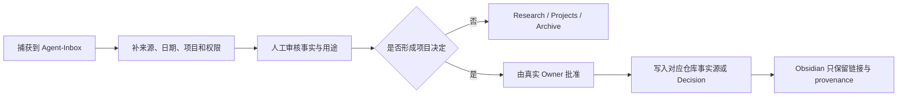

# 记忆、知识与派生认知政策

> 文档 ID：`GUIDE-AIDEV-003`
> 层级：`L5 / Guide`
> 生命周期：`GUIDE`
> 维护 Owner：`OWN-DOC-GOV（当前 UNASSIGNED）`
> 产品批准：`OWN-PRODUCT`，2026-07-24 明确批准第一阶段制度建设
> 最后核验：2026-07-24，`origin/main@d0e3d929130212b078f14f8254685852fd00012c`

## 1. 结论

Git 仓库继续保存项目权威真值；Obsidian 适合作为人的知识工作台；文档语义检索、代码图和代理记忆属于可丢弃或可重建的认知辅助。任何辅助层都不能因为“更方便搜索”而覆盖产品边界、当前状态、ADR、机器合同、当前分支代码或运行证据。

本指南只批准治理原则，不批准安装或接入工具。任何工具试点必须先通过仓库的 OSS/外部能力登记、权限与副作用审查，并形成独立任务。

## 2. 五层真值

| 层次     | 解决什么                     | 规范载体                                             | 能否覆盖上层                  |
| -------- | ---------------------------- | ---------------------------------------------------- | ----------------------------- |
| 业务真值 | 为什么做、给谁做、怎样算成功 | 产品负责人批准的需求、Capability、Scenario、Decision | 同主题由真实 Owner 决定       |
| 产品真值 | 范围、旅程、页面、状态和交互 | Git 内当前产品与设计文档                             | 不能覆盖业务批准和机器事实    |
| 技术真值 | 架构、接口、数据和承重决策   | 代码、OpenAPI、Schema、ADR、运行证据                 | 同主题按 Owner 和机器合同判断 |
| 派生认知 | 搜索、调用链、影响范围和摘要 | QMD、CodeGraph、索引、AI 分析                        | 不能覆盖前三层                |
| 长期知识 | 研究、会议、想法、经验和导航 | Obsidian、受控 Memory、历史记录                      | 不能自动晋升为当前决定        |

“下层不能覆盖上层”不是说文档一定高于代码，而是说每类事实回到自己的唯一 Owner。当前实现问题以当前分支代码、机器合同和运行证据为准；产品承诺问题以产品 Owner 和权威文档为准。

## 3. 代理的检索顺序

回答项目问题或开始施工时，默认按以下顺序核验：

1. 当前 Git 分支、worktree、提交、活 PR、代码与运行状态；
2. 与主题对应的权威文档和机器合同；
3. 当前规范、Registry、runbook 和已批准指南；
4. 交接记录、受控 Memory、Obsidian 笔记和历史证据；
5. 外部研究、竞品材料和工具生成的派生图。

第 4、5 层用于发现线索和降低检索成本。只要可能随时间或分支变化，就必须回到前 1–3 层验证。无法验证时，应标为“记忆来源、可能过期”或 `UNKNOWN`，不能用流畅表述掩盖不确定性。

## 4. Git 仓库与 Obsidian 的边界

### 4.1 Git 仓库

仓库继续保存：

- 当前产品范围、状态、架构、ADR 和路线；
- API、Schema、代码、测试和运行规则；
- 稳定 ID、责任和追踪关系；
- 可审计的实施与发布证据；
- 与代码版本必须同步演进的指南。

不得把这些内容迁出仓库后只在 Obsidian 维护，也不得在 Obsidian 长期复制一份“当前项目状态”作为平行真值。

### 4.2 Obsidian

Obsidian 可以保存：

- 市场、竞品和技术研究；
- 会议记录、产品灵感和待整理问题；
- 尚未批准的方案和跨项目知识；
- 项目导航、历史背景和对权威文件的链接；
- 经人工确认的经验总结。

建议使用独立知识库和以下权限分区：

```text
Obsidian/
├── Agent-Inbox/       # 代理可写，未经审核
├── Research/          # 人工审核后的研究
├── Decisions/         # 只能由批准流程产生
├── Projects/          # 项目导航，不复制动态当前状态
└── Archive/           # 过期或仅保留 provenance
```

代理自动写入只能进入 `Agent-Inbox/`。聊天结论、AI 摘要或研究推荐不得直接进入 `Decisions/`，也不得自动修改仓库权威文档。

## 5. 记忆条目的最低元数据

需要长期保存的条目至少记录：

| 字段            | 目的                                               |
| --------------- | -------------------------------------------------- |
| `type`          | research、meeting、lesson、proposal、navigation 等 |
| `project`       | 防止跨项目误用                                     |
| `authority`     | authoritative、derived、external、unverified       |
| `status`        | inbox、reviewed、approved、superseded、archived    |
| `source`        | 文件、URL、任务或责任人                            |
| `source_commit` | 与仓库事实相关时固定来源提交                       |
| `valid_as_of`   | 说明核验时间                                       |
| `review_after`  | 对易漂移事实设置复核时间                           |
| `owner`         | 谁能确认、晋升或废止                               |

不得把 Secret、访问令牌、私钥、完整个人数据、客户敏感正文或未经授权的受版权保护材料写入通用记忆。敏感信息只能保存在其受控系统，通过脱敏索引引用。

## 6. 知识晋升流程



记忆系统可以提出“这个结论可能值得晋升”，但不能自行批准。权威文件发生变化时，不要求把所有历史笔记改写成新事实；应标记过期、建立替代链接，并保证日常入口指向当前 Owner。

## 7. 候选工具的定位与准入门

以下是定位和触发条件，不是当前采用状态。正式安装前，必须在 [OSS / 外部能力注册表](../backend/oss-registry.md)建立或更新 Card，核验版本、许可证、数据流、遥测、写权限、安装副作用、Owner 和退出门。

| 候选                | 只允许承担                         | 禁止承担                                 | 重新评估触发器                     |
| ------------------- | ---------------------------------- | ---------------------------------------- | ---------------------------------- |
| Obsidian            | 人的知识工作台和导航               | 项目当前状态、机器合同或自动批准         | 建立独立 Vault、备份和权限分区     |
| QMD                 | 对指定 Markdown 的只读检索试点     | 自动改笔记、替代权威搜索                 | 中文检索有明确收益且资源成本可接受 |
| CodeGraph           | 当前 worktree 的代码关系和影响分析 | 用 main 图回答分支、把图当运行事实       | 真实调用链问题的准确率优于基线     |
| Basic Memory 类工具 | 独立 Agent Inbox 的受控写入候选    | 指向仓库权威目录、自由移动或删除当前事实 | 有细粒度权限、审计和可恢复写入     |
| Serena 类工具       | 大规模符号重构的专项试点           | 默认编辑器或无审查批量改写               | 跨文件符号重构成为高频瓶颈         |
| GitNexus 类工具     | 经审计后的代码图研究               | 自动安装技能、Hook 或改写 AGENTS/CLAUDE  | 可关闭全部治理文件副作用           |
| Sourcegraph 类平台  | 多仓库、多团队和远程代码搜索       | 当前单仓库的默认基础设施                 | 生产仓库和协作规模显著增长         |

任何记忆服务还必须有明确的持久存储路径、备份、恢复测试和数据保留策略。没有可验证持久位置的缓存或会话存储，不能被称为长期记忆。

## 8. Worktree 与索引隔离

代码和文档认知必须绑定精确上下文：

- 索引记录仓库、绝对 worktree 路径、分支、提交和生成时间；
- 一个索引只回答对应 worktree 的问题；
- main、活跃开发分支和历史实验不得共享“当前图”；
- 分支提交变化后，旧索引标为 stale 或重建；
- 回答必须返回可核验的文件、符号或提交来源；
- 删除 worktree 前先确认索引不再被任务引用；
- 派生索引可删除重建，不承担备份职责。

如果工具无法暴露索引提交或不能隔离 worktree，就不进入项目试点。

## 9. 第二阶段只读试点门

第一阶段只建立本指南，不安装工具。第二阶段必须使用独立任务，至少完成：

1. 在 OSS 注册表建立候选 Card 和采用范围；
2. 固定工具版本，审计许可证、遥测、网络和安装脚本；
3. 禁止自动修改 `AGENTS.md`、`CLAUDE.md`、Hook 和仓库配置；
4. QMD 仅索引明确批准的 Markdown 范围；
5. CodeGraph 为 main 与一个活跃 worktree 建独立索引；
6. 不向候选工具提供生产 Secret、客户数据或个人数据；
7. 提供卸载、索引清理和回退到 `rg`/文件阅读的路径；
8. 未通过对照评测前，不开放自动写入。

## 10. 真实对照评测

选择至少十个真实问题，覆盖：

- 当前状态与权威文件定位；
- 一个跨模块调用链；
- 一个接口或对象的影响范围；
- 一个只存在于活跃 worktree 的改动；
- 一个历史实验与 main 的差异；
- 一个同名符号或语义歧义；
- 一个中文业务概念到代码的映射；
- 一个错误分支或过期索引陷阱；
- 一个失败恢复路径；
- 一个工具无法回答、必须回到运行证据的问题。

对比基线 `rg + 文件阅读`、文档检索和代码图，记录：

| 指标       | 判断方式                              |
| ---------- | ------------------------------------- |
| 准确率     | 最终结论是否与权威来源一致            |
| 来源完整性 | 是否返回文件、符号、分支和提交        |
| 调用链遗漏 | 是否漏掉关键消费者、异步边或配置入口  |
| 分支新鲜度 | 是否误用 main、旧 worktree 或历史实验 |
| 错误引用率 | 是否引用不存在、过期或无权威的来源    |
| 工具调用量 | 完成同类任务的调用次数                |
| 响应时间   | 从问题到可验证答案的时间              |
| 副作用     | 是否写文件、联网、遥测或修改配置      |
| 可退出性   | 卸载后能否回到仓库原生流程            |

只有在真实问题上产生可重复净收益，且没有破坏权限、真值和分支隔离时，才讨论扩大使用范围。
