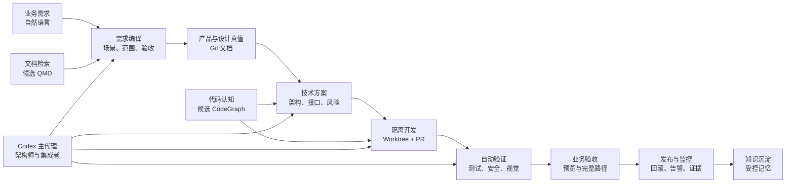
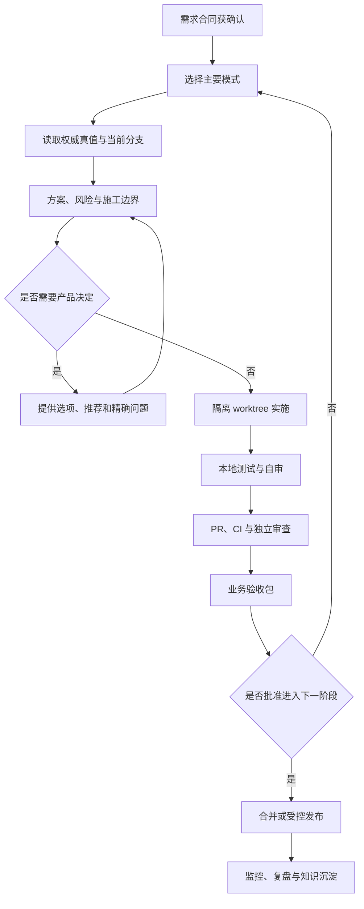

# AI 辅助开发运行模型

> 文档 ID：`GUIDE-AIDEV-001`
> 层级：`L5 / Guide`
> 生命周期：`GUIDE`
> 维护 Owner：`OWN-DOC-GOV（当前 UNASSIGNED）`
> 产品批准：`OWN-PRODUCT`，2026-07-24 明确批准第一阶段制度建设
> 最后核验：2026-07-24，`origin/main@d0e3d929130212b078f14f8254685852fd00012c`

## 1. 结论

本项目采用一套面向非开发者的“AI 软件开发操作系统”：产品负责人提供业务目标、优先级和验收判断；Codex 担任需求编译器、架构师与最终集成者；仓库和机器合同保存项目权威真值；研究、记忆、文档检索和代码图只提供受控的认知辅助。

图中的 QMD、CodeGraph 和受控记忆都是候选能力，不表示当前已安装或获准使用。准入规则见[记忆、知识与派生认知政策](memory-and-context-policy.md)。

## 2. 一次任务只处于一个主要模式

主要模式决定本轮允许做什么。模式切换必须显式说明；“先研究和讨论”不包含写代码，“诊断”也不自动包含修复或发布。

| 模式     | 主要问题                   | 允许产出                   | 禁止越界                          | 结束条件               |
| -------- | -------------------------- | -------------------------- | --------------------------------- | ---------------------- |
| 需求理解 | 谁遇到什么问题，怎样算成功 | 需求合同、开放决定         | 写产品代码                        | 产品负责人确认需求含义 |
| 对标研究 | 有哪些方案、证据和风险     | 来源、比较、推荐           | 把研究结果当批准决定              | 有清晰备选和推荐       |
| 产品设计 | 用户怎样完成目标和恢复失败 | 旅程、页面、状态、交互     | 把后端不支持的动作画成可用        | 关键路径和状态获确认   |
| 技术设计 | 用什么合同和架构实现       | 技术方案、风险、测试计划   | 未批准即进入施工                  | 方案和施工边界确认     |
| 实施     | 怎样安全地产生改动         | 独立 worktree、代码、测试  | 直接改 `main`、多写入者抢共享文件 | 本地验证与自审通过     |
| 审查验证 | 改动是否正确、安全、可合并 | CI、审查、缺陷处置、证据   | 用“代码写完”代替验证              | 必要门全部通过         |
| 业务验收 | 用户能否完成真实目标       | 验收路径、预览、限制清单   | 用测试数量代替业务结果            | 产品负责人确认或退回   |
| 发布     | 如何受控地提供给目标环境   | 部署、迁移、健康、回滚证据 | 无回滚直接全量                    | 发布证据和责任签发完整 |
| 运营     | 上线后是否稳定并产生结果   | 指标、告警、故障和改进项   | 发布后不观察                      | 观察窗结束并形成决定   |

默认情况下，Codex 在开始工作和发生模式切换时，用一句话报告“当前模式、将产生什么、明确不做什么”。

## 3. 职责分工

### 3.1 产品负责人

产品负责人负责：

- 为什么做、为谁做、哪个问题最重要；
- 可接受的成本、时间、业务风险和体验取舍；
- 事实、品牌、承诺和成功标准是否正确；
- 业务验收是否通过；
- 是否批准进入实施、合并、发布等关键阶段。

产品负责人不需要负责数据库选择、接口细节、测试框架或逐行代码审查。Codex 必须把需要决定的内容翻译为业务影响、选项、推荐和后果。

### 3.2 Codex 主代理

Codex 负责：

- 读取权威上下文并识别当前分支、主线和边界；
- 把自然语言需求编译成可开发、可测试的合同；
- 提出产品与技术方案，标明事实、推断和开放决定；
- 拆分任务、控制 worktree、文件写入边界和合并顺序；
- 实现或集成改动，执行相称的测试与风险验证；
- 用业务语言汇报已完成、未接通、限制、回滚和下一步；
- 保持设计上的可见动作与后端真实合同一致。

Codex 不能代替产品负责人批准产品范围，也不能代替隐私、安全、法务、运营或发布 Owner 签字。AI 自评、测试通过或截图都不能单独证明真实用户可用。

### 3.3 专项代理与工具

需要并行工作时，可按单一写入者原则划分研究、UX、前端、后端、QA、安全和发布职责。每个任务必须声明：

- 唯一写入者；
- 允许修改的文件或模块；
- 只读依赖和共享热点；
- 输入提交与目标分支；
- 输出合同、验证命令和完成门；
- 由谁集成和处理冲突。

共享 ADR、公共类型、数据库 Schema、跨模块合同和最终合并默认由 Codex 主代理控制。CI、静态检查、审查机器人和检索工具是证据或闸门，不是产品批准者。

## 4. 什么问题 Codex 应自行解决

在不改变已批准目标、风险边界和用户承诺时，Codex应自行处理：

- 读取仓库规则、定位代码、复现问题和收集证据；
- 同一方案内的实现细节、命名、局部重构和测试补齐；
- 类型、格式、lint、单测、构建和可恢复的 CI 失败；
- 符合现有合同的小范围错误处理、日志和防御式校验；
- 只读的 Git、PR、运行状态与依赖诊断；
- 对失败命令进行有界重试或选择不改变目标的等价验证方法；
- 把技术发现转成产品负责人可以判断的影响说明。

如果自行处理会扩大范围、改变用户体验、降低安全性、产生外部副作用或形成不可逆状态，必须停止并升级。

## 5. 什么问题必须找产品负责人

出现以下情况时，Codex 必须给出证据和推荐后请求决定：

| 需要决定的事项                         | 为什么不能由 Codex 补猜  |
| -------------------------------------- | ------------------------ |
| 目标用户、业务优先级或成功标准不明确   | 会改变“做什么”和验收结论 |
| 两种体验都合理但业务取舍不同           | 技术最优不等于产品最优   |
| 品牌、事实、价格、资质或对外承诺       | 错误会形成商业和信任风险 |
| 新增范围、明显延期、预算或采购         | 超出原授权               |
| 个人数据、版权、许可、条款或合规依据   | 需要真实责任角色承担     |
| 生产部署、数据迁移、删除、批量外部动作 | 可能不可逆或影响真实用户 |
| 覆盖现有 ADR、产品边界或明确决定       | 属于承重决策变更         |
| 为赶进度降低权限、安全、测试或回滚门   | 风险接受权不属于执行代理 |
| 外部凭证、账号、付费资源或他人协作     | 需要新权限或外部协调     |
| 验收证据不足但要求声明“完成/上线”      | 声明强度超过证据         |

升级不是把技术问题原样丢给产品负责人。Codex 必须先完成安全的只读调查，并使用以下格式：

1. 结论：现在被什么决定阻塞。
2. 影响：不决定会影响哪个用户结果、时间或风险。
3. 证据：来自哪个合同、代码、运行状态或来源。
4. 已尝试：哪些安全方案已验证，结果如何。
5. 选项：每项的业务效果、成本和风险。
6. 推荐：Codex 推荐哪一项及理由。
7. 精确问题：只询问真正需要产品负责人决定的内容。

## 6. 常用指令的授权语义

为了避免“问一个问题却触发改代码”，默认按下表理解：

| 产品负责人表达                       | 默认授权范围                                   |
| ------------------------------------ | ---------------------------------------------- |
| “现在是什么情况 / 为什么 / 帮我解释” | 只读核验与解释                                 |
| “诊断这个问题”                       | 复现、定位、说明原因；不自动实施修复           |
| “研究 / 对标 / 讨论方案”             | 只读研究与建议；不进入施工                     |
| “设计一下”                           | 需求、产品或技术设计；未批准不写产品代码       |
| “修复 / 实现 / 开发”                 | 在批准范围内修改、测试和准备 PR                |
| “提交 PR”                            | 提交、推送并创建可评审 PR；不自动合并          |
| “合并”                               | 在 CI、审查和合并门满足后执行合并              |
| “发布 / 部署”                        | 仅在环境、迁移、监控、回滚和责任授权明确后执行 |
| “删除 / 清理”                        | 只处理精确确认的目标；扩大范围必须再次确认     |

用户后续明确指令可以覆盖默认语义，但不能静默覆盖仓库安全和事实治理规则。

## 7. 标准开发闭环

具体 Git、worktree、PR 和验证命令不在本指南复制，统一服从 [AGENTS.md](../../AGENTS.md)、[CONTRIBUTING.md](../../CONTRIBUTING.md)及仓库 runbook。

## 8. 项目反复出现的难点与控制机制

下表是跨任务的风险模式，不是当前状态清单。任何实时结论仍须核验[当前状态](../status/current.md)、[as-built 架构](../architecture/current.md)、活 PR 和运行环境。

| 风险模式                 | 典型误判                                   | 必要控制                                                      |
| ------------------------ | ------------------------------------------ | ------------------------------------------------------------- |
| 需求语义不完整           | 开发完成后才发现解决错问题                 | 先形成需求合同、失败路径和非目标                              |
| 设计与合同脱节           | 原型按钮看似可用，后端没有动作             | Page/State/Interaction 必须绑定真实合同；未支持则禁用或标阻塞 |
| 实验冒充主线             | Demo、分支或外部项目被当成当前能力         | 核验 main 消费路径、合并提交和运行入口                        |
| “已配置”等于“已接通”     | 路由、注册或文件存在就声称运行             | 沿真实调用链验证消费者、终态和失败恢复                        |
| 多 worktree 漂移         | 用 main 索引回答开发分支，或多人改共享热点 | 每个 worktree 独立上下文和索引；单一写入者；集成门            |
| 环境或生成物漂移         | 缺生成步骤、旧缓存造成假故障               | 记录输入提交、生成命令、环境和可复现结果                      |
| 异步工作流边界           | 重试、取消、晚到结果破坏状态               | 幂等、fencing/CAS、预算、终态和恢复场景测试                   |
| AI 模型结果不可审计      | “模型很好”但无版本、路由、样本或回滚       | 固定 task contract、证据集、成本账本和回滚路径                |
| 本地成功冒充发布         | 开发机验证后声称用户已可用                 | 严格区分 build、merge、deploy、release 和 GA                  |
| 记忆或搜索污染事实       | 旧笔记、错误分支或自动摘要覆盖当前真值     | 使用事实优先级、来源提交、有效日期和冲突升级                  |
| 工具自动改治理文件       | 安装脚本修改 AGENTS/Hook/配置              | 先登记、审计副作用、固定版本、隔离试点                        |
| 证据很多但用户目标未完成 | 测试数量替代完整业务路径                   | 交付业务验收包，覆盖成功、失败和恢复                          |

## 9. 每轮沟通最低标准

开发中的阶段更新应简短说明：

- 当前主要模式；
- 已确认的事实和仍不确定的内容；
- 正在验证的用户结果；
- 是否需要产品负责人帮助；
- 下一次可检查的产出。

最终交付按[非技术需求与业务验收](requirement-and-acceptance.md)提供业务验收包。涉及真实发布时，证据结构必须服从[分析、测试与发布证据规范](../frontend/12-analytics-testing-and-release-evidence.md)，不得在本指南创建平行 Release Bundle。
