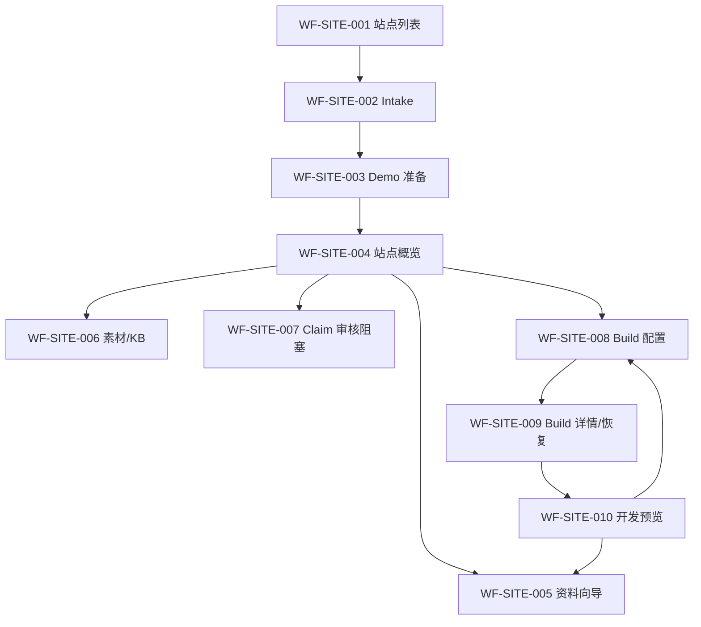

# 独立站管理低保真线框

> 文档 ID：`DESIGN-FE-003`
> 设计资产：`DSA-FE-SITE-WF-001`
> 层级：`L2 / Written low-fidelity wireframe`
> 生命周期：`ACTIVE_INPUT`
> 评审状态：`READY_FOR_GATE_5_REVIEW`
> Asset version：`0.1-gate5`
> 设计 Owner：`OWN-DESIGN`（责任帽子；实际人员/受控设计源未指派）
> 覆盖：`PAGE-FE-030..043`、`SCN-FE-SITE-001..018`

本资产固定页面流、内容优先级、关键状态、响应式和无障碍意图。它不是 Figma/高保真视觉稿、生产 Token、组件库或用户验证证据，状态只能是 `SPEC_REVIEW_CANDIDATE`。

## 1. 整体页面流



共同布局：Workspace/Site context 固定在页面标题区；状态、影响和下一动作在主内容首屏；帮助/诊断不取代主恢复动作。导航只引用全局 Shell，不在此资产重画。

## 2. WF-SITE-001：站点列表与概览

关联：`PAGE-FE-030/031`、Site 014/016。

```text
┌ 全局 Shell ───────────────────────────────────────────────────┐
│ 独立站管理                              [创建站点]            │
│ 当前 Workspace · 最近更新 · 筛选/搜索                         │
├───────────────────────────────────────────────────────────────┤
│ [Site 名称]  [draft / building / ready / setup_failed]        │
│ 当前开发预览：可用/无/旧版本保留 · 最后 Build · 下一安全动作  │
│ [继续准备] [查看任务] [打开开发预览]                          │
├───────────────────────────────────────────────────────────────┤
│ Empty: 为什么没有站点 + 首个价值 + [创建站点]                 │
└───────────────────────────────────────────────────────────────┘
```

状态变体：loading skeleton 保持标题结构；stale 显示时间；denied/404 不披露 Site 名称；setup_failed 保留 Site 卡和恢复动作；有 active old preview 时即使新 Build 失败仍可打开。

## 3. WF-SITE-002：Intake 与 ACK unknown

关联：`PAGE-FE-032`、Site 001/002。

```text
┌ 创建独立站 ───────────────────────────────────────────────────┐
│ 说明：先生成安全 Demo，之后补资料；不是公开发布               │
│ 企业名称* [____________________]                              │
│ 站点名称* [____________________]                              │
│ 业务邮箱* [____________________]  （敏感/用途说明）            │
│ [取消]                                      [创建并准备 Demo] │
├ ACK unknown ──────────────────────────────────────────────────┤
│ 请求可能已提交，正在确认；请不要重复创建                      │
│ [重新确认同一请求] [返回列表查看]                             │
└───────────────────────────────────────────────────────────────┘
```

提交失败先聚焦 error summary，再跳字段。按钮 loading 不清空输入；`IDEMPOTENCY_KEY_REUSED` 显示冲突而非静默换 key；Site limit 的升级动作只有服务端 entitlement 明确提供时出现。

## 4. WF-SITE-003：Demo 准备

关联：`PAGE-FE-033`、Site 001/002/014。

```text
┌ Demo 正在准备 ────────────────────────────────────────────────┐
│ Site 名称 · Build ID（可复制诊断编号，不作主标题）             │
│ 当前阶段：理解资料 / 组装候选 / 确认产物                      │
│ 可离开此页，任务会继续；最近更新 {time}                       │
│ [查看任务详情] [返回站点列表]                                 │
├ setup_failed ─────────────────────────────────────────────────┤
│ Site 已保留 · 发生什么 · 哪些结果仍可用                       │
│ [补资料] [安全重试] [复制诊断编号]                            │
└───────────────────────────────────────────────────────────────┘
```

不用前端匀速动画伪造进度；页面后台/恢复后重新读取 server state。Ready 才显示“打开开发预览”。

## 5. WF-SITE-004：站点概览

关联：`PAGE-FE-031`、当前纵切总控。

```text
┌ Site 名称 · 开发状态 · 最后更新 ──────────────────────────────┐
│ [开发预览] [启动 Build]                                      │
├ 下一步 ─────────────┬ 资料与信任 ─────────────────────────────┤
│ 1 补企业资料        │ Profile 4/5 组 · Asset ready 8/10       │
│ 2 处理事实审核      │ KB gaps 2 · Claim 阻塞 1                │
│ 3 生成可信预览      │ [查看资料] [查看阻塞]                   │
├ 当前结果 ───────────┼ 最近任务 ───────────────────────────────┤
│ active READY/无      │ running/degraded/failed + 旧结果保持    │
│ 开发预览，不是发布  │ [查看任务]                              │
└─────────────────────┴─────────────────────────────────────────┘
```

四层状态不合并。窄屏按“状态/下一步→资料→当前结果→最近任务”排序；主 CTA 根据 allowed action 和 readiness，不由前端猜角色。

## 6. WF-SITE-005：Profile 分组与冲突

关联：`PAGE-FE-034`、Site 003。

```text
┌ 建站资料  [企业] [信任] [线上] [品牌] [联系] ────────────────┐
│ 当前组说明 · 来源/用途                                       │
│ 字段 label* [________________]  帮助/证据                     │
│ 字段 label  [________________]  错误                          │
│ 本组未保存                                                    │
│ [放弃本组修改]                                  [保存本组]    │
├ Conflict drawer/dialog ───────────────────────────────────────┤
│ 远端版本已变化 · 本地草稿已保留                              │
│ 字段/组：当前值 vs 你的修改（敏感字段按权限脱敏）             │
│ [使用最新版本] [重新应用我的修改]                             │
└───────────────────────────────────────────────────────────────┘
```

Tab 在移动端改步骤选择器，但不隐藏未完成/错误。冲突 dialog 可键盘操作、焦点返回触发点；不提供“强制覆盖”。

## 7. WF-SITE-006：素材中心、上传任务与 KB

关联：`PAGE-FE-035..037/039`、Site 004..008。

```text
┌ 站点资料 ───── [素材] [知识状态] ─────────────────────────────┐
│ [上传素材]  支持类型/大小/公开用途说明                         │
│ 文件       Kind     阶段/状态        影响/动作                │
│ factory    图片     processing       [查看任务]               │
│ cert       认证     duplicate        [打开已有]               │
│ manual     文档     failed_retryable [重试处理]               │
├ 上传任务 ─────────────────────────────────────────────────────┤
│ 授权 → 上传 → 提交确认 → 处理 → 可用                          │
│ 当前：提交结果确认中；不要重复上传 [重新确认]                  │
├ KB 汇总 ──────────────────────────────────────────────────────┤
│ documents {n} · chunks {n} · gaps [列表] · partial 说明       │
│ [补资料]  （无文档级合同时不显示虚构的单文档重试）             │
└───────────────────────────────────────────────────────────────┘
```

`ASSET_IN_USE` 使用影响面板：已知 usages 可深链，未知显示受控运营路径；Delete 按钮不消失得无解释。移动端每个任务是可聚焦卡片，阶段用文本和有序步骤。

## 8. WF-SITE-007：Claim/Evidence 阻塞态

关联：`PAGE-FE-038`、Site 009/010、`BLK-FE-004`。

```text
┌ 事实与认证审核 ───────────────────────────────────────────────┐
│ Claim：{statement}  状态 needs_review/conflict/expired         │
│ 适用范围 · 来源 · Evidence 摘要 · Asset · 版本/时间           │
│ 影响：新 Build 不会使用；具体页面影响合同待补                 │
│ [查看完整证据]                                                │
├ 当前阻塞 ─────────────────────────────────────────────────────┤
│ Site 审核/影响合同尚未开放，系统不会自动批准                  │
│ [查看受控处理说明] [复制诊断编号]                             │
└───────────────────────────────────────────────────────────────┘
```

在 allowed-actions/impact contract 到位前不画可点击“批准/拒绝”主动作。Evidence drawer 必须展示 provenance/范围/时效，且按权限脱敏。

## 9. WF-SITE-008：Build 配置

关联：`PAGE-FE-040`、Site 011/012。

```text
┌ 生成可信开发预览 ─────────────────────────────────────────────┐
│ 范围  (●)整站 ( )单页 ( )单板块                              │
│ 目标  [仅 partial scope 显示 canonical picker]                │
│ 风格  [modern-industrial ▼]                                  │
│ 语言  [en 必选] [de-DE 可选]                                 │
│ 资料门/Claim/KB/Asset 影响摘要                                │
│ 预算：cap / 已用 / unknown settlement                         │
│ [取消]                                        [启动 Build]    │
├ Existing/blocked ─────────────────────────────────────────────┤
│ 已有任务运行中 [打开任务]；或配额/不支持选项的明确原因         │
└───────────────────────────────────────────────────────────────┘
```

不显示 `ar` 为生成语言；不允许自由输入 style/locale；Build active 时主动作变“打开现有任务”，不自动 cancel。

## 10. WF-SITE-009：Build 详情与恢复

关联：`PAGE-FE-041/042/044`、Site 013..015。

```text
┌ Build 状态：running/degraded/failed/cancelled/succeeded ──────┐
│ Site · scope · started/updated · [请求取消]                   │
│ ① 读取资料       done                                        │
│ ② 理解品牌       degraded — 影响说明                         │
│ ③ 处理图片       done                                        │
│ ④ 生成文案       done                                        │
│ ⑤ 组装候选       running                                     │
│ ⑥ 质量复核       skipped — 未执行，不是通过                  │
├ 成本 ────────────────┬ 当前/旧结果 ───────────────────────────┤
│ reported/calculated  │ 新候选未生效；旧开发预览保持           │
│ estimated/unknown 分开│ [打开旧预览]                          │
├ Recovery ─────────────────────────────────────────────────────┤
│ 发生什么 · 影响 · 已保留 · [补资料] [重建] [复制诊断编号]     │
└───────────────────────────────────────────────────────────────┘
```

取消点击后进入“正在确认”，不立即标 cancelled。长任务更新只在阶段/终态播报；成本不是视觉次要信息，但 unknown 不显示 0。

## 11. WF-SITE-010：开发预览

关联：`PAGE-FE-043`、Site 016..018。

```text
┌ 管理条：开发预览｜Site｜Version｜locale｜degraded ─────────────┐
│ [返回站点] [在新窗口打开] [需修改] [结果可继续]              │
├───────────────────────────────────────────────────────────────┤
│                       Preview viewport                        │
│              （与管理 Shell/凭证隔离；noindex）               │
├ Integrity failure ────────────────────────────────────────────┤
│ 候选完整性校验失败；未切换当前可用结果                         │
│ [打开旧预览] [返回任务] [复制诊断编号]                        │
└───────────────────────────────────────────────────────────────┘
```

“结果可继续”只是 review feedback，不是 Publish。iframe 有 title 和替代新窗口入口；移动端默认新窗口，避免双重导航和狭窄 iframe。

## 12. 响应式组合

| Breakpoint intent | 布局 | 不可丢失 |
|---|---|---|
| Desktop | 两到三列，侧栏承载 Evidence/状态/成本 | 主状态、影响、下一动作、旧结果、权限原因 |
| Narrow | 两列变单列，侧栏进入主内容相邻区块 | 冲突、degraded、unknown cost、诊断入口 |
| Mobile | 单列、一次一任务/表单组、底部动作不遮错误 | Workspace/Site context、保存/取消、任务终态、预览边界 |

表格变卡片时保留 header association；横向流程变有序纵向列表；不得用 hover 承载唯一信息。

## 13. a11y 注释

- 每个 WF 有唯一 H1；页面状态紧随标题，使用文本 badge；Site/Build 更新不抢焦点。
- Error summary 是可聚焦区域，链接到字段/步骤；dialog/drawer 打开/关闭恢复焦点。
- 进度只有服务端给出可靠数值时用 `progressbar`；否则使用 step status，不报虚假百分比。
- 卡片不是整块嵌套可点击区域；标题链接和动作按钮分开，避免交互嵌套。
- Delete/Cancel/Accept 等动作说明对象、版本和影响；颜色/图标不能作为唯一状态。
- 200% zoom 与 320px reflow 需保留完整文案和动作；动画遵循 reduced motion。

## 14. 资产状态与下一步

本资产覆盖页面流、10 个关键线框、状态、响应式和 a11y，故 `DSA-FE-SITE-WF-001` 可从 `REQUIRED_NOT_CREATED` 升为 `SPEC_REVIEW_CANDIDATE`。它不能升级为 `DESIGNED`，因为仍缺：

1. 受控设计工具/file/node/version 与实际 Design reviewer；
2. 品牌视觉方向、semantic token values、组件源和权利；
3. `STATE-FE-001..020` 与 permission/AI pattern board 的视觉资产；
4. 目标用户可用性、键盘/读屏和 responsive 验证；
5. 正式前端实现映射和视觉回归基线。
