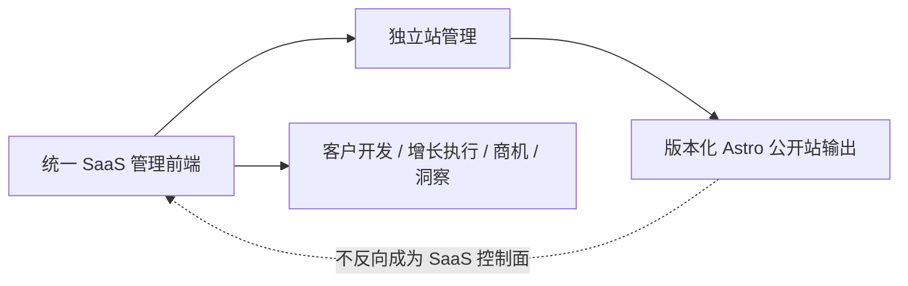

# 前端范围、权威与状态

> 文档 ID：`FE-GLOBAL-001`
> 层级：`L2 / Normative candidate`
> 生命周期：`ACTIVE_INPUT`
> 评审状态：`READY_FOR_GATE_4_REVIEW`
> 内容 Owner：`OWN-PRODUCT`
> 关联：`CAP-SHELL-001`、`DEC-FE-P2-003..009`、`BLK-FE-001..007`

## 1. 产品面

本规范覆盖一个统一 SaaS 管理前端：身份、Workspace、企业事实、客户开发、独立站管理、增长执行、互动与商机、洞察、团队/集成/设置和受控运营入口。公开 Astro 站仅是独立站管理产生的版本化输出，它有独立的访问、安全、性能和发布边界，但不拥有 SaaS 导航、身份或控制面。

## 2. 事实优先级

| 问题 | 唯一真值 | 本规范的责任 |
|---|---|---|
| 产品边界、跨仓 ownership | [product-scope.md](../product-scope.md) | 解释用户可见边界，不另造 SoR |
| 当前实现 | [architecture/current.md](../architecture/current.md)、main 代码和机器契约 | 映射体验，不提升未建能力 |
| 承重决定 | [ADR registry](../adr/registry.md)、批准 Gate/Decision | 引用 Decision ID |
| 当前主线/完成度 | [status/current.md](../status/current.md) | 只写局部多轴状态 |
| 能力/对象/场景/冲突关系 | [governance](../governance/README.md) | 使用稳定 ID，不建第二登记表 |
| API | `packages/contracts/openapi/openapi.json` | 按 operationId/生成类型接入，不手抄长期总数 |
| 视觉与组件 | 未来受控设计源 + 资产登记 | 当前仅定义交付合同，实际源仍缺 |
| 发布事实 | 未来 Release Bundle | 本包只定义门，不声称已经发布 |

冲突时先登记到 [冲突台账](../governance/conflict-register.md)，再由相应 Owner 裁决；页面文案、设计稿和前端代码不得静默重定义产品或后端状态。

## 3. 四种必须分开的陈述

| 陈述 | 允许证据 | 禁止推导 |
|---|---|---|
| 产品已批准 | Gate/Decision | 已设计、已实现 |
| UX 已规范/验证 | 受控规格/资产 + 评审或用户验证 | API 已建、用户可用 |
| 前端已实现 | 正式 repo 的 commit/CI/部署 | 后端有 API、Mock 有页面 |
| 用户可用 | 合同、正式前端、部署、场景 E2E、Release evidence | 本地能跑、截图、单测通过 |

每项能力必须沿 [多轴交付状态](../governance/terminology-and-status.md#6-多轴交付状态)报告，不使用单一“完成”。

## 4. 当前与目标

### 当前可证实

- Gate 2 已批准首批客户、默认操作者、六项一级 IA、共享企业事实底座、首个 Site 纵切和指标方向。
- 本仓 Site Builder 后端在 intake/profile/asset/KB/build/cancel/internal preview 等方面有不同深度的 main 证据，详见 [追踪矩阵](../governance/traceability-matrix.md)。
- 客户开发后端有真实能力但新增开发冻结；Campaign、Conversation、Opportunity、Outcome 与完整 SaaS UI 是外部 ownership。
- `/global/frontend` 是 `LOCAL_UNCONTROLLED / MOCK_PROTOTYPE`，不是正式实现或技术选型证据。

### 本包拟确立

- 跨模块可复用的 IA、Shell、权限、状态、AI/Evidence/Approval、内容、a11y、性能、合同、测试和发布门。
- 设计资产、微文案、场景和 Release evidence 的稳定 ID 与追踪要求。
- 当合同、Owner 或设计源缺失时的安全默认和用户表达。

### 仍不能声称

- 正式前端仓库、技术栈、设计系统、组件库、视觉 Token 或生产部署已经确定。
- 所有页面已设计或接入；所有 Journey 已经用户验证。
- Site Builder 已公网发布、可绑定域名、可回滚、可接询盘或已生产可用。

## 5. 适用范围和非目标

本包适用于 SaaS 管理面和所有后续模块 Capability Pack。公开站输出的页面内容、SEO、组件和运行性能只在跨边界处给原则；其完整输出规范属于 Phase 5。

Phase 4 不批准商业套餐、数据权利、支持 impersonation、外部发送/发布策略、具体 OSS、前端技术选型或实际设计稿。对应事项集中在 [开放决策](13-open-decisions.md)。

## 6. 例外流程

模块若需偏离本包，必须记录：规则 ID、用户/技术原因、受影响 Capability/Scenario、风险、替代 a11y/安全/恢复方案、Owner、有效期和回收条件。未批准例外按全局规范执行；不能以“模块特殊”直接复制一套 loading、权限或审批模式。
