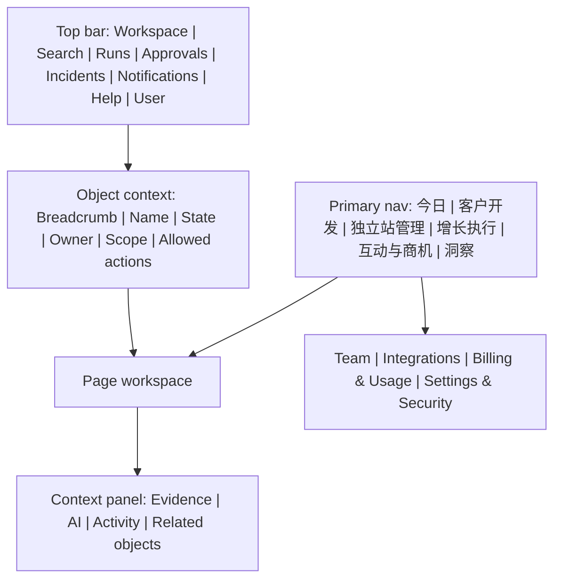

# 导航与 Workspace Shell 规范

> 文档 ID：`FE-GLOBAL-006`
> 层级：`L2 / Normative candidate`
> 生命周期：`ACTIVE_INPUT`
> 评审状态：`READY_FOR_GATE_4_REVIEW`
> 内容 Owner：`OWN-DESIGN`
> 关联：`CAP-SHELL-001`、`CAP-TODAY-001`、`SCN-FE-SHELL-001..004`

## 1. Shell 组成

Shell 必须允许模块独立加载和失败；Search、通知或审批服务不可用时，不应阻止用户通过稳定 URL 打开仍健康的 Site、Company 或 Run。

## 2. 全局入口

| Shell ID | 入口 | 必须展示/支持 | 不允许 |
|---|---|---|---|
| `SHELL-FE-001` | Workspace switcher | 当前 Workspace、环境/代理状态、搜索、最近、切换确认 | 切换后保留旧租户缓存/订阅 |
| `SHELL-FE-002` | Search/Command | 权限过滤、对象类型、最近、键盘操作、安全命令预览 | 搜索结果泄漏无权对象；无确认危险动作 |
| `SHELL-FE-003` | Runs | Build/导入/研究/发布的状态、影响、取消、结果和恢复 | 只显示 spinner；将 ACK 不明写成失败/成功 |
| `SHELL-FE-004` | Approvals | 待办、Evidence、范围、提交者、差异、截止、决定深链 | 在聚合卡里绕过域对象和审计决定 |
| `SHELL-FE-005` | Incidents | 业务影响、已保留结果、下一步、correlation ID、运营入口 | 原始堆栈/provider 错误作为主文案 |
| `SHELL-FE-006` | Notifications | 来源、时间、对象、可读/未读、偏好和深链 | 用通知代替 Task/Approval/Incident |
| `SHELL-FE-007` | Help/Feedback | 当前 Page/Object/Run 上下文、脱敏诊断、指南和反馈 | 自动携带 Prompt、PII、Secret 或文档正文 |
| `SHELL-FE-008` | User menu | 个人偏好、账号安全和退出 | 承担 Workspace 策略管理 |

## 3. 对象上下文栏

进入 canonical object 后统一显示：

- 面包屑、对象类型/名称和稳定 ID 的安全显示；
- Workspace、业务状态、stale/degraded 标记、Owner、最后更新时间；
- 主动作、次动作和危险动作；动作来自服务端 allowed actions 或可验证合同；
- 相关 Company/Claim/Run/Version 等关系和活动；
- 在允许时打开 Evidence、AI、cost、history；
- 归档、删除、保留、外部 ownership 或无权限时的精确边界。

对象状态与操作不得只靠路由、页面本地缓存或前端角色数组推断。

## 4. 导航行为

1. 当前一级区域、对象上下文和来源筛选分别表示，避免面包屑把聚合页当对象父级。
2. 导航切换不取消服务端长任务；离开有未保存修改时按 [状态规范](07-state-error-degradation-and-recovery.md)处理。
3. 跨 Workspace 切换先处理未保存草稿/上传，再清空 query cache、搜索、订阅、最近对象和返回栈；失败时保留原 Workspace。
4. 深链无权或对象不存在按不泄漏策略返回；不要先渲染数据再跳转。
5. 可用性三态由 capability/entitlement/allowed action 共同决定；manifest 缺失时 fail-closed。
6. 外部 preview/public link 不携带 SaaS cookie、Workspace token 或内部 query 参数。

## 5. Today 组合规则

Today 卡片只来源于明确 read model，并包含 `source_type/source_id`、原因、优先级规则、新鲜度、Owner、动作和 deep link。排序优先：高风险阻塞/即将到期 → 用户继续中的任务 → 明确机会/待办 → 信息性更新。任何 AI 推荐都标明依据和可 dismiss/反馈方式。

Today 不新建 Task/Approval/Incident 的第二状态；聚合数据 stale 时整卡标 stale，并允许进入源对象，而不是显示伪实时数字。

## 6. 桌面和移动

| 模式 | 优先任务 | 导航策略 |
|---|---|---|
| 宽屏桌面 | 密集列表、比较、编辑、Build/证据/多面板 | 可折叠侧栏 + 固定上下文；面板不能遮住主任务 |
| 窄屏/平板 | 审批、状态、摘要、轻编辑 | 一级导航进入可访问抽屉；上下文和动作按优先级收敛 |
| 移动 | 通知、审批、异常、任务跟踪、摘要 | 不复制完整桌面；重编辑说明原因并提供安全继续入口 |

断点数值属于未来 Token；这里固定的是内容优先级和可完成任务，不用设备名称硬编码权限或能力。

## 7. 键盘与焦点

- 提供 skip link、稳定 landmarks 和页面唯一 H1；导航、搜索和主内容可直接到达。
- 路由切换后焦点移到页面标题或明确目标，并通过可访问名称宣布上下文；后台刷新不抢焦点。
- 对话框关闭回到触发点；删除触发点时移到合理邻近动作。
- command/search、menu、tabs、tree/grid 等复合组件遵循已选择的可访问模式；焦点与选中态视觉上分开。
- 快捷键不得覆盖浏览器/辅助技术，必须可发现和可关闭。

## 8. Shell 验收

至少以 `SCN-FE-SHELL-001..004` 验证有效/过期会话、两 Workspace 隔离、无权深链、审批合同缺、聚合服务失败、长任务继续和旧结果保留。实际设计和 E2E 在正式 repo/设计源确定后产生；本文件不构成实现证据。
