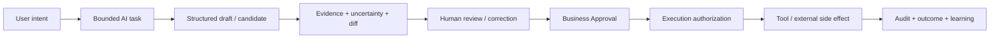

# AI、Approval、Evidence 与人工控制规范

> 文档 ID：`FE-GLOBAL-009`
> 层级：`L2 / Normative candidate`
> 生命周期：`ACTIVE_INPUT`
> 评审状态：`READY_FOR_GATE_4_REVIEW`
> 内容 Owner：`OWN-PRODUCT`
> 关联：`CON-FE-P2-013`、`DEC-FE-P2-005`、`CAP-SITE-CLAIM-001`

## 1. 控制链

并非每个任务都需要全部步骤，但任何高影响外部动作都不能从 Prompt 直接跳到执行。Approval 表示业务决定；execution authorization 绑定具体对象/版本/范围/时间；服务端 Tool/Workflow 再执行并留结果。

## 2. 四类信息

| Type ID | 类型 | 视觉/内容要求 | 可进入公开/业务真值的条件 |
|---|---|---|---|
| `AIINFO-FE-001 FACT` | 可核验事实 | 来源、引用、日期、适用范围、Evidence 状态 | approved Claim/权威对象快照 |
| `AIINFO-FE-002 INFERENCE` | 从事实推断 | 推理依据、假设、置信/不确定性、反例 | 不能冒充事实；需用户/规则接受 |
| `AIINFO-FE-003 RECOMMENDATION` | 建议行动 | 预期收益、风险、成本、替代和可忽略 | 用户选择或策略批准；不自动改业务状态 |
| `AIINFO-FE-004 GENERATED_CONTENT` | 文案、图像、草稿 | 生成来源、使用资料、编辑 diff、权利/Claim 检查 | 内容审批、权利、事实和外部动作门通过 |

“置信度 92%”只有在定义、校准和适用范围可解释时才显示；否则使用清楚的未知项/证据覆盖描述，避免伪精确。

## 3. 有界 AI Task 卡

每个 AI task surface 至少显示：

- 要完成的具体任务、输入对象和输出对象；
- 使用的数据范围、可选工具/模型类别和禁止访问的范围；
- 预计时间/成本的来源和硬上限；
- 运行/步骤/部分成功/降级/取消/重试；
- 输出是事实、推断、建议还是草稿；
- Evidence、缺失信息、风险和人工审查点；
- 实际 cost/model/tool 只在服务端有可披露事实时展示；
- Run/correlation ID 和结果持久化位置。

全局 AI 入口只做目标表达、解释和导航；它必须把结果落到结构化对象/任务，不能成为唯一历史、权限绕行或隐藏的超级 Agent。

## 4. Evidence 体验

Evidence drawer/card 统一包含：

| 字段 | 要求 |
|---|---|
| Claim/content segment | 明确它支持哪一句/哪个字段，不笼统“有来源” |
| source type/title/origin | 在权利和隐私允许范围可识别；敏感来源可脱敏 |
| excerpt/location/hash | 可定位且防漂移；不无权复制全文 |
| captured/observed/valid dates | 区分抓取、发生、有效期和 stale |
| applicability | 产品、市场、locale、站点/版本或使用范围 |
| review state/owner | needs review/approved/expired/revoked/conflict |
| conflict/quality | 其他来源、缺失、低质量或解析失败 |
| downstream usage | 哪些 Site/Content/Release 正在引用，允许时可追踪影响 |

模型输出、搜索结果摘要和不可访问 URL 不是自动 Evidence；原始 Trace、Prompt 和隐藏 chain-of-thought 不展示为用户证据。

## 5. Review 与 Approval

| 阶段 | 主动作 | 必须看到 | 结果 |
|---|---|---|---|
| Candidate review | 修正、接受候选、拒绝 | 原值/新值、Evidence、未知项、生成者 | 形成草稿/候选，不自动批准 |
| Business approval | 批准、退回、限制范围、到期/撤销 | 完整 diff、适用范围、下游影响、职责分离 | 写域对象/Approval 审计 |
| Execution confirmation | 执行/取消 | 准确版本、目标、外部影响、费用、不可逆性 | 申请短时 execution authorization |
| Post-action review | 查看结果、补救、撤销/回滚 | 实际执行、部分失败、投递/发布/成本事实 | 审计、Incident、Outcome/learning |

批准人不能只看到 AI 摘要；必须能查看关键原文/差异和影响。批量审批显示逐项异常、范围和采样策略，不能用一个勾选框掩盖不同风险。

## 6. 永久 fail-closed 与分级自动化

| 自动化等级 | 例子 | 默认 |
|---|---|---|
| `L0 SUGGEST` | 推荐入口、草稿、分类建议 | 可自动生成，用户可忽略 |
| `L1 INTERNAL_REVERSIBLE` | 保存个人草稿、内部标签候选 | 明确可撤销/审计后可配置 |
| `L2 TEAM_STATE` | 修改共享 Profile、创建任务/Build | 权限、幂等、对象状态和确认 |
| `L3 EXTERNAL_OR_HIGH_IMPACT` | 发布、发送、导出、删除、付费动作 | Approval + execution auth；默认人工确认 |
| `L4 PROHIBITED_WITHOUT_POLICY` | 自动批准 Claim、绕过 consent、跨 Workspace、无上限付费 | 没有明确政策/合同时永久拒绝 |

当前首个 Site 纵切中 Claim 自动批准禁止；若 public review 合同未建，只能显式阻塞或走经批准、可审计的运营兜底。

## 7. 不可信输入与安全

- 抓取网页、上传文档、用户 Prompt 和第三方工具输出都按不可信内容处理；其中的“指令”不能改变 tool allowlist、权限、预算或系统政策。
- UI 明确区分引用内容与系统说明，避免把注入文本作为按钮/警告展示。
- Tool 参数、域名、外部目标和数据范围在服务端验证；前端预览不能成为唯一安全门。
- Prompt/Output 的日志、保留、训练/反馈使用、跨境和用户访问权由数据/隐私政策决定；默认最小化。
- Secret、internal reasoning、系统 Prompt、原始 provider 错误和其他 Workspace 数据不可在解释/Evidence 中泄漏。

## 8. 降级和人工兜底

模型/工具不可用时，界面说明缺失能力、已完成部分、是否消耗预算、结果可信度和可选动作：等待、只用确定性步骤、切换已批准 fallback、补资料、保存草稿或联系运营。Fallback 必须由服务端策略允许，并保持相同任务/审计身份；不能静默换模型后仍称原结果。

运营兜底必须显示“由谁、以什么范围、何时完成”，并产生与自助流程等价的对象状态和审计；不能把人工成功计入自助完成率。

## 9. 反馈与学习

用户可对建议、Claim、生成内容和任务结果作“接受/修正/拒绝/不相关/有害”反馈，且说明反馈用途。修正结果写结构化差异和原因；是否用于模型训练、评测或规则更新由政策控制。前端反馈不是自动 ground truth，需按角色、Evidence 和 Outcome 分层。

## 10. 评审门

含 AI 的 Capability 在 Dev-Ready 前必须有：task contract、输入/输出对象、数据范围、成本/取消、事实分类、Evidence、Approval/authorization、降级、注入/泄漏防护、审计、反馈、Scenario 和运营兜底。只有聊天框、loading 动画和“生成成功”不构成 AI 产品设计。
