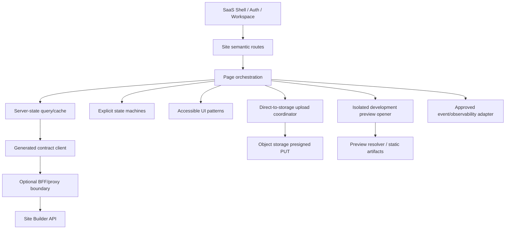

# 独立站管理前端实施蓝图

> 文档 ID：`FE-IMPL-SITE-001`
> 层级：`L3 / Stack-neutral implementation blueprint`
> 生命周期：`ACTIVE_INPUT`
> 评审状态：`APPROVED_AT_GATE_5`
> 工程 Owner：`OWN-SAAS-FE`（责任帽子；正式 repo/人员未指派）
> 合同 Owner：`OWN-SITE-BE`、`OWN-SAAS-PLATFORM`、`OWN-TRUTH-BE`
> 关联：`FE-SITE-000..004`、`BLK-FE-001..007`

本文是正式前端团队的实施交接，不是 as-built 技术方案。由于正式 SaaS frontend repo、runtime、CI、部署和团队未定位，本蓝图只固定架构职责、接口边界、状态模型、工作顺序和验证门，不选择 framework/BFF/UI library/state library。

## 1. 目标架构



### 1.1 包/层级职责

| Layer | 责任 | 禁止 |
|---|---|---|
| Shell adapter | session、Workspace、capability/entitlement、deep link、global task/incident | 在 Site 模块自建 token/role truth |
| Contract client | 从机器 OpenAPI 生成类型/调用；统一 transport/error/correlation | 手抄 DTO、路径总数或 enum |
| Domain adapter | 把 API DTO 映射成明确 Site/Profile/Asset/Build view model | 把 unknown/degraded/skipped 合并成 success |
| State machines | intake/profile/upload/build/cancel/preview 的状态与恢复 | 用 scattered boolean + Toast 驱动业务终态 |
| Query/cache | canonical server state、stale time、invalidate/retry/polling | 用页面内存成为任务真值 |
| UI patterns | Page、form、task、approval、evidence、error、responsive/a11y | 模块另造全局 permission/loading 模式 |
| Preview boundary | 打开/嵌入 active preview，标注 noindex/dev boundary | 拼内部 storage/resolver URL、把 Preview 当 Publish |
| Telemetry adapter | 只在 schema/privacy 批准后发逻辑事件 | 直接引 SDK 或记录企业/联系人/文档内容 |

## 2. Semantic route boundaries

正式 route string 由 SaaS Shell 决定，本模块只需要以下语义 segment 和 canonical object identity：

```text
site collection
site create/intake
site overview
site profile
site assets / asset task
site knowledge
site claim review (blocked until contract)
site build create
build run detail / recovery
site development preview
future: editor / releases / publish / domain / inquiries / analytics
```

Deep link 必须先恢复 session/Workspace，再检查 object authorization；无权和不存在共享 anti-disclosure 表达。未来 route 变化通过 route builder/redirect 迁移，不把 path fragment 存入业务对象。

## 3. Contract client

### 3.1 当前 operation surface

从 `packages/contracts/openapi/openapi.json` 生成并校验以下 13 个 SiteBuilder operation：

| Use case | operationId |
|---|---|
| Intake | `IntakeController_create_v1` |
| Site list/detail | `SitesController_list_v1`、`SitesController_get_v1` |
| Profile get/patch | `SitesController_getProfile_v1`、`SitesController_patchProfile_v1` |
| Asset presign/commit/list/delete | `AssetsController_presign_v1`、`AssetsController_commit_v1`、`AssetsController_list_v1`、`AssetsController_remove_v1` |
| KB aggregate | `KbController_status_v1` |
| Build create/get/cancel | `BuildsController_create_v1`、`BuildsController_get_v1`、`BuildsController_cancel_v1` |

CI 生成/漂移门至少检查 operationId、request/response schema、required header、error code、enum 和 nullable 字段；不把 hidden preview resolver加入 public generated client。

### 3.2 Runtime validation

- API response 在 trust boundary 做运行时校验或由已批准的 generated runtime validator 保证；失败进入 contract incident，不把未知字段/枚举静默变默认。
- SiteSpec 当前只有 TypeScript shared type，不能被前端任意 JSON 编辑器视为 runtime-safe；`CON-FE-017` 关闭前编辑器 lane 不实现。
- Error adapter 保留 stable code、HTTP class、correlation ID、retryability、acknowledgement semantics 和 safe details；用户文案只消费批准映射。

### 3.3 Auth/BFF 决策边界

是否使用 BFF、server component 或 direct API 取决于正式 repo、token 放置、same-site/CSRF、aggregation、streaming、latency 和 deploy ownership。无论选择哪种：

1. 浏览器不持久化长期 token；Workspace 从已验证会话绑定，不接受页面任意参数覆盖。
2. 服务端仍是 authorization 真值；BFF 不能把客户端角色映射升级为授权。
3. presigned upload 只把短期 PUT 授权给指定对象/类型/大小，不代理或记录文件内容。
4. correlation/trace 经过脱敏；contact/profile/document 内容不进入访问日志。

## 4. Client state model

### 4.1 Server state

按 canonical key 管理：

```text
workspace + site collection
workspace + site id
site + profile + etag
site + asset collection
site + kb aggregate
build id + status/steps/cost
```

mutation 成功后按对象精确 invalidate；ACK unknown 不执行 optimistic terminal update。Site/Build polling 使用 visibility-aware backoff，终态停止；网络恢复先 revalidate。

### 4.2 Local state

只保留尚未提交的表单草稿、上传文件 handle（浏览器允许范围）、展开/排序/过滤和用户偏好。业务对象、任务状态、权限、cost 和 preview pointer 不以 local storage 为真值。

### 4.3 Explicit machines

至少实现以下 reducer/statechart，并有状态转移单测：

- `intake`: editing → submitting → accepted | ack_unknown | validation | conflict | blocked；
- `profile_group`: pristine → dirty → saving → saved | conflict | validation | error；
- `upload`: selecting → presigning → putting → committing → processing → terminal/recoverable；
- `build_create`: configuring → submitting → accepted | ack_unknown | active_conflict | quota | validation；
- `build_run`: queued/running → terminal；cancel idle → requesting → confirming → cancelled/active/error；
- `preview`: resolving → ready | none | integrity_failed | stale；旧 active pointer 独立保留。

## 5. Upload implementation

1. 创建本地 upload task ID，校验客户端可知的 kind/type/size，但服务端重复校验。
2. 调 presign，保存 Asset ID、过期时间和 PUT 要求；不把 presigned URL写日志/analytics。
3. direct PUT 支持进度和 abort；断网/过期后重新 presign，不新造业务 Asset。
4. commit 后进入 confirming/queued；响应丢失时按稳定 Asset 重放/查询。
5. 通过 list/polling 收敛到 ready/duplicate/rejected/failed_retryable；页面离开后任务仍可从 server 恢复。
6. 删除先执行 contract action；409 `ASSET_IN_USE` 保持 cache 对象并打开 impact/fallback。

批量上传以后可在 coordinator 层增加 concurrency/backpressure，但不能跳过单任务状态、权利和失败恢复。

## 6. Build implementation

- Config options 来自机器合同/服务端 capability manifest；不 hard-code “未来可能支持”的 locale/style。
- partial scope target 使用 canonical Page/Section identity；在 public editor contract 出现前不提供自由 target picker。
- active Build conflict 解析出 canonical buildId 后跳转现有任务；不得自动 cancel 或创建新任务。
- task timeline 以 server steps 为真值，并对 done/degraded/failed/skipped/aborted逐一映射；phase 仅作为分组。
- cost summary component 显示 value/source/currency/settlement/unknown，不把 absent 当 0。
- Cancel 使用同 buildId；请求超时进入 confirming，查询 terminal，不做 optimistic cancel。
- 成功后重新读取 Site，只有 active READY previewUrl 出现才开放 preview；Build succeeded 但 pointer 未就绪时继续“产物确认中”。

## 7. Preview isolation

- 默认新窗口打开；若嵌入 iframe，使用最小 sandbox/allow policy、明确 title，并提供退出/独立打开。
- 管理 Shell 与预览 origin/message channel 分开；不允许预览 HTML读取 SaaS token、Workspace cache 或执行管理动作。
- previewUrl 只消费 server 提供的 opaque URL；禁止前端拼 slug/storage key。
- 管理条显示开发预览、Build/Release identity、locale/degraded 和返回修订，不注入 public 页面主 DOM。
- integrity/contract error 进入受控 incident；旧 active 可继续打开，但不自动隐藏错误候选。

生产 public origin、share/access policy、CSP 和域名不在当前蓝图实施范围。

## 8. UI component contracts

复用 Gate 4 全局组件模式，Site 只增加组合：

| Component/pattern | 必需 props/state | 关键 a11y |
|---|---|---|
| Site status card | Site identity、四层状态摘要、last updated、allowed actions | 标题/状态文本；卡片内动作键盘顺序 |
| Profile group form | schema fields、etag、dirty/conflict/error | label/help/error summary/focus restore |
| Upload task row/card | file label、stage、progress、terminal、action | progressbar 只在有可靠值时；状态变化低频播报 |
| KB gap summary | documents/chunks/gaps、impact、next action | list/heading；不只用红绿 |
| Claim/Evidence panel | claim state、source、scope、version、allowed decisions | dialog/drawer focus trap；批准影响可读 |
| Build configuration | supported enum、scope/target、hard-cap reason | fieldset/legend；disabled reason 可访问 |
| Build timeline | run/steps/update/cost/cancel | ordered list；当前 step `aria-current`；终态公告 |
| Recovery panel | error class、kept result、safe actions、correlation | 首焦点到摘要；不展示 raw stack |
| Preview boundary bar | dev label、locale、version、degraded、return | landmark；不与 public page nav 混淆 |

`BLK-FE-002` 关闭前这些是行为合同，不是视觉组件或 Storybook 已存在。

## 9. Testing strategy

| Test | 重点 |
|---|---|
| Contract generation | 13 operations、required headers、enums、stable error mapping、nullable fields |
| State-machine unit | 所有合法/非法 transition、ACK unknown、cancel confirming、old result |
| Query/integration | cache isolation by Workspace、stale/reconnect/poll stop、mutation invalidation |
| Upload integration | URL expiry、PUT fail、commit loss、duplicate/reject/retry、page reload |
| Build integration | active conflict、quota、degraded/skipped/unknown cost、cancel ACK、candidate fail |
| Security | cross-Workspace IDOR、403/404 anti-disclosure、XSS/URL、token/presign/log leakage |
| Accessibility | form error/focus、keyboard, live region、zoom/reflow、screen reader timeline/dialog |
| E2E | `SCN-FE-SITE-001..018` 与登记 Fixture；目标 019..023 不伪造 |

测试失败不能通过扩大 mock 响应使 UI 全绿。Contract-backed mock/fixture 必须包含失败、partial、unknown 和权限分支。

## 10. Observability 与 analytics

- 技术 observability：page/action latency、contract parse failure、network/error code、polling/preview incident；不带业务内容。
- 产品 analytics：只通过未来批准的 event adapter 发 `EVT-FE-001..013`，server outcome 优先。
- 所有记录带 app/release/contract/fixture version 和 opaque object ID；采样、retention、region、consent、vendor/exit 由 `BLK-FE-005` 关闭。
- SDK 加载失败不得阻断核心任务；tracking 未批准时 adapter 为显式 no-op，不把 console 作为替代。

## 11. 安全、性能与发布

- 依赖/供应链、CSP、CSRF/CORS、session、secret scanning、source map、headers 按正式 runtime 威胁模型确定。
- 管理页预算按 route/chunk/interaction 制定；大表/图片虚拟化或渐进加载不得破坏键盘/读屏。
- Preview/static output 的预算和 Gate 见 [公开输出规范](../modules/independent-site-management/public-site-output-spec.md)。
- 每次正式发布必须形成 Release Bundle：规范/设计/contract/client commit、CI、scenario/fixture、a11y/security/perf、deploy、rollback、Owner 和 post-release review。

## 12. 施工分解与依赖顺序

| Wave | 工作 | 前置门 | 可交付状态 |
|---|---|---|---|
| W0 | 定位正式 repo/Owner/CI/deploy；选 runtime/BFF/client generation | `BLK-FE-001` | architecture decision，不写页面 |
| W1 | Shell auth/workspace/allowed-actions、contract client、error/correlation | `BLK-FE-003` 至少有可消费合同 | shared foundation |
| W2 | Site list/intake/demo/profile | W1；受控设计源用于视觉实现 | scenario 001..003 |
| W3 | Asset upload/list/delete + KB aggregate | W1/W2 | scenario 004..008 |
| W4 | Claim/Evidence review/impact | `BLK-FE-004` + W1 | scenario 009/010；此前保持 blocked |
| W5 | Build config/run/cancel/recovery/cost | W2/W3；Claim gate 明确 | scenario 011..015 |
| W6 | Development preview boundary/integrity/accept feedback | W5 + preview access policy | scenario 016..018 |
| W7 | E2E/a11y/security/ops drill + deployment Release Bundle | `BLK-FE-006` 实际 assignee | 当前纵切 user-ready 候选 |
| Future | editor/release/publish/domain/inquiry/analytics | `BLK-FE-007` 各自 PDR/ADR/contract | 独立 Capability Gate |

不得因 W4 阻塞就把自动批准或通用 Claim endpoint直接塞入 W2/W5；可在 UX 中显式停住，并让后端/运营依正式协议解阻。

## 13. Open decisions

- `OPEN-FE-TECH-001..003`：runtime/repo、BFF、contract generation/runtime validation；
- `OPEN-FE-DES-001/002`：受控设计源、UI/component/icon/font；
- `OPEN-FE-I18N-001`：SaaS UI locale 与 QA 矩阵；
- `OPEN-FE-DATA-001`：analytics/observability vendor、consent、retention；
- `OPEN-FE-COMM-001`：quota/upgrade/retention；
- `OPEN-FE-SITE-001`：Publish/Domain/Inquiry 等后置对象/合同。

Gate 5 只批准蓝图的职责与依赖，不替代这些决策，也不授权实现。
