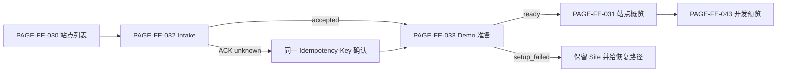
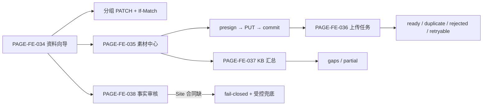
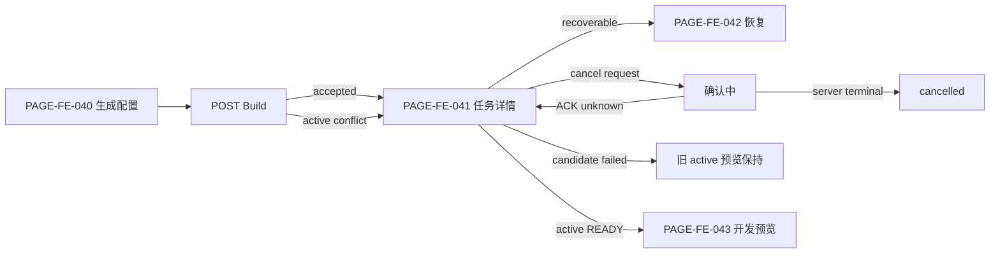

# 独立站管理用户旅程与页面规格

> 文档 ID：`FE-SITE-001`
> 层级：`L2 / Module UX specification`
> 生命周期：`ACTIVE_INPUT`
> 评审状态：`APPROVED_AT_GATE_5`
> 内容 Owner：`OWN-PRODUCT`；设计责任帽子：`OWN-DESIGN`
> 关联：`JRN-FE-001..003/006/007`、`PAGE-FE-030..057`、`DSA-FE-SITE-WF-001`

## 1. 体验目标

用户不是来“运行 AI”的，而是要以可恢复、可解释的方式得到可信站点结果。页面默认展示业务对象、当前影响和下一安全动作；模型、Workflow、对象存储 key 和内部 phase 只在授权诊断层出现。

### 1.1 当前纵切成功定义

1. 用户以最少真实资料建立 Site；请求丢失时可用同一幂等键确认，不重复建站。
2. Demo 准备期间用户知道系统在做什么、能否离开、失败后站点是否保留。
3. 用户按组纠正资料，上传素材并分辨上传、提交、处理、可用和拒绝。
4. 未获批准或有冲突的事实不会静默进入新内容；合同缺失时明确阻塞。
5. 用户只选择服务端支持的 Build scope/style/locale，能跨刷新观察、取消和恢复。
6. 新候选失败时旧预览保持；完整性失败不返回残缺成功页。
7. 开发预览始终标明不是公网发布，不出现域名、上线或询盘成功暗示。

### 1.2 当前不构成成功的行为

- 只创建了 Demo 但用户无法打开或理解预览；
- Build 标为 `succeeded`，但存在未披露 degraded/skipped/unknown cost；
- 客户端把 profile 字段数当事实支持率；
- 预览可访问就宣称站点已发布；
- 运营人工绕过 Claim、权限或产物完整性门。

## 2. 端到端旅程

### 2.1 首次进入与安全 Demo



- Intake UI 在第一次有效提交时创建稳定 `Idempotency-Key`，只在用户明确开始一个新的业务意图时更换。
- `DEMO_LAUNCH_UNAVAILABLE` 表示提交结果未知，不显示“创建失败”并重新造 Site；同键确认。
- `SITE_LIMIT_REACHED` 与 entitlement 未决分开：前者是服务端业务结果，升级/申请路径只有在 SaaS 明确返回时才出现。
- `setup_failed` 不删除 Site；引导用户补资料、重试或联系运营，并保留 correlation ID。

### 2.2 资料、素材、知识与事实信任



- Profile 以五组提交：`companyProfile/trustAssets/onlineAssets/brand/contact`。保存一组不覆盖未编辑组；`contact` 以敏感数据处理。
- `412`/版本冲突显示“远端已变化”的字段组、刷新和重新应用选择，不提供静默覆盖。
- PUT 完成只表示对象上传，不等于素材 ready；commit ACK unknown 时继续确认稳定 Asset，不重复上传。
- `duplicate` 链到已有对象；`rejected` 解释不能重试的原因类别；`failed_retryable` 保留 Asset 身份。
- KB 首批只有 aggregate status；不得虚构文档级管理。部分成功保留可用文档，并把 gaps 转成补资料动作。
- 通用 Claim API 存在，但 Site 级影响/allowed-actions 未闭环。页面可显示只读来源和阻塞说明，批准/拒绝动作在 `BLK-FE-004` 关闭前不得伪接。

### 2.3 Build、取消、恢复与开发预览



- 整站、单页、单板块对应 `site/page/section`；partial scope 必须提供 target，整站禁止 target。
- 首批 style 只显示 `modern-industrial`、`precision-light`；生成 locale 只显示 `en`、`de-DE`，并强制 `en` 为第一语言。
- 任务详情使用业务步骤名并映射 server phase/step，不按客户端计时器假造进度。
- `quality_loop=skipped_m1f` 必须显示“未执行”，不能归入成功检查。
- 成本区分 `reported/calculated/estimated/unknown`；estimated 不累计成“实际支出”。
- Cancel 只有服务端返回 terminal `cancelled` 才完成；`CANCEL_UNAVAILABLE`/ACK unknown 时任务仍 active，并使用同一 buildId 重试确认。
- 预览前校验 active READY pointer、manifest/digest 和组件合同；失败只显示安全错误和旧结果入口，不泄漏存储信息。

### 2.4 目标发布、域名、询盘和分析

目标旅程保留用于发现依赖，不进入当前承诺：

```text
编辑结构/内容/主题
→ 比较不可变 Release
→ PublishReview（Claim/Asset/locale/form/legal）
→ 显式批准与执行授权
→ 公开服务健康切换/失败保留旧站
→ Domain ownership/DNS/SSL
→ Inquiry receiver/consent/anti-abuse/Conversation ACK
→ privacy-aware analytics 与持续更新
```

整条链受 `BLK-FE-007` 阻塞。内部 SiteRelease、hidden preview、disabled InquiryForm 或事件名称都不能替代 public API、infra、权限、审计、隐私和运行证据。

## 3. 当前纵切 Page Manifest

路由只写语义 segment，正式 canonical route 由正式 SaaS 前端/Shell 决定；不得据此把任意字符串固化为外部合同。

| Page | Actor / job / outcome | Objects / contracts | 关键状态与动作 | Trace / gate |
|---|---|---|---|---|
| `PAGE-FE-030` 站点列表 | ACT-002 找到/创建 Site；能识别当前预览和异常 | Site list；`SitesController_list_v1` | first/empty/loading/stale/denied/error；创建、继续、打开当前预览 | `CAP-SITE-001`；Site 014/016；`BLK-FE-003` |
| `PAGE-FE-031` 站点概览 | ACT-002 判断下一安全动作 | Site detail、profile、KB、Build summary；get Site | draft/building/ready/setup_failed/published 枚举如实显示；不把 `published` 推导为本期能力 | `CAP-SITE-001`；Site 008/014/016 |
| `PAGE-FE-032` Intake | ACT-002 最少真实输入建站 | CompanyProfile/Site/Build；create intake | editing/submitting/ACK unknown/validation/site-limit/launch unavailable；提交、同键确认 | Site 001/002；`COPY-FE-SITE-002/003` |
| `PAGE-FE-033` Demo 准备 | ACT-002 等待或离开后继续 | Site + demo Build | generating/progress/setup_failed/ready；查看任务、补资料、打开预览 | Site 001/002/014；MET 002/003 |
| `PAGE-FE-034` 资料向导 | ACT-002/003 分组纠正资料 | Profile 五组；GET/PATCH + ETag | pristine/dirty/saving/saved/conflict/validation/denied；保存组、刷新比较 | Site 003；`BLK-FE-003` |
| `PAGE-FE-035` 素材中心 | ACT-003 管理可用于站点的素材 | Asset/Variant；presign/list/delete | empty/uploading/committing/processing/ready/duplicate/rejected/retryable/in-use | Site 004..007；MET 006 |
| `PAGE-FE-036` 上传任务 | ACT-003 理解单个素材的阶段与恢复 | Asset；presign/commit/status from list | URL expired、PUT failed、commit confirming、processing、terminal；重新 presign/确认/重试 | Site 004..006；Copy 006..010 |
| `PAGE-FE-037` KB 状态 | ACT-002 理解知识是否足够 | KB aggregate；`KbController_status_v1` | empty/processing/partial/ready/gaps/error；补资料/回素材 | Site 008；不得伪造文档级动作 |
| `PAGE-FE-038` 事实/认证审核 | ACT-005 判断可使用事实 | Claim/Evidence/Asset/internal snapshot；Site public contract 缺 | blocked/needs-review/conflict/approved/expired/revoked；当前只读+兜底 | Site 009/010；`BLK-FE-004` |
| `PAGE-FE-039` 素材引用与删除影响 | ACT-003 避免删坏内容 | Asset usages；delete 409 `ASSET_IN_USE` | loading/in-use/unknown/eligible/deleting/tombstoned；跳转引用或联系运营 | Site 007；完整影响 API 未闭环 |
| `PAGE-FE-040` 生成配置 | ACT-002 启动受支持 Build | SiteVersion/Build/Budget；create build | ready/invalid-option/active-conflict/quota/validation/submitting/ACK unknown | Site 011/012；style/locale 从合同 |
| `PAGE-FE-041` Build 详情 | ACT-002 跨刷新观察结果 | BuildRun/Step/Cost；get/cancel | queued/running/degraded/failed/cancel-requested/cancelled/succeeded；轮询、取消、预览 | Site 013..015；MET 008/010/013 |
| `PAGE-FE-042` 失败恢复 | ACT-002 找到不破坏旧结果的恢复动作 | Build error、Site active release、profile/asset/KB refs | retryable/non-retryable/quota/integrity/old-result-kept/ops escalation | Site 012..017；`BLK-FE-006` |
| `PAGE-FE-043` 开发预览 | ACT-002/005 审看可信候选 | Site previewUrl、active READY Release、static artifact | no-preview/loading/ready/degraded/integrity-failed/stale；返回修订、接受继续 | Site 014/016..018；`COPY-FE-SITE-001` |

### 3.1 每页共同交付字段

上述 manifest 还必须继承以下全局字段：

- `workspace_context`、canonical object ID、deep-link restore 和 403/404 anti-disclosure；
- server `allowed_actions`、entitlement 和 reason；未知一律 fail-closed；
- 首次、空、等待、部分成功、degraded、stale、offline、失败、取消、ACK unknown、冲突、人工兜底；
- Desktop ≥ 1200、narrow 768–1199、mobile 320–767 的重排，不按设备删除关键动作；
- 键盘顺序、可见焦点、错误汇总、表单 label、`aria-live` 优先级、reflow/zoom 和 reduced motion；
- Copy ID、Scenario、Metric hypothesis、Evidence locator、Owner 和 last verified。

## 4. 后置页面摘要

| Page | 目标结果 | 状态 | 缺失门 |
|---|---|---|---|
| `PAGE-FE-044` Build 成本详情 | 看 ledger 来源、attempt、结算和 unknown | `NEXT_SITE`；当前只做 summary | 商业/账单/权限、完整读合同 |
| `PAGE-FE-045` 结构编辑器 | 编辑 Page/Section 并安全并发 | `APPROVED_NOT_BUILT` | runtime schema、read/write、design assets |
| `PAGE-FE-046` 内容/多语言编辑器 | 按 locale 编辑、审校和显示事实 refs | `APPROVED_NOT_BUILT` | CopyBundle API、locale policy、Claim impact |
| `PAGE-FE-047` 风格与主题 | 选择/预览批准主题 | `APPROVED_NOT_BUILT` | 设计源、Token values、theme contract |
| `PAGE-FE-048` 版本历史与对比 | 查看/比较不可变 Release | `TARGET_NOT_RUNNABLE` | public Release list/detail/diff/activate |
| `PAGE-FE-049` 发布前检查 | 汇总 Claim/Asset/locale/form/legal gate | `TARGET_NOT_RUNNABLE` | PublishReview object/contract/Owner |
| `PAGE-FE-050` 发布与回滚 | 授权切换、失败保站、紧急回滚 | `TARGET_NOT_RUNNABLE` | execution auth、public service、audit/rollback |
| `PAGE-FE-051` 域名与 SSL | 验证 ownership、DNS、证书和健康 | `TARGET_NOT_RUNNABLE` | Domain/Certificate objects、infra/SLA/security |
| `PAGE-FE-052` 站点设置 | 管理名称、locale、危险动作 | `APPROVED_NOT_BUILT` | allowed actions、settings contract、retention |
| `PAGE-FE-053` 询盘设置 | 配置表单、同意、路由、anti-abuse | `TARGET_NOT_RUNNABLE` | receiver/privacy/delivery contract |
| `PAGE-FE-054` 站点询盘 | 查重、分类并投递 SaaS Conversation | `TARGET_NOT_RUNNABLE` | Inquiry SoR、outbox/ACK、DSR/retention |
| `PAGE-FE-055` 站点分析 | 看有效访问/询盘/质量而非虚荣指标 | `TARGET_NOT_RUNNABLE` | event schema、privacy、bot/timezone、Data Owner |
| `PAGE-FE-056` 站点诊断 | 诊断旧站并形成可执行 Finding | `DEFERRED M3+` | diagnosis contract、crawl ownership、remediation |
| `PAGE-FE-057` 公开站输出 | 为海外买家输出可信、可访问、快速站点 | `PARTIAL_AS_BUILT_TARGET_SPECIFIED` | Publish/Domain/Inquiry/production evidence |

## 5. 响应式与交互结构

| Surface | Desktop | Narrow | Mobile |
|---|---|---|---|
| Site 列表/概览 | 导航 + 主区 + 状态/下一步侧栏 | 侧栏折叠为页内区块 | 单列卡片；主要动作固定在内容流，不遮挡错误 |
| Profile/Build 配置 | 左侧步骤 + 表单 + 证据/说明侧栏 | 步骤改顶部/抽屉；说明按需展开 | 一次一组；底部动作条保留保存/取消，冲突全屏说明 |
| Asset/KB | 表格/卡片可切；批量动作仅有权可见 | 卡片优先；状态列合并 | 单列任务；上传在后台继续，失败项可定位 |
| Build 详情 | 步骤时间线 + 结果 + 成本侧栏 | 成本下移，动作保持可见 | 摘要优先；步骤 accordion；取消不与返回混淆 |
| Preview | 管理条与 viewport 并列/独立窗口 | 管理条压缩 | 默认独立打开；管理页提供状态，不把 iframe 当唯一访问方式 |

窄屏不是减少事实、安全或恢复信息；长表格转换为键值卡片，并保留对象 ID、状态、影响和动作的语义关联。

## 6. 可访问性与内容要求

- 页面 H1、Site 名称、状态和主动作有唯一可读层级；步骤组件使用有序列表/状态文本，不只用颜色和图标。
- 表单所有控件有持久 label、帮助与错误关联；焦点在提交失败后移到 error summary，再可跳到字段。
- 长任务更新只播报阶段变化/终态，不高频播报进度百分比；取消确认使用明确对象和影响。
- Preview 管理条与站点内容有 landmark/标题区分；iframe 若使用必须有 title，并提供“在新窗口打开”。
- Asset 缩略图需要可操作名称；纯装饰图 alt 为空，内容图 alt 来自获批内容或显式人工输入。
- Copy 不使用“完成/发布/成功”掩盖 partial、degraded、skipped、unknown 或开发预览。

## 7. 评审与实现门

1. Product 批准 Page/旅程和当前/目标分层；Design 在受控源完成关键状态、响应式和 a11y；Frontend 绑定正式 repo 与合同。
2. `BLK-FE-003` 未关闭前，所有动作矩阵只是安全设计默认，不是可执行权限真值。
3. `BLK-FE-004` 未关闭前，`PAGE-FE-038` 不能标为自助完成，Build 前事实门仍需显式阻塞或正式运营 SOP。
4. `BLK-FE-005/006` 未关闭前，指标不能验收，人工兜底和 Release sign-off 不能由文档作者代签。
5. `BLK-FE-007` 未关闭前，`PAGE-FE-048..056` 不进入前端 backlog 的“可实现”列。
