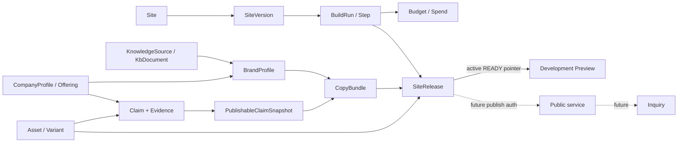

# 独立站管理对象生命周期、权限与状态

> 文档 ID：`FE-SITE-002`
> 层级：`L2 / Module state and authorization specification`
> 生命周期：`ACTIVE_INPUT`
> 评审状态：`READY_FOR_GATE_5_REVIEW`
> 内容 Owner：`OWN-PRODUCT`
> 合同 Owner：`OWN-SITE-BE`、`OWN-TRUTH-BE`、`OWN-SAAS-PLATFORM`
> 关联：`OBJ-FE-003..008/012..017/027`、`STATE-FE-001..020`、`BLK-FE-003/004/007`

## 1. 状态建模原则

独立站管理至少同时存在四层状态，任何页面都不得用一个“站点状态”覆盖它们：

| 层 | 问题 | 示例 | 真值来源 |
|---|---|---|---|
| Site | 用户正在管理哪个长期对象 | draft/building/ready/published/setup_failed | Site read contract |
| Build | 某次生成任务在做什么 | queued/running/succeeded/failed/cancelled + phase/steps | BuildRun/Temporal read contract |
| Release/Preview | 哪个不可变产物可被开发预览 | candidate/ready/failed/deleting/deleted；active pointer | internal SiteRelease + Site.activeVersionId |
| Public service | 哪个版本在公网健康服务 | unpublished/publishing/live/degraded/rollback 等目标状态 | 当前 `NONE`；不得从 Preview 推导 |

`Build succeeded` 不自动等于 `Release active`；`Release ready` 不等于 `published`；`previewUrl` 不等于公网域名。

## 2. 核心对象关系



| Object | 用户可见责任 | 关键边界 |
|---|---|---|
| `OBJ-FE-003/004` CompanyProfile/Offering | 企业与产品事实的可编辑来源 | Site profile 是受限投影；不能反向覆盖所有企业域事实 |
| `OBJ-FE-005` KnowledgeSource/KbDocument | 解释资料处理和 gaps | 首批公开合同仅 aggregate；不虚构单文档管理 |
| `OBJ-FE-006/007` Claim/Evidence | 事实、来源、范围、时效和批准 | AI 不能自动批准；Site public impact contract 缺 |
| `OBJ-FE-008` Asset/Variant | 原始素材、处理状态、用途和权利 | tombstone 与物理 cleanup 分开；被引用时阻止删除 |
| `OBJ-FE-012` Site | 长期管理容器和 active pointer | 不承担 Build/Release/Public 的全部状态 |
| `OBJ-FE-013` SiteVersion | 不可变内容版本意图 | 不是部署产物；编辑合同未公开 |
| `OBJ-FE-014` SiteRelease | immutable manifest/digest/artifact | 当前内部 substrate；无 public list/diff/activate/rollback |
| `OBJ-FE-015` BuildRun/Step | 可恢复长任务及每步结果 | 任务身份持久化；进度只认服务端 |
| `OBJ-FE-016` Budget/Spend | hard cap、尝试和成本来源 | estimated/unknown 不得当实际成本 |
| `OBJ-FE-017` BrandProfile/Snapshot/CopyBundle | 派生输入和发布事实快照 | 不反向成为 Company/Claim SoR |
| `OBJ-FE-027` Inquiry | 未来访客提交边界 | 当前 receiver disabled，SoR/保留/投递待定 |

## 3. 对象生命周期

### 3.1 Site 与 Intake

```text
no_site
→ submitting
→ accepted(generating_demo)
→ draft/building
→ ready when a trustworthy development preview exists

exception:
submitting → acknowledgement_unknown → confirm same key
accepted → setup_failed (Site retained; recovery required)
```

- 客户端把一个业务提交的 `Idempotency-Key` 持久化到获得确定结果或用户显式放弃。
- `IDEMPOTENCY_KEY_REUSED` 表示同键不同 payload，不得自动换键重试。
- `DEMO_LAUNCH_UNAVAILABLE` 是 ACK/launch 边界错误，按同键确认；不推断原子创建已回滚。
- Site 的 `published` 枚举来自当前 DTO，但 Phase 5 不提供使其发生的用户链；UI 不因此显示发布动作。

### 3.2 Profile 并发

```text
loaded(etag N) → dirty(group G) → saving(If-Match N)
→ saved(etag N+1)
or → conflict/precondition_failed → reload/compare/reapply
```

- PATCH 是 group-level replacement；提交 payload 必须只表达用户确认的组。
- `428` 表示缺 precondition；客户端修复请求，不允许“强制保存”。
- `409/412` 进入 conflict state；保留本地草稿，拉新版本，并显式让用户重放或放弃。
- Contact 组不得进入普通 analytics、日志或无权错误文案。

### 3.3 Asset 与 KB

```text
pending_upload → presigned → uploading → committing
→ queued → processing → ready
                     ↘ duplicate
                     ↘ failed_retryable → processing
                     ↘ rejected
ready → delete_requested → tombstoned/deleted → async cleanup
```

- Presigned URL 默认 15 分钟；过期只重取上传授权，不改变稳定 Asset 身份。
- client PUT 和 commit 是两个明确步骤；commit ACK unknown 时确认/重放 commit，而非再次 PUT 新对象。
- `ASSET_IN_USE` 保留 Asset，展示已知 usage 或安全的运营兜底。没有完整引用读合同就不承诺“一键解除全部引用”。
- KB 以 `documents/chunks/gaps[]` 聚合表达。`documents>0` 或 `chunks>0` 不等于全部资料 ready；gaps 进入 partial/degraded。

### 3.4 Claim/Evidence

```text
candidate → needs_review → approved | rejected
approved → expired | revoked | conflict
conflict → resolved(new decision/version)
```

- 通用 Company Claim API 可以读写/批准/拒绝/撤销/解冲突；Site 首批还缺“该 Claim 将影响哪些 Build/页面/文案、当前用户能做什么”的完整 public contract。
- 前端可展示只读 Claim/Evidence 和 blocked reason；不得以推测角色调用通用批准接口，直到 `BLK-FE-003/004` 关闭并有 Site 影响合同或正式运营 SOP。
- 每次 Build 消费不可变 publishable snapshot；后续过期/撤销影响新 Build。旧 preview/未来 public service 的紧急处置需独立合同。

### 3.5 Build、Step 与成本

```text
queued → running → succeeded
                 ↘ failed
                 ↘ cancel_requested → cancelled
                                  ↘ acknowledgement_unknown → running/terminal confirmation
```

Build steps 使用 `queued/running/done/degraded/failed/skipped/aborted`，与 Run terminal 分开。当前业务步骤映射：

| Server step | 用户名称 | 不得误写 |
|---|---|---|
| `kb_ingest` | 读取企业资料 | “知识全部正确” |
| `brand_profile` | 理解品牌与受众 | “品牌已批准” |
| `image_pipeline` | 处理站点图片 | “素材权利已批准” |
| `copy` | 生成受限语言文案 | “事实已自动核验” |
| `assemble_build` | 组装候选站点 | “已发布” |
| `quality_loop` | 质量复核 | `skipped_m1f` 不得显示通过 |

Cost summary v1 的 `reported/calculated/estimated/unknown` 必须分别汇总；hard cap 或 unknown settlement 阻断 fallback 时，页面解释“为何停止”，不能将其归入技术失败。

### 3.6 Release 与 Preview

```text
candidate → ready → active development preview
          ↘ failed (old active preserved)
ready → deleting → deleted
```

- Release manifest/digest/object 和已知组件门都通过后才可成为 active READY。
- unknown component 在 Release promotion 前 fail-closed；renderer 直接调用仍可能跳过 unknown component，这是当前分层限制，不能绕过 Release 门。
- 预览完整性失败不返回“部分页面成功”。旧 active 若存在，提供返回入口。
- target public states 只作未来设计：`unpublished/reviewing/authorized/publishing/live/degraded/rollback_requested/rolled_back/taken_down`。当前无 SoR，不进入实现枚举。

## 4. 权限与动作矩阵

角色名称是产品责任帽子，不是客户端 RBAC 真值。最终 UI 只消费 SaaS 返回的 capability、entitlement、object authorization、data scope、Approval 和 execution authorization；`BLK-FE-003` 未关闭时未知动作 fail-closed。

| 动作 | Operator ACT-002 | Contributor ACT-003 | Approver ACT-005 | Workspace admin | 安全默认 |
|---|---|---|---|---|---|
| 查看 Site/任务/预览 | 预期可见 | 受 scope | 受 review scope | 受 Workspace scope | 服务端未返回 allowed action 则不披露 |
| 创建 Site/Build | 预期可执行 | 默认否 | 默认否 | 不因 admin 自动获得 | 隐藏/禁用并显示 reason，不硬编码 |
| 编辑 Profile | 预期可执行 | 受委派组 | 只读或受委派 | 不默认覆盖 | ETag + group scope |
| 上传 Asset | 预期可执行 | 预期可委派 | 只读 | 不默认覆盖 | 类型/大小/权利和 quota 由服务端 |
| 删除 Asset | 高影响，需 allowed action | 默认否 | 默认否 | 不自动允许 | 先查 usage；409 时保持对象 |
| 查看 Claim/Evidence | 受数据范围 | 受数据范围 | 预期可见 | 不默认读个人/受限证据 | anti-disclosure 403/404 |
| 批准/拒绝/revoke Claim | 默认否 | 否 | 需显式 Approval capability | admin 不自动继承 | Site 合同缺时全部 blocked |
| 取消 Build | 需 allowed action | 默认否 | 默认否 | 不自动允许 | 只向相同 buildId 发请求 |
| 接受开发预览 | 可记录反馈 | 可评论 | 可审核事实 | 不等于 Publish auth | 只改变 review object，不激活公网 |
| Publish/rollback/domain | 不可用 | 不可用 | 不可用 | 不可用 | `BLK-FE-007`，无动作 |

## 5. 错误、状态与微文案映射

| Contract/error | UI state | 保留内容 | 下一动作 | Copy |
|---|---|---|---|---|
| intake `VALIDATION_ERROR` | field/error summary | 用户输入 | 修正并原键提交 | `COPY-FE-SITE-002` |
| `IDEMPOTENCY_KEY_REUSED` | conflict | 已知 Site/本地草稿 | 返回既有结果或显式新意图 | `COPY-FE-SITE-003` |
| `DEMO_LAUNCH_UNAVAILABLE` | `STATE-FE-018` ACK unknown | 可能已建 Site | 同键确认 | `COPY-FE-STATE-005` |
| profile `409/412/428` | conflict/precondition | 本地修改 | 刷新、比较、重放 | `COPY-FE-SITE-005` |
| presign expired | recoverable | Asset 身份/已选文件（浏览器允许时） | 重新 presign | `COPY-FE-SITE-006` |
| commit ACK unknown | confirming | 已上传对象 | 重放/确认 commit | `COPY-FE-SITE-007` |
| Asset duplicate/rejected/retryable | terminal variants | 现有对象或 Asset 身份 | 打开已有/更换/重试处理 | `COPY-FE-SITE-008..010` |
| `ASSET_IN_USE` | blocked | Asset 和引用 | 打开已知引用/运营兜底 | `COPY-FE-SITE-011` |
| KB gaps | partial | ready documents/chunks | 补资料 | `COPY-FE-SITE-012` |
| Claim contract/approval missing | blocked | 未批准事实不进入新 Build | 查看 Evidence/联系运营 | `COPY-FE-SITE-013/014` |
| `BUILD_IN_PROGRESS` | existing task | 当前 active Build | 打开任务 | `COPY-FE-SITE-015` |
| unsupported scope/option/target | validation | 配置草稿 | 只选 server enum | `COPY-FE-SITE-016` |
| `QUOTA_EXCEEDED` | blocked | 当前 Site/旧 preview | 等待/申请，只有 entitlement 给出才显示升级 | `COPY-FE-SITE-017` |
| Build degraded/failed | partial/failed | 已完成步骤和旧 active | 查看影响、补资料、重建 | `COPY-FE-SITE-019/020` |
| cancel `*_UNAVAILABLE` | ACK unknown/active | Build 身份 | 同 buildId 确认 | `COPY-FE-SITE-021` |
| preview integrity/unknown component | fail-closed | 旧 active（若有） | 返回旧预览/运营升级 | `COPY-FE-SITE-022` |
| no active preview | empty/blocked | Site | 完成 Build/查看失败 | `COPY-FE-SITE-023` |
| locale degraded | degraded | 主语言结果 | 补审/移除可选 locale | `COPY-FE-SITE-024` |
| publish/domain/inquiry action | unavailable | 开发预览 | 说明当前边界 | `COPY-FE-SITE-026..029` |

## 6. 长任务与恢复协议

1. 创建成功后立刻保存 canonical Site/Build ID；刷新、重开和跨设备都从服务端恢复。
2. 轮询采用可见性/网络感知退避；页面后台时降低频率，回前台先重新读取，不从本地计时器续算。
3. 网络错误不会改写服务端状态；显示 stale time，并在危险动作前强制刷新。
4. Cancel 是请求—确认协议；按钮进入“正在确认取消”，而不是立即把任务涂成 cancelled。
5. 新任务失败不清除旧 active result；重试创建新的 Build 身份，并保留失败 run 供审计。
6. partial/degraded 允许用户查看已完成结果，但接受动作必须列明未完成范围。
7. 用户可见错误用稳定业务码映射；原始 transport、storage key、Prompt、stack、provider 信息只进入授权诊断。

## 7. 待关闭输入

- `BLK-FE-003`：真实 capability/entitlement/allowed-actions/error reason contract；没有它，本矩阵不能实现验收。
- `BLK-FE-004`：Site Claim review、impact、audit 和运营 SOP；没有它，事实纵切不能完整自助。
- `BLK-FE-006`：人工升级路径、响应时限和实际责任人；文档只能定义何时升级。
- `BLK-FE-007`：Public Release/Publish/Domain/Inquiry/Analytics 的对象、状态、权限、API、infra 和隐私。
