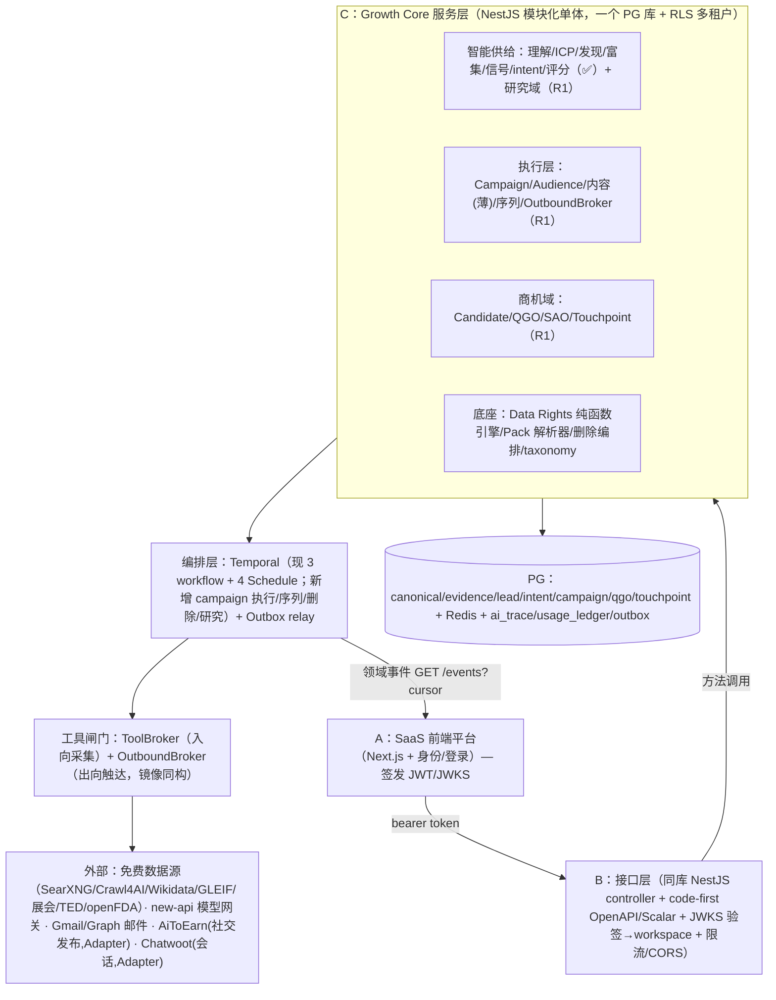

> 【SUPERSEDED 2026-07-10】本文件是顶层设计 **v1**，已被合流定稿取代：[../product-scope.md](../product-scope.md) + [../architecture/current.md](../architecture/current.md) + [../adr/registry.md](../adr/registry.md)。**其中「QGO/Opportunity B+C 同库共建」「全部业务真相在增长库」等表述已被 ADR-001（本仓止于 LeadQualifiedPackage，QGO 归 SaaS）改判**，勿再引用。保留仅作研究归档。
> 文中的“C+Claude / 未来 Claude 会话 / merge-judge”是历史组织与工具称谓，不是当前责任链；现行开发主体、PR 与合并规则只认 Codex + [../../AGENTS.md](../../AGENTS.md)。

# 出海企业 AI 全球客户开发与增长执行平台 · 总体顶层设计

> 2026-07-10 v1。**本文是整个平台（不只获客后端）的顶层设计**：把 v3.0 两份 Word 评审稿（《产品总纲与产品手册》=why、《产品总体 PRD》=what，均待批准）消化成一份三人团队可执行的总体设计。
> 方法：两份 docx 全文提取精读 + 两轮共 12 个视角对抗式精读（产品/系统/数据/合规/边界/文档审计 + 执行层/商机归因/Pack专家/体验IA/研究域/交付路线），每条结论带文档出处核验。
> 【事实】=文档/代码核验所得；【建议】=设计判断；需业务负责人拍板的集中在 §15。
> 读者：业务负责人（C）、前端（A）、接口层（B）、未来 Claude 会话。

---

## 1. 一页图景

**产品**【事实，手册 §1.1】：面向中国出海企业的 AI 全球客户开发与增长执行平台——客户只给官网/产品/目标，平台主动完成企业理解→市场研究→客户发现→内容与触达→互动→商机转化→归因优化的全闭环。

**北极星**【事实，D-021】：每活跃 Workspace 每月新增 **QGO（合格增长商机）** 数 + 单位 QGO 成本。价值链：

```
Market Opportunity → Qualified Account/Contact → Opportunity Candidate → QGO → SAO → Verified Outcome
└──── 智能供给段（获客引擎，✅已建成并真实运行）────┘└──── 执行与结果段（本设计要建的）────┘
```

**13 阶段闭环归成三段 + 一个底座**【建议】：

| 段 | 覆盖阶段 | 现状 |
|---|---|---|
| **智能供给**（理解/研究/ICP/发现/验证评分） | 0-4 | ✅ 获客引擎已建成，真实数据常驻运行（Research 域除外） |
| **执行触达**（Campaign/内容/审批/发布/互动） | 5-9 | ⬜ 未建，本设计 §6 |
| **商机结果**（QGO/SAO/归因/学习） | 10-12 | ⬜ 未建，本设计 §7 |
| **平台底座**（数据平台/AI 平台/合规策略/Pack/身份） | 横切 | ◐ 数据/AI/合规大半已建（§9-11），身份归 A，Pack 未建（§8） |

**总设计立场**【建议，全文的纲】：把 PRD 的「广度完整、深度受控」（§13.1）在三人团队现实下反转为——

> **闭环完整、广度受控**：获客引擎已是真的；接下来所有投入换取一条「Campaign→邮件触达→回复→QGO」的真实窄路，其余域（视频/多平台/专家/Marketplace）以变更记录（PDR）显式后延，而不是假装十二域全面铺开。

---

## 2. 产品域总地图（14 个一级域 × 归属 × 波次）

【裁定建议】C=获客/增长后端（同库服务层），B=接口层（同库 controller/契约），A=前端 SaaS 平台（含身份）。R0-R3 见 §13。

| 产品域（手册 §7.2） | 归属 | 建设波次 | 现状/说明 |
|---|---|---|---|
| Workspace 与治理（身份/角色/审批） | **A 主** + C 消费 claims | R0 握手 | C 已备 JWKS 验签，待 A 给端点+claim 约定 🔴 |
| 企业理解与知识 | **C** | ✅ 已建 | Claim/Evidence/冲突/人工 Gate |
| Market Research | **C 建后端** + A 出 UI | R1-R2 最小 4 层版 | 现 backlog 写「后延」，本设计建议反转（§5、§15-6） |
| Data Hub（多源发现/身份解析/权利） | **C** | ✅ 已建 | 最厚的一层，免费源 fan-out |
| ICP 与 Lead Intelligence | **C** | ✅ 已建 | 六维评分/四队列；缺回测 |
| 出口准备度/Buyer Trust | A 主 + C 供数据 | R3+ | Onboarding 精简形态先行 |
| Campaign | **C 建对象与编排** + B 契约 + A 画布 | R1 | 协调上下文非聚合根（§6.1） |
| Create/Video | C 薄自建（图文/邮件）；视频 R3+ | R1 文案 / R3 视频 | MoneyPrinterTurbo 后置 |
| Publish/Outreach | C 建邮件直连；社交经 AiToEarn Adapter | R1 邮件 / R3 社交 | 先邮件后社交（§6.5） |
| Engage/Inbox | C 建邮件回流；聊天渠道经 Chatwoot | R1 邮件 / R3 多渠道 | 先 Engage 后 Publish 铺宽 |
| QGO/Opportunity | **B+C 同库共建**（SoR 在增长库），A 只出 UI | R1 最小版 | 裁决见 §7.1、§15-1 |
| Analytics/归因 | C 事件+成本 → 规则归因 | R1 记账 / R2 归因 | 归因不物化（§7.2） |
| Pack/Expert | C 骨架 3 表 + 内容按需 | R1 骨架 / R2 内容 | Studio=git，Marketplace 不设计（§8） |
| AI Platform / Integration Ops | **C** | ✅ 大半已建 | 缺 Golden Set/PolicyPort/observability 补强（§10） |

---

## 3. 总体系统架构

### 3.1 架构图【建议】



### 3.2 关键架构决策（重申与新增）【裁定建议】

1. **单体同库不动摇**（2026-07-08 团队决议 + PRD §11.18 一致）：A→B→C 方法调用；拆微服务的触发条件=团队/流量/发布节奏证明需要。
2. **双平面编排**：事件驱动主链（对象创建→workflow）+ 时间驱动维护面（Temporal Schedule 增量蚕食）——获客侧已验证此模式，执行层与研究域沿用。
3. **无超级 Agent**（§9.11）：LLM 只在有界 Task 里理解/生成/建议；状态/权限/预算/执行/审计全部确定性。执行层新增镜像原则：**LLM 只产 ActionProposal，发送动作 100% 走确定性 OutboundBroker**。
4. **两个 Broker 对称**：入向 ToolBroker（已建：白名单/预算 reserve-settle/限流/source_policy/幂等/trace）；出向 **OutboundBroker**（待建，同构：验 ExecutionAuthorization→Suppression 逐条重查→Policy→频控预算→幂等→审计→才调 Provider）。Kill Switch/熔断挂在 Broker 层。
5. **PRD 技术基线对照结论**【事实】：已对齐 12 项（NestJS 单体/PG+RLS/Temporal/Outbox/pgvector 起步/Adapter-ACL/字段级 Evidence/Task Contract/Tool Registry/无超级 Agent/状态机/薄网关契约）；**有意偏离 4 项**（new-api 替代 LiteLLM、全 TS 无 Python worker、不用 BullMQ、自建 ai_trace 替代 Langfuse——理由均成立，应在 deviations 登记不再静默）；范围内未建=OPA（用 PolicyPort 过渡，§10）、Golden Set、OTel、PII 列级加密、事件对外通道（R0 必修）。
6. **数据所有权（SoR）**：全部业务真相（Company/ICP/Lead/Campaign/QGO/Evidence/Rights）在增长库 PG；A 的身份库只拥有 Organization/User/会话；AiToEarn/Chatwoot 只拥有各自执行态（媒体任务/会话消息），经 ExternalExecutionId 映射，**绝不反向成为业务事实源**（§10.3.2/§7.9.10）。

---

## 4. 智能供给段（获客引擎，已建——现状与补强）

【事实】已建成并真实运行：企业理解(Claim/Evidence)→ICP(买家委员会)→多源发现（public_web/wikidata/OSM/名录/展会/TED/openFDA fan-out，全免费）→确定性身份解析→fit 四门→富集（GLEIF/Wikidata 命名空间）→信号（digital_footprint/structured_harvest）→intent 引擎（web_watch 网站变更 + TED 招标 + openFDA 510k 清关）→决策人抽取（🔴隔离）→邮箱验证（smtp_self，RISKY 不谎报）→六维评分→四队列；4 个 Temporal Schedule 常驻。

【建议】按客户价值排序的补强 Top5：① 贸易数据/TradeFlow（发现来源顺序第 1 位、对标腾道主战场；先国家级免费统计起步，§5）；② **ICP 回测**（无回测的 ICP=假设型，直接损伤 Lead 接受率）；③ 客户自有数据接入（CRM/CSV 排重·校准·激活，D-003）；④ 联系人补全 waterfall（Reachability 硬底卡住供给量）；⑤ Data Product API 统一信封（Evidence/Quality/Rights/Freshness/Cost/Partial，PRD §8.17——B 对接前置）。

供给质量指标（对北极星的可度量贡献）：Lead 接受率、证据覆盖率、真实意向信号覆盖率、邮箱有效率、重复/失效率、单位有效公司成本、ICP 命中率。

---

## 5. 市场研究域（最小 4 层版）

【事实】研究是一级产品域，输出必须进入 ICP/Lead/Campaign（D-005）；现 backlog 把研究「后延」——与 D-005 冲突，本设计取折中。

【建议】**建最小 4 层版，不全量也不全延**：全球筛选/贸易/买家地图/风险四层（竞品情报/监测/内容渠道层推 R2+）。理由：ICP 质量是整个漏斗的最上游，研究最小版直接抬高已建引擎的产出，且 **90% 复用已建件**——SearXNG/Crawl4AI/ToolBroker（检索）、taxonomy+crosswalks（新增 HS 子树，CPV/FDA 模式第三次复用）、field_evidence（加 claimType 枚举：独立事实/供应商自述/贸易记录/AI 推断/专家确认）、TED/openFDA/GLEIF（注册库层）、name-match（实体归并）、monitored_source+diff（论点监测）、Temporal（researchWorkflow）。

要点：MarketScorecard 9 维**确定性规则聚合**，LLM 只做维度内证据摘要（§7.3.7 禁 LLM 直出单一分）；研究→ICP 走「一键生成草案 + sourceThesisId 溯源 + Thesis 改版发事件标待复核」（引用不复制，人工 Gate 不自动改）；**Trade Intelligence 起步=国家级免费统计**（Comtrade/Census/Eurostat，零付费，market×HS 优先级，无公司名），公司级提单在国家级证明价值后并入（DLP FOIA 前提先核实）。深度研究=「Temporal 编排 N 个有界 Task」，恰是现有 L2/L3 架构的直接延伸，不引入自主漫游 agent。

---

## 6. 执行层（Campaign → Create → Publish/Outbound → Engage）

### 6.1 Campaign：协调上下文，非聚合根（D-009）【建议】

新 NestJS 模块 `campaign/`，各对象独立表仅存 campaignId 外键：campaign（目标/ICP/预算/Owner）、audience（**Query Snapshot**=lead 队列查询条件快照 + 生成时刻 leadId 物化清单）、content_plan/outreach_sequence（独立版本化）、campaign_revision（运行中变更=新 revision+重审批）、execution_authorization、stop_condition。统计走 outbox 事件读模型，不实时跨表 Join。**与获客产物的接口：Campaign 只读 lead 四队列**，获客侧零改动；回写走 TouchpointCreated/ReplyReceived 事件进 `attributes.engagement.*` 喂重评分。11 态状态机全量实现，APPROVED 迁移是唯一签发 ExecutionAuthorization 的时点（不可变行：内容哈希+边界快照+有效期，只能吊销不能改）。

### 6.2 Build vs Integrate【裁定建议】

| 段 | 决策 | Spike 失败 Plan B |
|---|---|---|
| Create 图文/邮件文案 | **自建薄层**（复用 new-api 网关 + Claim 引用 + 品牌/禁词 QC） | 无需 |
| Create 视频 | R3+；MoneyPrinterTurbo 作 VideoCompositionProvider，只进 Worker+对象存储 | 商业视频 API / FFmpeg 模板 |
| Publish 社交 | **AiToEarn 经三 Provider 契约**（仅过生产 Spike 的渠道；绝不写增长主数据） | 自实现 1-2 个 API 友好平台直连 Adapter；其余标 UNSUPPORTED，**不降级浏览器自动化** |
| Engage 邮件回复 | **自建**（Gmail API/Graph 线程同步，不经 Chatwoot） | 无需 |
| Engage 聊天/WhatsApp/社评 | Chatwoot 经 ConversationProvider（只持会话执行态） | 自建最小三表（conversation/message/assignment）+ 长尾渠道标 MANUAL_ONLY |

**三人现实判断**：执行层唯一「必须成」的是**邮件**（全栈可控、无 App Review）；两个外部内核只加渠道宽度，失败均可降级不伤主线。

### 6.3 对外动作管控链（PRD §0.3 七检查的执行架构）【建议】

校验一次编排、逐动作执行，全部确定性：①数据权利（Audience 构建时，复用 source_policy+field_evidence+🔴标记——无合法基础的联系人**进不了名单**）→ ②Suppression（Dry Run 展示 + **发送前逐条重查**，权威在发送时刻）→ ③Policy（TS 确定性 PolicyService，契约对齐 OPA 输出格式日后可替换）→ ④RBAC（JWKS roles，B 层 Guard）→ ⑤Campaign Scope（执行网关比对动作参数 ⊆ 授权边界）→ ⑥Approval（人审 Dry Run→APPROVED）→ ⑦ExecutionAuthorization（事务内签发不可变授权）。全链在 **OutboundBroker** 强制执行。

### 6.4 邮件 Outbound 最小可行版（三人版）【建议】

**不建发送基建**：只做 Gmail API / Microsoft Graph **用户授权发送**——送达率随客户自有域名信誉，平台零 IP 运维。序列=Temporal workflow（每联系人一实例：step→Broker→发→sleep→查回复→分支；暂停/退订=Signal）；域名健康=复用 digital_footprint 的 DNS 能力做 SPF/DKIM/DMARC 日检（第 5 个 Schedule），不达标 BLOCKED+修复指引；退信=轮询收件箱识别 DSN→contact_point 置 INVALID+写 Suppression，硬退率>2% 触发熔断暂停 Campaign；退订=List-Unsubscribe（mailto+一键 URL）→Suppression 全局立即生效；回复=Gmail history/Graph delta 拉线程，In-Reply-To 关联回 Campaign/Contact=Engage 最小版；发送前复用 smtp_self 验证（RISKY 不发或降速）。

### 6.5 执行层阶段顺序【裁定建议】

E1 Campaign 骨架+管控链（纯内部零外部依赖，B 可同步出审批 UI 契约）→ E2 邮件 Outbound+邮件 Engage（**不可拆**：发出去收不到=零价值）→ E2.5 并行启动 AiToEarn/Chatwoot Spike（外部审批周期长，早启动不阻塞）→ E3 社交 Publish+品牌内容（此时 Inbox 骨架已在，先 Engage 后 Publish 铺宽）→ E4 视频+实验深化。**排序逻辑：每阶段收口一条「发出→收回→归因」完整环，绝不先铺渠道宽度再补回收。**

---

## 7. 商机与归因域（QGO / SAO / Verified Outcome）

### 7.1 核心设计决策【裁定建议】

- **lead ≠ QGO**：lead 四队列是获客侧的**评分读模型**（随重评分刷新）；QGO 是**带承诺语义的聚合根**（状态机+审计+不可静默刷新）。混用会让重评分冲掉商业状态。
- **转换协议**：`lead(recommended + intent 达阈值 或高意向消息) → C 发 OpportunityCandidateProposed（outbox）→ QGO 域消费 → qualifyWorkflow 跑六门 → QUALIFIED → A 前端 Sales 点接受（owner/stage/nextStep/dueAt/reason 五字段必填）→ SAO`。
- **所有权**：QGO 聚合 **SoR 落增长库（B+C 同库共建）**——B 出 controller，C 出资格 workflow；A 只调接口出 UI，不落自己的商机表（与 PRD §7.9.10「平台拥有 QGO 主数据」一致，也规避 A 独立 DB 造成商机脱离证据链）。此裁决需拍板（§15-1）。
- **资格六门复用**：QGO 六条件中五条直接复用已建确定性件（fit 四门/intent 事件/canonical 身份/suppression+Reachability 硬底/field_evidence→QualificationSnapshot），仅「推荐动作+有效期」新建。LLM 只做证据摘要，不做资格裁决。

### 7.2 Touchpoint 与归因【建议】

单张 append-only `touchpoint` 表；**归因不物化**——First/Last Meaningful Touch 是查询时规则视图（改规则不回填），人工 Primary Source 是 QGO 上可覆写字段；「归因待修复队列」=缺 account/campaign 关联的 touchpoint。**多触点归因的启动门槛**：月 QGO≥30、触点解析率≥80%、Won/Lost 积累≥1 季度、渠道≥3——达标前上模型是自欺（PRD §7.10.5 自己划了界），预计 M3+。

### 7.3 指标 SoR 地图与反馈回路【建议】

供给/质量指标 SoR=获客后端；活动/执行指标=执行域；商业漏斗与护栏指标（QGO→SAO 接受率、7/30/90 回写率、重复失效率）=QGO 域（本质是状态机转移计数）；成本分母=UsageLedger（已建）。反馈回路：SAO 拒绝必选**结构化原因码**（not_icp/bad_timing/unreachable/duplicate…）→ 两条批式回路（ICP 回测修订建议 + 六维评分权重 backtest 校准——正好供给已排期的「加法→乘法门」所需标签流），**不做在线学习**，权重配置 workspace 私有（RLS），全局默认只能匿名聚合+人工评审升级为 Pack 默认（§5.14.1 学习隔离）。

**建设时机**：R1 启动最小版（4 张表+状态机+Outbox 消费+资格 workflow+手动接受/拒绝+First/Last Touch 视图），与触达 MVP **并行而非其后**——intent 事件今天已在产出，可先跑通「无回复也能提 QGO」的 signal 驱动路径。砍掉：合并/拆分、CRM 同步、Outcome 自动同步、多触点归因、Experiment。

---

## 8. Pack 与专家体系（平台可扩展性）

### 8.1 Pack 统一机制【建议】

**Pack = 数据+配置+规则的版本化 jsonb 文档**，落现有 PG，zod 按类型校验（全 TS 团队无需 DSL 引擎）。5 表骨架：pack / pack_version（semver+content+审批+灰度）/ pack_dependency / workspace_pack_binding（pin+overrides）/ resolved_strategy_snapshot（**不可变**，Campaign 启动物化，运行中一律读快照，Pack 升版→Revision 提案+重审批，绝不热更新）。解析器=纯函数按 §7.11.7 优先级深合并，**禁止项单向传播**（低优先级不得解禁高优先级 deny——与 source_policy fail-closed 同构）。

**关键接缝**【事实+建议】：已建 taxonomy+crosswalks+resolveIcpToCpv/Fda **就是 Data Source Pack 的运行时**（PRD §7.11.6 要求已实现 ~60%）——taxonomy 是平台共享资产，Pack 只存引用不内嵌码表；**source_policy 就是 Compliance Pack 的执行面**（Pack 发布时编译写入 policy 行，运行时走已实测的 fail-closed 门）。Growth Motion=横切默认值覆盖层：一个 Motion 只改「来源优先级/资格门阈值/六维权重向量/序列模板/停止条件」这组已参数化默认值，零新代码路径（第一刀：把 scoring.ts 硬编码权重外部化为 Pack 字段）。

### 8.2 Expert System 最小版（R2 内部运营）【建议】

5 对象（ExpertRequest/Brief/Assignment/Deliverable/KnowledgeContribution）+ 1 状态机 + Temporal SLA 定时器；无市场无结算。**D-018 硬线**：LLM 只做分诊/Brief 草稿/摘要，输出恒标「信息辅助非专业意见」；专家结论→通用规则必须人工去敏+显式审批，无自动通道。

### 8.3 三种交付模式（D-024）的三个必建机制【建议，M1 就长进骨架】

① **Actor 双字段**：所有写操作记 `actorUserId + onBehalfOfWorkspaceId`（Managed=运营者以客户身份操作，同一 RLS/审计）——对现有后端是 outbox+field_evidence 加字段的一次 migration；② **任务责任矩阵是数据不是代码**（taskType→defaultOwner per mode，模式切换=改表）；③ **审批路由读矩阵**（高风险动作在 Managed 下仍路由到客户）。

### 8.4 防过度设计裁剪【裁定建议】

M2 前不建：Channel/Content Pack（消费者未建，配置先于能力=纸面）、Expert Playbook Pack、Industry/Market Pack 完整形态（只做薄片：ICP 默认值+taxonomy 锚点+四档支持等级标注）。**Pack Studio：M2 前就是 git**（JSON 进仓库、PR=专家审核、CI Golden Set=测试集、merge=签名发布、revert=回滚——满足 PAK-004 全部语义零 UI 成本）。Marketplace：付费客户 <50 家前无意义，不设计。**总纲：骨架 M1 一次建对（便宜），内容严格按「先有消费者、后有配置」由真实客户拉动。**

---

## 9. 数据平台总体设计

**五层数据资产模型（PRD §8.3）映射**【事实】：Public & Official Intelligence=最厚已建层（raw_source_record/source_policy/采集监控/全部免费 provider）；Derived Intelligence=已建（canonical/attributes/评分/intent，缺算法版本留痕）；Licensed Commercial=**有意空缺**（免费优先，插槽表已备勿提前建）；Customer Private Vault=大部分归平台侧，只留 ICP 回测样本上传接缝；First-party Signal=**永远不该在获客侧建**（表单/邮件回复/会议是执行域产物，R1 起由执行层写 touchpoint/engagement 事件）。

**流水线缺口**【事实】：对照 §8.7 十三步缺三环——Data Classification（落 `field_evidence.dataClass('green'|'amber'|'red')` 列，替代代码纪律）、Deletion（§11 删除编排）、Read Model/搜索索引（按需后置）。

**身份解析演进触发点**【建议】：CanonicalPerson 任职时间有效性=接任何付费联系人源前；IdentityLink merge/split/回放=多商业源前；CompanyRelationship/TradeRelationship 抽表=经销商/提单需求出现时；pgvector look-alike=单 workspace canonical>1 万时；Splink=海关 consignee 场景才引入。

**Data Product API（§8.17）**【建议】：交付 B 前先定统一返回信封 DTO（Evidence/Quality/Rights/Freshness/Cost/Partial）；必补 getEvidence（§8.21 验收第一条）/checkDataRights 只读版/requestDeletion/resolveIdentity 显式端点；searchMarkets/getTradeRelationships 随研究域（§5）落。单位经济：不建新表，usage_ledger+costCents 聚合视图先落 6 指标。

---

## 10. AI 平台总体设计

【事实】四层模型（L0 Tool→L1 Provider→L2 有界 AI Task→L3 Temporal）+ ToolBroker + Task Contract + 薄网关契约已建并实测；OPA/Langfuse/Golden Set 未建。

【裁定建议】三项取舍：
1. **OPA 不急引，先抽 PolicyPort**：`evaluate(action, ctx) → Allow/Deny/RequireApproval` 单一入口 + policy_decision_log 审计，把散落的确定性门收口到可替换实现后面；触发引 OPA 的条件=对外动作规模化或平台侧要求策略版本化。执行层的 PolicyService（§6.3）与数据侧 DataRightsService（§11）都实现此契约。
2. **Langfuse 前先补两件事**：correlation_id 贯穿（workflow→task→tool→model）+ 脱敏分级（🔴任务不存完整 prompt/response）——避免敏感数据先于脱敏策略进第三方观测库。
3. **Golden Set 最高优先**：fit 门/抽取/CPV/FDA 映射的真实判例已在 verify 脚本产物中现成，固化为每任务 30-50 例离线集进 CI——换模型路由（Gemini 429→deepseek 类操作）唯一的回归保障。执行层上线后新增三高风险任务集：意图分类/邮件文案事实支持/资格摘要。

---

## 11. 合规总体架构

**责任三栏**【裁定建议】：存储侧 A 门（STORE/AI_PROCESS/RETAIN/DERIVE 判定、证据、删除编排引擎、爬虫治理）=C；发送侧 B 门（OUTREACH 判定、可发送性矩阵、退订/退信治理）=执行层（R1 起与邮件同批建**最小版**——德国 UWG 硬红线等，不再是「后延」）；平台侧（VIEW/EXPORT/SHARE 的 RBAC 执行点、DSR 受理 UI、审批链 UI）=A/B。

**Data Rights 引擎**【裁定建议】：确定性 TS 纯函数 `DataRightsService.evaluate(ctx)`，规则=jurisdiction_policy 种子表数据行，每次判定写 policy_decision_log；动作词表从 3 扩到 PRD §8.10 的 7 个（AI_PROCESS 是每天在做却无判定点的动作，优先补）。**LLM 绝不参与权利判定**。

**删除编排（GDPR Art.17，backlog #3）**【建议】：2 张 append-only 表（deletion_request 状态机 + deletion_receipt 完成证明）+ Temporal deletionWorkflow 五步（冻结先写 suppression→按 personal_data 证据+命名空间定位→硬删/匿名化（指纹哈希天然免删）→触发重评分→回执）。**硬前置：删除编排必须先于任何邮件发送上线**（存决策人个人数据而无删除路径=试点可被合规叫停）。

**PRD 空白、本设计补的两块**【建议】：① **PIPL 法域对**（欧盟自然人数据→中国租户使用是双向跨境；evaluate() 输入加「数据主体法域×处理地法域」，jurisdiction_policy 加 PIPL 行，同一引擎）；② **制裁名单筛查**（把 OFAC SDN/EU 名单/BIS Entity List 命中实体推荐给中国客户=转嫁出口管制风险；平台级 sanctions_entity 表+Schedule 周更（trade.gov CSL 等全免费）+qualify **第五门**：命中→SCREENING_HIT 隔离队列必人审，绝不自动推荐也绝不自动实锤）。

**不可回退红线（写给所有会话）**：🔴具名个人数据默认隔离（无 LIA 不解锁 OUTREACH）；LLM 不做权利判定；source_policy fail-closed；证据先行（无 evidence 字段不评分不导出）；🔴内容只存指纹/计数；新表设计时声明删除依赖链位置；embedding 只对公司事实；个人数据必有保留期清理；RLS 不回退；Suppression 是一切对外动作第一道检查；技术能抓≠合规能用。

---

## 12. 前端体验与信息架构（给 A 的顶层输入）

**导航分期点亮**【建议】：M0-M1 四项（今日/客户/企业/设置——未上线项不显示，不做灰置空壳）→ M2 +战役/互动 → M3 +内容/洞察成六项终态（PRD §6.2）。页面地图：M0 骨架=Today(lite)/Company&Knowledge/ICP/Lead Explorer（后端今天就能全部支撑）；M2=Campaign Canvas/Inbox/QGO；M3+=Video Studio/Expert Workspace/完整归因。

**交互架构硬约定**【建议】：AI 面板永远不直接返回散文，返回**类型化产物信封** `AIEnvelope = {objects[], actions[](带自动化等级徽章), evidence[], cost, risks[]}`；对象一律持久化为后端实体，聊天历史只是索引（§6.4.1「对话不是结果，任务对象才是结果」）；全部工作页复用战役画布三栏骨架（左流程/中结构化编辑/右 AI+证据）。自动化等级 MVP 收敛三档：L0 推荐卡/L1 草稿/L2 审批卡（diff+不可变授权）；L3/L4 不出现。

**首次价值（M1 可兑现版）**【建议】：重定义为「**30 分钟拿到第一批可解释的推荐线索**」——输入官网→Claim 审核→建 ICP+回测→查询计划确认（L2 闸已有 `confirm` 端点）→发现进度页（分阶段展示不许无信息 Loading）→四队列+逐条六维 Score Explain+证据抽屉→accept/reject。发现耗时数分钟级，引导流插「后台跑、跑完通知」中断点。

**裁剪与红线**：Video Studio/Expert Workspace/完整归因 M3+；市场研究首发=ICP 页内「市场摘要卡」；设计系统首发 5 组件（RecommendationCard/EditableTable/ApprovalCard/EvidenceDrawer/StatusBadge）；页面状态先做 4 态（Empty 即教学不砍）。**不可裁**：证据可回溯、L2 审批闸、未确认事实阻断（ONB-008）、🔴个人数据字段按角色遮罩。

---

## 13. 现实版交付路线（R0-R3，替代 PRD M0-M3 的三人版）

【事实】PRD 假设 12+ 人团队做 M1 十二域全 Alpha；现实=三方。获客段已用真实数据越过「沙箱 Alpha」直达受控真实运行——**不再为已真跑的段位补做模拟原型**。

| 阶段 | 范围 | A 交付 | B 交付 | C+Claude 交付 | 退出条件 |
|---|---|---|---|---|---|
| **R0 对齐与握手**（2-3 周） | 契约冻结 + 一条真纵切 | JWKS+claim 约定；登录/Workspace；Lead 队列查看页 | 读路径 OpenAPI（队列/证据/ICP/run 进度）；**事件出口**（GET /events?cursor） | 保持 sweep 运转；**启动删除编排**；本设计作 PDR 提交；开放决策关闭 | A 用真 token 经 B 读到 C 真实 lead 数据 |
| **R1 单渠道最小闭环**（6-8 周） | Campaign 最小对象+授权+邮件单渠道（草稿→人审→受控发送）+回复收件箱+**QGO 手工确认**+事件/成本记账 | Campaign 创建/审批/收件箱三页 | 写路径 API+审批校验最小版 | Campaign 域/邮件序列 workflow/Engage 最小/QGO 对象/删除编排落地/研究域最小 4 层启动 | 内部账号走通全链一次（真数据、受控发送、0 未授权动作） |
| **R2 真实试点**（8-12 周） | 2-3 家 Design Partner，每家 1 个 Campaign；规则归因；周复盘 | 复盘看板/成本视图 | 归因报表 API | 数据质量修复、游标饿死+乘法门、Golden Set 三任务 | **3 家中 ≥2 家激活、≥1 家 30 天内出人工确认 QGO**；数据权利/Suppression 100%；单 Campaign 成本可算 |
| **R3 补域+商业化前奏** | AiToEarn 图文发布(1-2 平台)/Pack 内容/视频/SAO 回流/计费 SLA | 平台授权 UI | 发布 API | AiToEarn Adapter Spike→生产（按 §13.7.1 Gate） | 试点续约/付费意向 |

**依赖主干**：JWKS(A) → 读契约(B) → 事件出口(B) → Campaign 对象(C) → 审批授权(B+C) → 邮件发送(C) → 回流(C) → QGO 确认(A 页) → 归因(C)；**删除编排──必须先于──邮件发送**。可并行：游标修复/乘法门/研究域/Golden Set/A 的登录页。

**M2 成功标准裁决**【建议】：以 **QGO 为 Gate、SAO 降为观察指标**（PRD §13.6 为后订版本且 ANA-013 明文 QGO 北极星；SAO 依赖 partner 销售组织行为，n=3 下作 Gate 必然噪声主导）；比例指标改绝对值门槛。

**质量工程现实版**：保留=单测/契约测试（339+ vitest）、真数据 verify 脚本推广为联调 Gate、Codex 审查+CI+用户明确确认、租户隔离/SSRF/RLS 验证、开放决策命中即停；简化=E2E 只保一条纵切 Journey、Golden Set 只做三个高风险任务、Runbook 先三条（邮件退信投诉/爬虫安全/数据删除）；暂缓=Provider Bake-off、平台 Capability Gate、ComfyUI/Remotion/Langfuse Spike。**Gate 4 Pilot Ready（数据权利/发信/Runbook）是唯一不许简化的门。**

**风险 Top5**：① A 侧握手/进度单点（应对：契约先行+dev stub；A 延期则 API-only 试点，Scalar 门户当临时 UI）；② 发送先于删除编排（列 R1 阻塞项）；③ 邮件单渠道全押注→域名烧毁（partner 自有域+小批量双确认+B 门最小版先行）；④ 无运维兜底（备份脚本+最小告警+三 Runbook+高风险变更升级人）；⑤ PRD 惯性范围回摆→三方各建一半（本设计作 PDR 走变更控制，RACI 随 R0 契约签认）。

---

## 14. 团队接缝与防蔓延

**三接缝**【建议】：① **JWKS**：A 出 `/.well-known/jwks.json`+claim（iss/aud/exp/sub/workspace_id/roles[]，aud=growth-api）；C 只认粗粒度 scopes，roles→scopes 映射归 B（防 A 的 RBAC 细节渗进 C）；双方 fake-JWKS contract test 入 CI。② **事件出口**：复用 outbox；CloudEvents 风格信封；至少一次+dedupeKey 幂等；传输首选 B 拉取 `GET /events?cursor`（A 独立 DB 也兼容）；🔴payload 只放实体 id 引用；首批事件 QualifyCompleted/LeadScored/OpportunityCandidateProposed/SuppressionAdded/DeletionCompleted；AsyncAPI 入 packages/contracts。③ **OpenAPI**：code-first，每 PR 重生成打 tag，CI 加 oasdiff 破坏性变更门；统一错误码与响应信封 B 定 C 遵守；**不造 mock**，A 拿 tag 版契约自行生成 stub。

**边界判据一句话**：动「人、权、审、发、看」（身份/权限/审批链/触达执行 UI/前端）的活不进 C；动「挖、并、证、分、存」（发现/解析/证据/评分/合规存储）+ 本设计新划入的「排（Campaign 编排）、送（OutboundBroker）、机（QGO 域）」才是 C 的。身份系统零渗入是最硬边界（「先帮 A 建个用户表过渡」无条件拒）。

---

## 15. 开放决策与拍板清单（业务负责人）

1. **QGO SoR 落增长库（B+C 同库），A 只出 UI**——是否采纳（§7.1；关联 positioning §6-1）。
2. **审批链拆分**：决策点/UI 归 A、执行位归 C（kill-switch/acquisition_paused 已备）——是否采纳（positioning §6-2）。
3. **展会 Algolia 暂停加深，先律师 DPIA**；工程转官方 API/无鉴权 JSON 源（positioning §6-3）。
4. **免费优先正式写进 PRD**（改瀑布默认策略，不改架构；付费留插槽）（positioning §6-4）。
5. **对象级 RACI 一页**由 B 牵头三方签认（positioning §6-5）。
6. **市场研究域从「全量后延」反转为「最小 4 层版 R1-R2 建」**（§5，与现行 positioning 文档冲突，需明确改判）。
7. **M2 成功口径**：QGO 为 Gate、SAO 观察；绝对值门槛 3 家中 ≥2 激活、≥1 出 QGO（§13）。
8. **A 平台是否独立 DB**——决定事件出口传输与数据所有权表现实形态（B 牵头澄清）。
9. **制裁名单筛查第五门立项**（零付费，PRD 空白，合规护城河）（§11）。
10. **DLP 提单 FOIA 前提人工核实**（研究显示 2023-04 已被拒；影响贸易数据排期表述）。
11. **v3.0 双文档整改选档**：最小整改（修撞号/损坏标题/宣布权威表/登记 8 条偏差，1-2 天）先行；彻底重构（手册瘦身只留 why、PRD 去重、requirements.yaml 追踪）等 v3.0 批准时做（§16）。

---

## 16. v3.0 双文档整改处方（回应「文档比较混乱」）

【事实，全部实测核验】① 编号系统性损坏：PRD 第 4 部分内部小节误编 5.1-5.16 与第 5 部分撞号；两文档 §6/§11 大段跳号；§10/§11 十余个标题在 docx 里样式损坏（粘在上段末尾），目录导航失效；附录字母错乱（附录 H 内编 N.x、附录 I 内编 O.x，两个「版本声明」附录并存）。② **手册 ~60%（约 2600 行）与 PRD 逐字重复**（§8/§9/§12 diff 为空）——重复即双权威，已产生真实矛盾：M2 成功标准 PRD 写 QGO、手册写 SAO；同一处 PRD 写 QGO、手册写 Qualified Lead；PRD §8.1 还残留「v2.0 采用」字样。③ 状态标记失效：定义了 7 态词表但 PROPOSED 全文仅 3 处（近零覆盖）；ADR 表自造词表外状态；APPROVED 与状态机枚举词汇污染无法机器审计。④ 与已建后端 8 条实现偏差未登记（LiteLLM vs new-api、付费瀑布 vs 免费优先、OPA/Python 未建、AiToEarn 触达范围、recommended 队列门缺位等）。

**处方**：先做**最小整改**（修复结构错误 + 两文档 §0 加「重复章节权威表」宣布 §5/6/8/9/10/12/13 以 PRD 为准 + M2 口径裁决 + 建 `docs/backend/deviations.md` 登记偏差）；**彻底重构**（手册瘦身至 ~1500 行只留宪章/决策/原则/能力分层，重复章节全删留指针；PRD 修复重编号；ADR 抽成活文档；requirements.yaml 作可 grep 追踪源）等 v3.0 正式批准时一并做——批准前大动结构会让评审失去参照。本设计文档在 v3.0 批准前充当「实现侧的单一顶层参照」。
