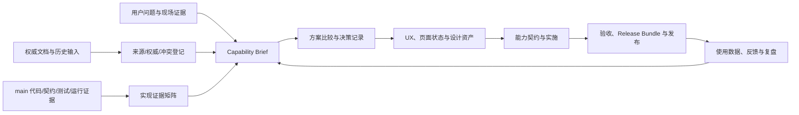

# 统一 SaaS 前端文档治理与实施规划

> 文档 ID：PLAN-FE-DOC-001
> 版本：v0.6-gate-3
> 状态：`PHASE_3_READY_FOR_GATE_3_REVIEW`
> 批准基线：`v0.2-approved / APPROVED_PLAN`；v0.3–v0.4 回写 Phase 1，v0.5 回写 Phase 2，v0.6 只回写用户随后明确授权的 Phase 3 治理底座与 Gate 状态，不扩张 Phase 4–8 授权
> 计划批准：2026-07-20（含产品工作方式、Capability Pack、设计资产、场景库和发布学习闭环增补）
> 执行授权：`PHASE_3_GRANTED`——Gate 2 已由产品负责人按推荐组合通过，并授权“文档治理底座”；Phase 4–8、正式前端规范施工和产品代码实现仍未获授权
> 基线提交：`676c6cdc175326927ec341a2d585168aa0a1a374`
> 适用范围：完整 SaaS 产品前端，其中“独立站管理”是当前优先模块
> 拍板人：产品负责人
> 执行主体：Codex（Phase 1/2/3 均于 2026-07-20 分别获明确授权；Gate 3 后须再次取得明确批准）

## 0. 本文件解决什么问题

本文件不是新的总体 PRD，也不是前端技术选型结论。它定义一套受控的产品与文档交付体系：如何完整读取现有 Markdown、Word、代码、契约、测试、运行证据、历史分支和竞品材料，建立不漂移的产品与前端事实体系，再据此形成可指导设计、开发、测试、发布和运营学习的统一 SaaS 前端文档、独立站管理实施方案，以及开源/外部能力接入方案。

本计划要解决六个根问题：

1. 现有材料很多，但权威层级、当前态、历史稿和目标态容易混淆。
2. 后端、契约或施工分支“已经有了”，不等于 SaaS 前端已经可用。
3. 当前文档擅长架构和工程证据，但缺少完整的用户旅程、页面信息架构、权限可见性、失败恢复和使用指南。
4. Word PRD、开源项目清单和竞品材料包含大量有价值输入，但不能直接升级为产品真值或实施承诺。
5. “独立站管理”必须放回统一 SaaS 产品中设计；生成的公开站是该模块管理和发布的产物，不是平行的第二套 SaaS 前端。
6. 如果交付只停留在 Markdown 数量、模板齐全或一次性文档补齐，产品事实仍会在下一次开发和发布后漂移；因此需要建立持续的发现、决策、设计、实施、验证、发布和学习闭环。

## 1. 授权边界

### 1.1 当前已授权

- 编写并交付本计划文档，以及将产品工作方式、Capability Pack、设计资产、场景库、评审责任和发布学习闭环建议纳入本文件。
- 使用独立 docs-only worktree，避免影响主工作区和现有施工现场。
- 执行第 1 阶段“来源与实现审计”：只读核对 Markdown、Word、代码、契约、测试、运行证据、历史分支/worktree、原型、GoodJob、竞品和开源项目。
- 在本 docs-only worktree 编写 Phase 1 来源总账、实现证据矩阵、能力状态矩阵、冲突登记、前端/设计来源审计、待决策与风险清单及 Gate 1 评审包。
- Gate 1 通过后执行第 2 阶段“产品体验与 IA 基线”：建立用户/问题/旅程、产品域、对象/SoR、页面目录、导航/Shell 选项、指标与 Gate 2 决策包。
- Gate 2 按推荐组合通过后执行第 3 阶段“文档治理底座”：建立门户、文档/术语/能力/对象/场景/冲突 Registry 和追踪矩阵；旧材料只登记迁移去向，不移动。
- 对 Phase 1–3 文档运行非破坏性校验，并在内容稳定后创建本地 docs-only checkpoint commit；不推送、不建 PR、不合并。

### 1.2 当前未授权

- 不进入第 4–8 阶段；Gate 2 只批准推荐组合，不把它升级为已经完成的正式 UX、视觉、前端技术方案或用户可用实现。
- 不创建 `docs/frontend/` 正式文档体系。
- 不修改现有权威文档、Word、Site Builder 00–14 或历史稿。
- 不移动、归档、删除或重命名任何现有材料。
- 不处理主工作区的 `.playwright-cli/`、`template/`、流程图或其他未跟踪文件。
- 不修改产品代码、数据库、OpenAPI、测试、基础设施或依赖。
- 不推送、创建 PR 或合并；当前仅允许在独立 worktree 创建本地 docs-only checkpoint commit。
- 不替产品负责人决定导航、商业承诺、数据权利、OSS 采用、设计工具或跨仓 ownership。

### 1.3 后续启动条件

第 1、2 阶段已完成并分别通过 Gate 1/2；第 3 阶段随后获明确授权。完成 Phase 3 后必须停在 Gate 3，提交完整评审包并等待下一次明确批准；在此之前不得进入第 4–8 阶段。对权限、商业承诺、数据权利、OSS 采用、设计工具、正式前端仓库和跨仓 ownership 的新裁决，执行过程中仍须单独暴露，不得由执行者静默决定。

## 2. 已固定的产品事实

以下内容来自当前权威链，后续文档不得自行推翻：

1. 产品是统一的出海企业 AI 全球客户开发与增长执行 SaaS，不是若干工具页面的拼接。
2. SaaS 拥有身份、控制面和完整产品 UI；本仓后端只校验 SaaS 签发的 token，不建立平行身份系统。
3. “独立站管理”属于 SaaS 的一级产品区域；其内部包含独立站建设，后续包含站点诊断。
4. 注册引导、素材、知识库、构建、预览、编辑、版本、发布、域名和诊断应在同一独立站管理工作区中形成用户闭环。
5. Astro 生成的公开站是独立站管理模块的版本化输出资产；公开站页面规范可单列，但不得被描述为平行产品前端。
6. Site Builder 运行时采用固定 DAG、Temporal 和有界 AI Task，不采用自由 Planner。
7. SiteSpec 是组装、渲染器与 SaaS 前端编辑器之间的核心契约；兼容 Puck 数据形状不等于 Puck 编辑器已经实现。
8. 获客侧当前冻结新增开发，但已实现能力仍属于完整产品上下文，文档不得丢失或误写为待建。
9. 当前权威链仍为：产品边界、as-built 架构、ADR、当前状态和路线图；本计划及未来前端文档必须引用而不是复制承重事实。

权威入口：

- [产品边界](../product-scope.md)
- [as-built 架构](../architecture/current.md)
- [ADR 注册表](../adr/registry.md)
- [当前状态](../status/current.md)
- [发布路线](release-plan.md)
- [Site Builder 决策事实源](../site-builder/00-decisions-and-coordination.md)
- [Site Builder PRD](../site-builder/01-prd.md)

## 3. 计划目标与非目标

### 3.1 目标

完成后应具备以下能力：

- 任何成员能从统一门户找到正确的产品、前端、架构、契约、实施和证据文档。
- 每一项产品能力都能追踪到用户、页面、角色、状态、接口、数据、工作流、证据和发布阶段。
- “当前已有”“已批准未实现”“历史建议”“冻结”“外部负责”不再混写。
- 整个 SaaS 前端拥有统一的信息架构、跨模块对象模型、交互状态、权限、AI 控制和设计系统说明。
- 独立站管理形成完整、可开发、可测试、可验收的前端 UX 与实施方案。
- 用统一 Capability Pack 将用户价值、UX、权限、状态、契约、验收、运营和证据组织成垂直能力闭环。
- 除 Markdown 外，明确信息架构、旅程、线框图、原型、设计变量、微文案、场景 Fixture 和发布证据的交付规格。
- 为每项优先能力定义可观测的用户成功指标，并将发布后数据与用户反馈回写产品决策。
- Word 中每项产品主张和 OSS/外部能力都有明确去向、采用决策状态和证据要求。
- GoodJob 等竞品的可取之处被转化为我们的文档标准，而不是复制其结构或实现。
- 文档具备自动防漂移能力，至少能够检测失效链接、重复 ID、非法状态和无证据的 as-built 声明。

### 3.2 非目标

- 本计划不决定最终 SaaS 前端框架、状态管理库或组件库。
- 本计划不把旧 Word 合并成一份更长的新 Word/Markdown。
- 本计划不因为某个 OSS 自带 UI，就把它变成我们的产品模块或导航入口。
- 本计划不把目标态接口、页面或基础设施描述为当前已实现。
- 本计划不替代现有 ADR、OpenAPI、Schema、测试或发布证据。
- 本计划不授权立即实现所有历史 PRD 能力。
- 本计划不要求所有模块一次性达到同样的 Dev-Ready 深度。

## 4. 总体工作模型



关键原则是先建立证据和归属，再作产品承诺和正式设计。不得从旧 PRD 章节目录直接推导页面，也不得从当前代码目录反向决定产品导航。

### 4.1 双层深度策略

文档完整不等于所有产品域同时达到开发深度。本计划采用两层交付：

- **全 SaaS 产品层**：完整覆盖用户、任务、产品域、核心对象、能力边界、信息架构、导航和能力状态。
- **当前主线层**：先将独立站管理做到 Dev-Ready，包含 UX、状态、权限、契约、验收、运营和设计资产。

获客等冻结产品域先做产品地图、已实现事实和边界，不凭历史 Word 或竞品能力编写虚假的 Dev-Ready 细节。

### 4.2 Capability Pack 作为最小交付单元

模块、页面或文件数量不作为完成标准。每个进入交付的产品能力必须形成一个可追踪的 Capability Pack，至少包含：

1. 用户、问题、场景、当前替代方案和目标结果；
2. 用户证据、优先级理由、成功指标和反指标；
3. 范围、非目标、不可变约束和用户可见承诺；
4. 用户旅程、页面入口、信息架构和设计资产；
5. 角色、权限、数据范围、核心对象和生命周期；
6. 正常、空、等待、部分成功、失败、取消、冲突、恢复和降级状态；
7. API、事件、数据、工作流、安全、商业化和可观测契约；
8. 标准场景、Fixture、验收标准、测试和真实运行证据；
9. 用户指南、管理员指南、运营恢复、已知限制和发布记录；
10. 决策 Owner、评审记录、最后核验提交、发布后数据和下一次回顾条件。

### 4.3 五类事实载体

为防止文档爆炸，正式产出只允许属于五类载体之一：

1. **Normative Spec**：当前生效的产品、UX、契约或操作规范；
2. **Registry/Contract**：结构化目录、状态、映射、机器契约和所有权；
3. **Evidence**：研究、代码、测试、运行、评审和发布证据；
4. **Guide**：面向用户、管理员、运营和开发者的任务指南；
5. **History**：已被取代、延后、拒绝或仅保留 provenance 的材料。

同一事实必须有唯一 Owner 和权威载体；其他文档使用 ID、摘要和链接形成不同读者视图，不复制承重事实全文。

## 5. 输入材料与完整读取要求

### 5.1 当前权威与活文档

- `AGENTS.md`、`CONTRIBUTING.md`、仓库 README 和契约接入说明。
- `docs/product-scope.md`。
- `docs/architecture/current.md`。
- `docs/adr/registry.md`。
- `docs/status/current.md`。
- `docs/roadmap/release-plan.md` 与 changelog。
- `docs/site-builder/00`–`14`、DQ-1 和 handoff。
- `docs/backend/`、`docs/implementation-records/`、`docs/research/` 与其他 roadmap 设计稿。

### 5.2 Word 与平台材料

至少包括：

- [产品总体 PRD v3.0 完整评审稿](../出海企业AI全球客户开发与增长执行平台_产品总体PRD_v3.0_完整评审稿.docx)
- [产品总纲与产品手册 v3.0 完整评审稿](../出海企业AI全球客户开发与增长执行平台_产品总纲与产品手册_v3.0_完整评审稿.docx)
- [总产品手册与 PRD v2.0 完整产品母本](../出海企业AI增长平台_总产品手册与PRD_v2.0_完整产品母本.docx)
- [顶层产品与系统架构设计 v1.0](../platform/全球客户开发与增长执行平台_顶层产品与系统架构设计_v1.0.docx)
- [v3.0 文档体系重构与实施治理方案](../platform/全球客户开发与增长执行平台_v3.0文档体系重构与实施治理方案_v1.0.docx)

Word 必须全文提取和语义阅读，不只查看目录或搜索关键词。表格、脚注、超链接、图示说明、状态字段和附录也要进入来源登记。原文件保留 provenance；迁移内容进入新事实源后，原文只通过链接和 superseded 信息说明去向。

### 5.3 竞品与外部输入

- [GoodJob](https://gitee.com/sendoh-huang/GoodJob/) 的 README、功能设计、权限、导航、使用指南、实现总结、测试状态和代码事实。
- AI 建站产品、B2B 增长/CRM、内容与渠道平台、企业 SaaS 控制台四类对标。
- 对标时记录核验日期和来源，优先官方文档与可复现实测；不得把营销宣称当成已验证能力。

### 5.4 未跟踪和历史施工材料

- `template/` 中的本地原型或导出项目。
- `docs/agile-iteration-flowchart.html`。
- 历史 worktree、分支、提交、PR 和 Claude/Codex provenance。

这些材料先登记来源、归属、License、独有提交和当前用途。未确认前不得吸收到正式产品或组件库，也不得清理。

### 5.5 完整读取的可核验方式

建立来源登记表，每份材料至少记录：

| 字段 | 说明 |
|---|---|
| `source_id` | 稳定来源编号 |
| `path_or_url` | 文件或外部地址 |
| `format` | Markdown、DOCX、代码、契约、测试、网页等 |
| `authority_layer` | L0–L6 或外部输入 |
| `truth_status` | 权威、活文档、历史、研究、证据、未知 |
| `scope` | 覆盖的产品域和技术域 |
| `read_status` | 未读、部分读取、全文读取、已交叉核验 |
| `last_verified_at` | 核验时间 |
| `last_verified_commit` | 本地材料对应提交 |
| `conflicts_with` | 已知冲突来源 |
| `migration_target` | 内容未来归属 |
| `notes` | 缺失、风险和待裁决事项 |

## 6. 本地实现审计方案

### 6.1 审计范围

代码审计不局限于 Site Builder Controller，应覆盖：

- `apps/api/src/site-builder/`：intake、site、profile、asset、KB、build、copy、image、claim/evidence、cost、preview 等。
- `apps/api/src/temporal/`：Demo、Refurbish、KB recovery、清理和其他工作流/活动。
- `apps/site-renderer/`：SiteSpec 消费、Astro 页面、组件、主题、locale、链接和构建产物。
- `packages/contracts/`：SiteSpec、CopyBundle、媒体、Evidence、Inquiry、OpenAPI 和事件契约。
- `packages/db/prisma/`：模型、RLS、约束、索引、迁移和所有权。
- ToolBroker、预算、模型路由、对象存储、Docling、embedding 和外部服务接缝。
- 单元测试、契约测试、迁移完整性测试、集成/真机验证脚本和证据目录。
- `main`、开放 PR、未合并 worktree 和历史提交之间的差异。

### 6.2 真实运行链

每项关键用户能力沿以下链路核验：

```text
用户动作
→ 页面/路由需求
→ OpenAPI/事件/共享类型
→ Controller/DTO/Guard
→ Service/Repository
→ Prisma/RLS/迁移
→ Workflow/Activity/Tool/Model
→ Renderer/Preview/Release
→ 测试/真机/发布证据
```

链路中任一层缺失，都必须单独登记。API 已存在不能推导页面已存在；测试分支有实现不能推导 main 已实现；迁移文件存在不能推导生产已部署。

### 6.3 多轴实现状态

每项能力分别记录：

| 轴 | 建议状态 |
|---|---|
| 产品 | `UNDEFINED` / `PROPOSED` / `APPROVED` |
| UX | `NONE` / `FLOW_ONLY` / `SPEC_READY` / `DESIGNED` |
| 前端 | `NOT_STARTED` / `IN_PROGRESS` / `MERGED` / `DEPLOYED` |
| API/事件 | `NONE` / `DRAFT` / `EXPORTED` / `VERIFIED` |
| 数据/工作流 | `NONE` / `MIGRATED` / `WIRED` / `VERIFIED` |
| 质量 | `UNTESTED` / `UNIT` / `CONTRACT` / `E2E` / `REAL_SERVICE` |
| 用户可用性 | `INTERNAL_ONLY` / `PILOT` / `GA` / `DISABLED` |

另设统一事实状态：

- `AS_BUILT`：当前主线代码已有，并有与声明相称的证据。
- `APPROVED_NOT_BUILT`：已拍板但没有完整实现。
- `PROPOSED`：研究、Word 或竞品输入。
- `DEFERRED`：已决定延后。
- `FROZEN`：当前暂停新增开发。
- `EXTERNAL_OWNED`：明确属于 SaaS 或其他仓库。
- `REJECTED`：明确不采用。
- `UNKNOWN`：尚未核验，禁止推测。

### 6.4 实现证据最低标准

任何 `AS_BUILT` 声明至少应链接：

1. `main` 上的代码或机器契约；
2. 对应数据库/状态持久化证据（若该能力需要）；
3. 与声明强度一致的测试；
4. 最后核验提交；
5. 若声称可供用户使用，还需部署或真实前端入口证据。

## 7. 中央事实矩阵

### 7.1 产品能力矩阵

这是整个计划的核心产物。字段至少包括：

| 字段 | 说明 |
|---|---|
| `capability_id` | 稳定能力 ID |
| `user_outcome` | 用户获得的结果 |
| `product_domain` | 产品域，不直接等同导航 |
| `actors` | 用户、管理员、运营、系统 |
| `entry_points` | 页面入口和触发方式 |
| `business_objects` | 涉及的核心对象 |
| `permissions` | 操作权限与数据可见范围 |
| `ui_states` | 空、加载、成功、部分成功、失败、取消等 |
| `frontend_status` | 前端轴状态 |
| `contract_status` | API/事件/共享类型状态 |
| `backend_status` | 服务、数据和工作流状态 |
| `evidence` | 代码、测试、提交和运行证据 |
| `phase` | 当前、下一阶段、目标、延后、冻结 |
| `owner` | 产品/仓库/团队 owner |
| `dependencies` | 前置与外部依赖 |
| `acceptance` | 用户与工程验收 |

### 7.2 页面与能力目录

每个页面或全局面板至少记录：

- Page ID、名称和所属产品域；
- 目标用户与用户任务；
- 上游入口、下游跳转和深链规则；
- 首屏信息和主/次操作；
- 数据对象与 SoR；
- 角色、权限和数据范围；
- 完整状态矩阵；
- API、事件和实时更新方式；
- 埋点和成功指标；
- 响应式、无障碍和性能约束；
- 当前实现状态和证据；
- 已知限制、人工兜底和验收标准。

### 7.3 冲突台账

冲突不得在正文中静默“综合”。每条冲突记录：

- 冲突 ID；
- 涉及来源；
- 冲突内容；
- 当前权威判断；
- 用户影响；
- 技术影响；
- 推荐选项与理由；
- 是否需要产品负责人拍板；
- 决议及回写位置。

### 7.4 核心对象与生命周期图

除能力和页面外，必须建立跨模块核心对象登记，至少覆盖 Workspace、Company、ICP、Site、SiteVersion、Release、Asset、Knowledge、BuildRun、Claim、Evidence、Lead、Conversation、Opportunity 和 Outcome。每个对象记录：

- 系统记录源、Owner、稳定 ID 和跨模块引用方式；
- 用户可见名称、关键属性和数据级别；
- 状态机、合法转移、触发者和失败恢复；
- 创建、分享、审批、归档、删除、保留、导出和恢复规则；
- 页面、API、事件、读模型和审计证据；
- 当前与目标态差异。

产品导航不代替对象归属；一个对象可在多个产品域被使用，但不得因页面分散而产生多个事实源。

### 7.5 标准场景与 Fixture Catalog

建立可被产品评审、设计原型、前端开发、后端测试、E2E、演示和用户指南共用的场景目录。每个场景至少包含：

| 字段 | 说明 |
|---|---|
| `scenario_id` | 稳定场景 ID |
| `actor_and_goal` | 角色和希望达成的结果 |
| `preconditions` | 账号、权限、数据、套餐和外部依赖 |
| `fixture` | 可复现的样例数据，且不包含未授权 PII/版权资产 |
| `steps` | 用户行为和系统响应 |
| `expected_states` | 页面、对象、任务和外部依赖状态 |
| `recovery_or_fallback` | 失败、取消、超时、部分成功和人工兜底 |
| `acceptance_and_evidence` | 产品、UX、契约、测试和运行证据 |

独立站管理首批场景必须覆盖首次建站、资料缺失、Claim 冲突、等待审批、部分构建、超时/取消、预算耗尽、发布失败、域名异常、多语种不完整、版本回滚和无权发布。

### 7.6 成功指标与学习登记

每个 Capability Pack 必须在开发前声明：

- 用户结果指标、基线、目标值和观测窗口；
- 采用、完成、恢复、质量、成本和安全护栏指标；
- 可能被表面增长掩盖的反指标；
- 数据来源、埋点口径、Owner 和隐私/保留约束；
- 发布后何时回顾，什么证据会导致保留、迭代、回滚或终止。

独立站管理的候选指标包括注册到首次可预览时间、Onboarding 完成率、首次 Build 成功率、失败后自助恢复率、预览到发布转化率、发布成功率、Claim 修正率、首次有效询盘时间和站点持续更新率。这些只是待审计后定义口径的候选，不在本计划中冒充已批准 KPI。

## 8. 目标文档体系

以下是目标结构，不代表一次性创建全部文件。正式施工前可根据来源矩阵合并相近内容，避免文件爆炸。

### 8.1 门户与治理

```text
docs/
  README.md
  governance/
    document-register.md
    terminology-and-status.md
    capability-register.md
    core-object-register.md
    scenario-catalog.md
    conflict-register.md
    traceability-matrix.md
```

- `docs/README.md`：按产品、设计、开发、测试、运营等读者提供阅读路线。
- `document-register.md`：登记所有活文档、历史稿和外部来源。
- `terminology-and-status.md`：稳定术语、对象名和状态枚举。
- `capability-register.md`：登记 Capability ID、用户结果、当前深度、Owner、状态和能力包入口。
- `core-object-register.md`：登记跨模块对象、SoR、生命周期、权限和契约引用。
- `scenario-catalog.md`：登记可复用的用户场景、Fixture、失败变体和验收证据。
- `conflict-register.md`：只记录未决或已裁决冲突，不重复方案全文。
- `traceability-matrix.md`：能力到页面、对象、API、代码、测试和 Release 的追踪。

### 8.2 全局前端文档

```text
docs/frontend/
  README.md
  00-scope-authority-and-status.md
  01-product-experience-principles.md
  02-information-architecture.md
  03-users-roles-and-journeys.md
  04-page-and-capability-catalog.md
  05-navigation-and-workspace-shell.md
  06-permissions-and-data-visibility.md
  07-state-error-degradation-and-recovery.md
  08-ai-approval-evidence-and-human-control.md
  09-design-system-and-content-guidelines.md
  10-responsive-accessibility-and-performance.md
  11-frontend-contracts-and-integration.md
  12-analytics-testing-and-release-evidence.md
  13-open-decisions.md
```

其中 `04-page-and-capability-catalog.md` 是“整个项目到底需要哪些前端能力”的人类入口；机器级追踪仍由治理层矩阵承担。

### 8.3 模块 PRD/UX Spec

产品域文档建议覆盖：

```text
docs/frontend/modules/
  platform-shell-and-today.md
  company-knowledge-and-trust.md
  research-and-buyer-intelligence.md
  campaign-and-growth-planning.md
  independent-site-management/
  content-and-channel-execution.md
  interaction-and-inbox.md
  lead-opportunity-outcome-and-growth.md
  workspace-admin-and-operations.md
```

这些名称是文档产品域，不自动成为最终主导航。旧“今日/研究/战役/内容/互动/增长”方案与当前“独立站管理”一级入口的关系必须进入 IA 冲突台账；当前活 PRD 对独立站管理的定位不得被旧 Word 静默覆盖。

### 8.4 独立站管理文档包

当前优先模块建议形成：

```text
docs/frontend/modules/independent-site-management/
  README.md
  journeys-and-page-spec.md
  lifecycle-permissions-and-state.md
  public-site-output-spec.md
  operations-and-acceptance.md
```

覆盖：

- 注册、首次登录和无旧站/有旧站路径；
- Demo 生成和首次价值；
- 站点列表、站点主页和工作台；
- 企业资料、Claim/Evidence 与资料缺口；
- 素材中心、版权、来源、变体和引用关系；
- KB 处理状态、失败、重试和人工处理；
- 风格、页面结构、封闭组件和 DesignSpec；
- 多语言 CopyBundle、翻译、fallback 和审核；
- Build 进度、成本、取消、超时、部分成功和恢复；
- Preview、编辑、保存冲突、版本对比和回滚；
- Release、发布、域名、DNS、SSL 和发布前检查；
- 询盘表单、同意、反垃圾、路由和送达；
- 站点诊断、SEO、性能、无障碍、表单健康和证据有效性；
- 公开站页面、SEO、响应式、性能和安全输出规范；
- 用户、Workspace 管理员、内容审批人和平台运营权限；
- 已知限制、降级、人工兜底和验收证据。

### 8.5 实施方案与指南

```text
docs/frontend/implementation/
  platform-frontend-blueprint.md
  independent-site-management-blueprint.md
  oss-and-external-capability-blueprint.md

docs/design/
  README.md
  design-asset-register.md
  content-and-microcopy-catalog.md

docs/guides/
  user-guide.md
  workspace-admin-guide.md
  operator-and-recovery-guide.md

docs/releases/
  README.md
  <release-id>/release-bundle.md
```

实施方案负责“如何实现”，用户指南负责“如何使用”，运营指南负责“如何诊断和恢复”，设计登记负责“产品现场应呈现什么”，Release Bundle 负责“这次发布实际交付了什么”。这些载体通过稳定 ID 关联，不得混成一份巨型文档，也不得重复定义同一承重事实。

### 8.6 Capability Pack 索引方式

Capability Pack 是逻辑交付单元，不强制把所有内容复制到一个新目录。每个能力建立一份轻量 manifest，通过稳定 ID 指向产品规范、UX 资产、契约、场景、测试、证据、指南和 Release。当某项内容已有权威载体时，manifest 只引用，不复制全文。

## 9. 前端设计必须覆盖的横切能力

### 9.1 产品骨架

- 全局导航、面包屑和 Workspace 切换；
- 全局搜索、最近访问、收藏和快捷入口；
- 通知中心、待办中心、审批中心和异常中心；
- 长任务中心和跨页面进度；
- 帮助、反馈、客服、账号、团队、账单、安全和集成设置；
- 运营控制台与受控 impersonation。

### 9.2 跨模块对象一致性

为企业、Claim/Evidence、市场、ICP、买家公司、联系人、Lead、Campaign、内容、Site、Conversation、Opportunity 和 Outcome 定义：

- 主数据和对象主页；
- 稳定 ID、URL 和深链；
- 创建、引用、分享、评论、负责人和标签；
- 删除、保留、归档和恢复；
- 跨模块上下文传递；
- 事件和读模型；
- 权限和数据范围。

### 9.3 完整状态设计

除正常成功路径外，统一覆盖：

- 首次空态、无权限、无数据、无配置；
- loading、排队、处理中、等待外部系统、等待人工审批；
- 成功、部分成功、degraded、stale；
- 可重试失败、不可重试失败、超时、取消和迟到结果；
- 多标签页和多人并发；
- 自动保存、草稿、未保存修改、ETag 冲突；
- 撤销、重做、版本恢复和失败保留旧版本；
- 网络中断、刷新恢复和任务跨设备继续。

### 9.4 AI、证据与人工控制

统一定义：

- AI 正在执行的任务和预计耗时/成本；
- 使用的资料、来源和 Evidence；
- 事实、推断、建议和生成内容的视觉区分；
- 置信度、警告和缺失信息；
- 批准、驳回、修正、重新生成和撤销；
- 修改是否回流及其审计；
- 模型/工具降级和部分失败；
- 哪些动作必须人工确认；
- 哪些声明、素材或外部动作永久 fail-closed；
- 自动发布和自动发送的明确禁区。

### 9.5 商业化与 Entitlement

至少在产品与权限层考虑：

- 试用、套餐、功能门和 Workspace entitlement；
- 站点数、构建次数、AI 成本、存储、语言和成员配额；
- 预算预估、硬上限、超额和升级提示；
- 升级、降级、续费、取消和关闭账号；
- 数据保留、导出和删除；
- 自助、顾问协助、代运营和合作伙伴模式。

如商业规则尚未拍板，必须标记 `OPEN_DECISION`，不得由前端默认行为替代产品决策。

### 9.6 国际化与市场适配

- UI 语言与站点内容语言分离；
- 时区、日期、数字、货币和计量单位；
- RTL、字体和长文本布局；
- 地址、电话和联系方式差异；
- locale slug、hreflang、默认语言和 fallback；
- 翻译审批与各语言构建状态；
- 法域、Cookie、隐私和同意文案；
- 不同市场的页面结构和 Claim 适用范围。

### 9.7 数据进入、迁移与退出

- 旧官网抓取和导入；
- Shopify、Amazon、WordPress 等来源的可选迁移；
- 产品、素材和客户数据批量导入；
- 字段映射、预览、冲突和回滚；
- SiteSpec、组件库和 Renderer 版本迁移；
- 数据、站点和素材导出；
- 域名迁出、服务停用和供应商更换；
- OSS/Provider/模型退出方案。

### 9.8 非功能与运营

- 响应式、可访问性、键盘操作和屏幕阅读器；
- 性能预算和 Core Web Vitals；
- 浏览器支持；
- 安全、CSRF/XSS、上传和链接安全；
- 可观测性、correlation ID、前端错误和行为日志；
- Feature Flag、灰度和回滚；
- 客服诊断、手动重试、Provider kill switch 和审计；
- DSR、数据删除、违规素材和域名争议处理。

### 9.9 设计与内容交付标准

前端设计不能只用 Markdown 描述“需要某个页面”。进入 Dev-Ready 的模块应根据复杂度交付：

- 产品信息架构、页面关系和端到端用户旅程；
- 关键页面低保真线框图与可验证交互原型；
- 高保真界面、响应式变体和全部关键状态；
- 设计原则、Token、变量、组件、变体、密度和交互模式；
- 权限可见性、内容密度、键盘操作、焦点顺序和屏幕阅读器标注；
- 空状态、引导、确认、警告、错误、AI 不确定性、审批和恢复的微文案；
- 设计源地址、页面/组件 ID、版本、Owner、最后核验日期和对应 Capability/Scenario ID。

设计工具中的画板、本地 HTML 原型、截图或导出代码都只是设计证据，不自动成为产品或 as-built 真值。真值仍需由规范、契约、实现和验证共同支撑。

## 10. GoodJob 对标吸收原则

### 10.1 建议吸收

- 以用户问题和业务场景开篇；
- 页面入口、第一屏和主动作；
- 信息架构和导航变化；
- 方案 A/B/C、取舍理由和最终范围；
- 权限矩阵与数据的协作/个人属性；
- 人工兜底和阶段性简化；
- 验收标准、使用指南、FAQ 和已知限制；
- 设计、实现总结和用户指南面向不同读者。
- 从查询或生成结果继续进入客户、任务、商机、导出或跟进的跨模块闭环；
- 将演示、访问说明和典型场景转化为可复用的 Fixture 和验收输入；
- 对模式、成本、风险和适用条件使用决策树，降低用户理解成本。

### 10.2 不建议吸收

- 根目录平铺全部文档；
- README 同时承担产品、架构、状态和指南；
- 多份相似说明重复同一事实；
- 文档自称完成而无代码/测试证据；
- 无 superseded 标记的旧设计；
- 用“专家审核通过”替代可核验评审记录。
- 用编译成功、截图或自评代替真实用户可用性、完整 E2E 和发布证据；
- 在高频企业工作台中滥用宣传式 Hero、渐变卡片和低信息密度的“漂亮 UI”。

### 10.3 我们需要超越的部分

- 跨模块对象和端到端旅程；
- AI/Evidence/Approval 的统一体验；
- 部分成功、长任务和恢复；
- 商业化与 Entitlement；
- 可访问性、性能和国际化；
- 文档 ID、机器契约、证据和 CI 防漂移。

## 11. Word 中 OSS/外部能力的实施方案

Word 中的项目名称只作为候选输入。正式方案采用 `Learn / Build / Adapt / Integrate / Buy / Avoid / Defer` 决策框架，每项建立 Capability Card。`Learn` 表示只吸收产品、UX 或工程方法，不引入代码或运行时依赖；避免将“值得学习”误写为“必须集成”。

### 11.1 必填字段

- 项目/服务、官方来源、核验版本和日期；
- 对应的用户能力和非目标；
- 当前本地是否已有等价能力；
- 采用决策及理由；
- License、SaaS 商用、缓存、导出、再分发和模型权重结论；
- 输入、输出、能力探测和失败模式；
- Adapter/ACL 契约；
- 主数据和外部副本边界；
- 多租户、身份、权限、安全、数据出境和供应链风险；
- 部署拓扑、可观测性、成本和容量；
- 前端是否暴露、入口和用户可见状态；
- 契约测试、故障演练、升级和回滚；
- Owner、替代实现、数据导出和退出计划；
- Spike、Pilot 和生产 Gate。

### 11.2 待重新核验的候选组

- Create/Publish/Engage：AiToEarn、Chatwoot、Activepieces。
- 视频与媒体：MoneyPrinterTurbo、ComfyUI、Remotion。
- 知识与时序关系：Cognee、Graphiti、LightRAG。
- 文档与采集：Docling、Crawl4AI、Firecrawl、SearXNG。
- 工作流与策略：Temporal、OPA。
- 模型与可观测性：new-api、LiteLLM、Langfuse。
- 建站与编辑：Astro、Puck、Readdy 及其他可替代方案。

候选必须与本地代码重新交叉核验。已在开发环境出现、已有客户端或已有文档，不自动等于生产采用；旧 Word 的 License 和版本结论也必须以执行时的官方资料重新核验。

## 12. 分阶段施工与 Gate

### Gate 0：计划批准

交付物：本文件。

当前状态：计划内容已批准；Phase 1/2 已完成并通过 Gate 1/2；Phase 3 已获授权并形成 Gate 3 评审包；Phase 4–8 仍未授权。

退出条件：已满足。

### 阶段 1：来源与实现审计

交付物：

1. 全量来源登记；
2. 代码/契约/数据/工作流证据清单；
3. 产品能力多轴状态矩阵；
4. 冲突台账；
5. 实际 SaaS 前端仓库、设计源、组件库和运行环境的定位结论；
6. 缺失输入与待拍板清单。

Gate 1：不能存在已知但未登记材料；任何 `AS_BUILT` 都有最低证据；历史 worktree 不被误认作 main；若找不到真实 SaaS 前端实现或设计源，对应内容必须标记为目标态而不是 as-built。

当前状态：Phase 1 评审包已形成于 [saas-frontend-phase-1/](saas-frontend-phase-1/README.md)，并于 2026-07-20 由产品负责人明确通过 Gate 1、授权 Phase 2。Phase 1 保持冻结证据基线，不用 Phase 2 的 `main` delta 重写。

### 阶段 2：产品体验与 IA 基线

交付物：

- 用户、角色、核心任务和端到端旅程；
- 用户问题、当前替代做法、现有证据和待验证假设；
- 产品域与跨模块对象图；
- 核心对象生命周期和 SoR 登记；
- 页面与能力目录；
- 导航、Workspace Shell 和全局入口方案；
- 能力成功指标、反指标和埋点假设；
- 信息架构冲突选项及推荐。

Gate 2：产品负责人拍板目标用户、关键 IA、一级入口、对象归属、用户可见承诺和待验证成功指标。

当前状态：Phase 2 评审包已形成于 [saas-frontend-phase-2/](saas-frontend-phase-2/README.md)，并于 2026-07-20 由产品负责人以“Gate 2 通过，按推荐组合授权 Phase 3”明确批准。批准范围是推荐的目标用户、IA、对象 ownership、首个纵切、Claim fail-closed、用户承诺和指标方向；正式前端仓库与设计 Owner 继续作为 blocker。

### 阶段 3：文档治理底座

交付物：门户、文档登记、能力登记、对象登记、场景目录、状态词典、冲突台账和追踪矩阵。

Gate 3：每个事实有唯一 owner；旧文档有迁移去向；不移动尚未完成引用映射的历史稿。

当前状态：Phase 3 已建立 [项目文档门户](../README.md)、[治理 Registry](../governance/README.md)和 [Gate 3 评审包](saas-frontend-phase-3/gate-3-review.md)，状态为 `READY_FOR_GATE_3_REVIEW`。本阶段没有建立 `docs/frontend/` 正式规范、没有修改产品代码，也没有移动任何历史/用户材料；未收到产品负责人明确批准前停在 Gate 3。

### 阶段 4：全局前端规范

交付物：旅程、权限、状态、AI 控制、设计系统、设计资产和微文案规范、国际化、性能、集成、埋点和发布规范。

Gate 4：所有模块可以复用统一模式，不需要各自发明 loading、错误、审批或权限表达；设计资产有稳定 ID、Owner、版本和能力/场景追踪。

### 阶段 5：独立站管理 Dev-Ready 文档包

交付物：完整的独立站管理 Capability Pack，包含模块 PRD/UX、公开站输出规范、设计资产、标准场景与 Fixture、前端实施方案、API/状态映射、成功指标、验收和运营指南。

Gate 5：从注册到发布/失败恢复的端到端路径完整；当前、目标和依赖无混写；所有关键状态有原型或明确规格；页面、对象、契约、场景、埋点和验收可追踪；能够进入设计定稿和工程拆分。

### 阶段 6：其他产品域文档

冻结能力先达到产品地图和边界完整，不伪造 Dev-Ready 细节；进入路线图的模块再补足页面、合同和验收。

Gate 6：完整产品没有失踪能力，当前优先级没有被历史“大而全”路线稀释。

### 阶段 7：OSS/外部能力实施方案

Gate 7：每项候选有 `Learn / Build / Adapt / Integrate / Buy / Avoid / Defer` 决策、License、Adapter、Security、Test、Owner 和 Exit Plan；未经 Gate 不进入生产。

### 阶段 8：防漂移与收口

交付物：docs lint、链接检查、状态检查、证据检查、历史 banner/归档提案、阅读路线验收、Release Bundle 模板、文档可用性测试和发布后学习回写规则。

Gate 8：机器和人工检查通过；新人、产品、设计、前端、后端、测试和运营均能沿各自路线完成一项真实任务并找到事实源；任一发布可通过 Release Bundle 反查规范、实现、证据、指南和复盘责任。

## 13. 产品工作方式、责任与发布闭环

### 13.1 Discovery 与 Delivery 双轨

产品发现与实施可以并行迭代，但不得混淆决策状态：

- **Discovery** 负责验证用户、问题、时机、替代做法、价值、风险和方案，输出有证据的 Capability Brief 与决策。
- **Delivery** 只接收已达到相应 Gate 的能力契约，负责设计定稿、开发、测试、发布和运营准备。
- Discovery 结论必须标记 `HYPOTHESIS / VALIDATED / REJECTED`；不能因为已有线框图或代码 Spike 就冒充产品批准。
- Delivery 发现新约束时回写冲突台账或决策记录，不在代码 PR 中静默重定义产品。

实施优先采用垂直能力切片：一个可见的用户结果连同页面、契约、数据、工作流、测试和指南一起交付；不以“先写完全部 PRD”、“先做完所有后端”或“先画完所有页面”作为单独成功。

### 13.2 决策与评审责任

| 责任角色 | 主要批准内容 | 不得代替的责任 |
|---|---|---|
| 产品负责人 | 目标用户、问题、范围、非目标、优先级、用户承诺和成功标准 | 技术验收、合规签字 |
| 产品设计 | 旅程、IA、交互、状态、内容、响应式和无障碍 | API 可行性、后端真值 |
| 前端 | 客户端架构、组件复用、状态映射、性能和可测试性 | 产品范围和后端契约真值 |
| 后端/契约 Owner | API、事件、数据、状态机、幂等、安全和恢复语义 | 用户体验批准 |
| QA/证据 Owner | 场景覆盖、验收方法、回归、真实运行证据和发布门 | 自行改写产品承诺 |
| 运营/客服 | 运营可操作性、诊断、人工兜底、用户指南和反馈闭环 | 安全和合规裁决 |
| 安全/合规/商业 Owner | 数据权利、隐私、授权、套餐、成本、License 和风险门 | 用审核名义代替其他 Owner |

某个角色暂时由同一人兼任时，仍需在记录中分开责任帽子。AI 可以生成草稿、发现冲突、提出方案和辅助验证，但不得同时充当生成者、唯一审批者和证据签发者。“已自评”或“多轮专家审核”必须有真实评审身份、范围、结论、finding 处理和证据，否则不作为 Gate 证明。

### 13.3 建议节奏

- **每周事实同步**：审查主线变化、能力状态、冲突、新证据和过期声明。
- **每两周能力/UX 评审**：用标准场景走查一个垂直能力，不只评静态页面。
- **每次发布**：规范、设计、契约、实现、测试、证据、指南和已知限制一起收口。
- **每月产品学习复盘**：审查成功指标、支持工单、失败/恢复、用户反馈、OSS/供应链变化和文档可用性。

节奏是开始执行后的建议基线，具体会议和 Owner 在 Gate 2/3 确定；本文件不自动创建会议或外部协作任务。

### 13.4 Release Bundle 与发布后学习

每个真正对用户生效的能力发布应产生 Release Bundle，至少记录：

1. Release ID、范围、Owner、环境、时间和发布方式；
2. 关联 Capability、Scenario、Decision、Page、Object 和 Contract ID；
3. 当前规范、设计版本、实现提交和迁移；
4. 自动化测试、真实运行、安全、性能和无障碍证据；
5. 发布前检查、灰度、告警、回滚、人工兜底和运营 Owner；
6. 用户/管理员/运营指南、已知限制和变更通知；
7. 成功指标基线、观测窗口、复盘日期和后续决策。

发布后的数据、客服问题、人工恢复和用户研究结论回写学习登记，并触发保留、迭代、降级、回滚或终止决策。“已发布”不是 Capability Pack 的终止状态。

## 14. Git 与交付策略

- 正式施工一律使用 `/global/backend/.codex/worktrees/<topic>`。
- 不在 `/global/backend` 主工作区直接修改或提交。
- 每个 PR 只承载一个可评审的文档层或模块，不做无法核验的巨型 PR。
- 推荐拆分：审计底座、全局前端基线、独立站管理、其他模块、OSS 方案、防漂移收口。
- 每批先检查现有 worktree、开放 PR、热点文件和用户未提交材料。
- 未经用户授权不合并 `main`；CI、审查和专项验证收口后再请求确认。

## 15. 文档元数据与自动防漂移

未来正式文档建议统一包含：

```yaml
document_id: FE-XXX
layer: L3
status: CURRENT
authority: normative
owner: product-or-engineering-owner
last_verified_at: YYYY-MM-DD
last_verified_commit: git-sha
supersedes: []
superseded_by: null
source_documents: []
related_capabilities: []
related_scenarios: []
related_objects: []
related_releases: []
```

建议逐步建立以下检查：

- 重复/缺失 Document ID；
- 非法状态；
- 活文档无 Owner 或核验提交；
- 失效相对链接；
- `AS_BUILT` 无代码/测试证据；
- 页面引用不存在的 Capability ID；
- Capability manifest 缺失必需载体、Owner 或状态；
- Scenario/Fixture 引用不存在的对象、页面、契约或验收证据；
- 设计资产无版本、Owner、Capability ID 或最后核验日期；
- Release Bundle 声称能力可用但缺少实现、测试、运行证据、指南或回滚责任；
- 手写 OpenAPI 数量或路径与机器契约漂移；
- 历史文档没有 superseded banner；
- 同一承重事实被多个规范文档重复定义；
- 文档包含密钥、PII 或不应进入 Git 的运行证据。

## 16. 主要风险与控制

| 风险 | 控制措施 |
|---|---|
| 文档数量继续膨胀 | 先定事实 owner；相近内容合并；注册表和机器契约不复制全文 |
| Word 被直接当现行 PRD | 全部标来源状态；逐条迁移；冲突进入台账 |
| 工作树能力被写成主线完成 | 只认 main/已合并提交；工作树单列 provenance |
| 后端存在被误写成前端完成 | 前端、API、数据、运行和部署多轴状态 |
| 竞品功能诱导范围膨胀 | 回到用户结果、阶段、成本和证据；每项有采用结论 |
| OSS 绑架产品和数据 | Adapter/ACL、SoR、License、Owner、Exit Plan 五道门 |
| 全产品文档稀释当前主线 | 全产品先做地图；独立站管理先做到 Dev-Ready；冻结项不启动实现 |
| 旧文档移动后链接断裂 | 完成引用映射后再提出 archive 变更，第一阶段不移动 |
| 前端技术方案凭空选型 | 未见真实 SaaS 前端仓库前只写约束和选项，不冒充 as-built |
| 文档完成但无法使用 | 用真实用户旅程、页面状态、API 追踪和验收任务反向测试文档 |
| Capability Pack 变成新的重复文档栈 | manifest 只引用现有权威载体；同一事实只有一个 Owner |
| 设计稿与实现完全脱节 | 设计资产绑定 Capability/Scenario/Page ID、版本和最后核验提交 |
| 只验证快乐路径 | 场景库强制覆盖无权、空、超时、取消、部分成功、冲突、回滚和人工兜底 |
| AI 自我评审成为形式门 | 分离生成、决策和证据责任；记录真实评审身份与 finding 处理 |
| 发布后无人回看效果 | Release Bundle 强制指标基线、观测窗口、复盘日期和后续决策 Owner |

## 17. 完成定义

本计划全部完成须同时满足：

1. 所有现有 Markdown、Word、代码、契约、测试、证据、原型和竞品材料都有登记和去向。
2. 每项能力的产品、UX、前端、API、数据/工作流、质量和部署状态彼此独立且有证据。
3. 整个 SaaS 的产品域、跨模块对象、用户旅程、页面目录和公共 Shell 完整。
4. 独立站管理被正确建模为 SaaS 模块；公开站作为其版本化输出规范存在。
5. 每个页面能追踪到角色、权限、状态、API、对象、埋点、验收和人工兜底。
6. AI 事实/推断/建议/生成、Evidence、Approval、成本和失败恢复有统一体验规则。
7. 商业化、Entitlement、国际化、无障碍、性能、安全、运营、迁移和退出没有被遗漏。
8. Word 中每项 OSS/外部能力有采用状态、License、Adapter、安全、测试、Owner 和 Exit Plan。
9. GoodJob 的优点被吸收，但其重复、过期和无证据声明模式未被复制。
10. 当前权威链保持稳定；旧稿仅在完成映射后才加 banner 或归档。
11. 文档自动检查能够阻止最常见的状态、链接、ID 和证据漂移。
12. 产品、设计、前端、后端、测试、运营和新成员都能通过门户找到自己的阅读路线。
13. 每个进入实施的能力有完整 Capability Pack，但不重复复制既有权威事实。
14. 标准场景和 Fixture 能被产品评审、设计、开发、测试、演示和指南共用，并覆盖关键失败与恢复路径。
15. 进入 Dev-Ready 的页面有可追踪的设计资产、全状态、微文案、响应式和无障碍交付。
16. 每个用户可用的发布可通过 Release Bundle 追踪到规范、设计、代码、测试、证据、指南、回滚和运营责任。
17. 优先能力有经批准的成功指标、数据口径、复盘时间和发布后保留/迭代/回滚/终止决策记录。
18. 评审记录可识别真实责任人、责任帽子、评审范围、问题处理和证据，不使用 AI 自评代替人类/责任 Owner 批准。

## 18. 仍需产品负责人后续拍板的事项

以下清单同时记录 Gate 2 已关闭项和相应 Gate 前仍需裁决的事项，避免已经批准的决定被重复打开：

1. ✅ Gate 2 已关闭：完整 SaaS 一级导航采用“今日/客户开发/独立站管理/增长执行/互动与商机/洞察”。
2. 🟡 Gate 2 部分关闭：首批客户为 B2B 制造/工贸/传统出口，默认操作者为海外增长/外贸运营；服务模式和商业套餐仍待定。
3. 本地 SaaS 原型已定位后，正式 SaaS 前端仓库、Owner、目标技术栈、组件库和设计事实源如何建立。
4. Workspace 管理员、内容审批人、运营和平台管理员的权限矩阵。
5. 站点发布、域名、询盘、Cookie/隐私和数据保留的首发市场要求。
6. 哪些冻结产品域只保留产品地图，哪些需要同步做到 Dev-Ready。
7. Word 中 AiToEarn、Chatwoot、媒体和知识图谱候选的业务优先级。
8. 是否建设统一任务/通知/审批/异常中心，以及首期范围。
9. 套餐、配额、预算和升级路径的产品策略。
10. 历史 Word、v3.1/v3.2 和本地原型最终采取 banner 还是迁入 archive。
11. 产品、设计、前端、后端、QA、运营、安全/合规和商业责任帽子的实际 Owner。
12. Gate 2 已批准独立站管理指标与反指标方向；具体 KPI 口径、事件、基线、目标、观测窗口和数据保留约束仍待定。
13. 设计源、原型工具、设计资产存放位置、组件/变量真值和版本管理方式。
14. 周事实同步、双周能力/UX 评审、发布门和月度学习复盘的参与人与固定节奏。

## 19. 下一步 Handoff

当前 handoff 状态：`PHASE_3_READY_FOR_GATE_3_REVIEW`。

产品负责人已通过 Gate 2 并按推荐组合授权 Phase 3；门户、文档/术语/能力/对象/场景/冲突 Registry、追踪矩阵和旧材料迁移映射已经形成 [Gate 3 评审包](saas-frontend-phase-3/gate-3-review.md)。后续可选择：

- `Gate 3 通过，授权 Phase 4`：只进入全局前端规范；
- `Gate 3 有条件通过`：先补指定 Owner、迁移或追踪 finding，再请求复核；
- `Gate 3 不通过`：修改指定治理模型、责任归属或迁移映射。

Gate 3 通过也不授权 Phase 5–8、正式前端实现、产品代码、Schema、OpenAPI、基础设施、依赖、历史文件移动、push、PR 或合并。

在收到明确 Gate 3 决策前，继续停止第 4–8 阶段，不直接批量编写正式 PRD、UX、设计系统、前端技术方案或产品代码。
