# Gate 2 评审包

> 文档 ID：`GATE-FE-P2-001`
> 状态：`READY_FOR_GATE_2_REVIEW`
> 工程事实基线：`origin/main@676c6cdc175326927ec341a2d585168aa0a1a374`
> 核验日期：2026-07-20
> 当前授权终点：Gate 2；未获批准不得进入 Phase 3–8

## 1. 评审结论

Phase 2 已将 Gate 1 的来源与实现审计转化为统一 SaaS 的产品体验和 IA 基线：目标用户假设、核心任务、8 条端到端旅程、11 个产品域、27 个核心对象、完整页面目录、3 套导航方案、Workspace Shell、成功指标与反指标，以及 22 条 IA 冲突。

最重要的判断是：

1. 当前不是缺少更多 Mock 页面，而是缺少用户/对象/责任一致的纵切。
2. 独立站管理必须保留一级位置，但不能把内部 R1-min Release 地基包装成公开发布能力。
3. Company/Offering/Claim/Evidence/Asset 是多个产品域共用的企业事实底座，Site Builder 不应复制第二份真相。
4. 完整 SaaS 的客户开发、Campaign、互动、商机和洞察仍需保留产品地图；冻结或外部 ownership 不等于删除。
5. 第一个可验证纵切应止于“资料与信任 → Build/取消/恢复 → 可信开发预览”，公开发布、域名、回滚、询盘和分析分别进入后续能力 Gate。

## 2. 建议批准组合

| 决策面 | 推荐选择 | 理由 |
|---|---|---|
| 首批客户 | B2B 制造、工贸一体、传统出口企业 | 与 Site Builder、企业信任素材和历史买家智能能力最匹配 |
| 默认操作者 | 海外增长/外贸运营 | 跨资料、建站、客户开发和执行；老板/品牌/销售/审批协作 |
| 一级 IA | 今日 / 客户开发 / 独立站管理 / 增长执行 / 互动与商机 / 洞察 | 覆盖完整价值链，避免工具菜单扩张，保留 Site 一级位置 |
| 企业事实 | 一个 Company/Offering/Claim/Evidence/Asset 底座 | 防止 Site/Content/Campaign 各自复制事实 |
| 首个纵切 | `JRN-FE-002` + `PAGE-FE-030`–`043` | 与当前 13 个 Site OpenAPI 操作和内部 Release/preview 地基相称 |
| Claim Gate | 优先补自助审核合同；否则受控运营兜底并显式阻塞 | 自动批准违反事实安全 |
| 用户承诺终点 | 可信开发预览 | 公开发布/域名/询盘尚无完整合同和生产证据 |
| 指标 | `MET-SITE-001`–`014` + `ANTI-FE-001`–`010` | 同时衡量采用、质量、恢复、成本和安全，不用 Build success 冒充价值 |

## 3. 建议首个纵切的可见边界

```mermaid
flowchart LR
  A["进入独立站管理"] --> B["查看 Site / Demo / gaps"]
  B --> C["分组补 Profile"]
  C --> D["上传并 commit Asset / 文档"]
  D --> E["查看处理与 KB 状态"]
  E --> F["处理 Claim Gate 或运营兜底"]
  F --> G["配置允许的 scope/style/locale"]
  G --> H["启动 Build"]
  H --> I["步骤 / cost / degraded / cancel"]
  I --> J["失败恢复或成功"]
  J --> K["打开 active READY Release 的开发预览"]
```

与该纵切相称的当前合同：

- intake：1 个操作；
- site/profile：4 个操作；
- asset：4 个操作；
- KB status：1 个操作；
- build/create/status/cancel：3 个操作。

当前 `packages/contracts/openapi/openapi.json` 仍为 56 paths / 64 operations，其中 Site Builder 13 operations。R1-min 的 `/preview` resolver 被隐藏于公开 OpenAPI，且不存在用户可管理的 Release/publish/domain/rollback 操作。

## 4. 明确不在首个承诺中

- 公网生产发布、域名和 SSL；
- 用户选择 Release、版本对比和回滚；
- 可视化 Puck 编辑器、完整页面结构/内容/主题编辑；
- 询盘接收、同意、anti-abuse、Conversation 和 Opportunity；
- 站点分析、SEO 诊断和博客运营；
- 超出 `en/de-DE` 的生成语言；
- 超出当前机器枚举的风格；
- “15 分钟可发布”“生产就绪”“全自动”“任意市场/语言”等未验证承诺。

这些能力仍在完整页面地图中，不是删除；只是必须有自己的对象、合同、权限、状态、测试和发布证据。

## 5. Gate 2 必须由产品负责人决定

请对以下九项给出批准、修改或拒绝：

1. `DEC-FE-P2-001`：首批目标客户是否为 B2B 制造/工贸/传统出口。
2. `DEC-FE-P2-002`：默认日常操作者是否为海外增长/外贸运营。
3. `DEC-FE-P2-003`：是否采用六项混合一级 IA。
4. `DEC-FE-P2-004`：是否批准“可信开发预览”纵切为下一步文档和设计优先级。
5. `DEC-FE-P2-005`：Claim 人工 Gate 选择自助合同优先还是运营兜底。
6. `DEC-FE-P2-006`：是否维持本包对象 ownership，并由谁拥有正式 SaaS repo/各外部域。
7. `DEC-FE-P2-007`：是否批准首批用户可见承诺与明确不承诺清单。
8. `DEC-FE-P2-008`：是否批准指标/反指标方向并指定产品数据、隐私、事件 Owner。
9. `DEC-FE-P2-009`：正式前端仓库、设计 Owner 和设计事实源由谁负责。

若第 9 项当前无法关闭，可先批准产品/IA 基线，但 Phase 3 必须把它保留为 blocker；进入实际前端设计或实现前必须关闭。

## 6. 产物索引

- [用户、问题与旅程基线](user-problem-and-journey-baseline.md)
- [产品域与跨模块对象图](product-domain-and-object-map.md)
- [对象生命周期与 SoR 登记](object-lifecycle-and-sor-register.md)
- [页面与能力目录](page-and-capability-catalog.md)
- [导航与 Workspace Shell 方案](navigation-and-workspace-shell-options.md)
- [成功指标与埋点假设](success-metrics-and-instrumentation.md)
- [IA 冲突与决策登记](ia-conflict-and-decision-register.md)

## 7. 质量与边界声明

- 本地结构检查通过：Phase 2 九份文档均只有一个 H1、代码围栏成对、状态字段和结尾换行合法，无 `TODO/TBD/FIXME` 占位。
- 相对链接检查为 0 失效，Phase 2 文档 ID 无重复，`git diff --check` 通过。
- 重新机器解析 OpenAPI 得到 56 paths / 64 operations / 13 Site Builder operations，与本包使用的当前合同数字一致。
- Gate 前重新 fetch 后 `origin/main` 仍为 `676c6cd`，开放 PR 列表为空；没有把并行分支或历史 worktree 当成当前实现。
- Phase 1 冻结事实没有被重写；R1-min 只作为 `676c6cd` 的 Phase 2 delta 使用。
- 本包未修改产品代码、Schema、OpenAPI、基础设施、依赖、Word、现有 Site Builder 文档或主工作区用户材料。
- 本包没有把本地 React 原型、旧 Spring API、Word 或竞品提升为当前产品真值。
- 未决定的权限、套餐、数据权利、设计工具、跨仓 ownership 和公开发布均保留开放状态。
- Gate 2 未批准前，Phase 3–8 保持未授权。

## 8. 批准语义

“Gate 2 通过”仅表示产品负责人同意本包中的目标用户、IA、对象 ownership、首个纵切、用户承诺和指标方向，可据此进入 Phase 3 文档治理底座。它不表示：

- 正式 PRD/UX/视觉设计已经完成；
- 前端技术方案或仓库迁移已经批准；
- Site Builder 已公开发布或生产可用；
- Phase 4–8 自动授权；
- 任何产品代码、API、Schema、基础设施或依赖修改自动获准。
