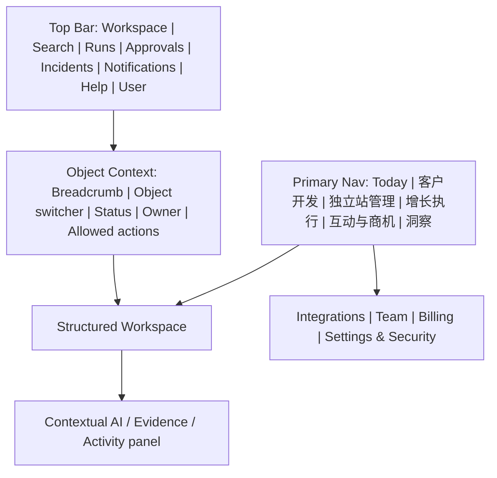

# 导航与 Workspace Shell 方案

> 文档 ID：`BASE-FE-P2-005`
> 状态：`READY_FOR_GATE_2_REVIEW`
> 事实基线：`origin/main@676c6cdc175326927ec341a2d585168aa0a1a374`
> 决策边界：本文件提出 3 个 IA 选项和推荐，不替产品负责人批准

## 1. 已固定约束

1. 产品是统一 SaaS，不是功能工具箱。
2. “独立站管理”必须是一级产品区域；内部包含“独立站建设”，后续包含“站点诊断”。
3. Astro 公开站是独立站管理的版本化输出，不进入 SaaS 主导航。
4. 获客侧当前冻结，但完整产品地图不能删除客户开发能力。
5. 身份、Workspace、Entitlement 和完整 UI 由 SaaS 拥有；客户端不建立平行身份真相。
6. 当前本地原型的 7 个 primary + 6 个 secondary 入口不是批准 IA。
7. Word 的“今日/研究/战役/内容/互动/增长”六项也只是历史提案，且没有一级独立站管理。

## 2. 设计原则

- 一级入口表达用户持续承担的业务责任，而不是后端模块或 OSS 名称。
- 高频“今天要处理什么”与稳定“我在管理什么对象”并存。
- 一级入口控制在可扫描范围；低频治理能力进入 Shell，而不是全部挤进侧栏。
- 聚合入口不拥有业务对象；Today、Search、Approvals、Insights 均通过读模型和深链回到 canonical object。
- 冻结/未购买/未部署能力的可见性必须有统一策略，不能每个页面自行决定隐藏还是置灰。
- 重要对象有稳定 URL、面包屑和跨域返回路径；用户刷新或跨设备仍能恢复上下文。
- 移动端优先审批、通知、异常和摘要；建站编辑、研究、Campaign 等重操作保持桌面优先。

## 3. 选项 A：在旧六项上追加独立站管理

```text
今日
研究
战役
内容
互动
增长
独立站管理
```

### 优点

- 最大程度保留 Word 的历史结构，理解迁移成本低。
- 每条生命周期阶段有独立入口，适合内部按专业团队分工。

### 缺点

- 七个一级入口仍未处理“客户/账户”这一高频对象的明确归属。
- “研究/增长”“战役/内容”在用户心智上容易交叉。
- 独立站成为追加项，不能体现它与企业事实、内容、询盘、机会的关系。
- 会延续当前原型“每个能力一个菜单”的扩张路径。

### 结论

`NOT_RECOMMENDED`。只适合作为历史迁移参照。

## 4. 选项 B：对象中心 IA

```text
今日
企业
客户
独立站管理
战役
商机
洞察
```

### 优点

- 对象稳定，深链和权限容易理解。
- Company、Customer、Site、Campaign、Opportunity 都能形成清晰主页。

### 缺点

- 仍有七个一级入口。
- 内容、渠道、互动等动作不容易归类；最终会在对象页内长出复杂二级导航。
- “企业”在中文里可能既指本公司，也指目标客户公司，命名风险高。
- 用户想完成任务时需要先知道对象模型。

### 结论

`VIABLE_ALTERNATIVE`。适合数据/CRM 成熟、对象操作频率高的阶段，不建议作为当前首版。

## 5. 选项 C：任务与对象混合 IA（推荐）

```text
今日
客户开发
独立站管理
增长执行
互动与商机
洞察
```

辅助入口不占一级产品导航：

```text
全局顶部：Workspace / Search / 长任务 / 审批 / 异常 / 通知 / 帮助 / 用户
对象上下文：企业资料与知识 / 相关对象 / 活动 / 权限
底部或用户菜单：集成 / 团队 / 套餐与用量 / 设置与安全
受控内部入口：Operations Console
```

### 5.1 一级入口定义

| 一级入口 | 回答的问题 | 包含能力 | Canonical 对象 |
|---|---|---|---|
| 今日 | 我现在最应该做什么 | 继续任务、审批、异常、提醒、机会、成本护栏 | 只做读模型/深链，不拥有对象 |
| 客户开发 | 去哪里、找谁、为什么现在 | 市场研究、ICP、账户、联系人、信号、Lead | Market、ICP、Lead、Company |
| 独立站管理 | 如何建立并持续运营可信海外站 | 建站、资料、素材、KB、Build、预览、版本、发布、域名、诊断 | Site、Version、Release、Asset |
| 增长执行 | 如何把目标转成可控动作 | Goal/Initiative、Campaign、Audience、Content、Publish/Outbound | Campaign、ContentAsset、PublishJob |
| 互动与商机 | 如何处理响应并推进商业结果 | Inbox、Conversation、Intent、QGO/SAO、Opportunity、Outcome | Conversation、Opportunity |
| 洞察 | 哪些投入有效、哪里需调整 | 漏斗、质量、成本、归因、实验、建议 | Read models、Experiment |

### 5.2 为什么推荐

- 六个入口直接覆盖完整价值链，又给独立站管理稳定一级位置。
- 把研究+客户合成一个用户任务空间，把 Campaign+Content+Channel 合成增长执行，减少菜单碎片。
- 保留 Opportunity 的业务重要性，同时避免单独的 Inbox、QGO、SAO 多菜单。
- Today、Shell utilities 和对象上下文承担跨域工作，不需要再建“团队审批”“企业知识”“集成账号”三个一级入口。
- 可用 entitlement 和产品阶段控制子路由，不需要改变顶层心智模型。

### 5.3 风险与缓解

| 风险 | 缓解 |
|---|---|
| “客户开发”在冻结期入口内容有限 | 明确维护态和可用能力；不显示虚假空模块；是否对首批租户可见由 entitlement 决定 |
| “增长执行”范围较大 | 二级按 Plan / Content / Channels 分区，对象页保留 canonical URL |
| “互动与商机”混合运营与销售 | 默认视图按角色调整，但对象和权限仍分离 |
| “企业资料”不在一级菜单难找 | Workspace switcher 下固定企业上下文入口；Site/Campaign/Content 里始终可深链 |
| 六项是否仍太多 | 用户研究验证；不要在没有任务数据前继续压缩或扩张 |

## 6. 推荐 Workspace Shell



### 6.1 顶部全局入口

| Shell ID | 入口 | 规则 |
|---|---|---|
| `SHELL-FE-001` | Workspace switcher | 切换时清空租户缓存、搜索和任务订阅；显示环境/代理操作状态 |
| `SHELL-FE-002` | Search/Command | 权限过滤后搜索对象；危险动作不能无确认执行 |
| `SHELL-FE-003` | Long-running tasks | 聚合 Build/研究/导入/发布；显示状态、取消、结果和恢复 |
| `SHELL-FE-004` | Approvals | 聚合待批准，但决定仍写回各域对象/统一审计信封 |
| `SHELL-FE-005` | Incidents/Exceptions | 显示业务影响、已保留结果和下一步；不只展示技术错误 |
| `SHELL-FE-006` | Notifications | 事件摘要和深链；不取代 Task/Approval/Incident |
| `SHELL-FE-007` | Help/Feedback | 带 object/run/correlation 上下文，默认脱敏 |
| `SHELL-FE-008` | User menu | 个人偏好、账号安全、退出；不承担 Workspace 设置 |

### 6.2 对象上下文栏

进入 Site、Lead、Campaign、Conversation 或 Opportunity 后，统一展示：

- 面包屑和 canonical object name；
- 当前业务状态、是否 stale/degraded；
- Workspace、Owner、更新时间和权限范围；
- 主动作和 `More` 中的低频/危险动作；
- 相关对象和活动入口；
- 允许时展示 Evidence/AI/成本侧面板。

状态、Owner 和 allowed actions 应来自服务端或经过契约验证的读模型，不能只由路由或前端角色表推断。

### 6.3 AI 入口

本地原型有常驻 Global AI Panel，但正式 Shell 不应让“聊天”成为产品真相。建议：

- 全局入口用于表达目标、解释和导航；
- 在对象上下文中生成结构化草稿或任务；
- 任何结果必须形成可编辑、可批准、可追踪对象；
- 显示使用的资料、未知信息、预计成本和风险；
- 不允许 Global AI 绕过页面权限、Approval 或 ExecutionAuthorization。

## 7. 二级 IA 建议

| 一级入口 | 二级区域 | 页面目录 |
|---|---|---|
| 今日 | 我的行动、审批、异常、最新机会/站点 | PAGE-003、006–009 |
| 客户开发 | 市场、ICP、客户池、发现任务、数据权利 | PAGE-060–066 |
| 独立站管理 | 站点、建设、版本与发布、询盘、诊断 | PAGE-030–057 |
| 增长执行 | 目标与战役、受众、内容、发布任务、渠道账号 | PAGE-070–079 |
| 互动与商机 | Inbox、会话、Opportunity、结果 | PAGE-080–083 |
| 洞察 | 经营、归因、实验、成本 | PAGE-084–086 |

企业资料、知识、Claim/Evidence 和 Asset 是跨域上下文：从 Workspace switcher 固定入口和各业务对象深链进入，不建议把它们当一级孤岛。

## 8. 当前阶段的入口可见性

完整 IA 与当前可用入口是两件事。建议服务端下发 capability/entitlement 后，采用三种呈现状态：

| 状态 | 何时使用 | 表现 |
|---|---|---|
| `AVAILABLE` | 用户有权限、套餐和部署能力 | 正常进入，显示真实状态 |
| `UNAVAILABLE_WITH_REASON` | 产品已批准但因权限、套餐、地区或前置配置不可用 | 可见但明确原因和下一步；不承诺日期 |
| `NOT_OFFERED` | 未批准、未部署、冻结且没有用户价值入口 | 不出现在日常导航；仍在产品/文档地图中 |

是否隐藏还是置灰不能由前端自行写死。尤其是客户开发冻结、发布/域名未建、诊断 M3+，应由 capability manifest 驱动。

## 9. 独立站管理内部 IA

不建议沿用原型的 8 个同级 Tab（概览/结构/内容/风格/资料/信息/设置/生成），因为它混合对象、任务和成熟度。建议：

```text
独立站管理
├─ 站点列表
└─ Site Workspace
   ├─ 概览（当前预览、下一步、缺口、任务）
   ├─ 资料与信任（Profile、Asset、KB、Claim）
   ├─ 设计与内容（结构、内容、风格、多语言；后续）
   ├─ 生成任务（Build、成本、失败恢复）
   ├─ 版本与发布（Release、对比、发布、回滚；后续）
   ├─ 询盘与表现（后续）
   └─ 设置（站点、域名、SEO、法务；后续）

二级 capability：站点诊断（M3+，不作为注册分支）
```

首批只点亮“概览 / 资料与信任 / 生成任务 / 开发预览”。未来能力在同一对象工作区渐进增加，不创建另一套建站产品。

## 10. 深链、返回和上下文规则

1. 所有业务通知、审批、异常和长任务必须深链到具体 Workspace + object/run。
2. 路由恢复时先验证 Workspace 和权限；无权对象返回安全 404/403，不泄漏存在性。
3. 从聚合页进入对象后，浏览器 Back 返回原筛选；对象内跨域跳转提供“返回来源”但不改变 canonical URL。
4. 未保存编辑、ETag 冲突和运行中任务在离开前有明确处理，不用全局 Toast 代替。
5. 分享链接只能在同一 Workspace 和权限范围生效；公开 preview URL 是独立边界，不携带 SaaS cookie。
6. 移动端深链应落到可完成的审批/摘要；重编辑给出“在桌面继续”的明确路径。

## 11. Gate 2 决策项

| Decision ID | 选项 | 本包推荐 |
|---|---|---|
| `IA-FE-001` | A 旧六项+Site / B 对象中心 / C 混合 IA | 选择 C |
| `IA-FE-002` | 企业资料是否一级入口 | 不占一级；固定 Workspace/对象上下文入口 |
| `IA-FE-003` | 审批、异常、长任务是否各模块自行做 | 统一 Shell 聚合 + 域内对象写回 |
| `IA-FE-004` | 独立站内部继续 8 Tab 或按任务分区 | 按 §9 分区 |
| `IA-FE-005` | 冻结/未建能力的显示策略 | capability/entitlement 驱动三态，不由前端硬编码 |
| `IA-FE-006` | Global AI 是否作为主交互 | 作为表达/解释入口；结构化对象才是结果 |

若产品负责人不选择推荐项，应同时记录目标用户任务、迁移成本和被放弃的权衡，避免只改菜单名称。
