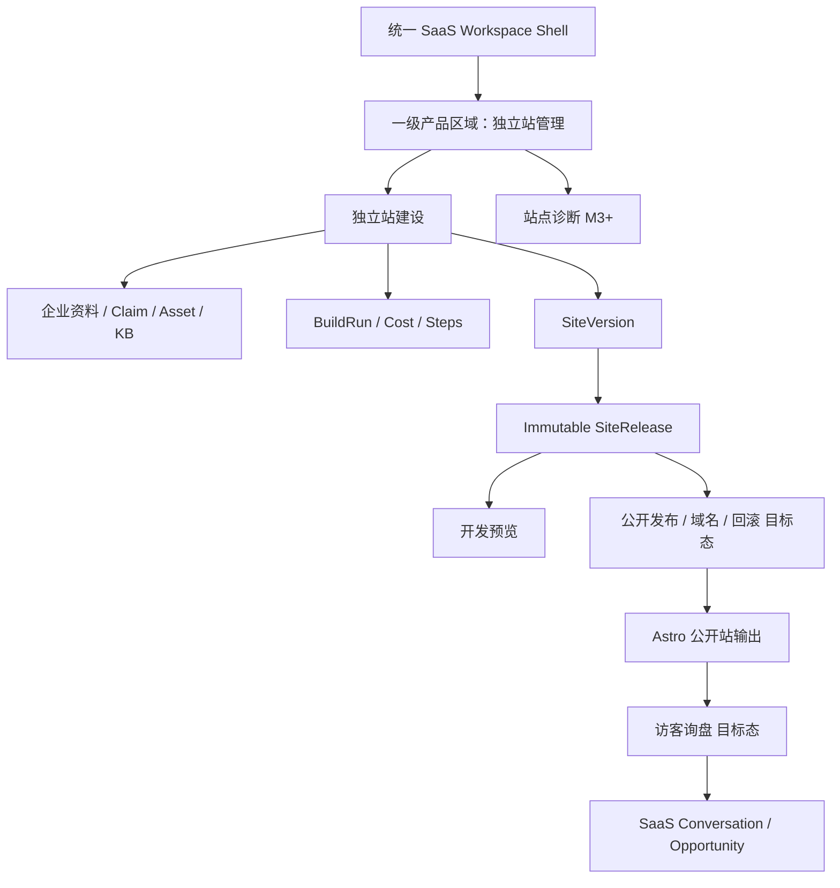
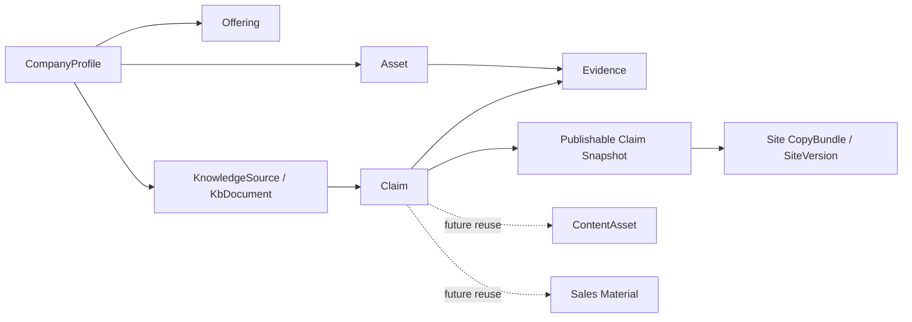
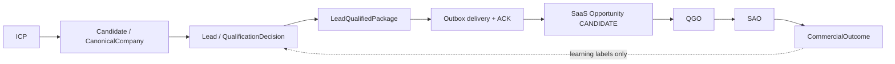
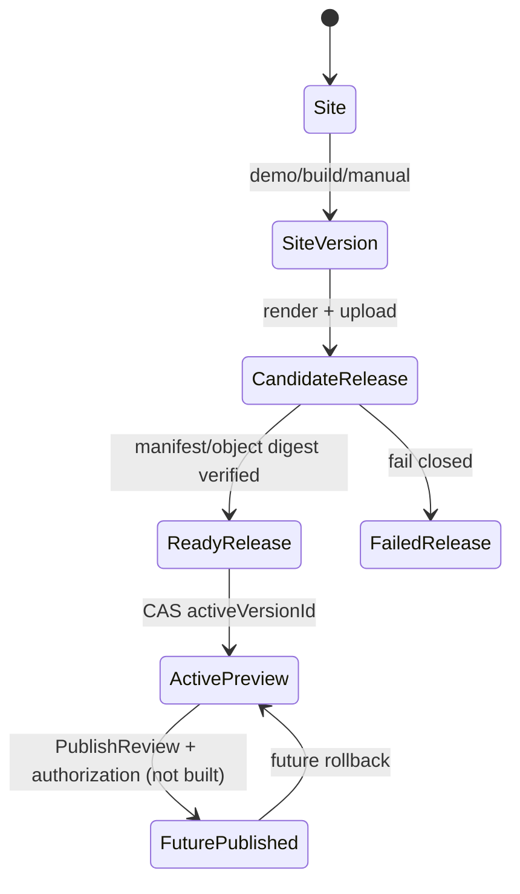

# 产品域与跨模块对象图

> 文档 ID：`BASE-FE-P2-002`
> 状态：`READY_FOR_GATE_2_REVIEW`
> 事实基线：`origin/main@676c6cdc175326927ec341a2d585168aa0a1a374`
> 原则：产品域用于划分责任，不自动等同一级导航或代码模块

## 1. 统一产品上下文

统一 SaaS 的产品对象链可概括为：

```mermaid
flowchart LR
  WS["Workspace / Identity"] --> CO["Company / Offering"]
  CO --> CE["Claim / Evidence / Asset / Knowledge"]
  CE --> SITE["Site / Version / Release"]
  CE --> MKT["Market / ICP"]
  MKT --> LEAD["Candidate / Lead / Qualified Package"]
  LEAD --> CAMP["Goal / Initiative / Campaign"]
  CE --> CONTENT["Content / Channel Asset"]
  CAMP --> CONTENT
  CONTENT --> EXEC["Publish / Outreach / Delivery"]
  SITE --> VISIT["Public Site Visit / Inquiry"]
  EXEC --> CONV["Conversation / Intent"]
  VISIT --> CONV
  CONV --> OPP["Opportunity / QGO / SAO"]
  OPP --> OUT["Commercial Outcome"]
  OUT --> LEARN["Attribution / Learning"]
  LEARN -. "feedback" .-> MKT
  LEARN -. "feedback" .-> CAMP

  classDef current fill:#d9f2e6,stroke:#248a57,color:#123;
  classDef external fill:#e9e5ff,stroke:#6654c0,color:#123;
  classDef frozen fill:#fff2cc,stroke:#b68b00,color:#123;
  classDef target fill:#f3f3f3,stroke:#777,color:#123;
  class WS external;
  class CO,CE,SITE current;
  class MKT,LEAD frozen;
  class CAMP,CONTENT,EXEC,CONV,OPP,OUT,LEARN,VISIT target;
```

颜色只表达当前责任/施工状态：绿色为本仓当前主线已有地基，黄色为本仓已实现但冻结，紫色为 SaaS 外部所有，灰色为目标态或尚缺闭环。它不表示生产部署。

### 1.1 独立站管理的位置

`Site → SiteVersion → SiteRelease → Astro artifact` 是同一产品域的内容、版本和输出链：

公开站只消费批准后的版本化输出。它没有 Workspace Shell、SaaS 导航或内部业务对象编辑能力，因此不能被定义为另一套 SaaS 前端。

## 2. 产品域登记

| Domain ID | 产品域 | 用户结果 | 核心对象 | 当前事实 | 建议导航映射 |
|---|---|---|---|---|---|
| `DOM-FE-001` | Workspace Shell 与控制面 | 在正确 Workspace 内安全找到任务、对象和状态 | Workspace、Membership、Role、Entitlement、Notification、Task | 身份/UI 归 SaaS；本地只有无权威性的原型 | 全局 Shell，不作为业务模块平铺 |
| `DOM-FE-002` | 企业、产品与信任 | 建立可追溯、可批准、可撤销的企业事实和资产 | CompanyProfile、Offering、Claim、Evidence、KnowledgeSource、Asset | 本仓有核心对象；统一前端和权限未建 | 对象上下文 + 全局“企业资料”入口 |
| `DOM-FE-003` | 独立站管理 | 生成、审核、维护、预览并最终发布可信海外站 | Site、SiteVersion、SiteRelease、BuildRun、Asset、KbDocument、CopyBundle | 当前主线；后端较深，SaaS 前端未接 | 必须为一级产品区域 |
| `DOM-FE-004` | 市场与买家智能 | 选择市场并得到可解释客户候选 | Research、MarketThesis、ICP、CanonicalCompany、Lead、Signal、LeadQualifiedPackage | 后端已实现且冻结；前端 Mock | “客户开发”内部 |
| `DOM-FE-005` | 增长计划 | 把目标转成可控的 Campaign 和实验 | Goal、Initiative、Campaign、Audience、Revision、Authorization | SaaS 侧目标，当前无本仓 SoR | “增长执行”内部 |
| `DOM-FE-006` | 内容与资产 | 用批准事实生成、审核和复用多语言内容 | Brief、ContentAsset、VideoProject、RightsRecord | Site CopyBundle 子集已有；平台域目标态 | “增长执行”内部；共享资产从企业域引用 |
| `DOM-FE-007` | 渠道执行 | 受控发布、发送并获得回执 | ChannelAccount、PublishJob、OutboundSequence、DeliveryReceipt | SaaS/执行系统所有；本地原型 Mock | “增长执行”内部 |
| `DOM-FE-008` | 互动与资格 | 聚合回复/表单并识别意向 | Conversation、Message、Intent、QGO | SaaS 所有；Site inquiry receiver 尚未落地 | “互动与商机”内部 |
| `DOM-FE-009` | 商机与结果 | 销售接受机会、推进并回写商业结果 | Opportunity、SAO、Stage、NextAction、CommercialOutcome | SaaS 所有；本仓只接学习标签 | “互动与商机”内部 |
| `DOM-FE-010` | 洞察与学习 | 解释成本、质量、结果和下一轮动作 | Touchpoint、Attribution、Experiment、Recommendation、Usage | 平台目标；局部 Usage/Build cost 已有 | 一级“洞察” |
| `DOM-FE-011` | 集成与运营 | 管理连接、健康、异常、删除和人工恢复 | Integration、CredentialRef、ProviderHealth、Incident、DeletionRequest | 本仓有部分平台能力；SaaS UI/Secrets 归外部 | Shell 设置 + 受控运营入口 |

## 3. 为什么不能按代码模块或 Word 章节直接做导航

1. `DOM-FE-002` 的 Claim、Evidence、Asset 会同时被 Site、Content、Campaign 和销售材料消费；如果按页面复制，会产生多个事实源。
2. `DOM-FE-005`–`007` 在用户心智中是一条“增长执行”任务链，但对象必须保持独立 ownership；导航分组不改变聚合根。
3. `DOM-FE-008` 和 `DOM-FE-009` 对用户连续，但 QGO 资格与销售 Opportunity 仍是不同责任。
4. `DOM-FE-011` 是跨模块控制面，不应把集成、成本、异常、删除都做成一级业务入口。
5. 独立站管理是产品负责人已固定的一级区域，即使它消费企业知识和内容对象，也不能降回“次级工具”。

## 4. 跨域对象关系和使用规则

### 4.1 企业事实底座

规则：

- Site Builder 不重新创建 Company/Offering/Claim/Evidence 真相源。
- `BrandProfile` 是站点构建的派生理解产物，不是企业公开事实 SoR。
- `SitePublishableClaimSnapshot` 是一次 Build 的不可变发布输入，不反向覆盖 Claim。
- `Asset` 是逻辑原件；`AssetVariant` 是确定性派生物；页面引用不能把派生图当原始权利记录。
- Claim 被撤销、过期或证据失效时，应产生影响面和后续重建/下线任务；当前公开影响 API 尚未完成。

### 4.2 客户开发到商机的跨仓接缝

规则：

- 本仓止于不可变 `LeadQualifiedPackage`，SaaS 消费后创建 Opportunity。
- QGO/SAO 是 Opportunity 生命周期状态/资格结果，不在本仓复制主状态。
- 结果回流只作为质量学习标签，不能把 SaaS 的销售状态回写成 Lead 主状态真相。

### 4.3 Site 版本、Release 和发布

当前事实：`Site.activeVersionId` 是唯一开发预览指针；R1-min 的 active READY Release 通过隐藏 preview resolver 提供静态对象。`SiteRelease` 的存在不等于用户可选择、发布或回滚，因为这些公共合同和 SaaS 页面尚不存在。

## 5. 对象社会属性基线

权限设计不能只问“哪个角色能 CRUD”，还要问对象在团队里的社会属性。

| 属性类 | 典型对象 | 默认协作预期 | 仍需决定 |
|---|---|---|---|
| Workspace 共享业务事实 | Company、Offering、Claim、Evidence、Site、SiteVersion、Asset、ICP、Lead、Campaign、Opportunity | 团队在权限范围内协作；修改和批准可审计 | 角色、字段遮罩、对象级分享、导出 |
| 公开候选/公开输出 | approved Claim、active published Release、公开站内容 | 只有明确批准和适用范围后可公开 | 谁批准、何时失效、紧急下线 |
| 个人工作草稿 | 私人备注、个人待办、未共享草稿、个人搜索 | 不应因管理员身份默认无限可见 | 是否存在、转团队规则、离职移交 |
| 受限个人数据 | 联系人、询盘人、业务邮箱/电话、DSR | 最小可见、用途绑定、保留和审计 | 销售/运营/管理员的字段权限 |
| 系统控制与诊断 | BuildRun、TaskAttempt、Spend、ProviderHealth、Incident | 普通用户看业务摘要；运营看受控诊断 | 原始错误/trace 暴露、impersonation |
| 外部执行副本 | CRM、Chatwoot、渠道发布记录 | SoR 仍在平台业务对象；外部只存副本/回执 | 冲突同步、删除、退出与导出 |

## 6. 数据流和页面上下文原则

1. 页面 URL 应引用稳定业务对象 ID；展示 slug/名称不是主键。
2. 同一对象可以在多个域出现，但对象主页只有一个 canonical route；其他页面以引用卡、抽屉或深链使用。
3. 聚合页（Today、Search、Approvals、Long-running tasks、Insights）使用读模型，不成为业务对象写入 SoR。
4. AI 对话只能创建/修改结构化对象草稿；关键结果不能只留在聊天历史。
5. 页面不直接推断 entitlement、角色或业务状态；服务端合同提供允许动作和拒绝原因。
6. 跨 Workspace 切换必须清空对象上下文、缓存、搜索和长任务订阅，避免租户串线。
7. 外部系统 URL、Provider 原始 JSON、模型 trace 和内部错误不能直接穿透给普通用户。

## 7. 当前与目标态差异

| 差异 ID | 当前事实 | 目标体验 | 影响 |
|---|---|---|---|
| `GAP-DOM-001` | Workspace/Role/Entitlement 归 SaaS，但没有当前仓库合同 | Shell 可按服务端权限和套餐呈现入口/动作 | Gate 2/4 前无法定最终可见性 |
| `GAP-DOM-002` | Claim/Evidence 有数据与内部 bridge，无完整公开审核/影响 API | 一个跨域事实审查与影响面工作台 | Site 首个纵切需要明确人工兜底 |
| `GAP-DOM-003` | SiteRelease 已在内部链路落地，无用户列表/选择/发布 API | 可比较、批准、发布、回滚的版本体验 | 公开发布必须单列能力 |
| `GAP-DOM-004` | Buyer Intelligence 后端真实、SaaS 页面 Mock，且冻结 | 保留可解释客户开发产品面 | 只能地图化，不启动新实现 |
| `GAP-DOM-005` | Campaign/Conversation/Opportunity/Attribution 只在目标架构和原型存在 | SaaS 业务核心 SoR 与 UI | 需确认前端仓库/后端 Owner/合同 |
| `GAP-DOM-006` | Site inquiry receiver 禁用 | 公开站询盘进入 SaaS Conversation/Opportunity | 数据权利、同意和事件接缝未决 |

## 8. Gate 2 推荐

1. 批准 `DOM-FE-001`–`011` 为完整产品域地图，但明确它们不直接等于导航。
2. 批准 `DOM-FE-002` 为跨域企业事实底座，禁止 Site/Content/Campaign 各建第二份 Company/Claim 真相。
3. 批准 `DOM-FE-003` 为一级区域，并把公开 Astro 站定义为其版本化输出。
4. 维持本仓与 SaaS 的接缝：Buyer Intelligence 止于 `LeadQualifiedPackage`；Conversation/Opportunity/Outcome 归 SaaS。
5. 要求正式权限方案纳入对象社会属性，不采用只有角色名的简单 RBAC 表。
