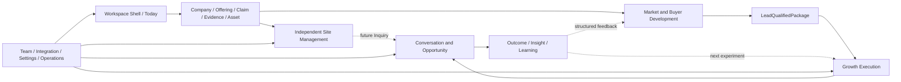

# 全 SaaS 产品组合覆盖与优先级

> 文档 ID：`BASE-FE-P6-001`
> 状态：`FROZEN_EVIDENCE / APPROVED_AT_GATE_6`
> Owner：`OWN-PRODUCT`
> 目的：证明完整产品没有失踪能力，同时不让地图自动变成当前 roadmap

## 1. 一个产品，不是功能平铺

Shell 和控制面提供上下文与安全；企业事实提供可信输入；业务域各自拥有聚合根；洞察消费读模型并把结构化学习送回。导航邻近不改变对象 ownership，页面数量也不等于产品优先级。

## 2. 24 项顶层 Capability 覆盖

| Capability | 正式 Pack | 产品/实现状态 | Phase 6 结论 |
|---|---|---|---|
| `CAP-SHELL-001`、`CAP-ID-001`、`CAP-ONB-001`、`CAP-TODAY-001` | Shell/Today | IA approved；本地 Mock；平台合同未知 | `MAP_COMPLETE / FOUNDATION_BLOCKED` |
| `CAP-TRUTH-001`、`CAP-KNOW-001` | 企业事实与信任 | 跨域原则 approved；后端子集存在 | `MAP_COMPLETE / PARTIAL_BACKEND` |
| `CAP-SITE-001..005` | 独立站管理 | Gate 5 已批；当前/目标两 lane | 当前纵切 `SPEC_READY_WITH_BLOCKERS`；后置 `TARGET_NOT_RUNNABLE` |
| `CAP-BUYER-001`、`CAP-INTENT-001`、`CAP-COMP-001` | 客户开发 | 后端真实；新增开发冻结 | `FROZEN_MAP_ONLY` |
| `CAP-CAMP-001`、`CAP-CONTENT-001`、`CAP-PUBLISH-001` | 增长执行 | SaaS target；原型 Mock；无 SoR | `MAP_COMPLETE / TARGET_EXTERNAL` |
| `CAP-ENGAGE-001`、`CAP-OPP-001` | 互动与商机 | SaaS owned；无正式实现定位 | `MAP_COMPLETE / TARGET_EXTERNAL` |
| `CAP-INSIGHT-001` | 洞察与学习 | 目标读模型；Site 只有局部 cost | `MAP_COMPLETE / TARGET_EXTERNAL` |
| `CAP-INTEG-001`、`CAP-TEAM-001`、`CAP-SET-001`、`CAP-ADMIN-001` | 控制面 | 外部 owned；旧原型冲突 | `MAP_COMPLETE / TARGET_EXTERNAL` |

结论：全部 24 项顶层 Capability 和 76 个 Page ID 均有正式 Pack/Registry 归属；`CAP-TRUTH-001` 补上此前企业事实 Domain 已存在但顶层 Capability 缺位的问题。缺号是预留，不是失踪页面。这个覆盖结果不把 `TARGET_EXTERNAL/FROZEN` 升级为当前 backlog。

## 3. 用户价值切片与当前优先级

| Lane | 用户可见结果 | 当前优先级 | 进入条件 |
|---|---|---|---|
| `L0` 产品安全地基 | 正确 Workspace、权限、Evidence、状态/恢复、QA/Ops | 与首个 Site 纵切共同前置 | `BLK-FE-001/003/004/006` 适用部分关闭 |
| `L1` Site 当前纵切 | 注册/资料/素材/KB/Claim→Build/取消/恢复→可信开发预览 | 唯一当前前端候选纵切 | Gate 5 规格 + 正式 repo/设计/合同/Owner/证据 |
| `L2` Site 后置链 | 编辑、版本、Publish、Domain、Inquiry、Analytics | 不进入当前承诺 | 按能力分别关闭 `BLK-FE-007` 与隐私/infra/合同门 |
| `L3` 客户开发 | 可解释客户发现与资格 | 地图保留，新增开发冻结 | 产品负责人明确解除冻结 + 重新验收 |
| `L4` SaaS 增长/互动/商机/洞察 | 从执行到 Outcome 的完整增长闭环 | 长期产品地图，不是当前施工 | 正式 SaaS SoR/repo/Owner、最小纵切和 Capability Gate |
| `L5` 控制面/运营 | 成员、集成、套餐、安全、运营 | 随真实纵切按最小能力切入 | 身份/权限/商业/安全/审计政策与实际 Owner |

“地图完整”与“现在先做什么”分开治理。Phase 6 不采用 Word 中先把 Campaign、内容、视频、全渠道 Inbox、归因和 Marketplace 同时施工的路线。

## 4. 依赖排序原则

1. 先修用户可见结果的最小闭环，不先建大平台空壳。
2. 身份/Workspace/allowed actions、事实/Evidence、失败恢复、可观察和证据门随第一个纵切一起落，不永久后置。
3. 任何外部动作先有 Dry Run、Approval、ExecutionAuthorization、Suppression/Policy、幂等、预算和回执。
4. 任何聚合页先有 canonical object 和读模型；Today/Insights 不创建第二份业务真相。
5. 任何数据/指标先有口径、权限、新鲜度、隐私/保留和下钻；不从 Mock 图表反推 Schema。
6. OSS、第三方 SaaS 和设计/生成工具先走 Phase 7 adoption card；依赖存在或竞品使用不等于采用。

## 5. 每个域进入更深文档的门

地图级 Pack 升级到 Dev-Ready Pack 前，至少需要：

- 明确产品结果、首个 actor、最小纵切和非目标；
- 正式 repo、Accountable/implementation/QA/Ops/Privacy Owner；
- 对象 SoR、生命周期、权限、社会属性和机器合同；
- Page manifest、关键状态、文案、低保真和无障碍/响应式行为；
- 标准 Fixture、正常/失败/取消/恢复场景、验收和人工兜底；
- 指标/反指标、事件/隐私门和发布后学习；
- 若含外部系统，完成 License/security/data/adapter/test/exit 决策。

只有满足这些输入，才能从 `MAP_COMPLETE` 升为 `SPEC_READY`；正式实现、部署和用户可用仍各有独立轴。
