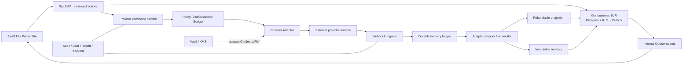

# Phase 9 外部 Provider、主真值与退出架构

> 文档 ID：`BASE-FE-P9-004`
> 生命周期：`DRAFT`
> 层级：`L4 / Architecture proposal`
> 事实 Owner：`OWN-SAAS-PLATFORM`
> 联合评审责任帽：`OWN-SEC-COMMERCIAL`、`OWN-SECURITY`、`OWN-DATA-PRIVACY`、`OWN-GROWTH-PRODUCT`、`OWN-CONVERSATION-PRODUCT`、`OWN-SITE-BE`、`OWN-AI-PLATFORM`、`OWN-OPS`、`OWN-QA-EVIDENCE`、`OWN-SAAS-FE`、`OWN-DESIGN`
> 外部资料核验截止：2026-07-22；外部 API、套餐、条款和能力会漂移，接入时必须重新探测
> 状态限定：本文是设计合同与选型建议，不是 `APPROVED`、`AS_BUILT`、`DEPLOYED`、`PILOT` 或生产放行证据

本文在[产品边界](../../product-scope.md)、[当前架构](../../architecture/current.md)、[术语与状态](../../governance/terminology-and-status.md)、[OSS 采用政策](../../platform/oss-adoption/adoption-policy.md)和[Phase 7 组合决定](../saas-frontend-phase-7/portfolio-decisions-and-triggers.md)之下，定义 SaaS 如何使用外部执行能力而不丢失业务主真值、权限、审计、回执和退出能力。本文不创建新的正式 `ADP-*`、`CAP-*`、`OBJ-*` 或 `PAGE-*` ID；候选经后续 Gate 批准后，才进入对应 Registry。

## 1. 结论先行

1. 我方平台拥有 Workspace、Membership、allowed actions、Company、Offering、Site、Campaign、Content、Conversation、Opportunity、Outcome、Evidence、Approval、Execution Authorization、成本与审计的规范事实。
2. 外部系统只以 `Provider Adapter` 提供执行、传输、托管或计算能力。供应商账号、任务和消息 ID 是外部引用，不取得我方业务对象身份。
3. `Projection` 是可重建读模型；`Receipt` 是外部副作用的不可变结果证据；二者都不能被误写成用户目标或业务终态。
4. 外部命令必须区分 `REQUESTED → ACCEPTED → DELIVERED/FAILED`。超时后无法确定结果时进入 `ACK_UNKNOWN`，禁止立即无脑重试和展示“成功”。
5. 每项接入在写第一行运行时代码前，必须同时有 capability probe、最小 scope、CredentialRef、签名/重放策略、成本、健康、导出、删除和替代路径。
6. Aitoearn 是内容媒体、分发和公开互动的候选执行 Provider；Chatwoot 是私密入站会话的候选执行 Provider；BaoTa/1Panel/Coolify 是客户自管服务器的候选 Hosting Provider。它们都不进入一级 IA，也不直接暴露供应商管理台。
7. 默认站点发布目标保持供应商中立：`Immutable SiteRelease → object storage/CDN → Caddy/ACME`。面板类 Provider 只服务客户自有基础设施，不取得 SiteRelease、Publish、Domain 或 Certificate 业务真值。
8. new-api 严格留在服务端 `ModelGateway` 后；浏览器不获取 Base URL、上游模型密钥、Provider token 或路由规则。

## 2. 采用决定与执行阶段必须分轴

`BUILD/INTEGRATE/DEFER/AVOID` 是采用决定，`BAKEOFF/PILOT` 是验证阶段；不得把“计划 Pilot”写成已经采用。

| 轴 | 允许值 | 含义 |
|---|---|---|
| 采用决定 | `BUILD` | 自建我方 Contract、业务状态、Adapter、Policy 或必要实现 |
| 采用决定 | `INTEGRATE` | 通过我方 Adapter 调用一个已过 Gate 的外部运行时 |
| 采用决定 | `DEFER` | 当前不安装、不建账号、不接流量；触发器出现后才重开 |
| 采用决定 | `AVOID` | 禁止某项目或某种接法；不是泛指永远不能研究 |
| 验证阶段 | `NOT_STARTED` | 只有文档设计，没有账号、运行时或流量 |
| 验证阶段 | `BAKEOFF` | 在同一 Contract/Fixture 下比较候选，不接真实用户流量 |
| 验证阶段 | `PILOT` | 有受控租户、数据、范围、回滚和结束日期；不等于 GA |
| 用户可用性 | `DISABLED / INTERNAL_ONLY / PILOT / GA` | 沿用治理词典；只能由真实 Release evidence 升级 |

本文出现的 `PILOT_NOT_STARTED` 表示“建议的下一验证阶段尚未执行”，不能在产品 UI、销售材料或状态页中表述为已接入。

## 3. 参考架构



### 3.1 五类边界

| 层 | 可以保存 | 不得保存或决定 |
|---|---|---|
| Business SoR | canonical object、业务状态、版本、Workspace、allowed actions、授权、成本和审计 | 供应商密钥明文；由供应商标签反推业务终态 |
| Adapter | 请求/响应 mapper、协议、版本兼容、错误分类、capability probe | 产品规则、角色判断、套餐真值、跨域业务编排 |
| Projection | 外部账号/对象摘要、最后同步水位、可重建状态 | 唯一业务身份；不可恢复的唯一消息或发布事实 |
| Receipt | command identity、外部 ID、accepted/delivered/failed、时间、摘要、成本和证据引用 | 覆盖历史；把 accepted 当 delivered；把 delivered 当 Outcome |
| Exit | 导出、对账、切换、撤权、删除回执、残余风险 | 只写“有接口可替换”而无演练、对象计数和删除证明 |

### 3.2 唯一主真值规则

- 一个事实只能有一个规范 Owner。外部系统可以是 system of execution 或 transport source，但不是自动成为业务 SoR。
- `Campaign approved` 不等于 `Publish authorized`；`Publish accepted` 不等于 `delivered`；`message sent` 不等于对方已接收；`reply received` 不等于 Opportunity qualified。
- Chatwoot label、Aitoearn publish status、面板 deployment status 都只能映射到我方受控枚举；原始值另外保留用于诊断，不能直接驱动权限或销售阶段。
- Provider 数据丢失后，Projection 应可由 API/导出/Receipt 重建；若无法重建，必须在 CapabilityManifest 中标为 `nonPortable=true` 并阻止 GA。
- 外部控制面创建的对象不自动进入我方。只有经过 Workspace 映射、用途门、身份归并和授权的对象才可投影。

## 4. 设计合同

以下均为设计级 TypeScript 形状，不是当前 OpenAPI，也不授权新增数据库表。字段名在实施前需经 `OWN-SAAS-PLATFORM`、领域 Owner 和 `OWN-DATA-PRIVACY` 评审。

### 4.1 `ProviderCapabilityManifest`

```ts
type CapabilitySupport = 'SUPPORTED' | 'PARTIAL' | 'UNSUPPORTED' | 'UNKNOWN';

interface ProviderCapabilityManifest {
  schemaVersion: 'provider-capability-manifest/v1';
  providerKind: string;                 // stable internal slug, not a secret
  adapterVersion: string;
  deploymentModes: Array<'SAAS' | 'SELF_HOSTED' | 'CUSTOMER_MANAGED'>;
  capabilities: Record<string, {
    support: CapabilitySupport;
    operations: string[];               // internal operation names
    constraints: Record<string, unknown>;
    requiredScopes: string[];
    receiptLevels: Array<'ACCEPTED' | 'DELIVERED' | 'READ' | 'FAILED'>;
    webhookEvents: string[];
    pollingFallback: boolean;
    idempotencyMode: 'NATIVE' | 'ADAPTER_DEDUPE' | 'NONE';
  }>;
  authModes: Array<'OAUTH2' | 'API_KEY' | 'SIGNED_REQUEST' | 'BEARER_TOKEN'>;
  webhook: {
    signing: 'HMAC_SHA256' | 'ASYMMETRIC' | 'NONE' | 'UNKNOWN';
    deliveryId: boolean;
    timestamp: boolean;
    documentedRetry: boolean | 'UNKNOWN';
  };
  dataClasses: string[];
  dataRegions: string[] | 'UNKNOWN';
  exportSupport: CapabilitySupport;
  deleteSupport: CapabilitySupport;
  costModel: 'REQUEST' | 'TOKEN' | 'JOB' | 'SEAT' | 'USAGE' | 'UNKNOWN';
  sourceRefs: Array<{ url: string; checkedAt: string; note: string }>;
  liveProbe: { checkedAt: string; environment: string; resultDigest: string } | null;
}
```

有效能力不是供应商营销页的并集，而是：

```text
effective capability
= adapter-supported
∩ exact provider version/plan/live probe
∩ granted scopes
∩ Workspace entitlement
∩ policy/region/data-purpose allowance
∩ current provider health
```

客户端只消费服务端计算后的 `effectiveCapabilities`；不得自行根据 Provider 名称显示按钮。

### 4.2 `ProviderConnection`

```ts
interface ProviderConnection {
  id: string;
  workspaceId: string;
  providerKind: string;
  deploymentMode: 'SAAS' | 'SELF_HOSTED' | 'CUSTOMER_MANAGED';
  displayName: string;
  externalTenantRef: string | null;
  credentialRef: string;                // opaque; never the credential
  grantedScopes: string[];
  status:
    | 'PENDING_AUTH' | 'VERIFYING' | 'ACTIVE' | 'DEGRADED'
    | 'EXPIRING' | 'EXPIRED' | 'REVOKED' | 'BLOCKED'
    | 'EXITING' | 'REMOVED';
  manifestDigest: string;
  health: {
    auth: 'OK' | 'DEGRADED' | 'FAILED' | 'UNKNOWN';
    api: 'OK' | 'DEGRADED' | 'FAILED' | 'UNKNOWN';
    webhook: 'OK' | 'DEGRADED' | 'FAILED' | 'UNKNOWN';
    sync: 'OK' | 'LAGGING' | 'FAILED' | 'UNKNOWN';
    checkedAt: string;
  };
  lastRotatedAt: string | null;
  createdBy: string;
  createdAt: string;
  removedAt: string | null;
}
```

- OAuth 必须使用 state、PKCE（适用时）、精确 redirect URI、短时授权上下文和一次性 callback；callback 绑定 Workspace、actor、provider 和 nonce。
- API Key、panel key、Bearer token 只进入 Vault/KMS；DB、URL、浏览器、日志、截图和设计 Fixture 只保存 `credentialRef` 与脱敏后四位。
- 重新授权不得复用旧 callback；scope 增加必须产生新的 Execution Authorization 和审计记录。
- “删除连接”是退出流程，不是简单删一行：先停新命令、排空/取消、导出/对账、撤权、删除 Provider 副本，再关闭映射。

### 4.3 `CapabilityBinding`

```ts
interface CapabilityBinding {
  id: string;
  workspaceId: string;
  connectionId: string;
  capability:
    | 'MEDIA_GENERATE' | 'SOCIAL_PUBLISH' | 'PUBLIC_INTERACTION'
    | 'PRIVATE_CONVERSATION' | 'HOSTING_DEPLOY' | 'DOMAIN_MANAGE'
    | 'TRANSACTIONAL_EMAIL' | 'PRODUCT_ANALYTICS' | 'CRM_SYNC'
    | 'ERP_REFERENCE' | 'LOCALIZATION_SYNC';
  targetRef: string;                    // our channel/site/inbox/etc identity
  externalResourceRef: string;
  direction: 'OUTBOUND' | 'INBOUND' | 'BIDIRECTIONAL';
  role: 'PRIMARY' | 'SHADOW' | 'MIGRATION_TARGET';
  status: 'PENDING' | 'ACTIVE' | 'DEGRADED' | 'PAUSED' | 'EXITING' | 'REMOVED';
  configVersion: number;
  grantedActions: string[];
  createdAt: string;
}
```

同一个 LinkedIn/Facebook/WhatsApp 账号可以分别绑定发布、公开互动、私信和分析能力；“账号已连接”不表示全部能力已授权。一个 `workspace + capability + targetRef` 同时最多一个 `PRIMARY`。`SHADOW` 只能读/比对，不能产生外部副作用；迁移期间禁止两个 Provider 自动双发。

### 4.4 `WebhookDelivery`

```ts
interface WebhookDelivery {
  id: string;
  workspaceId: string | null;
  providerKind: string;
  connectionId: string | null;
  externalDeliveryId: string | null;
  dedupeKey: string;
  eventType: string;
  externalObjectRef: string | null;
  eventOccurredAt: string | null;
  receivedAt: string;
  signature: 'VALID' | 'INVALID' | 'MISSING' | 'NOT_SUPPORTED';
  payloadDigest: string;
  rawPayloadRef: string | null;          // encrypted, bounded retention if required
  state:
    | 'RECEIVED' | 'AUTHENTICATED' | 'DUPLICATE' | 'PERSISTED'
    | 'PROJECTED' | 'QUARANTINED' | 'FAILED' | 'RECONCILED' | 'DISCARDED';
  projectionVersion: string | null;
  errorCode: string | null;
}
```

处理顺序固定为：读取原始 bytes → 校验时间窗/签名 → 解析 connection → 计算 dedupeKey → durable persist → 返回 2xx → 异步 mapper/projector。签名失败、未知 Workspace、超大 payload、未知 event type 和 schema 漂移进入隔离队列，不直接改业务表。

去重优先使用 Provider delivery ID；没有时用 `provider + connection + event type + external object + source version + canonical payload digest`。去重只阻止重复副作用，不删除重复到达的审计证据。

### 4.5 `SyncRun`

```ts
interface SyncRun {
  id: string;
  workspaceId: string;
  connectionId: string;
  capability: string;
  mode: 'INCREMENTAL' | 'RECONCILE' | 'BACKFILL' | 'EXIT_EXPORT';
  cursorBefore: string | null;
  cursorAfter: string | null;
  window: { from: string | null; to: string | null };
  status: 'QUEUED' | 'RUNNING' | 'PARTIAL' | 'SUCCEEDED' | 'FAILED' | 'CANCELLED';
  counts: { seen: number; created: number; updated: number; unchanged: number; failed: number };
  cost: { estimated: number | null; settled: number | null; currency: string | null };
  startedAt: string | null;
  finishedAt: string | null;
  errorSummaryRef: string | null;
}
```

Webhook 是低延迟提示，不是完整性证明；每个生产绑定必须有周期 reconciliation。游标只能在本页全部持久化后推进；部分失败保留失败子集并允许有界重跑。

### 4.6 Command 与 Receipt

```ts
interface ProviderCommandReceipt {
  commandId: string;                    // our idempotency identity
  workspaceId: string;
  capability: string;
  targetRef: string;
  externalRequestRef: string | null;
  externalObjectRef: string | null;
  state:
    | 'REQUESTED' | 'SENT' | 'ACCEPTED' | 'ACK_UNKNOWN'
    | 'DELIVERED' | 'PARTIAL' | 'FAILED' | 'CANCELLED';
  providerStatusRaw: string | null;
  requestedAt: string;
  acceptedAt: string | null;
  terminalAt: string | null;
  evidenceDigest: string | null;
  estimatedCost: number | null;
  settledCost: number | null;
  currency: string | null;
}
```

`ACK_UNKNOWN` 处置：

1. 不把请求标成失败，也不立即再发。
2. 有原生 idempotency key 时用同 key 查询/安全重试；没有时按外部对象、时间窗和内容摘要做只读对账。
3. 对账能唯一定位则补 Receipt；出现零个或多个候选时保持 `ACK_UNKNOWN` 并交人工选择。
4. 只有明确证明未执行，才允许生成新的 command；新 command 必须引用旧 command 和人工/策略依据。

### 4.7 `HostingTarget`、Deployment 与 DomainBinding

```ts
interface HostingTarget {
  id: string;
  workspaceId: string;
  connectionId: string;
  providerKind: 'DIRECT' | 'BAOTA' | 'ONEPANEL' | 'COOLIFY' | string;
  displayName: string;
  externalServerRef: string | null;
  region: string | null;
  allowedSiteIds: string[];
  capabilities: Array<'DEPLOY_RELEASE' | 'HEALTH' | 'DOMAIN' | 'CERTIFICATE' | 'ROLLBACK'>;
  status: 'ENROLLING' | 'READY' | 'DEGRADED' | 'OFFLINE' | 'REVOKED' | 'EXITING';
  lastProbeAt: string | null;
}

interface HostingDeploymentReceipt {
  deploymentId: string;
  hostingTargetId: string;
  siteId: string;
  siteReleaseId: string;
  artifactDigest: string;
  externalDeploymentRef: string | null;
  state: 'REQUESTED' | 'ACCEPTED' | 'ACK_UNKNOWN' | 'VERIFIED' | 'FAILED' | 'ROLLED_BACK';
  healthCheckDigest: string | null;
}

interface DomainBindingProjection {
  domain: string;
  siteId: string;
  hostingTargetId: string;
  dnsState: 'UNVERIFIED' | 'PENDING' | 'VERIFIED' | 'CONFLICT' | 'FAILED';
  certificateState: 'NONE' | 'ISSUING' | 'ACTIVE' | 'EXPIRING' | 'FAILED' | 'UNKNOWN';
  providerCertificateRef: string | null;
  checkedAt: string;
}
```

面板 Adapter 只能部署已批准的 immutable artifact digest；不得接受自由 shell、任意文件路径、数据库 root 或面板 root 操作。回滚是把公开服务切回已知 SiteRelease，不是从面板目录猜测历史内容。

## 5. 异步、乱序与故障语义

### 5.1 入站事件

- 不按 HTTP 到达顺序更新对象；优先使用 Provider monotonic version/cursor，其次用 `eventOccurredAt + external ID`，仍不确定时执行 fetch-current reconciliation。
- 旧事件可以补审计，但不得覆盖更高版本。删除/撤回用 tombstone，不能被迟到的 create/update 复活。
- mapper 必须纯化：相同原始 payload + adapter version 产生相同 normalized event；升级前用历史 fixture 回放。
- 业务投影用 CAS/fencing。对话、发布、域名、证书和账单各自有独立水位，不能用一个“已同步”徽章概括。
- Provider 5xx、429、限流、断连和 schema drift 都只降级相应 binding；不应把整个 Workspace 标为失败。

### 5.2 出站命令

- 所有有副作用请求先在我方创建 command、做 allowed-actions/版本/预算/授权检查，再调用 Adapter。
- 只有 Provider 明确支持幂等，才自动重试 POST；否则网络超时进入 `ACK_UNKNOWN`。
- `cancel requested` 与 `cancel confirmed` 分开。Provider 不支持取消时，UI 显示“无法阻止已提交的外部执行”，不能假装取消成功。
- 部分发布、部分媒体变体、部分渠道或部分收件人失败，保留成功子集并只重试失败子集。
- Provider 回执不得直接触发 Outcome；必须由领域规则或人确认。

### 5.3 健康、成本与审计

每个 binding 至少暴露五个独立信号：

1. authorization：token/scope/expiry；
2. provider API：探针、延迟、限流和错误率；
3. webhook：签名失败、最后到达、delivery lag；
4. reconciliation：cursor lag、差异计数、失败子集；
5. business execution：accepted/delivered/failed/ACK unknown。

成本必须分 `estimated` 与 `settled`，并绑定 command/job/Workspace；未知 usage 不能继续无界 fallback。审计至少记录 actor、Workspace、allowed action、对象/版本、scope、Provider、command、结果、成本、correlation ID 和变更前后配置摘要，绝不记录密钥或完整敏感 payload。

## 6. Aitoearn：媒体、分发与公开互动候选

### 6.1 当前证据与诚实状态

[Aitoearn 开放平台](https://docs.aitoearn.ai/zh/use/introduction)说明开放 API 可用于账号授权、素材上传和多平台发布；[API 索引](https://docs.aitoearn.ai/zh/api)列出了图像/视频生成、账号、授权、发布流程、作品和统计等接口，并声明大多数接口使用 `X-Api-Key`。这只证明文档所列能力存在，不证明当前租户、套餐、渠道或账号具有相同能力。

Phase 7 当前决定仍是 `LEARN / NO_RUNTIME`，运行时 `DEFER`。Phase 9 的 DRAFT 建议是：Growth 最小纵切、Owner、vault、渠道政策和退出门关闭后，才允许 `INTEGRATE + PILOT`；当前执行态为 `PILOT_NOT_STARTED`。

### 6.2 Provider 角色拆分

| 我方能力 | Aitoearn 候选角色 | 我方 SoR | 必须探测 |
|---|---|---|---|
| 图片/视频生成 | `MediaGenerationProvider` | MediaJob、输入 spec、Asset、RightsRecord、成本和批准 | 精确模型、异步状态、取消、结果保存期、usage、地区、内容权利 |
| 多平台发布 | `SocialPublishProvider` | Campaign、Content、PublishJob、Execution Authorization、Receipt | 渠道、scope、字段、限额、幂等、草稿/排程/取消、部分失败 |
| 作品/统计 | `SocialAnalyticsProvider` | MetricDefinition、采集水位和规范聚合 | 指标定义、时间窗、数据延迟、删除/撤回语义 |
| 公开评论互动 | `PublicInteractionProvider` 候选 | PublicInteraction、审核、升级私聊和审计 | 当前开放 API 是否真实覆盖评论读取/回复、支持平台、权限和删除；未探测前为 `UNKNOWN` |
| 文本模型 | 不作为第二个通用 ModelGateway | task route、Evidence、预算仍由我方/new-api 路径承重 | 默认 `UNSUPPORTED_BY_POLICY`；只可在另行模型 Gate 后重开 |

Aitoearn 帮助页展示部分平台有发布、分析和公开互动能力，例如 [Facebook 能力说明](https://docs.aitoearn.ai/zh/help/social-platforms/555-using-facebook-with-aitoearn)。但产品 UI 能力与开放 API 可编程能力不是同一事实；公开评论 Pilot 必须以真实 API probe 为准。

### 6.3 最小 Pilot

- 一个内部 Workspace、一个官方 OAuth 渠道、一个合成品牌账号、无客户 PII。
- 只跑 `connect → scope snapshot → draft → schedule → accepted → delivered/partial/failed → analytics reconciliation → revoke/export`。
- 第一期不自动回复评论；只读评论和人工起草也要先证明 API、权限、删除和审核链。
- 所有发布必须有具体 Content version 和一次性 Execution Authorization；连接成功不授予自动发布权。
- `X-Api-Key` 仅服务端保存；OAuth 账号授权结果映射为 ProviderConnection/CapabilityBinding。
- 若 Aitoearn 无签名 webhook 或公开文档未证明 webhook，使用有界 polling + reconciliation；不能让无签名回调直接改业务状态。

### 6.4 退出与 Postiz 对照

[Postiz Public API](https://docs.postiz.com/public-api/introduction)作为同合同替代候选；官方文档提供 [OAuth 渠道连接](https://docs.postiz.com/public-api/integrations/connect)、[渠道/Integration 列表](https://docs.postiz.com/public-api/integrations/list)、发布与统计接口。当前决定是 `DEFER / BAKEOFF_NOT_STARTED`，不是备用运行时。

退出顺序：停新 PublishJob → 等待/取消在途 → 导出账号映射、发布记录、外部 ID、媒体和统计水位 → 以我方 Receipt 对账 → 在新 Provider 建立 `MIGRATION_TARGET` → 小样 shadow 读取 → 明确切换 PRIMARY → 撤销旧 OAuth/API key → 请求删除 Provider 副本并保存回执。Postiz 或任何替代不能继承旧 token；必须重新授权。

## 7. Chatwoot：私密入站会话候选

### 7.1 当前证据与诚实状态

Chatwoot 官方 API 提供 Inbox、Conversation、Message、Team 和 Webhook 等资源；[创建 Webhook](https://developers.chatwoot.com/api-reference/webhooks/add-a-webhook)当前文档返回签名 secret，[Webhook 验证说明](https://www.chatwoot.com/hc/user-guide/articles/1677693021-how-to-use-webhooks)定义 `X-Chatwoot-Signature`、`X-Chatwoot-Timestamp`、`X-Chatwoot-Delivery` 和 HMAC-SHA256 计算方法。接入仍必须固定并验证实际 Chatwoot 版本，因为旧版本/不同 webhook 类型可能不具备同样签名能力。

Phase 7 当前决定仍是 `LEARN / NO_RUNTIME`，运行时 `DEFER`。Phase 9 DRAFT 建议：Conversation/Message/Opportunity、PII Owner、retention 和出口合同完成后，进入一个 API Channel/测试 Inbox 的 `PILOT_NOT_STARTED`。

### 7.2 所有权与映射

| Chatwoot 对象/能力 | 我方对象/真值 | 规则 |
|---|---|---|
| Account | Workspace connection projection | 不能以 Chatwoot Account 代替 Workspace/Membership |
| Inbox/Channel | CapabilityBinding external resource | scope、渠道、SLA 和健康分别保存 |
| Contact | IdentityMatch 候选投影 | Company/Person identity 由我方归并；歧义不自动合并 |
| Conversation | Conversation transport/workflow projection | canonical Conversation ID、业务上下文和 Opportunity 关联由我方保存 |
| Message | MessageProjection + provider source ref | 内容按最小化/保留策略保存；附件先扫描再可见 |
| Assignee/Team | 我方 actor/team 的受控映射 | Chatwoot 用户/角色不授予 SaaS 权限 |
| Label/Status | 运营提示投影 | 不直接成为 QGO/SAO/Opportunity stage |
| Send message | `ConversationProvider` command | outgoing message 有 command/authorization/ACK unknown/receipt |

### 7.3 Webhook 与回补

- 使用创建 webhook 时产生的专用 secret，按原始 body 和 timestamp 验 HMAC；签名缺失/错误、时间窗超限立即隔离。
- `X-Chatwoot-Delivery` 可用时作为首选 dedupe key；缺失时用事件/对象/版本/摘要组合。
- 只订阅批准事件，避免 typing 等高频瞬态事件进入业务账；完整订阅清单由 CapabilityManifest 固定。
- message/conversation webhook 可以乱序或重复。写入 delivery ledger 后按对象版本/时间回补；不按最后到达者覆盖。
- webhook lag 或差异出现时，使用 [Conversation API](https://developers.chatwoot.com/api-reference/conversations/conversations-list)和 [Message API](https://developers.chatwoot.com/api-reference/messages/get-messages)做有界 reconciliation。
- outgoing send 若 API 超时且无可靠幂等证明，进入 `ACK_UNKNOWN`；先拉取消息按 external source/correlation/摘要对账，防止给买家重复发送。

### 7.4 PII、安全与退出

- 消息正文、邮箱、电话、附件、IP/浏览器信息和翻译都按个人数据处理；记录用途、地区、保留、法律依据、DSR 和删除传播。
- 附件先进入隔离区执行类型、大小、恶意文件和下载 URL 检查；Chatwoot URL 不是永久 Asset identity。
- Agent token/API access token 只在服务端；代表坐席发送必须携带真实 SaaS actor 和审计，禁止共享“机器人管理员”绕过权限。
- 导出必须覆盖 Conversation、Message、附件、Inbox/Channel、Contact 映射、assignment、审计和外部 ID；对账数量/hash 后才切换 Provider。
- 退出时先暂停新入站路由，保留只读回补窗口，完成导出/映射，切 DNS/webhook/channel，撤销 token，删除 Provider 副本并验证 DSR 残余。
- Chatwoot Help Center、联系人、label 或 automation 不能顺带成为帮助文档、CRM、Opportunity 或用户权限 SoR。

## 8. Hosting：默认主路、BaoTa 与替代候选

### 8.1 默认发布主路

目标结构保持：

```text
approved SiteVersion
→ immutable SiteRelease + artifact digest
→ object storage/CDN
→ Caddy/ACME public serving
→ domain/certificate health projection
```

当前公开 Publish/Domain 仍有既有 blocker；本文不把目标架构冒充 as-built。`DIRECT` 路径是目标默认，因为其运行面最小、artifact 可验证、回滚清晰，并减少客户面板差异。

### 8.2 BaoTa

[宝塔开源许可协议](https://www.bt.cn/new/agreement_open.htm)允许基于 API 开发应用，也明确 API 应用不得破坏或修改宝塔代码，无改动集成不得修改源码。因此 DRAFT 边界固定为：`API-only Hosting Adapter`、不 fork、不换标、不嵌供应商 UI、不注入插件、不依赖其内部表。商业使用、分发形态、商标和精确版本仍需 `OWN-SEC-COMMERCIAL` 书面确认。

[宝塔 Linux 面板 API 文档](https://www.bt.cn/api-doc.pdf)只作为候选能力来源；PDF 或某台面板存在某接口，不代表所有版本、插件和授权等级都支持。每个目标必须运行只读 version/capability probe，CapabilityManifest 未确认的 Domain/Certificate/Rollback 能力一律不显示。

安全边界：

- 客户主动创建最小权限 API 凭据、限制来源 IP、设置到期和轮换；若面板只提供高权限 key，默认阻止 GA。
- TLS 必须验证。初次 enrollment 可由用户核对证书指纹，但运行时不得长期 `-k`/忽略证书。
- Adapter allowlist 只允许站点/域名/证书/健康所需确定性操作；禁止自由 shell、终端、数据库、文件浏览器和插件安装。
- artifact 在我方签名并带 digest；面板落盘后做 hash/HTTP health/CSP 检查，验证前只显示 `ACCEPTED`，不能显示 Published。
- 目标目录固定且逐 Site 隔离；防路径穿越、symlink、覆盖其他站点和跨 Workspace target 复用。
- rollback 只能指向我方已知 Release；不从目标目录生成新真值。

当前建议：`DEFER / CAPABILITY_SPIKE_NOT_STARTED`。只有默认 DIRECT 路径已定义、客户自管服务器需求被真实用户验证且许可/安全 Gate 关闭后，才进入非生产 Spike。

### 8.3 1Panel 与 Coolify

| 候选 | 官方可证明输入 | DRAFT 位置 | 额外 Gate |
|---|---|---|---|
| [1Panel API](https://1panel.cn/docs/v2/dev_manual/api_manual/) | Swagger、API key、IP 白名单、有效时间；新接入推荐 HMAC-SHA256 | `DEFER / BAKEOFF_NOT_STARTED` | 禁用兼容 MD5；能力按精确 v2 实例探测；高权限和面板暴露面评审 |
| [Coolify API](https://coolify.io/docs/api-reference/authorization) | team-scoped Bearer token、权限和 API；deploy 权限可与 read/write 分离 | `DEFER / BAKEOFF_NOT_STARTED` | 只申请 `read + deploy` 所需最小权限；禁止 `root`；team/Workspace 映射和敏感响应脱敏 |

三种面板使用同一 HostingProvider Contract 与相同 Fixture 比较：部署 immutable artifact、幂等/ACK unknown、域名、证书、健康、回滚、凭据轮换、断网恢复、升级、导出和彻底撤权。不得按“界面更好看”或“开源”选择。

### 8.4 Hosting 退出

1. 冻结新部署并记录当前 active SiteRelease、DNS、证书、目标目录和 artifact digest。
2. 导出/重建 Provider-neutral DomainBinding 和证书状态；私钥默认不跨 Provider 导出，必要时重新签发。
3. 在新 target 部署同一 immutable release 并完成离线/临时域 health verification。
4. 切 DNS/流量，保留有界回滚窗口；旧 target 只读。
5. 撤销 panel token、IP allowlist 和 webhook；删除旧 artifact/日志/缓存并保留客户确认与删除回执。
6. 只有 DNS、证书、内容 hash、健康和回滚路径全部对账后，才能关闭旧 connection。

## 9. 横向平台能力组合

下表是 DRAFT 组合，不修改 Phase 7 Registry。`BUILD` 仅指必须掌握的合同/主真值；候选运行时仍为 `DEFER`，除非后续 Gate 另行批准。

| 能力 | 我方必须 BUILD | 候选与官方入口 | 当前建议 / 执行态 | AVOID |
|---|---|---|---|---|
| Identity | Workspace/Membership/Entitlement、external subject mapping、JWKS trust、session/security projection、allowed actions | [Keycloak](https://www.keycloak.org/documentation)、[ZITADEL](https://zitadel.com/docs)及合规托管 OIDC | `DEFER / BAKEOFF_NOT_STARTED`；同 OIDC/SCIM/MFA/B2B tenant/审计/出口 Fixture 比较 | 自建密码学、MFA/Passkey 协议；把 IdP role 当业务授权；旧 Spring identity 复活 |
| Vault | `CredentialRef`、用途/scope、租户映射、轮换/撤销/访问审计 | [OpenBao secrets engines](https://openbao.org/docs/secrets/)与云 KMS/Secret Manager | `DEFER / BAKEOFF_NOT_STARTED`；在第一个外部 Pilot 前必须选定或提供等价基线 | 浏览器/URL/日志/普通 DB 明文；把凭据导出给客户或新 Provider |
| Product analytics | MetricDefinition、event schema、consent、identity rules、水位、保留和删除 | [PostHog product analytics](https://posthog.com/docs/product-analytics)及仓库/ClickHouse 基线 | `BUILD contract + DEFER backend / BAKEOFF_NOT_STARTED` | 供应商 SDK 事件名成为指标真值；默认 session replay；采集消息/表单/PII |
| Billing | Plan/Entitlement、usage ledger、invoice/payment projection、grace/suspension policy和人工复核 | [Stripe Billing Webhooks](https://docs.stripe.com/billing/subscriptions/webhooks)及面向目标地区的支付候选 | `BUILD SoR + DEFER provider / BAKEOFF_NOT_STARTED` | 以 `payment succeeded` 直接授予全部权限；把 Stripe customer/subscription 当 Workspace/Entitlement SoR |
| Observability | correlation、SLO、Incident、业务 Receipt/成本、脱敏和保留 | [OpenTelemetry](https://opentelemetry.io/docs/)作为 vendor-neutral telemetry；[Sentry](https://docs.sentry.io/)、Grafana stack 作为 sink 候选；Langfuse 保持既有 `DEFER` | `BUILD OTel contract + DEFER sinks / BAKEOFF_NOT_STARTED` | 原始 PII、密钥、Prompt/附件进入 trace；把 vendor alert 当 Incident 业务真值 |
| Transactional email | Notification、template version、recipient purpose、suppression、EmailDelivery Receipt、退信与 DSR | [Resend Webhooks](https://www.resend.com/docs/api-reference/webhooks/create-webhook)、Postmark、AWS SES | `DEFER / BAKEOFF_NOT_STARTED`；注册验证/安全通知纵切批准后重开 | 与营销/销售触达共用名单和授权；只凭 API 200 写 delivered；绕过 suppression |
| Anti-abuse | 风险 policy、rate limit、honeypot、IP/设备最小化、suppression、人工复核和 incident | [Cloudflare Turnstile server validation](https://developers.cloudflare.com/turnstile/get-started/server-side-validation/)及 hCaptcha | `BUILD policy + DEFER provider`；Inquiry 纵切可做 `PILOT_NOT_STARTED` | CAPTCHA 单点放行；只在客户端校验；把挑战结果当身份或永久信誉 |
| Help | Git/Registry 事实、GuideManifest、Tutorial/How-to/Reference/Explanation、版本和搜索索引 | [Astro Starlight](https://starlight.astro.build/)、[Docusaurus](https://docusaurus.io/docs) | `BUILD docs-as-code + DEFER portal / BAKEOFF_NOT_STARTED` | Chatwoot Help Center、供应商文档或搜索索引成为唯一知识真值；无版本 AI 答案 |
| CRM | Opportunity/QGO/SAO/Outcome、IdentityMatch、sync policy、冲突和 Receipt | [Salesforce REST API](https://developer.salesforce.com/docs/atlas.en-us.api_rest.meta/api_rest/)、[HubSpot APIs](https://developers.hubspot.com/docs/api/overview) | `BUILD CRM Adapter contract + DEFER connectors` | iframe 管理台；直连外部 DB；Chatwoot label/CRM stage 无审批覆盖我方 Opportunity |
| ERP | 我方只保存客户/产品/询价上下文和外部业务引用；订单/发票/生产执行由 ERP 自身负责 | [Odoo External API](https://www.odoo.com/documentation/19.0/developer/reference/external_api.html)、ERPNext 等候选 | `DEFER / REQUIRE_REAL_CUSTOMER_TRIGGER` | 在本产品重建 ERP/MES/库存/订单；双向同步无字段 Owner/冲突/回滚 |
| Localization | locale policy、source locale、glossary、translatable unit ID、translation status、review/approval、fallback | [Tolgee](https://docs.tolgee.io/)、[Crowdin API](https://developer.crowdin.com/api/v2/) | `BUILD contract + DEFER TMS / BAKEOFF_NOT_STARTED` | TMS key/ID 成为 Content identity；运行时页面依赖 TMS 在线；未审机器翻译自动发布 |

### 9.1 Identity 特别边界

- 本仓后端继续只验证 SaaS 签发 token/JWKS；不在 Site Builder 或 Provider Adapter 中签发/刷新用户 token。
- IdP 负责认证；SaaS 控制面负责 Workspace membership、角色、entitlement 和 object-level allowed actions。
- Provider OAuth identity 与登录 identity 分开。连接 LinkedIn/Chatwoot/面板不创建 SaaS 用户，也不扩大其角色。
- 删除用户、离开 Workspace、撤销委派时，要级联取消其代表授权和可用 credential，而不是删除共享业务对象。

### 9.2 CRM/ERP 特别边界

- 我方 Opportunity 是增长执行产品的主真值；CRM 可以获得副本、回写建议或经批准的阶段映射，但不能 silent provider-wins。
- ERP 的订单、发票、生产和库存属于外部 ERP SoR；我方只持有 reference/projection 并显示“来自 ERP、最后同步时间、冲突/不可用”。
- 双向同步必须逐字段定义 Owner、merge 策略、删除传播和 loop prevention；没有字段级合同就只允许单向导出。

## 10. new-api 严格后台边界

new-api 的当前事实和硬化要求继续服从既有 `ADP-FE-024` Card；本文只补前端和 Provider 控制边界：

- 所有文本、图像和 embedding 上游调用先经过服务端 `ModelGateway`、task route、预算、Evidence 和 kill switch；业务前端不直接调用 new-api。
- 普通用户只看任务策略，如“质量优先 / 速度优先 / 成本优先”；高级模式也只显示服务端批准的稳定别名和能力，不显示 Base URL、渠道、真实 key 或 fallback 链。
- new-api admin UI 仅平台运营面，受网络隔离、强认证和审计保护；不 iframe 到产品设置。
- Aitoearn 提供的 LLM-compatible API 不成为第二个通用模型网关。其媒体能力如获批准，只以 `MediaGenerationProvider` 接入并复用我方 MediaJob/Asset/Rights/Cost 合同。
- requested/reported/resolved model、transport、usage、settled cost 和 evidence 均写我方账；Provider 返回模型名不能覆盖 task route。
- 前端永不接收 Provider secret；“连接测试”由服务端执行，只返回 capability、脱敏错误、correlation ID 和建议动作。

## 11. UI 表达合同

### 11.1 Integration Center

每个连接详情固定包含：

1. Overview：业务用途、Owner、Workspace、数据类别和当前可用性；
2. Capabilities：支持/部分/未知/不支持、限制、scope 和最后探测时间；
3. Bindings：哪个账号/站点/Inbox 绑定发布、评论、私信、分析或部署；
4. Health：auth/API/webhook/sync/execution 五轴，而非一个绿点；
5. Deliveries & Sync：WebhookDelivery、SyncRun、lag、隔离和重放；
6. Usage & Cost：estimated/settled、限额和异常；
7. Audit & Security：scope、轮换、最近授权、allowed actions 和审计摘要；
8. Data & Exit：Provider 保存什么、地区、保留、导出、删除、撤权和迁移状态。

供应商名是二级信息。日常导航使用“发布渠道”“统一收件箱”“托管目标”等用户任务名，不使用“Aitoearn”“Chatwoot”“宝塔”作为一级入口。

### 11.2 状态和动作

- 业务状态、连接健康、同步水位、Evidence、新鲜度和权限分别呈现；颜色只作辅助。
- `ACTIVE` 连接仍可能某个 binding `DEGRADED`；某渠道发布失败不把全部内容工作室标红。
- `ACK_UNKNOWN` 显示“正在确认外部结果”，提供 correlation ID、最后检查、刷新/对账和受控人工决策；禁止提供普通“重试”按钮。
- `EXPIRING` 显示到期时间、受影响能力和重新授权；不承诺自动续期。
- `PARTIAL` 展开成功/失败子集，只允许重试失败项。
- `EXITING` 期间禁止新副作用，仍可查看/导出/对账；`REMOVED` 保留最小审计和删除回执。
- 页面动作只消费服务端 `allowedActions` 和 effective capability；隐藏按钮不是权限控制。

### 11.3 授权与危险动作

- OAuth 前先显示 Provider、账号类型、scope、数据、能力和退出影响；callback 后再次确认实际 granted scopes。
- scope 扩大、自动发布、外发消息、域名切换、证书私钥、删除和退出都需要 step-up/Execution Authorization。
- 用户看不到 secret；轮换展示“新凭据验证成功后切换、旧凭据撤销”的双阶段状态。
- 外链到供应商控制台必须明确离开我方产品、目标域和风险；不嵌入管理台，不让用户误以为仍在我方权限边界。

## 12. 删除、导出与退出状态机

```text
REQUESTED
→ PRECHECKED
→ QUIESCING
→ EXPORTING
→ RECONCILING
→ CUTOVER_READY
→ CUTOVER
→ REVOKING
→ DELETING
→ VERIFYING
→ CLOSED | PARTIAL_RESIDUAL | FAILED_RECOVERABLE
```

每次 Exit 至少产出：

- connection/binding/object/receipt 数量和 digest；
- 在途命令 drain/cancel/ACK unknown 清单；
- 导出格式、字段、附件/媒体、时间窗和校验结果；
- 新旧 Provider 映射与 PRIMARY 切换时间；
- OAuth/API key/webhook/DNS/IP allowlist 撤销证据；
- Provider 删除请求、完成回执、法定/备份残余和预计清除时间；
- 回滚窗口、最终批准者和独立 QA 结果。

用户发起的 Workspace 数据导出/账号关闭与替换 Provider 是两个流程：前者覆盖全部我方业务对象和外部副本，后者只迁移一个 capability binding。两者都必须保持 legal hold、DSR 和审计例外的透明表达。

## 13. Gate、测试与验收

### 13.1 外部 Provider 共同 Gate

| Gate | 必须有 | 失败时 |
|---|---|---|
| User outcome | 批准的最小纵切、非目标和真实触发器 | 保持 `DEFER` |
| Capability | 官方资料 + 精确版本/套餐 + live probe + manifest digest | 能力标 `UNKNOWN`，UI 不提供动作 |
| License/commercial | 许可、API/渠道条款、商标、嵌入/转售、费用和地域 | `AVOID` 该用途或保持 `DEFER` |
| Auth/security | vault、最小 scope、轮换、网络、签名、重放、租户和供应链 | 不建连接、不接流量 |
| Data/privacy | 数据图、目的、地区、保留、DSR、导出和删除 | 不使用真实个人/客户数据 |
| Contract | 正常、空、malformed、429/5xx、取消、部分、乱序、duplicate、ACK unknown | 不能进入 Pilot |
| Operations | SLO、健康、成本、告警、runbook、kill switch、实际 assignee | 最多非生产 Spike |
| Exit | 同 Fixture 替代、导出/对账/撤权/删除演练 | 不能进入 GA |

### 13.2 必测场景

- OAuth state/PKCE/redirect 攻击、scope 少于/多于预期、token 过期/撤销/轮换和串 Workspace。
- API key 泄漏模拟、日志/错误/截图/前端 bundle secret scan、Vault 不可用和 credential stale。
- 签名正确/错误/缺失、timestamp replay、delivery ID duplicate、payload schema drift、超大/恶意 payload。
- webhook 先于 API response、update 先于 create、delete 后迟到 update、同事件重复、回补窗口断点续跑。
- 200/202 后终态失败、部分成功、超时 ACK unknown、Provider 没有幂等、取消不支持、重复发布/重复消息对抗。
- Provider 429/5xx/区域中断、成本突增、quota 耗尽、Webhook 静默、reconciliation 差异和 kill switch。
- 删除/导出、DSR、附件/媒体残余、备份残余、Provider 账号被封、许可证/条款变化和替换演练。
- UI 在 normal/empty/loading/partial/degraded/stale/denied/conflict/offline/ACK unknown/exit states 下的键盘、读屏、长文本和移动端表达。

### 13.3 单项 Pilot 成功门

- 没有业务对象、权限、成本或用户数据转移为外部唯一真值。
- 100% Pilot command 可由我方 command ID 追到 Provider request、Receipt、审计和对象版本。
- 重复/乱序/超时矩阵无重复外发或错误终态；所有 ACK unknown 能被对账或显式人工收口。
- scopes 与 CapabilityManifest 一致；撤权后探针和真实请求均 fail-closed。
- 导出、切换、撤销、删除按 runbook 完成，计数/hash 可核验；没有“换了配置就算退出”。
- 成本有 estimated/settled 差异和上限；未知结算不继续 fallback。
- `OWN-QA-EVIDENCE`、`OWN-SECURITY`、`OWN-DATA-PRIVACY`、领域 Owner 和 `OWN-OPS` 有真实 assignee 与签发记录。

## 14. 推荐施工序与开放决定

1. 先 BUILD Provider control plane 合同：Manifest、Connection、Binding、WebhookDelivery、SyncRun、Command/Receipt、CredentialRef、Audit、Exit；不接供应商。
2. 同步完成 Identity/allowed actions、Vault、privacy/retention 和 Integration Center 状态设计；这些是任何 Pilot 的共同前置。
3. 选择一个用户结果纵切，而不是一次接三个 Provider：
   - Growth 获批时：Aitoearn 单渠道发布；
   - Conversation 获批时：Chatwoot 单测试 Inbox；
   - 客户自管服务器需求获证时：BaoTa/1Panel/Coolify 只读 capability bake-off。
4. 运行同 Contract failure/exit Fixture；若主候选不满足门，再启用 Postiz/1Panel/Coolify 等 bake-off，不长期双运行。
5. Pilot 结束必须作出 `STOP / EXTEND_WITH_CONDITION / PROPOSE_PRODUCTION`，并回写 Registry、Decision、Scenario、Guide 和 Release evidence；没有结论的 Pilot 自动到期停流。

仍需后续 Gate 决定：

- 正式 SaaS identity runtime 与 Vault/KMS 选型；
- Aitoearn 公开互动 API 的真实覆盖、webhook、费用、数据地区和删除能力；
- Chatwoot 精确版本、Community/Enterprise 边界、渠道条款和全量出口；
- BaoTa API 的精确版本能力、凭据权限粒度和商业/集成书面结论；
- DIRECT publish/domain/certificate 的公开产品合同；
- analytics、billing、email、anti-abuse、help、CRM/ERP 与 TMS 的首个真实用户纵切和 Owner。

在这些决定关闭前，产品 UI 只能展示设计/不可用原因，不得展示“已连接”“可发布”“可聊天”“可部署”或生产 SLA。
