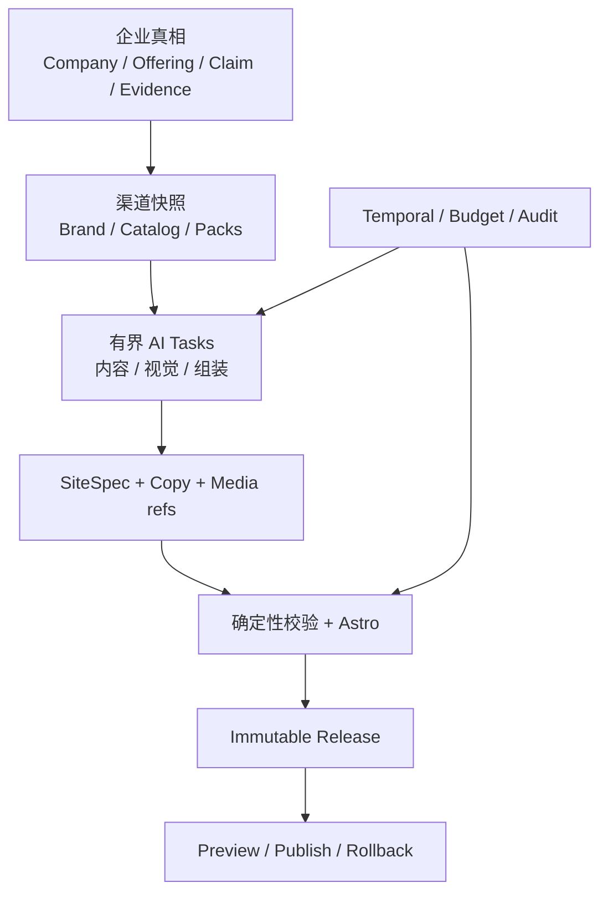

# Site Builder 架构设计 v1

> 配套 [01-prd.md](01-prd.md)。2026-07-13 起草；模型/素材库研究结论见 §6/§8（web 调研回填）。

## 0. 设计原则（五条）

1. **总控 = Temporal Workflow + 规划型 AI Task**，不做自由超级 agent。调度/重试/超时/预算/进度是确定性编排的活；智能只出现在有界任务节点。续用本仓 L0-L3 分层哲学（"AI Task = 有界任务契约"），获客侧已验证。
2. **SiteSpec 结构化产物 + 组件库渲染**（已拍板）：agent 产出结构化 JSON，确定性渲染器构建站点。同 SiteSpec 永远产出同站（可 diff、可回滚）；风格切换 = 换主题 token 秒级重渲染。v2 再开"自定义 section 代码生成"。
3. **两段式生成**：demo v0 秒出（确定性模板+注册信息+一次轻文案调用）；精装修异步分钟级。
4. **每个 agent = 有界 AI Task**：输入/输出 zod schema 严校验、失败重试带错误反馈、预算 reserve-settle、全链 trace。
5. **模型统一走 new-api 网关**（已拍板，付费开闸）：所有 agent 的文本/图像/视频调用集中网关记账，key 不散落。

> **补充架构原则（v3.2 §4.1 回写，与上五条并列的工程不变量）**：
> 6. **AI 只做开放性理解 / 生成 / 审美判断**；安全、结构、引用完整性、预算、发布与回滚一律由**确定性代码**决定，模型输出无权改这些。
> 7. **Agent 只交换版本化结构化工件**（schema 化 JSON），不做自由聊天、不产任意代码。
> 8. **SiteSpec 是渲染合同，不是事实数据库**——事实真相源是公共 `Company/Offering/Claim/Evidence`（§9），站点只保存**渠道投影 + 不可变 Release**。
> 9. **所有 AI/媒体任务可重试、取消、追踪、计费、降级、回放**（AiTask 基类内建，§4.4/§6）。
> 10. **Preview 与 Publish 用同一 Release 产物**，切换只动可见指针与域名，绝不二次构建（§4.6、§7）。

### 0.1 运行时硬约束（v3.2 §0.1 回写，护 D1/D13）

- **不让运行时 Agent 自由写 React/Astro/CSS 或任意组件**——只能从**已批准封闭组件库**（ADR-015，26 型为 v1 target）选择组合；当前产物是 SiteSpec，DesignBrief 属 DI-0/M1-e 目标。
- **不新增 planner Agent**——固定 DAG + 规则选择 + 现有 Temporal 编排是**唯一调度**（D13 / ADR-013）。
- **不把"再写一个更长的 prompt"当成设计方案**——设计智能靠开发期工厂沉淀的语料/组件/规则，不靠运行时长 prompt 即兴发挥。

### 0.2 两平面：开发期设计智能工厂 vs 生产期受控组装（v3.2 §0.2/§12 回写，target）

把 01 号"两主题预设 + 固定页面结构"升级为**两层**：

- **开发期平面**（Codex/开发 Agent 工作区，**非用户建站时运行**）：研究多源参考 → 临时分析压成 `DesignObservation` → 只把**聚合规则 / 许可代码 / 原创资产**提升为可运行语料 → 生成内部组件变体、构建 TemplateFamily → 跑合规/截图/性能/原创性评测 → **经 PR 发布版本化 DesignCatalog**。
- **生产期平面**：**当前 as-built 基底仅有** API / Temporal / AiTask / SiteSpec / Astro Renderer，Demo 仍由现有确定性 spec/模板路径生成，**尚无**运行时 DesignCatalog、TemplateFamily/Blueprint 选择或 DesignBrief 消费。**目标（DI-0 → M1-e）**才是按企业资料选择已批准 Family+Blueprint → 按素材/文案/事实证据受控组合 → 输出 DesignBrief/CopyBundle/SiteSpec/Findings。两阶段共同硬约束：不抓 Readdy（ADR-019）、不读原始参考页/模板源码、不生成任意前端代码（护 D1）。
- **两平面不可混合的四条理由**：① 设计研究需大量截图迭代，不适合 Demo 低延迟路径；② 来源许可有边界，不可在生产数据路径动态取用；③ 开发期靠**人工批准 PR**，生产期须**可重放/可计费/可降级**；④ 运行时自由设计会破坏 SiteSpec 白名单 / 缓存 / 可回归性。

> 开发期设计智能工厂的详设归 [13 号领域模型](13-design-domain-model.md)；[14 号](14-media-foundation-mf0.md)只承载媒体地基。本 02 的 as-built 只到上述 API/Temporal/AiTask/SiteSpec/Astro 基底；**两平面的版本化 `DesignCatalog` 单向接缝尚未实现**，属于 DI-0 契约 + M1-e 消费目标，不得被当前代码假定可用。v3.2 吸收 v2 合同并提出四层（设计合法复用抽象成内部资产 / 整站视觉语法+页面节奏+家族一致性 / Demo v0 10 秒也像有效海外站 / Codex 从 M1-c 起哪些立即改哪些延后）——施工状态以 09、13、14 号为准。

## 1. 模块与目录

```
apps/api/src/site-builder/
  intake/        # 注册引导接收、建站向导、店铺导入
  kb/            # 知识库：文档解析、切块、pgvector 向量化、检索
  assets/        # 素材：presigned 上传、处理管线状态机、多尺寸导出
  spec/          # SiteSpec zod schema + 校验器 + 主题 token 预设
  render/        # SiteSpec → Astro 构建（容器）→ 产物上传 → 预览
  agents/        # 各 AI Task（§5：8 张生产 agent，原卡 1 planner 已砍）
  temporal/      # siteBuilderWorkflow + activities
  preview/       # 预览签名 URL / 发布
  events/        # outbox: SiteDemoReady / SiteBuildProgress / SiteBuildFailed / InquiryReceived(M2)
```

复用现有：JWKS 鉴权、RLS 基建、Transactional Outbox、模型网关 client、SearXNG+Crawl4AI（品牌研究）、taxonomy 词表（行业级联）、预算 reserve-settle 思路（ToolBroker 同款）。

> **环境与安全边界（2026-07-17 Ubuntu as-built）**：R1-safety 已同时覆盖 Crawl4AI、robots 与平台 `http.get`。API 对每一跳做 global-unicast 校验并把连接钉扎到已验证 IP；Crawl4AI 保留 seed guard 与浏览器 pinning proxy。mihomo fake-IP 只有在系统答案全部位于 `198.18.0.0/15` 时才走固定 DoH 窄回退，broad `CRAWL4AI_ALLOW_INTERNAL_URLS` 已移除。公网抓取和 private/loopback/metadata/IPv4-mapped/redirect-to-metadata 真机矩阵均已验证；loopback 端口绑定只作附加防线。

新增基建：**MinIO**（compose，对象存储）、**Astro 构建容器**（渲染器）、网关新模型通道（§6）。

> **目标态新增/修改目录（v3.2 §25.2/§25.3 回写，target，随 M1-c~g 落地）**：
> - API 侧新增 `design/{catalog,resolver,rules,demo-visual-packs,design-lint,families/,blueprints/}`、`agents/{design-spec,aesthetic-review,model-profiles,model-policy.registry,model-capabilities,model-capability-probe,model-promotion.service}`、`media-gateway/`、`releases/`；修改 `demo-spec`/`task-routes`/`refurbish.workflow`/`site-builder.activities`/`schema.prisma`/迁移。
> - Renderer 侧新增 `components/variants/`、`lib/{design-catalog,design-tokens,picture}`、`fixtures/design/`、`tests/visual/`。
> - 🔴 **Renderer fail-closed（v3.2 §25.3，收敛 as-built）**：`Section.astro` 当前对未知组件**静默返回 null**（ADR-015 as-built，10 组件已注册）；目标改为**开发显错误块 + 测试/生产对未知组件 fail-closed**（不再静默）；`themes.ts` 从"两主题换皮"迁**版本化 StylePreset**；`spec.ts` 已迁共享契约（#117）删重复；locale 路由在 M1-e/M1-g 补完整验证（当前 `[...slug].astro` 只渲染默认 locale）。

## 2. 数据模型（Prisma 新表，全部 `workspace_id` + RLS policy）

| 表 | 关键字段 | 说明 |
|---|---|---|
| `site` | status(draft/building/ready/published), active_version_id, locales, style_preset | 每 workspace 可多站（先限 1） |
| `site_version` | spec(jsonb=SiteSpec), artifact_key, build_status, source_run_id | 版本化：回滚=切指针 |
| `site_build_run` | phase, progress, steps(jsonb 读模型), cost_summary, temporal_run_id, error | 一次精装修管线 |
| `site_build_step` | build_run_id, key, item_key, attempt, status, phase, progress, degraded, error_code | R3-B2 一等可恢复步骤真值（FORCE RLS） |
| `asset` | kind(logo/product_image/factory_image/cert/doc/video/generated), object_key, derived_keys(jsonb), processing_status, content_hash, meta | content_hash 幂等；EXIF 已剥离后落库 |
| `kb_document` / `kb_chunk` | source(intake/wizard/upload/storefront/web_research), embedding(pgvector) | 知识库 |
| `brand_profile` | value_props, tone, glossary, keywords, competitors, evidence(jsonb), version | Brand Brief 落库，版本化 |
| `inquiry`(M2) | form_data, source_page, status | 询盘回流（未来接获客管线） |

对象存储 key 约定：`ws/{workspace_id}/{site_id}/{kind}/{content_hash}.{ext}`；owner 凭证只在后端，外部一律短时 presigned URL。

> **Asset/KB 正确性状态机（v3.2 §26 R2-A 回写，target·failure-semantics）**：素材与知识库落库须做成**可重放正确性状态机**——内容寻址存储(CAS) + canonical copy + tombstone + Outbox + KB lease+retry + `assetId` 唯一 + profile patch schema 校验与并发合并。验收场景（全部须可重放且**绝不留指向已丢失对象的 ready 行**）：重复 commit、`P2002` 唯一冲突、对象删除失败、worker 崩溃、瞬时 embedding 失败、并发 patch。此为 §2/§12 素材与知识库表的**正确性合同**，非新表。

## 3. API 面（code-first OpenAPI，交 SaaS 前端）

```
POST /site-builder/intake                     # 注册引导提交 → 建档 + 【无条件】触发 demo v0（不论有无既有站）
GET  /site-builder/sites /sites/{id}          # 列表/详情（含预览 URL）
POST /sites/{id}/assets/presign               # 上传三步：presign → PUT 直传 → commit
POST /assets/{id}/commit                      # 触发素材处理管线
POST /sites/{id}/builds                       # 触发精装修（body: 风格/页面开关/语言/scope）
GET  /builds/{id}                             # 进度（阶段+百分比+步骤）
GET  /builds/{id}/events                      # SSE 实时进度（前端也可轮询）
POST /sites/{id}/regenerate                   # scope=site|page|section
PATCH /sites/{id}/spec                        # 人工文案/图片微调=直改 SiteSpec，免跑管线
GET  /sites/{id}/versions  POST /versions/{id}/rollback
POST /site-builder/import/storefront          # 店铺 URL 导入（M3）
POST /sites/{id}/publish                      # 发布（M2）
```

> **intake as-built（2026-07-16，#126）**：有/无旧站都无条件建 Demo；响应为 `{siteId,buildId,status:"generating_demo"}` 且不返回 `mode`。`Idempotency-Key` 以 `(workspace, endpoint, key)` 持久化，同键同请求重放首次结果、异请求返回稳定 409；Temporal 使用确定性 workflowId 与 execution-chain ACK 收敛启动不确定窗口。正式形状以 code-first OpenAPI 为准。

鉴权照旧：SaaS token → JWKS 验签 → workspace_id → RLS。全部接口 OpenAPI 注解，Scalar 门户可见。

## 4. 编排（siteBuilderWorkflow）

> Temporal 是**唯一**工作流编排器（ADR-013，无第二条 Agent 流程、无 Planner）。下分**两条构建通道**：Fast Demo（秒级、确定性）与 Refurbish（分钟级、异步精装修）。数据流：



### 4.1 Fast Demo 通道（P95 < 10s，v3.2 §4.2/§18.2 回写）

**当前 as-built**：`demoV0Workflow` 只编排一个 `generateDemoV0` activity；真实路径是 **读取 Site/intake → 使用站点 `stylePreset`（缺省时 `pickPreset` 在两套主题间确定性选择）→ 可选轻文案润色 → `buildDemoSpec` 生成 home/products/contact 三页 SiteSpec → 建 SiteVersion → Astro 构建 → 写 ready 预览**。当前没有 Archetype、Family/Blueprint、DesignBrief、DesignCatalog 或 DemoVisualPack。

**目标（DI-0 → M1-e）**才扩为 8 阶段快路径：**注册资料 → 规则识别 Archetype → Family/Blueprint 规则打分排序 → 安全 DemoVisualPack → 确定性 SiteSpec → 可选轻文案润色 → Astro 构建 → 快速 lint + 发布预览**。当前与目标共同硬约束：

- **关键路径不调视觉模型**：当前仅 `pickPreset` 关键词规则；目标 Family/Blueprint 也只用规则打分，不在 10s 预算内调多模态模型（保确定性）。
- **文案润色可取消、非依赖**：一次异步轻文案调用（deepseek-v4-flash）为锦上添花；硬超时即用模板默认文案，Demo 成功不依赖它。
- **只用注册明确事实**（ADR-017 禁虚构身份）；preview-only ≠ 可公开发布。
- **不跑**图片生成 / 视频 / 全页多模态 QA / 网络研究。
- **目标 DemoVisualPack 素材约束**：必须为平台原创、明确许可或程序化生成的**非事实性**素材；推荐三类来源=①平台自制抽象 SVG/网格/渐变/技术纹理；②明确可商用并本地化的图片；③后期由已批准图片模型生成的非事实性场景（不进 M1 Demo 必选路径）。
- **当前视觉能力边界**：`demo-spec.ts` 是 home/products/contact 三页确定性 Demo；`themes.ts` 仅两主题（颜色/系统字体/圆角/motionIntensity）=换皮而非完整设计语言。

### 4.2 Refurbish 精装修管线（异步，触发=用户补资料/选风格/点重新生成）

as-built：`refurbish.workflow.ts` 当前从 P1 直接进 `assembleAndBuild`，`site-builder.activities.ts` 里 `assemble` 仍调 `buildDemoSpec`、image/copy/quality 是**步骤位**——**设计升级落现有步骤位，不另建第二条工作流**。目标态六阶段产物与失败语义（v3.2 §4.2 回写）：

| 阶段 | 产物 | 失败语义 |
|---|---|---|
| P0 Prepare | BuildContext、预算、基准 Release、locks、ResolvedPackSnapshot | 阻断 |
| P1 Understand | BrandProjection、ClaimSnapshot、Gaps | 研究可降级；无可信事实走安全模板 |
| P2 Media+Copy | AssetVariant、MediaJob、CopyBundle | 可选素材/非默认 locale 可降级；必需项阻断 |
| P3 Design+Assemble | DesignBrief、DesignSpec、SiteSpec、BuildArtifact | 有限修复，仍失败**不切指针** |
| P4 Quality | QA/SEO/Aesthetic/Safety Report、FixPatch | 最多三轮；硬门不过不 publishable |
| P5 Release | SiteReleaseManifest、preview URL、Outbox | 原子提交；失败**保留旧 Release** |

原 ASCII 管线是同一意图的粗粒度视图：

```
P1 理解     资料解析入库向量化 ‖ brandProfileTask（全网研究）→ Brand Brief
P2 素材     并行 fan-out：imagePipeline(每图) ‖ copyTask(每语种) ‖ motionAssetTask ‖ videoTask(M3)
P3 组装     designSpecTask → siteAssemblyTask → SiteSpec 校验 → Astro 构建 → 预览部署
P4 质量环   ≤3 轮：qaTask ‖ seoTask ‖ aestheticReviewTask → findings → assemblyFixTask → 重构建
P5 发布     outbox: SiteReleaseCreated / SitePublished → SaaS 前端刷新预览
```

**阶段职责 I/O（v3.2 §19.1 回写，逻辑 agent → 产物）**：

| 阶段 | 输入 | 输出 | 设计相关变化 |
|---|---|---|---|
| P1 brandProfile | intake、资料、研究 | BrandProfile | 不改 |
| P2 imagePipeline | 用户资产 | 派生图片 + 能力摘要 | M1-c 纯 Sharp，不加设计模型（ADR-018） |
| P3 copy | BrandProfile + DesignBrief 内容预算 | CopyBundle | M1-d 增槽位长度 + 证据要求 |
| P3 designSpec | BrandProfile + Catalog + AssetCapabilitySummary | DesignBrief | M1-e 新增 Family/Blueprint/variant 决策 |
| P3 assembly | DesignBrief + CopyBundle + AssetManifest | SiteSpec | 只引批准组件 + 变体 |
| P4 quality | 构建产物 + 三断点截图 | Findings + Patch | M1-f 新增审美 + 通用感 |

### 4.3 增量构建（scope 语义，v3.2 §4.3 回写）

- `scope=site`：全站新快照；`scope=page`：仅重写目标页，但 **Release 仍是全站不可变快照**；`scope=section`：仅重写目标组件，保留 lock/人工编辑/未受影响引用。
- 素材变化由 **AssetUsage 反查**受影响组件；处理按 `content_hash` 幂等跳过。
- Claim 过期/撤销、Offering 更新、Asset 撤权**只创建 `SiteMaintenanceTask`，绝不静默改已发布页**。
- **每次 build 冻结** Pack/Catalog/Prompt/Schema/RoutePolicy/Renderer/ComponentLibrary 版本（可重放地基）。

### 4.4 失败语义与可恢复状态（v3.2 §4.4 回写）

`SiteBuildRun.steps JSON` 只做读模型；一等记录用 `SiteBuildStep(buildRunId,key,itemKey,attempt,status,progress,degraded,errorCode,costCents,artifactRefs,…)`，唯一键 `(buildRunId,key,itemKey,attempt)`。关键失败处理表：

| 场景 | 处理 |
|---|---|
| KB 摄入失败 | 沿用 ready 文档并 degraded |
| Brand 全路由失败 | 用上一版 BrandProjection；无上一版走安全模板 |
| 可选图片失败 | 原图优化 Variant 或占位（fail-safe，不阻断整站） |
| Logo/Hero 必需素材不可用 | 返回明确 gap 并阻断 |
| 非默认 locale 失败 | 本 Release 不含该 locale；**默认 locale 失败阻断** |
| 预算耗尽 | 停发新调用、结算已完成、状态 `resumable` + `SiteBuildFailed(reason=budget)`，绝不静默 |
| 取消 | 停新任务、执行不可取消补偿、**不改旧 Release** |
| 模型通道异常 | 按 registry fallback；**不能用无媒体能力的文本模型硬顶**媒体任务 |

- phase 级 Temporal 重试；**并发**：同 site 同时只允许一个 build run（Temporal workflow id = site id 派生，天然去重）。

### 4.5 DesignBrief 可重放/确定性（v3.2 §15.4 回写，target）

- `catalogVersion`/`familyVersion`/`variationSeed` 必须落入构建工件，**保证可重放**。
- 同一 `SiteBuildRun` 内 DesignBrief **不因重试随机漂移**。
- SiteSpec **只引用已批准**的 component+variant（ADR-014/015）。

### 4.6 不可变 Release 与原子发布（v3.2 §7.1 回写，引 ADR-013）

每次发布产出**不可变 Release**（内容寻址、可回放、可回滚），**异步失败绝不删除用户现有 Site**（ADR-013）。

- **对象前缀固定** `sites/{siteId}/releases/{releaseId}/...`，禁按 slug 覆盖历史目录。
- **ReleaseManifest 快照**冻结：SiteSpec + 各 locale CopyBundle hash、ClaimSnapshot/CatalogSnapshot、Asset/Variant hash+权利+来源、Pack/DesignCatalog/Family/variationSeed、component/renderer/prompt/schema/route policy/model snapshot、QA/SEO/Aesthetic/Safety/PublishReview 报告、artifact 清单 + digest。
- **原子指针**：DB 事务切 `previewReleaseId`/`publishedReleaseId` 同时写 Outbox；失败/取消/未过硬门**都不改当前指针**；回滚=切**完整 Release**，非只切 SiteSpec JSON。
- **Preview 与 Publish 同一 artifact**，禁二次构建导致漂移（详见 §7 域名/证书/tombstone）。
- **公共 Outbox 事件（不建第二消息系统，v3.2 §3.6）**：`SiteIntakeCompleted` / `SiteDemoReady` / `SiteDemoFailed` / `SiteBuildStarted` / `SiteBuildStepChanged` / `SiteBuildCompleted` / `AssetProcessed` / `MediaJobCompleted` / `SiteReleaseCreated` / `SitePublished` / `SiteRolledBack` / `InquirySubmitted` / `SiteMaintenanceRequired`。

## 5. Agent 架构卡（原 9 卡；卡 1「规划 planner」已按 D13 砍 → 职责拆入「编排/增量规划」确定性零模型 + designSpec，余 8 张生产 agent）

统一契约：`输入 schema → prompt（用户资料只进模板变量，防注入）→ 网关调用 → 输出 zod 校验（不过=带错误重试 ≤2）→ trace + 成本落 run`。每个 AiTask 须声明：`taskId`/owner/input+output schema version/prompt version/rubric version、`modelProfile`/allowed capabilities+tools/timeout/maxTokens/maxCost、fallback+degrade policy/deterministic post-checks/PII+data-region policy（v3.2 §5.3）。

### 5.1 四逻辑 Agent（设计视图）↔ 7 物理 AiTask（as-built）映射（v3.2 §5.1/§1.6 回写）

as-built 已落地 **7 个 task id**（`task-routes.ts`：`brand_profile / copy / design_spec / assemble / assembly_fix / qa_summarize / seo_review`）。下表**不做命名重构**，只在文档/owner/trace 上把它们（含 M1 目标新增 task）归成**四个逻辑 Agent**，明确责任与禁止边界：

| 逻辑 Agent | AiTask（含目标 *） | 责任 | 禁止 |
|---|---|---|---|
| Brand & Evidence | `brand_profile`、claim_projection* | 品牌、术语、引用、gaps | 不批准 Claim；不输出具名个人 |
| Content & SEO | `copy`、localize*、`seo_review` | 多语言文案、FAQ、metadata、Schema 文本 | 只消费允许公开的 ClaimSnapshot |
| Visual Media Director | image_select/qc/edit*、video_storyboard/qc*、aesthetic_review* | 媒体用途、编辑 brief、多模态质检 | 不改原件；证书/人像/Logo 禁生成式改造 |
| Site Composer & Fixer | `design_spec`、`assemble`、`assembly_fix` | Archetype/Family、组件、SiteSpec、受限 JSON Patch | 不生成代码；不绕过白名单 |

（* = M1-d/e/f 目标 task，尚未落地；下方 §5.2 的 8 卡是**能力设计视图**，与 7 as-built task 非一一对应——planner 卡已按 D13 砍。）

**确定性服务不是 Agent（v3.2 §5.2）**：Workflow Orchestrator、Budget Guard、SiteSpec Validator、Asset Processor、Safety/License Gate、A11y/Performance Scanner、Release Manager、Publisher/Domain Manager、Analytics/Event Collector 均为**确定性服务**——无人格、无模型自由度、无自主规划权。

**不设 Planner，保留审核三角（v3.2 §5.4 / D13 / ADR-013）**：固定建站由 DAG+scope+规则选择；M2 自由语言改站只增 `edit_intent` → 受限 PatchPlan，不获任意编排/代码生成权。QA/SEO/Aesthetic 是三个独立视角，生成者不得给自己打最终分；修复者只消费冻结 finding，输出 allowlist JSON Patch，每轮硬门须单调改善，最多三轮。

### 5.2 能力设计视图（8 卡；模型列见 §6 四态路由，非终选）

| # | Agent | 职责 | 输入 → 输出 | 模型（首选） | 工具/护栏 |
|---|---|---|---|---|---|
| ~~1~~ | ~~规划 planner~~ ❌**已砍 (D13)** | **职责已拆分（非删除）**：编排/预算/增量范围 → 「编排/增量规划」确定性零模型（§6·§11 D13）；"该有哪些页/每页什么结构"的设计智能 → 卡 6 designSpec（未砍）；用户自由意图改站 → M2 预留 | — | 无（确定性零模型） | 固定 DAG + 规则判定 |
| 2 | 品牌定位 brandProfile | 资料理解+全网研究 → Brand Brief | KB+店铺/官网/社媒抓取+同行参考 → 价值主张/tone/术语表/关键词/差异点 | `structured.default` | SearXNG+Crawl4AI（已有）；**事实红线：认证/产能/年限等必须带出处，缺=留空提示用户补，绝不虚构（ADR-017）** |
| 3 | 图片管线 imagePipeline | 产品/工厂图生成安全可发布的响应式派生件 | 原图 → 多尺寸 webp/avif + fallback | **M1-c 确定性零模型（纯 Sharp）** | 目标固定序：MIME/像素/解码炸弹检查→方向与 sRGB→重编码去 EXIF/GPS→质量门→安全裁切/focal point→多尺寸导出→`AssetVariant`；原图不可变、单图失败隔离。rembg、超分、生成式背景重绘、视觉质检与 pHash/embedding 主体校验均属 M1-c2/M3 后置能力，出现真实消费者、同意与 provider 门后另行落地（ADR-018） |
| 4 | 文案 copy | 每语种全站文案 | Brand Brief+页面结构+KB → locale×section 文案（含 SEO title/desc） | `copy.premium` | 术语表一致；每语种原生生成非机翻腔；禁绝对化宣称；目标市场文化禁忌 checklist |
| 5 | 动效/视频 motion/video | v1 动效参数（Ken Burns/视差=确定性零模型）；M3 图生视频（工厂环境/产品展示 5-10s） | 图片 → 动效参数 / 视频 asset | M1=`deterministic`；M3=`video.primary` | 每站视频条数配额；视频失败自动降级动效 |
| 6 | 审美 designSpec + aestheticReview | 生成期：DesignSpec（主题 token 选择/板块布局/图文节奏）；评审期：看整站截图挑毛病 | Brand Brief+模板 → DesignSpec；截图 → findings | 生成=`structured.default`；评审=`multimodal.review` | Playwright 全页截图（3 断点）；评分 rubric（层次/一致性/留白/对比度/CTA 显著度），≥85 过 |
| 7 | 组装 siteAssembly + assemblyFix | 产出/修补 SiteSpec | DesignSpec+文案+素材清单 → SiteSpec；findings → SiteSpec patch | 普通=`structured.default`；复杂升级=`reasoning.high` | 输出必过 zod schema+素材引用存在性+内链有效性（确定性校验器），不过=带错误重试 |
| 8 | 审核 qa | 功能/性能体检 | 构建产物 → findings | `text.summary` / `multimodal.review`（只做汇总/审美 finding） | **主体是确定性工具**：Playwright 遍历（链接/表单/响应式 3 断点/console error）+ Lighthouse（性能/a11y/SEO 基线分） |
| 9 | SEO seo | 技术 SEO+关键词落位 | 构建产物+Brand Brief → findings+patch 建议 | `text.summary` | 确定性检查：meta/OG/schema.org(Organization+Product)/sitemap/robots/**hreflang 多语言**/图 alt；关键词→页面映射 |

> 评审三人组（8/9/6 评审面）= GAN 式生成-评审循环（生成者改，评审者挑），有界 ≤3 轮防死循环；单维不过阈值出 findings，全过或轮数用尽即出环。
>
> ⚠️ 上表"模型（首选）"列为初稿；**以 §6 四态路由为准**（ADR-016：currentRoute 现役 as-built，候选只经评测晋级，非终选/非采购承诺）。
>
> **方法论内化说明**（用户确认的路线）：生产 agent 跑在本后端，Codex 与已安装的 ECC/Superpowers skills 是**开发期知识源**——各 agent 的 prompt/rubric 从对应 skills 方法论提炼固化（SEO rubric ← SEO 审计清单；审美 rubric ← frontend-design-direction/design-system；动效预设 ← motion-* 系列；质量环 ← GAN harness 模式；a11y ← WCAG 清单）。工具能力以**库内化**为先（M1 先落 Playwright/Lighthouse/Sharp；rembg 等只有真实消费者出现后才评估），MCP 只作确需外部服务时的传输选项（续 ADR「MCP=传输非授权」）。

## 6. 模型路由（currentRoute 与 ADR-020 目标组合分层）

> **代码事实优先**：`task-routes.ts` 的 7 个文本 task 是 `currentRoute`；下方 ADR-020 表是用户批准的质量优先 `targetCandidate`，不是已切换的 `promotedRoute`。本轮选择不以官网价格为主约束，而以任务效果、模型特性、结构化稳定性、多语言质量、多模态能力和安全边界为主；但 promotion 仍须 ADR-016 的真实 endpoint capability probe、Golden Set、shadow/canary 和可回滚证据。外部依据与历史实测见 [10-model-selection-study.md](10-model-selection-study.md)。

**currentRoute（as-built，不变）**：

| task | primary | fallback |
|---|---|---|
| `brand_profile` | `deepseek-v4-pro` | `glm-5.2` |
| `copy` | `deepseek-v4-pro` | `glm-5.2` → `doubao-seed-2.0-pro` |
| `design_spec` | `minimax-m3` | `doubao-seed-2.0-pro` |
| `assemble` / `assembly_fix` | `glm-5.2` | `deepseek-v4-pro` |
| `qa_summarize` / `seo_review` | `deepseek-v4-flash` | `doubao-seed-2.0-lite` |

**ADR-020 质量优先目标组合（approved targetCandidate）**：

| 任务 | 目标主模型 | 唯一模型回退 / 降级 | 不可绕过的规则 |
|---|---|---|---|
| 品牌研究归纳、FactSheet、BrandProfile、Claim Gap | `gpt-5.6-terra` | `claude-sonnet-5` | 搜索/抓取由确定性服务完成；模型只处理 R4 冻结证据 |
| 海外英文/德文文案、产品页、品牌叙事、本地化 | `claude-sonnet-5` | `gpt-5.6-terra` | 只引用 APPROVED ClaimSnapshot；术语/长度/事实后校验 |
| DesignBrief、Family/Blueprint/组件变体选择 | `gpt-5.6-terra` | `claude-sonnet-5` | 只从封闭 DesignCatalog 选择，不生成前端代码 |
| SiteSpec 首次组装与普通修复 | `gpt-5.6-terra` | `claude-sonnet-5` | Structured Output + schema/引用/兼容矩阵/Astro 八门 |
| 连续两次失败后的高难 SiteSpec 修复 | `gpt-5.6-sol` | 确定性安全 Blueprint | Sol 只作显式 escalation，不进入普通 fallback 链 |
| 三断点截图审美、图片/后续视频 QA | `gemini-3.5-flash` | `gpt-5.6-terra` | 只输出 Finding；不能直接任意重写页面 |
| QA/SEO 摘要、标签、内部分类、可选 Demo 润色 | `gemini-3.5-flash` | `gpt-5.6-terra` | 硬门继续由代码执行；Demo 无模型仍必须成功 |
| 企业 KB 向量 | `bge-m3` 自托管 | 无 | 经 new-api `/v1/embeddings`；维持 1024 维/版本，不出域 |

**图片与视频目标路由（不进入 M1-c；由真实媒体消费者触发）**：

| 任务 | 目标主模型 | 回退 | 安全边界 |
|---|---|---|---|
| 批量非事实 Hero、抽象背景、通用工业场景 | `gemini-3.1-flash-image` | `doubao-seedream-5.0-lite` | 禁伪造工厂、客户、认证、项目现场 |
| 高价值首页 Hero、品牌主视觉、复杂营销合成 | `gemini-3-pro-image` | `gpt-image-2` | 高价值小批量；文字/OCR 与权利门必过 |
| 产品主体敏感的背景替换、mask 外编辑 | `gpt-image-2` | 原图 Sharp Variant | mask 内产品锁定；Logo/标签/颜色/接口/孔位/轮廓任一变化即拒绝 |
| OG 图、带文字营销横幅 | `gpt-image-2` | 确定性 HTML/SVG | 事实文字仍来自批准 Claim |
| 产品几何、证书/报告、人物身份图片 | **禁生成式编辑** | 原图 | 永久 fail-closed |
| M3 5–10 秒图生视频 | `seedance-2.0` | 确定性动效/静态图 | 不进 Demo；主体/时序/权利 QA 后才能发布 |

`gemini-omni-flash-preview` 与 `veo-3.1-generate-preview` 只保留为评测候选：Preview 不作唯一生产依赖；Omni 当前没有不可替代职责，截图/媒体 QA 由稳定的 `gemini-3.5-flash` 承担。更换上述 target portfolio 必须新增 ADR，不能通过改一张表静默换型。

**2026-07-17 本机网关事实**：通用应用令牌 `/v1/models` 返回 39 个可调用型号，目标组合中 `gpt-5.6-terra`、`gpt-5.6-sol`、`claude-sonnet-5`、`gemini-3.5-flash`、`gpt-image-2` 已可见；BGE 不再暴露公共名，而只暴露私有别名 `site-builder-bge-m3-local`。`gemini-3.1-flash-image`、`gemini-3-pro-image`、`gemini-omni-flash-preview` 不可见。BGE 专用令牌的 `/v1/models` 只返回该一个别名，真实 `/v1/embeddings` 两条输入返回两组 1024 维有限向量。**型号可见/单次连通不等于 task promotion**；图片编辑、视觉输入、Structured Output、长任务和 provider 失败语义仍分别真探。`MODEL_DEFAULT_MODEL=deepseek-v4-flash` 只服务未显式传 model 的 legacy/general 调用，不是 Site Builder 主模型，也不覆盖本节 per-task 路由；在未显式化并评测那些旧调用前不得借 ADR-020 顺手修改它。

**BGE new-api 配置合同（PR #140 目标；合并前不是 main as-built）**：幂等引导命令 `pnpm --filter @global/api new-api:ensure-embeddings -- --write-env` 创建唯一 OpenAI-compatible channel：base URL=`http://embeddings:11434`（Compose 内网），对应用只声明 `site-builder-bge-m3-local`，并以 model mapping 映射到 Ollama `bge-m3`；同时创建只允许该别名、禁跨 group retry 的专用令牌并真验 1024 维。网关路径的模型别名固定、`EMBEDDINGS_API_KEY` 必填，禁止复用 `MODEL_GATEWAY_KEY` 或用 env 改投公共模型；只有精确 allowlist 的 `localhost/127.0.0.1/[::1]/embeddings:11434/v1` break-glass 可无 token 使用上游名 `bge-m3`。当前网关 channel/专用令牌已经就绪，但 **current main 的 EmbeddingsClient 仍直连 `:11434` 且不发 Bearer**；只有 #140 合并并执行 env 切换后，应用经 new-api 才成为 as-built。回滚把应用 `EMBEDDINGS_URL` 指回上述受控本机上游即可，维持同一模型/维度/version，不改数据库向量；定位完成后重新运行引导命令恢复统一网关。

🔴 全模型共用硬门：`finish_reason=length`、空 content、schema/capability 不符均显式失败；原始输出先过 schema→事实→引用→安全门；记录 policy/model snapshot、fallback、prompt/schema/rubric、token/latency/cost 与回滚原因。BGE 的 new-api 生产 channel 必须使用固定私有别名、专用模型受限 key、唯一本机/Compose 上游和幂等 inventory/readiness 检查，任一远端同别名或额外令牌模型都失败关闭；统一网关不改变“企业 KB 不出域”红线。new-api 视频中转若能力探针失败，不允许绕统一网关静默直连；任何例外须新 ADR、集中凭证与同等审计。

## 7. 权限与安全

- **RLS**：§2 全部新表 workspace policy；worker 写走 `withWorkspace`；本功能无跨租户扫描场景（比获客侧更简单——没有平台级 ownerDb 路径）。
- **对象存储**：key 前缀隔离 + 短时 presigned URL（上传/下载都是）；禁公共桶；构建产物同样按 workspace 前缀。
- **预览（D7 已拍板：独立预览域名）**：每站一个子域 `{slug}.preview.<平台域>`——泛域名 DNS（`*.preview.<平台域>`）+ 泛证书；**预览服务**按 Host 头映射 slug→site_version 从对象存储回源静态产物。未发布 = 随机不可枚举 slug + `noindex` + 可选访问门（带 token 的链接）；发布才公开/绑正式域名。预览域与 SaaS 主域天然隔离（防 cookie 泄漏）；CSP `frame-ancestors` 白名单 SaaS 主域，前端可 iframe 嵌入工作台。
- **上传安全**：MIME 白名单、大小上限、图片一律重编码（剥 EXIF 定位隐私 + 消 payload）、文档解析在受限容器。
- **Prompt 注入**：用户上传资料/抓取内容一律当**数据**（模板变量注入），不进 system prompt；agent 输出过 schema 校验天然限制注入外溢。
- **成本**：ModelBroker 每 workspace reserve-settle + 日/月配额 + 单 build 上限；全链 trace（复用 ToolBroker 模式）。
- **内容合规**：生成文案禁虚构事实字段（§5 卡 2 红线）；广告宣称约束；用户对上传素材权属自担（ToS 条款，提请 SaaS 侧加）。

## 8. 素材与版权基线（2026-07-14 调研结论）

- **readdy.ai 结论（ADR-019 现行边界）**：它支持导出代码/Figma（付费档）并有页面级 REST API，但**没有可供第三方产品调用的"素材库"开放接口**，其模板/素材授权也不随导出转移到我们客户的商用站点——直接联动其素材库不可行。默认仅作 `visual_research_only`：开发期可少量、临时观察并抽象跨来源设计规律，**不导出/复用源码、文案或素材**；只有取得覆盖 AI 建站产品、衍生组件和商业分发的书面授权，并完整登记授权证据、范围、期限、地域、撤回与再分发权后，才可登记为 `owned_export_authorized`，在授权边界内走一次性导出改造工序；缺任一项 fail-closed。生产素材走下方开放授权生态。
- **开放素材生态（均免费，可商用；注意点如下）**：
  - **Unsplash**：免费，Unsplash License 商用无需署名；API 免费（production 档需申请、有速率限制）；Unsplash+ 付费专区不可用；禁原样转售。
  - **Pexels**：免费，Pexels License 商用无需署名；API 免费有速率限制。
  - **Iconify**：框架 MIT；聚合图标集绝大多数 MIT/Apache/ISC/OFL——实现时按许可**白名单过滤**（排除或自动署名 CC BY 集）。
  - **Google Fonts**：OFL 开源、免费商用；🔴 **必须自托管**——德国法院已有判例：网页远程加载 Google Fonts 向 Google 泄露访客 IP 违反 GDPR。
  - **LottieFiles**：平台素材授权混杂（Simple License/订阅内容），**v1 不依赖**——动效走自建 motion token 预设，Lottie 后期按单个素材核授权再用。
- **图库使用原则**：真实工厂/产品图永远优先（B2B 信任的核心），图库图只补氛围位；AI 生成图按目标市场透明度要求处理（欧盟 AI Act 披露义务跟踪）。
- 组件库基底：Astro + Tailwind；section 组件 v1 约 15~20 种（hero/产品网格/工厂实力/认证墙/数字带/时间线/案例/FAQ/CTA/询盘表单/页脚…），每种 2~3 布局变体 × 动效预设。

## 9. 与获客后端的闭环（未来）

### 9.0 复用现有公共对象（不复制，v3.2 §9.1/§9.3 回写）

独立站**消费**仓库已有公共对象、不复制：`CompanyProfile`、`Offering`、`KnowledgeSource`、`Claim`/`Evidence`/`KnowledgeConflict`、`AiTrace`、`UsageLedger`、`OutboxEvent`。

- Site 关联 `companyProfileId`（旧行 additive 回填后再改必填）；`BrandProfile` 是站点**渠道投影**，存 tone/valueProps/glossary/keywords/differentiators/claimRefs/gaps/research summary + 生成版本。
- 公共 `Company/Offering/Claim/Evidence` 是**事实真相源**；文案只消费 evidence gate 过的 `PublishableClaimSnapshot`（认证/数字/客户案例/性能结论须 APPROVED）——ADR-017 禁虚构身份的存储侧对应。
- 构建开始解析 **`ResolvedPackSnapshot`**（IndustryPack 术语+证据要求+推荐组件 / MarketPack locale+法务+单位+SEO+consent / GrowthMotionPack CTA+询盘字段+实验），本 run **不读变化中的 latest**；Pack 更新只建维护建议或新 build，不改旧 Release（§4.3/§4.6 冻结语义）。

### 9.1 增长闭环回流

- 询盘表单 → `inquiry` → outbox 事件 →（恢复获客开发后）线索进获客管线评分。
- `brand_profile`/公司事实反哺获客 ICP 配置。
- 站点分析（流量/询盘转化）作为 intent 信号回流。

## 10. 决策记录（本轮拍板）

> 站建承重决策已收口为 **ADR-013~020**（`docs/adr/registry.md`，唯一决策真值：SCOPE/SiteSpec/封闭组件库/模型档路由/禁虚构身份/媒体地基/Readdy 参考/质量优先目标模型组合）；下表 D1-D17 为此前拍板原文，与 ADR 的对应见各 ADR「出处」列。

| # | 决策 | 结论 |
|---|---|---|
| D1 | SiteSpec+组件库 vs 自由写码 | SiteSpec+组件库（用户同意推荐） |
| D2 | 视频方案 | 付费开闸：Seedance（火山）；动效保底降级 |
| D3 | 模型接入 | 全部统一走 new-api 网关 |
| D4 | 生产 agent 运行时 | 自建有界 AI Task（L2 续用），不引入 Claude Agent SDK——网关是 OpenAI 兼容协议，SDK 绑 Anthropic 协议且自主漫游不可控；详见对话记录 |
| D5 | 站点诊断 | 「独立站管理」二级栏目（**非注册分支**，修订④）；已有站用户 SEO 体检，后置 M3+ |
| D6 | 多租户隔离 | RLS + 对象存储前缀 + 签名 URL（§7） |
| D7 | 预览方式 | **独立预览域名** `{slug}.preview.<平台域>`（泛解析+泛证书+Host 回源，§7）；需与 SaaS 侧对齐平台域与 DNS/证书运维归属 |
| D8 | 模型选型原则 | 按 agent 能力需求全市场选型；**2026-07-14 现役档定档**（§6 表=currentRoute as-built：实测评比+用户三轮拍板，依据见 10 号文档；ADR-016 四态路由，候选经评测晋级非终选）；视频=火山 **Seedance 2.0**（需 Large 档，用户将升档） |
| D9 | readdy 定位 | **已由 ADR-019 取代（2026-07-16）**：默认 `visual_research_only`，仅允许开发期少量、临时、多来源净室观察，持久化抽象 `DesignObservation/DesignRule`；**未经覆盖 AI 建站产品、衍生组件和商业分发的书面授权，且未完整登记证据、范围、期限、地域、撤回与再分发权，不得导出或改造 React/Figma**。全部满足后才可登记为 `owned_export_authorized`，按授权边界走一次性改造工序；缺任一项 fail-closed，运行时零依赖、禁止逆向，生产素材仍走开放授权生态（§8）。 |
| D10 | 发布部署 | **海外服务器**（免 ICP 备案）；静态托管=对象存储+CDN 优先（非 VPS）；预览国内友好线路/发布海外 CDN 双链路 |
| D11 | SiteSpec 数据形状 | 对标 **Puck**（MIT 可视化编辑器）兼容形状，渲染器自写 Astro（修订②，用户确认） |
| D12 | 模板策略 | Astro MIT 主题**改造+补缺**为基底，不从零画（修订③，用户确认）；**组件库 v1 扩容 17→26 型**（2026-07-14 用户拍板，readdy demo 缺口实证见 11 号文档：9 个小难度缺口并入 M1-e，中难度 3 个 v1.5，沉浸叙事类不进封闭库） |
| D13 | v1 编排 | **无 planner agent**：固定 DAG + 规则判定增量范围；M2+ 真需要再评估（修订①，用户确认） |
| D14 | 知识库与 embedding | **pgvector + BGE-M3 自托管**（沿 v3.0 D1 既定规格 vector(1024)/HNSW）+ **Docling** 文档解析（详见 §12）；模型从 day1 自托管，经 new-api 统一鉴权/审计传输（换模型才需全量重嵌，单纯换传输不需） |
| D15 | 富文本 | v1 即开（用户拍板）：受限 ProseMirror JSON、不存 HTML（04 §5） |
| D16 | 交互地图 | Google Maps **Embed API**（免费无限量）+ 两步加载 GDPR 方案；Geocoding 建站期一次缓存（04 §10 申请清单） |
| D17 | 注册去分支 + 引导式 onboarding | **修订④（2026-07-14 用户确认）**：注册「有无海外独立站」**只作背景知识、不分叉栏目**；后台统一一级「独立站管理」下挂**独立站建设 + 站点诊断**两个二级栏目；注册即**无条件**生成 demo（不论有无既有站）；进后台的引导（消息卡片→跳转预览→引导填向导）**流程与状态全在前端**（本仓不管），后端只提供**已有的预览链接**（`previewUrl`）供卡片跳转、**不为引导新增编排/状态端点** |

## 12. 知识库详设（2026-07-14 补，02 §2 kb 表的实现规格）

- **解析**：**Docling**（MIT，IBM）——Word/Excel/PPT/PDF/HTML/图片全格式，复杂表格抽取 97.9% 准度、开源基准第一（0.877）；外贸资料主流是 Word/Excel 产品表，正中其强项。中文复杂版式画册（扫描版 PDF）备选 **MinerU**（上海 AI Lab，CJK 最强 0.831），v1 不引入（KISS）。
- **切块**：结构感知——按标题层级切、表格整块保留（Docling 输出天然带文档树）；产品 SKU 表逐行成 chunk 并带表头上下文。
- **Embedding**：**BGE-M3 自托管**（MIT、1024 维、100+ 语言含中文），Ollama 容器作 new-api 的本机上游——沿 v3.0 D1 既定，**不接远端/付费 embedding 模型**。应用统一调用 new-api `/v1/embeddings` 只改变鉴权、路由与审计传输，不改变数据出域、模型、维度或向量空间。理由：公司资料敏感、KB 吞吐大，且与获客侧 `entity_embedding` **同一向量空间**。
- **存储**：`kb_chunk.embedding vector(1024)` + HNSW（halfvec cosine）+ workspace RLS；行上记 `embed_model`/`embed_version`（换模型=按版本重嵌，不混空间）。
- **检索**：向量 + 关键词（tsvector）混合召回，agent 侧按任务取 top-k 拼 kbDigest。
- **注意**：批量上传高峰的嵌入排队走 Temporal activity 限速，不阻塞交互路径。
- **分租户护栏**（2026-07-14 用户确认）：①每 workspace 存储配额（文档数/总体积上限，防单租户塞爆）；②删除链路：用户删资料 → chunk/向量级联删除；workspace 注销 → 整库可证删除（复用获客侧 Art.17 擦除编排先例）。模型共享、数据隔离：BGE-M3 是平台统一工具，各租户向量存各自 RLS 隔离行，检索只命中本 workspace。
- **分租户护栏（2026-07-14 用户确认）**：①每 workspace 存储配额（文档数/总体积上限，防单租户塞爆）；②删除链路：删资料 → chunk/向量级联删除；用户注销 → 整 workspace 知识库可证删除（复用获客侧 Art.17 擦除编排先例）。
- **Embedding 策略定案（用户确认）**：**第一天即 BGE-M3 自托管**，不走"先付费 API 后切换"——换 embedding 模型=全库重嵌+改列维度，切换成本才是大头；扩容路径=同模型加 GPU/副本（零重嵌）。生成类模型才是付费 API 起步，两条曲线策略相反。

## 11. 补充能力清单（2026-07-14 主动补全，纳入各里程碑）

1. **站点分析**：自托管 Plausible/Umami（免 cookie banner、GDPR 友好）——访问/询盘漏斗数据回流平台（M2）。
2. **隐私合规页**：Privacy Policy/Cookie 政策页按目标市场模板自动生成；询盘表单 GDPR 同意勾选（M1 组件库内置）。
3. **RTL 支持**：目标市场含中东（阿语/希伯来语）时组件库需 `dir=rtl` 变体——**v1 组件库设计期就要定**，后补成本高。
4. **无障碍**：欧盟 EAA（2025 生效）合规压力真实存在；审核 agent a11y 检查按 WCAG 2.2 AA 基线（M2）。
5. **表单反垃圾**：蜜罐字段 + Cloudflare Turnstile（免费、较 reCAPTCHA GDPR 友好）（M2）。
6. **询盘通知邮件**：发信域 SPF/DKIM/DMARC（M2）。
7. **发布 CDN**：发布站挂 CDN（Cloudflare 免费档起步）+ 图片按需变换（M2+）。
8. **质量评测基线（eval harness）**：golden set（N 家真实企业脱敏资料）+ rubric 自动打分回归——每次改 prompt/换模型跑回归防退化；**AI 产品工程化的关键一环**（M1 起建）。
9. **模板冷启动**：开发期由 Codex 使用生成/评审分离的 GAN 设计循环方法批量产行业模板，再经人工终审——模板质量决定 demo v0 第一印象（M0 的核心工作量）。
10. **内容安全审核**：用户上传图+生成文案过安全审核后才上站（M1）。
11. **SiteSpec 版本化**：`specVersion` 字段+迁移器，保老站向后兼容（M0 起）。
12. **观测**：build 成功率/时长/单站成本 dashboard（M1）。
13. **多站点预留**：schema 1:N（workspace→sites），v1 UI 限 1 站。
