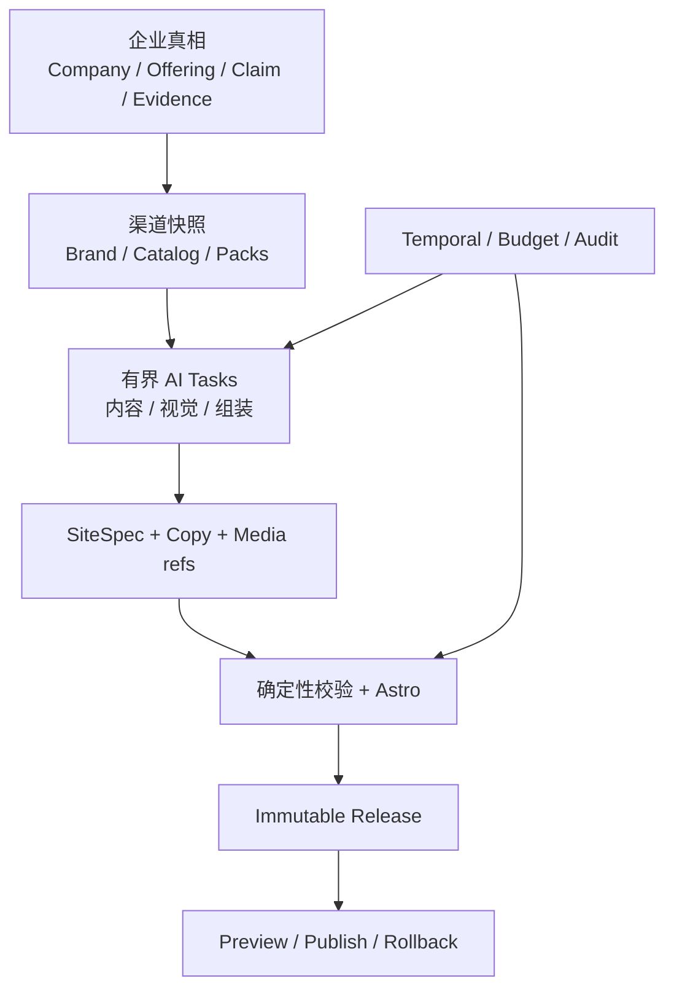

# 12 · 海外独立站完整设计基线、模型策略与迁移施工图

> ⚠️ **SUPERSEDED（2026-07-16）**——本文（v3.1）被 v3.2 取代，v3.2 又已归档、内容分发进活文档 00-14 + ADR-013~019。本文仅存历史迭代痕迹，**不作任何施工依据**。见 [v3.2 归档说明](12-site-builder-design-intelligence-and-cc-implementation-v3.2.md) 与 00-14 权威真值。
> 本文中的“CC / Claude”是当时开发主体称谓，保留仅为 provenance；当前开发主体与规则入口是 Codex + [../../AGENTS.md](../../AGENTS.md)，不得从本文恢复旧工作流或旧路径。

> 版本：v3.1（v2 完整合并与模型重选版）  
> 日期：2026-07-15  
> 文档定位：统筹 01–11、v2 与补充记忆文档的独立可执行基线；CC 不需要在多份 12 号文档之间猜结论  
> 仓库基线：mlhjyx/global-backend main @ 9dc84f27598c5e1f34672790c1651935f0ae8a96  
> 当前进度判断：M0、M1-a、M1-b 已进入 main；M1-c 尚未进入 main  
> 核心目标：不用外部设计师，建立一套由 Agent 驱动、可审计、可回归、可持续进化的海外独立站系统；同时解决 Demo 效果、事实可信、媒体生产、模型治理、发布回滚和既有代码迁移问题。

---

## 0. 给 CC 的一页结论

### 0.1 现在不要做什么

1. 不整段推倒 M0、M1-a、M1-b，但已发现的问题必须定点修复；“已合并”不等于“不可改”。
2. 不把生成式图片或设计 Agent 塞进 M1-c 的处理算法 PR；但 M1-c 合并前必须有 additive 的 AssetVariant / MediaJob / AssetUsage 媒体合同，避免 M1-e 和 M3 再改一次数据层。
3. 不把 Readdy 源码、产物或素材直接塞进运行时模板库。
4. 不让运行时 Agent 自由写 React、Astro、CSS 或任意组件。
5. 不在 Demo v0 的 10 秒关键路径里运行视觉模型、全页截图审美循环或视频生成。
6. 不新增 planner Agent；固定 DAG、规则选择和现有 Temporal 编排继续作为唯一调度。
7. 不把“再写一个更长的 prompt”当成设计方案。
8. 不把当前已接通的 DeepSeek / GLM / MiniMax / Seedream 路由写成永久“终选”；它们是 currentRoute，目标模型由 ModelProfile、评测晋级和回滚策略管理。

### 0.2 需要新增的核心

把当前“两个主题预设 + 固定页面结构”升级为两层系统：

- **开发期设计智能工厂**：Agent 研究 Readdy 等优秀海外站的抽象设计语言，产出 DesignDNA、TemplateFamily、Blueprint、组件变体和质量基线；所有产物经授权、原创性、可访问性、性能和截图评测后才进入仓库。
- **生产期受控组装**：运行时 Agent 只能从已批准的设计目录中选择和组合，输出 DesignBrief 与 SiteSpec，不生成任意代码。

质量闭环落在三个位置：

| 环节 | 当前痛点 | 本文方案 |
|---|---|---|
| Demo v0 | 三页固定结构、无素材、仅两种主题，所以“能跑但不好看” | TemplateFamily 排序 + Blueprint + 安全 DemoVisualPack；全程确定性，保持 P95 小于 10 秒 |
| M1-e | 有组件但没有整站设计语法，容易组件拼盘 | DesignDNA + TemplateFamily + 兼容矩阵 + 内容预算 + 26 组件变体 |
| M1-f | 只检查能否运行，无法识别模板感、空洞感、节奏差 | 三断点截图 + 确定性检查 + 审美评审 + 通用感检测 + 最多三轮结构化修补 |

### 0.3 施工顺序

先修会污染 M1-c 或后续结果的旧阶段问题，再继续功能 PR：

1. DQ-0：先合本文、文档权威性、设计来源治理和 Readdy 使用边界。
2. R0：产品口径、Demo 事实安全和隐私修复。
3. R1：预览产物原子发布、版本并发和构建沙箱修复。
4. R2：Asset / KB 状态机、幂等和对象存储一致性修复。
5. MF-0：additive 媒体基础表、RLS、双写适配和引用保护。
6. M1-c：在干净的资产与预览基础上完成纯 Sharp 确定性管线；生成式图片保持 feature flag 关闭。
7. R3：M1-a 构建 API、取消、Temporal trace 和进度修复。
8. R4：M1-b evidence、BrandProfile 幂等、持久预算和成本账修复；必须早于 M1-d。
9. MODEL-0：ModelProfile / PolicyRegistry，只改路由抽象，currentRoute 行为不变。
10. DQ-1：共享设计契约和静态 DesignCatalog。
11. DQ-2：Demo v0 视觉升级。
12. M1-d：文案槽位加入组件内容预算。
13. MODEL-1：接通候选官方通道、capability probe、shadow Golden Set；不直接全量切换。
14. M1-e-A / B：26 组件、DesignBrief、TemplateFamily 和受控组装。
15. M1-f-A / B：确定性视觉 QA、审美评审、通用感和最多三轮修补。
16. MODEL-2：按 task 逐个 5%→25%→100% canary，失败自动回 currentRoute。
17. M1-g：Golden Set、盲测、模型回归和发布门。

---

## 1. 本文与 01–11 的关系

### 1.1 保留的主干与被修正的表述

以下结论继续以原文档为准：

- 01：产品边界、Demo v0、精装修、工作台和里程碑。
- 02：Temporal 固定 DAG、L2 AiTask、new-api、SiteSpec + 封闭组件库、模型总路由。
- 03：现有 task 卡和结构化工件保留；在产品/可观测层归为 4 个逻辑 Agent，确定性服务不叫 Agent。
- 04：SiteSpec 主契约、组件白名单、i18n 和 Google Maps 两步加载。
- 05：预览域名、发布、回滚和安全头。
- 06：安全、滥用、提示注入和租户隔离。
- 07：HTTP API 主契约。
- 08：测试、评测和 Golden Set。
- 09：M1-a 到 M1-g 的工程顺序。
- 10：保留真机评测证据与当前可用路由；“终选”改为 currentRoute，不再代表永久型号。
- 11：Readdy 组件研究与 17 → 26 组件扩容。

### 1.2 本文合并并新增的层

本文完整吸收 v2 的产品、架构、Agent、SiteSpec、Release、安全、API、媒体、公共数据和迁移合同，并新增四个连接层：

1. 优秀设计如何被合法、可复用地抽象成内部设计资产。
2. 组件之外，整站的视觉语法、页面节奏和家族一致性如何表达。
3. Demo v0 如何在 10 秒内也能“看起来像一个有效的海外站”。
4. CC 从当前 M1-c 节点开始，哪些代码立即改、哪些延后、如何验收。

因此 v3.1 不是“只补四层”的增量笔记，而是 CC 的单一施工入口；01–11 仍保存背景、论证和更细的原始合同。

### 1.3 冲突处理原则

若实现中发现本文、v2 与 01–11 冲突：

1. 安全、合规、租户隔离、API 兼容以 01–08 为上位约束。
2. 本文列出的 R0–R4、MF-0、MODEL-0～2 是对 09 顺序的 additive 修订，不得跳过硬门。
3. 模型路由以本文的 `currentRoute + targetRoute + shadowRoute + promotion gate` 为唯一执行口径；02/10 的型号表降级为 2026-07-14 的运行证据。
4. M1-c 算法范围仍是确定性 Sharp；媒体一等实体属于合并前基础合同，不等于提前开启生成式图片。
5. 本文的 DesignCatalog、TemplateFamily、质量门、ReleaseManifest 和公共 Claim 映射优先于旧文档中的零散提示或 JSON 临时槽位。
6. 安全、RLS、事实门和外部发布要求只能收紧，不能因迁移兼容而放宽。

### 1.4 v2 → v3.1 覆盖与裁决矩阵

| v2 章节 | v3.0 状态 | v3.1 落点 | 裁决 |
|---|---|---|---|
| 0 执行摘要 | 部分覆盖 | §0、§26 | 完整并入，加入 MF-0 与 MODEL-0～2 |
| 1 产品基线 | 仅引用 01 | §3、§10 | 完整并入；质量指标扩展到设计效果 |
| 2 总体架构 | 只覆盖设计两平面 | §4、§12、§19 | 合并企业真相、两构建通道与设计两平面 |
| 3 Agent 职责 | 只新增设计工厂角色 | §5、§14、§23 | 4 逻辑 Agent + 开发期工厂；不新增自治框架 |
| 4 SiteSpec / 26 组件 | 零散出现 | §6、§17 | 完整并入版本、引用、RichText、三重门 |
| 5 Release / Hosting | 仅在 R1 提到 | §7 | 完整并入不可变 Release、原子指针、域名安全 |
| 6 安全合规 | 只补模板供应链 | §8、§29 | 完整并入 PublishReview、媒体、询盘、下架 |
| 7 API | 未独立覆盖 | §8.4～§8.6 | 完整并入 intake/build/asset/spec/release 与错误码 |
| 8 测试评测 | 只有 12 个视觉 fixture | §27、§28 | 分成 30+ 系统 Golden Set 与 12 个视觉子集 |
| 9 M1 实现 | 分散在审计与 PR 图 | §19、§24、§26 | 完整并入 P0–P5、BuildStep、失败语义 |
| 10 模型治理 | 被错误地退回旧终选 | §23、§27.5 | 重写为明确目标模型 + profile + 晋级制 |
| 11 Readdy | 覆盖较完整 | §13、§14 | 保留并强化授权、原创性和零运行时依赖 |
| 12 图片 | v3.0 弱化为 JSON 向前兼容 | §20 | 裁决采用一等媒体实体；算法 PR 仍不扩 scope |
| 13 视频/音频 | 只覆盖视频主路径 | §21 | 补齐 Shot、音轨、字幕、QA、播放与降级 |
| 14 公共数据映射 | 主要落在 R4 | §9 | 完整并入 Claim/Offering/Pack/编辑/询盘/维护 |
| 15 代码清单 | 有文件级清单 | §25、§26 | 合并并补 ModelPolicy、MediaGateway 和 Release 文件 |
| 16 01–11 回写 | 缺失 | §1.5 | 恢复为强制回写矩阵 |
| 17 PR 顺序 | v3.0 更细但缺模型/媒体基础 PR | §26 | 合并为带阻断关系的唯一顺序 |
| 18 完成定义 | 覆盖设计，系统项不全 | §33 | 合并成 M0～M3 分层 DoD |
| 19 决策记录 | 编号冲突 | §32 | 重编号为本文件局部 `S12-Dxx`，避免覆盖 01–11 D18 等 |

结论：v3.0 **没有**完整覆盖 v2；v3.1 将上表所有“未覆盖/弱化/冲突”项纳入正文。删除的只有被最新仓库事实推翻的实现假设和已过时的“永久终选”说法，删除理由均写在对应章节。

### 1.5 01–11 必须回写的内容

| 文档 | 保留 | 必改 / 新增 |
|---|---|---|
| 01 PRD | 两段式 Demo、工作台、M0–M3 | 两套模板拆成 Archetype / Family / Style；加入 Release、维护、媒体和真实北极星 |
| 02 Architecture | Temporal、SiteSpec、无 Planner | 8 Agent 表述改 4 逻辑 Agent + 服务；加入公共 Claim、MediaGateway、ReleaseManifest、ModelProfile |
| 03 Agents | 结构化产物、有限重试 | 型号移出卡片；每 task 补 schema/prompt/rubric/cost/failure/owner |
| 04 SiteSpec | textKey、assetRef、i18n | 组件统一 26；加版本、RichText、claim/offering/lock/video/release refs；未知组件 fail-closed |
| 05 Hosting | 对象存储、Caddy、CDN | slug 覆盖改 immutable release；加域名 ownership、tombstone、原子指针 |
| 06 Security | 上传、SSRF、注入、RLS、PII | 加 PublishReview、媒体权利/人像/音频、运行期复扫和 taken-down |
| 07 API | envelope、build、asset、spec | 与代码对齐 intake/build；加 media job、release、review、ETag/baseVersion、usage 查询 |
| 08 Eval | 硬门、Golden Set | 扩为 30+ 系统样本；加媒体 identity、视频时序、模型 promotion/canary |
| 09 M1 Design | 分 PR、TDD、真机 verify | 插入 R0–R4、MF-0、MODEL-0～2；明确 P0–P5 与各阻断门 |
| 10 Model Study | task-shaped eval 的实验数据 | 删除永久终选；改 current/target/shadow、profile registry、capability probe、晋级与回滚 |
| 11 Readdy | 设计来源定位、组件缺口 | owned export / reference only；清敏感路径和逆向叙述；同步 26 组件与 license manifest |

回写不是 M1-g 才做的一次性文档工程：每个实现 PR 同步修改对应 01–11；文件头记录 `Reviewed against 12 v3.1`、日期和决策版本。

---

## 2. 当前仓库实况与问题根因

### 2.1 代码事实

截至基线提交，仓库表现如下：

| 位置 | 当前实现 | 直接影响 |
|---|---|---|
| apps/api/src/site-builder/demo-spec.ts | 固定 home、products、contact 三页；区块序列高度固定；assets 为空；只按关键词选两个 preset | Demo 的结构、视觉密度和素材表现必然趋同 |
| apps/site-renderer/src/lib/themes.ts | 只有两个主题，主要是颜色、系统字体、圆角和 motionIntensity | 主题只是换皮，不是完整设计语言 |
| apps/site-renderer/src/components/Section.astro | 实际注册约 10 种组件；未知组件静默返回 null | 设计表达力不足；契约漂移可能被悄悄吞掉 |
| apps/site-renderer/src/lib/spec.ts | Renderer 内维护一份 SiteSpec 类型；CopyBundle 仍是 string-only | API 与 Renderer 容易形成双真值 |
| apps/site-renderer/src/pages/[...slug].astro | 只渲染默认 locale | 多语言站点无法完整验证 |
| apps/api/src/temporal/refurbish.workflow.ts | 当前从 P1 直接进入 assembleAndBuild | M1-c、M1-d、M1-f 仍是待接入阶段 |
| apps/api/src/temporal/site-builder.activities.ts | assemble 仍调用 buildDemoSpec；image/copy/quality 是步骤位 | 设计升级应落在现有步骤位，不另建第二条工作流 |
| apps/api/src/site-builder/agents/task-routes.ts | 现有 7 个 task id，没有独立 aesthetic_review 路由 | M1-f 需要增加任务配置，但不需要新增 Agent 框架 |
| packages/db/prisma/schema.prisma、assets.service.ts | 当前只有 Asset + derivedKeys JSON，没有 AssetVariant、MediaJob、AssetUsage、SiteRelease | M1-c 算法可先写纯函数，但合并前必须先落 additive 媒体合同并双写；不能把临时 JSON 变成未来图片/视频真相源 |
| packages/contracts | 已存在共享契约包，但站点设计契约尚未集中 | 适合在 DQ-1 建立唯一类型源 |

对应仓库证据：

- [demo-spec.ts](https://github.com/mlhjyx/global-backend/blob/main/apps/api/src/site-builder/demo-spec.ts)
- [refurbish.workflow.ts](https://github.com/mlhjyx/global-backend/blob/main/apps/api/src/temporal/refurbish.workflow.ts)
- [site-builder.activities.ts](https://github.com/mlhjyx/global-backend/blob/main/apps/api/src/temporal/site-builder.activities.ts)
- [task-routes.ts](https://github.com/mlhjyx/global-backend/blob/main/apps/api/src/site-builder/agents/task-routes.ts)
- [Section.astro](https://github.com/mlhjyx/global-backend/blob/main/apps/site-renderer/src/components/Section.astro)
- [spec.ts](https://github.com/mlhjyx/global-backend/blob/main/apps/site-renderer/src/lib/spec.ts)
- [themes.ts](https://github.com/mlhjyx/global-backend/blob/main/apps/site-renderer/src/lib/themes.ts)
- [schema.prisma](https://github.com/mlhjyx/global-backend/blob/main/packages/db/prisma/schema.prisma)

### 2.2 “Demo 没效果”不是单一模型问题

根因按优先级排序：

1. **素材为空**：Hero、产品、工厂、流程没有视觉锚点，任何主题都只能像线框稿。
2. **结构过于固定**：行业不同，但页面和区块节奏几乎相同。
3. **主题过薄**：只换颜色、圆角和字体，不能改变构图、密度、图片占比、内容节奏和 CTA 策略。
4. **组件覆盖不足**：设计意图无法落成合法 SiteSpec，只能退化成通用卡片。
5. **缺少内容预算**：模型可能给短标题塞长文，或在无事实时生成空洞的 Stats、Testimonials、Certificates。
6. **缺少整站一致性契约**：每个 section 单独合理，不代表全站像同一套设计。
7. **缺少截图级审美门**：schema、构建和 Lighthouse 都通过，页面仍可能“廉价、拥挤、AI 味重”。
8. **没有反模板感指标**：系统没有判断“连续三个卡片网格”“每页同一个 Hero”“所有站都蓝色工业风”。

因此，换一个更强的模型只能局部改善文案或 SiteSpec，无法替代设计资产、受控变体和质量闭环。

---

## 3. 产品完整基线

### 3.1 产品定位与北极星

独立站不是“一次生成几个网页”，而是企业公共内容的第一个增长渠道。系统必须同时提供：

- 注册后 10 秒级事实安全 Demo。
- 补充资料后 15 分钟内可发布的多语言预览。
- 图片、视频、文案、SEO、询盘、域名、发布、回滚和持续维护。
- 公开事实的来源、审批状态、有效期和发布快照。
- 人工编辑、锁定和增量重建，AI 不得覆盖用户锁定内容。

北极星不是 `build succeeded`，而是“可信站点被用户查看、补全、发布并带来有效询盘”。对应五个结果：Demo 快、事实可解释、站点可维护、发布可回滚、访问可转化。

### 3.2 注册与 Onboarding 最终口径

- `hasWebsite` 和 `websiteUrl` 只是品牌理解背景，不控制 builder / diagnosis 分支。
- 注册后无条件创建 `Site + demo_v0 BuildRun`。
- 一级栏目统一为“独立站管理”；诊断是 M3 capability，不是注册入口分叉。
- 后端返回 `siteId`、`buildId`、`status`；前端拥有卡片顺序和展示状态。
- intake 必须支持 `Idempotency-Key`，重放返回第一次结果。
- Demo 只使用用户明确输入；未知信息不补写 manufacturer、工厂、团队、认证、年限或客户。

### 3.3 四个层次不能混为“模板”

| 层 | 责任 | 例子 |
|---|---|---|
| BusinessArchetype | 页面与信息结构 | industrial-manufacturer、custom-oem、equipment-supplier、ingredient-exporter、b2b-service |
| IndustryPack | 行业术语、证据要求、推荐模块 | pumps、electronics、medical-device、food-ingredient |
| MarketPack | locale、法务、单位、区域 SEO、consent | US、DE、EU、GCC |
| TemplateFamily + StylePreset | 构图、节奏、视觉语法和 token | industrial-authority、precision-engineering、editorial-tech |

`BusinessArchetype` 决定“说什么和按什么顺序”；`TemplateFamily` 决定“如何形成整站视觉”；`StylePreset` 只负责可覆盖 token。颜色变化不能再被称为另一套业务模板。

### 3.4 功能里程碑

| 里程碑 | 目标 | 范围 |
|---|---|---|
| M0 | 无条件快速 Demo | intake、demo run、三页安全结构、基础预览 |
| M1-a | 精装修地基 | build API、Temporal、版本、KB、取消和补偿 |
| M1-b | 企业理解 | BrandProjection、联网研究、evidence gate、预算和 currentRoute |
| M1-c | 图片管线 | 原图保留、确定性优化、Variant/Job/Usage、图片 QA；生成式默认关闭 |
| M1-d | 内容与多语言 | PublishableClaimSnapshot、CopyBundle、受限富文本、en/de、RTL 合同、字体自托管 |
| M1-e | 设计与组装 | 26 组件、DesignCatalog、DesignBrief、SiteSpec、可复现构建 |
| M1-f | 质量闭环 | QA、SEO、审美复核、有限 Patch 修复、PublishReview 前置数据 |
| M1-g | 评测收口 | 30+ Golden Set、盲测、模型晋级报告、成本/延迟基线、文档同步 |
| M2 | 工作台与公开发布 | Puck 编辑、询盘、域名、发布审核、分析、实验、维护 |
| M3 | 高级媒体与导入 | 视频、音频/字幕、商店导入、诊断、产品同步 |

### 3.5 明确不做

- 不生成任意 React/HTML 代码作为生产站点。
- 不让多个 Agent 自由对话、自由调用网络或直接写数据库。
- 不在运行时依赖 Readdy、Relume 或未知模板服务。
- 不公开未批准的认证、数字、客户名、案例和性能承诺。
- 不在 M1 建复杂订单、支付、库存或通用 3D/沉浸式生成器。
- 不把 GA4、广告像素、聊天脚本或第三方表单默认装进站点。
- 不因独立站优先而删除 AI 获客代码；只冻结其新增功能和共享资源竞争。

### 3.6 指标与事件

事件进入公共 Outbox，不建第二套消息系统：

- `SiteIntakeCompleted`
- `SiteDemoReady` / `SiteDemoFailed`
- `SiteBuildStarted` / `SiteBuildStepChanged` / `SiteBuildCompleted`
- `AssetProcessed` / `MediaJobCompleted`
- `SiteReleaseCreated` / `SitePublished` / `SiteRolledBack`
- `InquirySubmitted`
- `SiteMaintenanceRequired`

指标分为激活、资料、构建、发布、增长和护栏六层。至少记录 Demo ready rate/P95、profile completion、publishable Claim 覆盖、build success/degraded/成本、preview→publish、CTA/form/inquiry conversion、hallucination、identity rejection、a11y/performance 和 abuse/takedown。访客分析受 region/consent 控制，询盘正文和个人信息不得进入分析事件。

---

## 4. 总体架构、工作流与失败语义

### 4.1 架构原则

1. Temporal 是唯一工作流编排器；不新增第二条 Agent 流程。
2. AI 只做开放性理解、生成和审美判断；安全、结构、引用、预算、发布和回滚由代码决定。
3. Agent 只交换版本化结构化工件，不自由聊天。
4. SiteSpec 是渲染合同，不是事实数据库。
5. Company / Offering / Claim / Evidence 是公共真相源；站点保存渠道投影和不可变 Release。
6. 所有 AI/媒体任务可重试、取消、追踪、计费、降级和回放。
7. Preview 与 Publish 使用同一 Release 产物，只切可见指针与域名。



### 4.2 两条构建通道

**Fast Demo**：`intake → deterministic archetype/family → safe copy → DemoVisualPack → SiteSpec → Astro → preview`。

- P95 小于 10 秒。
- 允许一次可取消的异步文案润色，但 Demo 成功不依赖它；硬超时后直接模板结果。
- 只使用注册明确事实；preview-only 不等于可公开发布。
- 不跑图片生成、视频、全页多模态 QA 或网络研究。

**Refurbish**：

| 阶段 | 产物 | 失败语义 |
|---|---|---|
| P0 Prepare | BuildContext、预算、基准 Release、locks、ResolvedPackSnapshot | 阻断 |
| P1 Understand | BrandProjection、ClaimSnapshot、Gaps | 研究可降级；无可信事实走安全模板 |
| P2 Media + Copy | AssetVariant、MediaJob、CopyBundle | 可选素材/非默认 locale 可降级；必需项阻断 |
| P3 Design + Assemble | DesignBrief、DesignSpec、SiteSpec、BuildArtifact | 有限修复，仍失败不切指针 |
| P4 Quality | QA/SEO/Aesthetic/Safety Report、FixPatch | 最多三轮；硬门不过不 publishable |
| P5 Release | SiteReleaseManifest、preview URL、Outbox | 原子提交；失败保留旧 Release |

### 4.3 增量构建

- `scope=site`：全站新快照。
- `scope=page`：仅重写目标页，但 Release 仍是全站不可变快照。
- `scope=section`：仅重写目标组件；保留 lock、人工编辑和未受影响引用。
- 素材变化由 AssetUsage 反查受影响组件。
- Claim 过期/撤销、Offering 更新、Asset 撤权只创建 SiteMaintenanceTask；不得静默改已发布页面。
- 每次 build 冻结 Pack、Catalog、Prompt、Schema、RoutePolicy、Renderer 和 ComponentLibrary 版本。

### 4.4 BuildStep 与可恢复状态

`SiteBuildRun.steps JSON` 只做读模型；一等记录使用 `SiteBuildStep(buildRunId,key,itemKey,attempt,status,progress,degraded,errorCode,costCents,artifactRefs,startedAt,finishedAt)`，唯一键为 `(buildRunId,key,itemKey,attempt)`。

关键失败处理：

| 场景 | 处理 |
|---|---|
| KB 摄入失败 | 沿用 ready 文档并 degraded |
| Brand 全路由失败 | 用上一版 BrandProjection；无上一版走安全模板 |
| 可选图片失败 | 原图优化 Variant 或占位 |
| Logo/Hero 必需素材不可用 | 返回明确 gap 并阻断 |
| 非默认 locale 失败 | 本 Release 不含该 locale；默认 locale 失败阻断 |
| 预算耗尽 | 停止发新调用、结算已完成调用、状态 `resumable` |
| 取消 | 停止新任务、执行不可取消补偿、不改变旧 Release |
| 模型通道异常 | 按 registry fallback；不能用不具备媒体能力的文本模型硬顶 |

---

## 5. Agent 架构与职责合同

### 5.1 四个逻辑 Agent

现有 task id 不为命名重构；只在文档、owner 和 trace 上归组：

| 逻辑 Agent | AiTask | 责任 | 禁止 |
|---|---|---|---|
| Brand & Evidence | brand_profile、claim_projection | 品牌、术语、引用、gaps | 不批准 Claim；不输出具名个人 |
| Content & SEO | copy、localize、seo_review | 多语言文案、FAQ、metadata、Schema 文本 | 只消费允许公开的 ClaimSnapshot |
| Visual Media Director | image_select/qc/edit、video_storyboard/qc、aesthetic_review | 媒体用途、编辑 brief、多模态质检 | 不改原件；证书、人像、Logo 禁生成式改造 |
| Site Composer & Fixer | design_spec、assemble、assembly_fix | Archetype/Family、组件、SiteSpec、受限 JSON Patch | 不生成代码；不绕过白名单 |

### 5.2 确定性服务不是 Agent

Workflow Orchestrator、Budget Guard、SiteSpec Validator、Asset Processor、Safety/License Gate、Accessibility/Performance Scanner、Release Manager、Publisher/Domain Manager、Analytics/Event Collector 均为确定性服务。它们没有人格、模型自由度或自主规划权。

### 5.3 AiTask 统一合同

每个 task 必须声明：

- `taskId`、owner、input/output schema version、prompt version、rubric version。
- `modelProfile`、allowed capabilities/tools、timeout、max tokens、max cost。
- fallback/degrade policy、deterministic post-checks、PII/data-region policy。
- `currentRoute`、`targetRoute` 只由 ModelPolicyRegistry 解析，Agent 卡不写供应商型号。

每次执行记录 run/workspace/site、routePolicy/provider/model/modelSnapshot/fallbackIndex、prompt/schema/rubric、input/output hash、tokens/latency/cost/finishReason/providerRequestId、状态/错误和 artifact ids。

### 5.4 不设 Planner，保留审核三角

- 固定建站由 DAG、scope 和规则选择，不设 Planner Agent。
- M2 的自由语言改站只增加 `edit_intent`，输出受限 PatchPlan，不获得任意编排或代码生成权。
- QA、SEO、Aesthetic 是三个独立视角；生成者不得直接给自己打最终分。
- 修复者只消费冻结 finding，输出 allowlist JSON Patch；每轮必须让硬门单调改善，最多三轮。

---

## 6. SiteSpec、组件与引用合同

### 6.1 SiteSpec v1.1

```jsonc
{
  "specVersion": "1.1.0",
  "componentLibraryVersion": "1.0.0",
  "rendererVersion": "git-or-image-digest",
  "site": {
    "defaultLocale": "en",
    "locales": ["en", "de"],
    "dirByLocale": { "en": "ltr", "de": "ltr" },
    "archetype": "industrial-manufacturer",
    "familyId": "industrial-authority",
    "theme": { "preset": "modern-industrial", "tokenOverrides": {} },
    "nav": [], "seoGlobal": {}
  },
  "pages": [],
  "assets": {},
  "copyBundles": {},
  "claimRefs": {},
  "offeringRefs": {},
  "locks": []
}
```

`familyId` 与 DesignBrief 决定视觉语法；`archetype` 决定业务结构；`rendererVersion` 和 `componentLibraryVersion` 决定可重放兼容性。

### 6.2 v1 组件清单

统一为 26 个：HeroBanner、TrustBar、ProductGrid、ProductDetail、FactoryShowcase、CertWall、ProcessTimeline、CaseStudies、StatsBand、AboutBlock、FaqAccordion、CtaBanner、InquiryForm、WhatsAppFloat、VideoBlock、MapLocation、NewsList、Testimonials、PricingTable、TeamGrid、GalleryGrid、MarqueeStrip、IconFeatureGrid、HistoryTimeline、PageHeader、BackToTop。

v1.5 候选为 News category filter、BeforeAfterCompare、RegionsGrid/MarketCoverage。ScrollVideoHero、Interactive3DHero 属于 premium 特例，不进入通用封闭库。

每个组件必须有 schema、变体、内容预算、a11y 合同、reduced-motion、fixture 和三断点视觉回归；未知组件开发态显示错误块，生产构建 fail-closed。

### 6.3 Copy、产品与媒体引用

- `copyBundles` 从 `Record<string,string>` 升为 `Record<string,string | RichTextDoc>`；RichText 只允许 paragraph/strong/em/list/listItem/h3/link/table，渲染后 sanitize。
- ProductGrid/ProductDetail 使用 `offeringRef + snapshotRef + textKey`，不能复制一套产品真相。
- 图片引用固定 `assetId + variantId + usage + focalPoint + altKey`；Renderer 不自行选“最新图”。
- 视频引用固定 video/poster/caption variant、autoplay/muted/loop/playsInline 和 reducedMotionFallback。
- 所有人工编辑保存 source、editor、locked、claimRefs、prompt/model provenance；物化 SiteSpec 可以简洁，但 ReleaseManifest 必须可追溯。

### 6.4 三重门和兼容门

1. **Schema**：组件、props、variant、motion、RichText、版本均为封闭枚举。
2. **Reference**：asset/variant/page/text/claim/offering/lock 全部存在且属于相同 workspace/site/release。
3. **Semantic**：H1、导航、CTA、alt、表单、法务、locale、Claim 发布状态、视频降级和用户锁定均合法。
4. **Compatibility**：Renderer 显式声明支持的 spec/component 版本；不兼容时在构建前失败，不静默丢 section。

---

## 7. 不可变 Release、预览、发布与域名

### 7.1 SiteRelease 与 ReleaseManifest

`SiteRelease` 至少包含 site/version/releaseNumber/status、manifest、artifactPrefix、artifactDigest、buildRunId、createdBy、publishedAt。对象前缀固定为 `sites/{siteId}/releases/{releaseId}/...`，禁止继续按 slug 覆盖历史目录。

ReleaseManifest 快照：

- SiteSpec、CopyBundle 各 locale hash、ClaimSnapshot、CatalogSnapshot。
- Asset/Variant hash、权利和来源。
- Industry/Market/Growth Pack、DesignCatalog、Family、variationSeed。
- component/renderer、prompt/schema/route policy/model snapshot。
- QA/SEO/Aesthetic/Safety/PublishReview 报告。
- artifact 文件清单和 digest。

### 7.2 原子预览、发布与回滚

1. 在新 release prefix 构建。
2. 完整性、安全、性能、noindex/robots 扫描。
3. 生成 immutable manifest 和 digest。
4. 数据库事务切 `previewReleaseId` 或 `publishedReleaseId`，同时写 Outbox。
5. CDN 按版本 URL 自然失效或精确 purge。

失败、取消和未过硬门的构建都不能改变当前指针。回滚是切完整 Release，而不是只切 SiteSpec JSON。

### 7.3 Preview 与自定义域名安全

- Preview slug 随机不可枚举，强制 `noindex,nofollow`；高风险 workspace 可加短时签名 token。
- Preview/Publish 使用同一 artifact，禁止二次构建导致结果漂移。
- 域名绑定要求随机 TXT/CNAME ownership token；绑定、续期、所有权迁移时复验。
- 删除域名后 tombstone/cooldown，防 dangling CNAME takeover；站点删除先撤路由再清产物。
- Caddy `ask` 只允许 verified+active；证书签发有速率、重试、告警和失败状态。
- 发布页 CSP/security headers、外呼域和第三方资源以 Release 扫描结果为准。

---

## 8. 安全、合规、API 与运行治理

### 8.1 发布风险与 PublishReview

| 等级 | 内容 | 门 |
|---|---|---|
| L0 | 结构、链接、格式、资源、安全头 | 确定性硬门 |
| L1 | 普通企业事实、图片安全、SEO | 规则 + 模型复核 |
| L2 | 认证、性能数字、客户 logo/案例、医疗/金融等 | 必须 APPROVED Claim |
| L3 | 首次公开发布、投诉恢复、受限行业 | 人工 PublishReview |

`PublishReview(siteId,releaseId,riskLevel,status,findings,reason,reviewedBy,reviewedAt,policyVersion,safetyModel,evidenceSnapshotHash,appealOfReviewId)` 是真实数据模型，不再只写一句“人工审核”。

### 8.2 媒体、提示注入和隐私

- 原件不公开直链；EXIF/GPS 必剥。
- 人物不换脸/换装/克隆声音；证书、报告、产品标签、技术参数图和 Logo 不做生成式改造。
- 客户 Logo、案例、音乐、旁白和参考视频记录授权；AI 产物记录 provider/model/prompt/input/provenance。
- 上传、抓取、模板注释和代码都进入 DATA 槽；task allowlist 决定工具，模型不得请求任意网络/文件。
- Research URL 过 SSRF、robots、域策略、MIME、体积和超时门。
- 询盘个人数据不进入公开 KB、embedding、品牌 Prompt 或分析事件。

### 8.3 运行复扫、下架与申诉

Claim 过期、素材投诉、恶意域名、安全策略变化或依赖漏洞触发 SiteMaintenanceTask。默认不静默改站；高风险可把指针切到 `taken_down` 页面，并保存审计、通知和 appeal 流程。

### 8.4 Intake、Build 与 Site API

- `POST /site-builder/intake`：保留 hasWebsite/websiteUrl 背景字段；支持 Idempotency-Key；响应 `{siteId,buildId,status}`；不返回旧 mode 分叉。
- `GET /site-builder/builds/{id}`：返回 siteId、previewUrl、targetReleaseId、degraded、warnings、costSummary、steps 的时序/attempt/error。
- `GET /site-builder/sites/{id}`：返回 preview/published release id/url、latestBuildId。
- GET 不启动模型、构建、修复或外部调用。

### 8.5 Media、Spec 与 Release API

- assets：presign、commit、list/get、process、select-variant、delete。
- media jobs：get、cancel；M3 再增加 storyboard/shot 操作，不把 provider job 直接暴露给客户端。
- spec：GET materialized、PATCH with `baseVersionId` 或 `If-Match`、versions、rollback；冲突返回 409/412，不 last-write-wins。
- release：create/list/get、request-review、publish、rollback、take-down。
- 删除被 draft/preview/published 引用的 Asset 返回 409 和 usages；未引用对象软删除，存储异步清扫。

### 8.6 最小错误码集合

`BUILD_IN_PROGRESS`、`BUDGET_EXHAUSTED`、`ASSET_IN_USE`、`ASSET_QUARANTINED`、`MEDIA_JOB_FAILED`、`SPEC_VERSION_CONFLICT`、`UNKNOWN_COMPONENT`、`MISSING_COPY_KEY`、`UNAPPROVED_CLAIM`、`PUBLISH_REVIEW_REQUIRED`、`RELEASE_NOT_PUBLISHABLE`、`DOMAIN_NOT_VERIFIED`、`MODEL_CAPABILITY_UNAVAILABLE`、`ROUTE_POLICY_ROLLBACK`。

---

## 9. 公共企业数据、内容生命周期与增长闭环

### 9.1 单一真相源

仓库已有 CompanyProfile、Offering、KnowledgeSource、Claim/Evidence/KnowledgeConflict、AiTrace、UsageLedger 和 OutboxEvent。独立站消费这些对象，不复制。

- Site 关联 `companyProfileId`；旧行 additive 回填后再改必填。
- BrandProfile 改名或定位为站点渠道投影，保存 tone/valueProps/glossary/keywords/differentiators、claimRefs、gaps、research summary 和生成版本。
- 旧 `factSheet` 双读一个迁移周期；新的 Copy 只消费 `PublishableClaimSnapshot`。
- evidence gate 通过的事实 upsert/关联公共 Claim/Evidence；认证、数字、客户案例和性能结论必须 APPROVED。

### 9.2 Release 中的 DecisionTrace

每个公开块应能回答：为什么选该结构、用了哪些 Claim/Offering/Asset、哪个 Prompt/Schema/Route 生成、通过哪些规则、谁编辑或锁定。无需把解释文本塞进 SiteSpec；ReleaseManifest 保存引用和 hash。

### 9.3 Pack 与构建快照

- IndustryPack：术语、证据要求、推荐组件、行业 QA。
- MarketPack：locale、法务、单位、联系方式格式、SEO、consent。
- GrowthMotionPack：CTA、询盘字段、事件和实验建议。

构建开始解析 `ResolvedPackSnapshot`，本 run 不读取变化中的 latest。Pack 更新只创建维护建议或新 build，不修改旧 Release。

### 9.4 Copy、人工编辑与多语言

Copy 字段内部元数据至少包含 locale/contentType、claimRefs/offeringRefs、source、prompt/model route、locked/editor/time。默认语言先生成，再按 glossary 和 MarketPack 本地化，不做逐字翻译；型号、认证、公司名和术语锁定。

- 默认 locale 失败阻断。
- 非默认 locale 失败时明确 degraded，本 Release 不发布该 locale。
- locale 上线前必须有 hreflang 互指、canonical、完整导航、表单和法务文本。
- 用户锁定内容只能产生建议，不能被增量 build 覆盖。

### 9.5 SEO、GEO 与结构化数据

每个 Release 生成 title、description、canonical、hreflang、OG、sitemap、robots 和 JSON-LD。Organization/Product/FAQ/Article 的事实字段只引用 Claim/Offering snapshot；preview 强制 noindex，published 不得继承。SEO Agent 只给 finding，canonical/hreflang/robots/sitemap/schema 合法性由代码验证。M2 可增加 AI 搜索友好的可引用事实问答，但不做关键词堆砌。

### 9.6 询盘、实验和持续维护

- InquiryForm 配置来自 GrowthMotionPack；提交进入 Inquiry 表 + Outbox，邮件只是可重试通知通道。
- 保存 release/page/component/UTM/referrer、consentVersion、风险摘要和 retention；权限、导出、删除独立治理。
- 实验变体对应不同 Release/Component variant，不由前端运行时随机改 HTML；先做 CTA、Hero、表单长度和顺序。
- Claim 过期、Offering 更新、Asset 撤权、链接失效、模型/组件弃用创建 SiteMaintenanceTask。
- 数据层保留多站能力，v1 业务仍每 workspace 1 站；未来多站复用 company core，不复制 KB。

---

## 10. 产品质量目标

### 10.1 用户看到的结果

一个合格的海外独立站 Demo 应在第一次生成时满足：

- 首页首屏能让用户在 5 秒内判断公司做什么、服务谁、下一步做什么。
- 页面看起来像同一品牌，而不是组件样例合集。
- 不同行业、不同资料完整度的结果有明显差异。
- 即使没有用户图片，也有安全、克制、非事实性的视觉占位。
- 没有虚构客户、认证、年限、团队、案例和统计数据。
- 手机端不是桌面版压缩，而是独立成立的版式。
- 没有外部字体、外部图片、未知脚本和托管表单依赖。

### 10.2 可量化发布门

| 维度 | M1 目标 | 阻断条件 |
|---|---:|---|
| Demo API P95 | 小于 10 秒 | 超过现有 PRD 红线 |
| Demo 生成成功率 | 不低于 99% | 无兜底或生成失败 |
| Lighthouse Performance | 不低于 85 | 任一 Golden 页面低于 85 |
| Lighthouse Accessibility | 不低于 90 | 任一 Golden 页面低于 90 |
| 结构化审美分 | 不低于 85/100 | 任一硬伤维度小于 60 |
| 事实安全 | 100% | 出现无证据认证、客户、数字或承诺 |
| 外部运行时依赖 | 0 个未批准域名 | 字体、图片、脚本或表单偷偷出站 |
| 组件契约覆盖 | 100% | 未知组件被静默丢弃 |
| 三断点溢出 | 0 | 375、768、1440 任一横向溢出 |
| 新方案盲测胜率 | 不低于 80% | 对当前 Demo 的成对盲测未达标 |
| 同质化 | 任意 10 个样本中至少 4 个明显结构家族 | 10 个样本只换色不换结构 |

Core Web Vitals 的工程目标采用公开良好阈值：LCP 不高于 2.5 秒、INP 不高于 200 毫秒、CLS 不高于 0.1；M1 先做实验室门，发布后再采集真实用户数据。[web.dev Web Vitals](https://web.dev/articles/vitals)

---

## 11. 方案选择

### 11.1 方案 A：直接“喂模板源码”

优点：

- 初期容易快速获得看起来不错的页面。

问题：

- 授权、版权、商标装潢、第三方资产和字体来源不可控。
- 源码技术栈与 Astro 封闭组件库冲突。
- 模板内常带外部图片、Google Fonts、表单服务、追踪脚本和 a11y 问题。
- 模板越多，运行时越容易变成不可维护的分叉代码。
- Readdy 条款对将输出用于训练或开发竞争性 AI 系统存在限制；本项目不能假设自己不属于竞争场景。

结论：**不作为默认方案**。

### 11.2 方案 B：只手写少量固定模板

优点：

- 合规、性能和维护性最好。

问题：

- 很快陷入“模板站”。
- 需要持续人工设计投入。
- 不能形成 Agent 可学习、可评测、可进化的机制。

结论：适合作为底座，不足以解决长期问题。

### 11.3 方案 C：开发期设计智能 + 运行时受控组装

优点：

- 兼顾审美、合规、速度和可维护性。
- Agent 学的是抽象设计语言，不是复制一份站点源码。
- 运行时仍保持 SiteSpec + 封闭组件库，不破坏 D1。
- 可以用 Golden Set 和截图差异持续回归。
- Readdy 只是重要参考之一，不成为单点依赖。

结论：**采用方案 C**。

---

## 12. 两平面总体架构

~~~mermaid
flowchart TD
    A["已登记的设计参考"] --> B["开发期设计智能工厂"]
    B --> C["DesignDNA + TemplateFamily + Blueprint"]
    C --> D["授权 / 原创性 / A11y / 性能 / 截图门"]
    D --> E["版本化 DesignCatalog"]
    E --> F["Demo 确定性选择"]
    E --> G["M1-e DesignSpec 选择"]
    F --> H["SiteSpec + Astro"]
    G --> H
    H --> I["M1-f 三断点质量闭环"]
~~~

### 12.1 开发期平面

这是 CC 和开发 Agent 的工作区，不在用户每次生成站点时运行。

职责：

- 研究设计参考。
- 抽象设计语言。
- 生成或改造内部组件变体。
- 构建 TemplateFamily。
- 运行合规、截图、性能和原创性评测。
- 通过 PR 发布新的 DesignCatalog 版本。

### 12.2 生产期平面

这是现有 API、Temporal、AiTask、SiteSpec 和 Astro Renderer。

职责：

- 根据企业资料选择已批准的 TemplateFamily 和 Blueprint。
- 根据素材可用性、文案长度和事实证据做受控组合。
- 输出 DesignBrief、CopyBundle、SiteSpec 和 Findings。
- 不抓取 Readdy，不读取原始模板源码，不生成任意前端代码。

### 12.3 为什么不能把两者混在一起

- 设计研究需要大量截图、比较和迭代，不适合 Demo 的低延迟路径。
- 设计来源可能有许可限制，不能在生产数据路径中动态使用。
- 开发期可以做人工批准式 PR 审核；生产期必须可重放、可计费、可降级。
- 运行时自由设计会破坏 SiteSpec 白名单、缓存和可回归性。

---

## 13. Readdy 与其他设计来源的使用边界

### 13.1 Readdy 的正确角色

Readdy 不是运行时 API，也不是本项目的生产模板仓。它的角色是：

- 海外站视觉方向参考。
- 页面层级、留白、图文比例、节奏、CTA、卡片密度和动效克制度的研究样本。
- 组件缺口和变体缺口的发现工具。
- 在拥有明确授权时，作为开发期一次性改造输入。

Readdy 官方支持导出 React、Tailwind、TypeScript 等代码，但“可导出”不等于“可用于训练或开发竞争性系统”。[Readdy Code Editor](https://docs.readdy.ai/features/code-editor) · [Readdy Terms](https://readdy.ai/terms-of-service)

### 13.2 默认保守策略

所有 Readdy 内容默认标记为 visual_reference_only：

允许：

- 观察公开预览或自己账号中的合法内容。
- 提取高层抽象：空间尺度、排版层级、区块节奏、图文比例、视觉焦点、交互模式。
- 形成不含原始文本、素材、CSS 数值组合和代码片段的 Design Reference Card。
- 与其他来源交叉综合后生成内部原创 TemplateFamily。

禁止：

- 用 Readdy 源码或输出训练、微调模型。
- 将其源码或输出放入生产 RAG，让运行时逐站检索仿制。
- 复制组件代码、文案、图片、图标、商标或独特构图。
- 通过 sourcemap、隐藏端点或非公开接口逆向。
- 假设“我们不是竞品”以绕过条款。

只有在获得书面许可、清晰许可证或用户自有输入权利后，来源才可升级为 owned_export_authorized，并进入一次性“合规重写”工序。

### 13.3 不要只依赖 Readdy

设计源应至少包括：

- 平台原创组件和内部样站。
- 明确许可证的开源 Astro/React 模板。
- Astro 官方主题目录中的逐项许可项目，不能把整个目录视为统一许可。[Astro Themes](https://astro.build/themes/)
- 品牌官方站、行业头部站和设计奖项站的 visual_reference_only 抽象观察。
- Relume 的“先 sitemap / wireframe / style guide，后页面”产品方法，用作流程参考而非运行时依赖。[Relume](https://www.relume.io/) · [Relume Sitemap](https://www.relume.io/resources/docs/building-a-sitemap-with-ai) · [Relume Style Guide](https://www.relume.io/resources/docs/concept-creation-using-the-relume-style-guide-builder)

### 13.4 设计来源清单

每一个进入开发工厂的来源必须有 DesignSourceManifest：

~~~ts
export type DesignSourceClass =
  | "platform_original"
  | "open_source_code"
  | "owned_export_authorized"
  | "visual_reference_only";

export interface DesignSourceManifest {
  id: string;
  title: string;
  sourceClass: DesignSourceClass;
  sourceUrl?: string;
  capturedAt: string;
  licenseSpdx?: string;
  licenseEvidencePath?: string;
  ownerAuthorizationPath?: string;
  allowedUses: Array<
    | "visual_analysis"
    | "token_abstraction"
    | "structure_abstraction"
    | "code_transformation"
  >;
  prohibitedUses: string[];
  externalAssets: Array<{
    kind: "image" | "font" | "icon" | "script" | "copy";
    source: string;
    disposition: "remove" | "replace" | "self_host" | "retain";
  }>;
  reviewer: string;
  approvedAt?: string;
}
~~~

开源许可证用 SPDX 标识；无清晰许可证即不可进入 code_transformation。[SPDX License List](https://spdx.org/licenses/)

---

## 14. 开发期设计智能工厂

### 14.1 Agent 分工

这些是 CC 开发角色，不是新增的生产 Agent 卡，也不需要常驻服务。

| 角色 | 输入 | 输出 | 不允许做的事 |
|---|---|---|---|
| Reference Curator | 候选 URL、截图、许可证 | DesignSourceManifest、参考分组 | 未核许可就下载进模板库 |
| Design Decomposer | 已批准截图/样站 | DesignDNA、Reference Card | 复制原文案、素材、独特代码 |
| Component Mapper | DesignDNA + 现有 26 组件 | 映射表、缺口表、变体建议 | 为单一参考无限增组件 |
| Blueprint Synthesizer | 多来源抽象 + 行业需求 | TemplateFamily、Blueprint | 输出任意运行时代码 |
| Compliance Rewriter | 授权源码或内部草稿 | 自托管 Astro 变体 | 保留 CDN、追踪、托管表单 |
| Visual Evaluator | 三断点截图 + rubric | DesignEvaluation、结构化 Findings | 只给“好看/不好看”的自由文本 |
| Originality Reviewer | 来源截图 + 生成截图 | 相似性风险、差异说明 | 把像素差当作唯一版权结论 |

生成与评审必须分开：

- 生成角色不能给自己的产物打最终分。
- 评审提示词不能看到“这是 Readdy 风格，应该高分”之类的诱导。
- 确定性工具结果优先于模型主观判断。

### 14.2 固定工序

1. 登记来源和权利。
2. 截图标准化：375、768、1440，统一浏览器、字体和网络。
3. 提取 DesignDNA。
4. 映射到现有组件和变体，记录缺口。
5. 至少综合三个不同来源或平台原创规则，形成 TemplateFamily。
6. 由 CC 手写或生成后重写为 Astro 封闭组件变体。
7. 清除外部依赖、品牌标识、第三方文案和素材。
8. 运行 schema、a11y、性能、截图和原创性评测。
9. 生成 DesignCatalogSnapshot。
10. 通过独立 PR 发布；失败的家族不进入运行时。

### 14.3 Design Reference Card

每个参考只保留下列抽象，不保存可复制的完整页面：

- 信息层级。
- 首屏构图类型。
- 内容密度。
- 图片占比和裁切策略。
- 标题比例与行宽。
- 区块间距和节奏。
- 卡片、分隔线、背景层次。
- CTA 数量、位置和权重。
- 动效类型、持续时间和 reduced-motion 降级。
- 移动端重排方式。
- 可复用原则与应避免特征。

---

## 15. 设计领域模型

### 15.1 五个概念必须分开

| 概念 | 回答的问题 | 示例 |
|---|---|---|
| BusinessArchetype | 这家公司需要什么页面和证据结构 | OEM 制造、技术目录、B2B 解决方案 |
| TemplateFamily | 全站使用什么一致的视觉语法 | precision-industrial |
| StylePreset | 该语法下的一组具体 token | graphite-cobalt |
| IndustryPack | 行业术语、区块偏好和证据提示 | pump-machinery |
| MarketPack | 目标国家的语言、合规、格式和信任元素 | de-DE |
| DemoVisualPack | 无用户素材时可安全展示什么 | generic-machinery-dark |

当前 demo-spec 把 BusinessArchetype、TemplateFamily 和 StylePreset 混成一个关键词主题选择，必须拆开。

### 15.2 DesignDNA

DesignDNA 是设计语言的抽象，不包含页面实例。

~~~ts
export interface DesignDNA {
  schemaVersion: "1.0";
  id: string;
  name: string;
  hierarchy: {
    displayScale: "compact" | "balanced" | "editorial";
    headingContrast: "low" | "medium" | "high";
    maxReadingWidthRem: number;
  };
  spatialRhythm: {
    sectionGapPx: [number, number];
    contentGapPx: [number, number];
    density: "airy" | "balanced" | "dense";
  };
  composition: {
    heroModes: Array<
      | "split"
      | "full_bleed"
      | "editorial"
      | "product_stage"
      | "technical"
    >;
    imageTextRatios: string[];
    alignmentBias: "left" | "center" | "mixed";
  };
  surfaces: {
    cardStyle: "flat" | "bordered" | "elevated" | "tinted";
    borderWeight: "none" | "hairline" | "strong";
    radius: "none" | "subtle" | "soft";
  };
  imagery: {
    preferredSubjects: string[];
    cropModes: Array<"contain" | "cover" | "editorial_crop">;
    backgroundPolicy: "light" | "dark" | "mixed";
    maxGeneratedMediaRatio: number;
  };
  motion: {
    intensity: "none" | "low" | "medium";
    allowed: string[];
    forbidden: string[];
  };
  antiPatterns: string[];
}
~~~

### 15.3 TemplateFamily

TemplateFamily 是可部署的设计产品，不等于一个单页模板。

~~~ts
export interface TemplateFamily {
  schemaVersion: "1.0";
  id: string;
  version: string;
  status: "draft" | "approved" | "deprecated";
  designDnaId: string;
  compatibleArchetypes: string[];
  compatibleIndustries: string[];
  stylePresetIds: string[];
  blueprints: Record<string, PageBlueprint[]>;
  componentVariants: Record<string, string[]>;
  adjacencyRules: AdjacencyRule[];
  contentBudgets: Record<string, ContentBudget>;
  assetRequirements: AssetRequirement[];
  demoVisualPackIds: string[];
  motionPolicy: MotionPolicy;
  qualityBaselineId: string;
  sourceManifestIds: string[];
}
~~~

### 15.4 DesignBrief

DesignBrief 是每次生成时的冻结决策，供 copy、assembly、renderer 和 quality 共用。

~~~ts
export interface DesignBrief {
  schemaVersion: "1.0";
  catalogVersion: string;
  familyId: string;
  familyVersion: string;
  stylePresetId: string;
  blueprintIds: Record<string, string>;
  componentVariantOverrides: Record<string, string>;
  assetStrategy: {
    availableRoles: string[];
    demoVisualPackId?: string;
    allowGeneratedImages: boolean;
    allowVideo: boolean;
  };
  contentBudgets: Record<string, ContentBudget>;
  localePolicy: string[];
  motionIntensity: "none" | "low" | "medium";
  variationSeed: string;
  reasons: string[];
  warnings: string[];
}
~~~

要求：

- catalogVersion、familyVersion 和 variationSeed 必须落入构建工件，保证可重放。
- DesignBrief 一旦进入同一 SiteBuildRun，不因重试随机漂移。
- SiteSpec 只引用已批准的 component + variant。

### 15.5 DesignEvaluation

~~~ts
export interface DesignEvaluation {
  schemaVersion: "1.0";
  overallScore: number;
  dimensions: {
    hierarchy: number;
    consistency: number;
    spacing: number;
    contrast: number;
    imagery: number;
    mobileComposition: number;
    ctaClarity: number;
    credibility: number;
    originality: number;
  };
  hardFailures: Array<{
    code: string;
    page: string;
    breakpoint: 375 | 768 | 1440;
    selector?: string;
    evidencePath: string;
  }>;
  findings: Array<{
    id: string;
    severity: "blocker" | "major" | "minor";
    target: string;
    rule: string;
    suggestedPatch: object;
  }>;
}
~~~

---

## 16. 首批 TemplateFamily

M1-e 首批只做 6 个家族，每个家族至少：

- 2 个首页 Blueprint。
- 2 个内页 Blueprint。
- 2–3 个 Hero 变体。
- 1 套移动端重排规则。
- 2 个 StylePreset。
- 1 个 DemoVisualPack。
- 12 个 Golden fixture 中至少覆盖 2 个。

| Family | 适用对象 | 设计语言 | 必须避免 |
|---|---|---|---|
| precision-industrial | 机械、泵阀、零部件、OEM | 精确网格、深色技术首屏、参数与能力并重 | 全站蓝色卡片、伪仪表盘 |
| technical-catalog | SKU 多、规格驱动企业 | 浅色高可读、筛选感、产品图主导 | 首屏纯情绪大图、隐藏技术信息 |
| oem-capability | 工厂、代工、供应链 | 制造流程、产能证据、工厂视觉 | 无证据的全球第一、虚构产线数字 |
| scientific-trust | 仪器、医疗供应、实验室 B2B | 克制、高对比、证据优先、清晰空白 | 过度霓虹、娱乐化动效 |
| natural-origin | 食品原料、农业、天然材料 | 温和色系、产地与工艺叙事、质感近景 | 伪有机认证、泛绿色洗白 |
| premium-innovation | 高附加值设备、创新材料、品牌型 B2B | 大留白、编辑式排版、产品舞台 | 大段空白却无价值信息 |

M1-g 后再考虑：

- global-wholesale。
- b2b-solution。
- service-expertise。
- exhibition-campaign。

不是行业越多越好；先保证每个家族真的有明显差异和稳定质量。

---

## 17. Blueprint、组件变体与反模板感

### 17.1 Blueprint 不是完整模板

Blueprint 描述：

- 页面目标。
- 区块角色顺序。
- 可选区块。
- 证据要求。
- 允许的组件变体。
- 相邻区块约束。
- 图片角色。
- 内容预算。

它不包含：

- 具体企业文案。
- 第三方图片。
- 任意 CSS。
- 运行时脚本。

### 17.2 兼容矩阵

Assembler 必须先过兼容矩阵，再调用模型或写 SiteSpec：

- full_bleed Hero 后不能紧接另一个 full_bleed ImageText。
- 连续三个 card-grid 组件禁止。
- 深色大区块连续最多两个。
- StatsStrip 需要至少两个有证据数值，否则删除。
- Testimonials 需要用户提供的可验证引用，否则删除。
- TeamGrid 需要明确授权的人物资料，否则删除。
- Certificates 需要资产或事实证据，否则删除。
- MapLocation 需要可验证地址；未验证时只显示地址文本。
- 产品少于三个时不使用 dense ProductGrid。
- 缺少宽图时不选择 full_bleed Hero。
- 文案超过预算时优先换变体或定向重写，不允许 CSS 缩小到不可读。

### 17.3 受控差异化

每次生成的差异来自：

1. BusinessArchetype。
2. TemplateFamily。
3. Blueprint。
4. StylePreset。
5. 组件 variant。
6. 素材完整度。
7. variationSeed。

variationSeed 只能在合法候选中做确定性选择，不能改变事实和组件契约。

### 17.4 通用感检测

M1-f 新增 genericness 检查：

- 相邻区块结构重复率。
- 卡片组件占全站比例。
- 多页 Hero 构图重复率。
- 图像占位重复率。
- CTA 文案和位置重复率。
- 与同一批次其他站点的 Blueprint 重复率。
- 颜色只换皮但版式相同的比例。
- 无证据营销形容词密度。

建议阈值：

- 同站连续结构重复：不超过 2。
- 同一站点页面 Hero 构图完全相同：不超过 50%。
- 同一批 10 个样本首页 Blueprint 完全相同：不超过 30%。
- 卡片式 section：不超过可见 section 的 50%。

---

## 18. Demo v0 重新设计

### 18.1 目标

注册后立即生成的 Demo 不是最终站，但必须让用户相信“这套系统能做出有效果的海外站”。

它仍然：

- 无条件生成。
- 不等待上传。
- 不要求付费模型成功。
- P95 小于 10 秒。
- 失败时回退到当前 deterministic demo。

### 18.2 新快路径

~~~mermaid
flowchart TD
    A["注册资料"] --> B["规则识别 Archetype"]
    B --> C["Family / Blueprint 排序"]
    C --> D["安全 DemoVisualPack"]
    D --> E["确定性 SiteSpec"]
    E --> F["可选轻文案润色"]
    F --> G["Astro 构建"]
    G --> H["快速 lint + 发布预览"]
~~~

关键点：

- Family 和 Blueprint 用规则打分，不在关键路径调用视觉模型。
- copy polish 失败直接使用 deterministic copy。
- DemoVisualPack 必须为平台原创、明确许可或程序化生成的非事实性素材。
- 不在 Demo 中展示假的客户 logo、证书、团队、评论、销量和工厂数字。
- Demo 的地图默认不启用，除非注册资料中的地址已明确且可安全地一次性 Geocode。

### 18.3 DemoVisualPack

每个视觉包包含：

- hero 宽图或抽象背景。
- 3–6 张通用产品/工艺占位。
- 纹理、渐变或几何背景。
- 图片角色与适配 Family。
- alt 模板。
- 授权和来源。
- 主色兼容度。
- 最小对比度建议。

推荐三类来源：

1. 平台自制的抽象 SVG、网格、渐变和技术纹理。
2. 明确可商用并完成本地化的图片。
3. 后期由已批准图片模型生成的非事实性场景，但不进入 M1 Demo 必选路径。

### 18.4 Demo 结构

不再固定为完全相同的三页顺序，而是从 Archetype Blueprint 选择：

- home：必有 Hero、Value/Capability、Product/Service、CTA；其余按事实和素材。
- products 或 services：按业务类型选择。
- about 或 capabilities：工厂型优先 capabilities，品牌型优先 about。
- contact：统一保留。

为了保持 10 秒预算，Demo 首批仍最多四页。

---

## 19. Refurbish 生产管线

### 19.1 阶段职责

| 阶段 | 输入 | 输出 | 设计相关变化 |
|---|---|---|---|
| P1 brandProfile | intake、资料、研究 | BrandProfile | 不改 |
| P2 imagePipeline | 用户资产 | 派生图片与能力摘要 | M1-c 纯 Sharp，不加入设计模型 |
| P3 copy | BrandProfile + DesignBrief 内容预算 | CopyBundle | M1-d 增加槽位长度和证据要求 |
| P3 designSpec | BrandProfile + Catalog + AssetCapabilitySummary | DesignBrief | M1-e 新增 Family/Blueprint/variant 决策 |
| P3 assembly | DesignBrief + CopyBundle + AssetManifest | SiteSpec | 只能引用批准组件和变体 |
| P4 quality | 构建产物 + 三断点截图 | Findings + Patch | M1-f 新增审美和通用感 |

### 19.2 DesignSpec 的职责边界

DesignSpec Agent 负责：

- 从候选 Family 中选择。
- 选择 Blueprint、StylePreset 和组件变体。
- 根据素材、事实、文案长度做取舍。
- 解释选择原因和风险。

不负责：

- 写 JSX、Astro、CSS。
- 发明组件类型。
- 生成未经证据支持的 section。
- 更改工作流。
- 自己抓取 Readdy。

### 19.3 组装与修补

siteAssembly 输出 SiteSpec 后经过：

1. Zod / JSON Schema。
2. 组件 + variant 白名单。
3. 素材引用存在性。
4. copy key 完整性。
5. 内链和 locale 完整性。
6. 证据门。
7. 兼容矩阵。
8. Astro 构建。

assemblyFix 只接受结构化 Findings，输出 JSON Patch 或受限 SiteSpec Patch；最多三轮。第三轮仍失败则：

- 保留最近一次可构建版本。
- 标记 quality_degraded。
- 回退到同 Family 的安全 Blueprint。
- 绝不删除用户现有站点。

---

## 20. 图片管线：M1-c 是否需要改

### 20.1 结论

**M1-c 的纯 Sharp 处理算法不推倒、不加入生成式模型；但 v3.0 只保留 derivedKeys JSON 的结论撤销。**

原因是图片不是一次性 build 临时文件：M1-e 要固定具体 Variant，删除要查引用，Release 要快照，M3 视频要复用 job/provenance/cost。如果现在把 JSON 当权威，后面一定二次迁移。

最终拆为两个独立可评审 PR：

1. **MF-0 Media Foundation**：additive 表、RLS、状态机、双写适配、删除保护；阻断 M1-c 合并。
2. **M1-c Deterministic Image**：纯 Sharp、算法/recipe/格式/QA；不接图片模型。

继续执行已锁定方案：

- Sharp 读取、校正方向、去 EXIF。
- 尺寸和质量验证。
- contain / cover 受控裁切。
- AVIF / WebP 派生。
- 幂等键。
- 原图不可用时降级，不阻塞全站。
- 不接 rembg。
- 不写生成式图片调用。

### 20.2 MF-0 一等媒体合同

**Asset** 表示逻辑素材或原件：origin、kind/mediaClass、parentAssetId、contentHash、尺寸/时长、person/text/logo/cert flags、moderation、rights/license evidence、AI 标记、provenance、deletedAt。

**AssetVariant** 表示可发布派生：

- assetId、variantType、mime、width/height/duration/bitrate。
- objectKey、contentHash、pipelineVersion、recipeHash、sourceVariantId。
- status/error/metadata；`unique(assetId,recipeHash)` 保证幂等。

**MediaJob** 表示处理或生成任务：

- buildRunId/siteId/assetId、operation、status/attempt/idempotencyKey。
- modelProfile/provider/model/promptVersion；确定性任务 provider=`sharp`。
- input/output variant ids、parameters、safety/identity/OCR、cost/providerJobId/errorCode。

**AssetUsage** 表示引用权威：siteVersionId/releaseId、assetId/variantId、page/component/fieldPath/usage、source、locked。删除保护、增量重建、版权审计和 Release 快照都读取它，不临时扫描 SiteSpec JSON 猜关系。

### 20.3 derivedKeys 的兼容角色

`derivedKeys` 只保留一个 Release 周期作为旧 API/旧 Renderer 的读优化投影，不是权威数据：

~~~ts
export interface DerivedImageManifest {
  schemaVersion: "1.0";
  pipelineVersion: string;
  sourceHash: string;
  variants: {
    hero?: ImageVariantSet;
    card?: ImageVariantSet;
    thumb?: ImageVariantSet;
    logo?: ImageVariantSet;
  };
}

export interface ImageVariantSet {
  avif?: { key: string; width: number; height: number; bytes: number };
  webp?: { key: string; width: number; height: number; bytes: number };
  fallback?: { key: string; width: number; height: number; bytes: number };
}
~~~

写路径：同一事务先写 Variant/Job，再物化 manifest；读路径：新代码只读 Variant，旧代码可读 manifest。完成 Renderer 切换和旧 Release 验证后停止双写，但不立即删列。

### 20.4 类型策略与处理矩阵

| 类型 | 确定性处理 | 生成式策略（M1-c2 以后） | 硬门 |
|---|---|---|---|
| Logo | sRGB、透明边界、尺寸 | 禁止 | 形状/颜色不改 |
| Product | 校色、裁切、抠图可后置、多尺寸 | 仅可靠 mask 外背景 | OCR、pHash/embedding、几何、接口/孔位/标签 |
| Factory | 校色、多尺寸 | 无人物时可轻修光线/背景 | 人脸、事实场景、权利 |
| Person/Team | 裁切、调色 | 禁止换脸/换装/身体生成 | 人脸和授权 |
| Certificate/Report | 方向、无损预览 | 禁止 | OCR、hash、可审计 |
| Hero creative | 多尺寸、裁切 | 可生成非事实性场景 | 品牌、安全、版权、文字质量 |
| Video poster | 抽帧、多尺寸 | 可生成备选 | 与视频内容一致 |

确定性流程固定为：MIME/像素/解码炸弹检查 → 自动方向/sRGB → 解码重编码/去 EXIF GPS → 模糊/曝光/噪点分析 → 安全裁切/focal point → 320/640/960/1440/1920 响应式输出 → Variant/recipeHash/checksum。

### 20.5 Renderer 同步要求

M1-e 的图片组件统一输出 picture：

- AVIF。
- WebP。
- fallback。
- width / height，避免 CLS。
- loading、fetchpriority 和 sizes 按角色设置。
- 不允许组件自己拼对象存储 URL。
- 不允许 Renderer 自己选择最新 Variant；build 时固定 variantId。

### 20.6 生成式图片何时接

生成式图片属于 M1-c2/M2 的独立 feature flag，不阻塞 Demo 和 M1-c：

- 仅补背景、场景和营销视觉。
- 产品主体默认不可被改形。
- 用户明确同意后才生成。
- 生成结果标记 model、promptHash、sourceAssetIds 和 createdAt。
- 无法证明的工厂、证书、团队和客户场景禁止生成。
- 用户可以 lock 选定 Variant，重建不得替换。
- 生成拒绝时自动回原图优化 Variant，不阻断整站。

模型按 §23：产品精确编辑选 GPT Image 2；批量非事实 Hero 目标选 Gemini 3.1 Flash Image；高价值合成选 Gemini 3 Pro Image；Seedream 5.0 Lite 保留 currentRoute。所有目标模型在 capability、成本、OCR、主体保护 Golden Set 通过前不接生产流量。

### 20.7 M1-c 合并门

- [ ] Asset/Variant/Job/Usage migration、RLS 与 FORCE RLS 通过 A/B 租户测试。
- [ ] 原件永不覆盖，recipe 相同不产生重复 Variant。
- [ ] commit/processing CAS、lease、重试、取消和 zombie write 测试通过。
- [ ] EXIF/GPS 真图复验、方向/色彩/透明通道、AVIF/WebP/fallback 均可解码。
- [ ] cert/person/logo 不进入生成式分支；本 PR 不包含 provider 调用。
- [ ] 单图失败隔离，必需 Hero 无 fallback 才阻断。
- [ ] 被 SiteSpec/Release 引用的 Asset 删除返回 409 和 usages。
- [ ] MinIO 对象、Variant 行和 checksum 可对账；对象清理不在 DB 事务中执行。
- [ ] derivedKeys 双写兼容测试和停止双写的迁移条件已写清楚。

---

## 21. 视频与动效：不能遗漏，但不提前塞进 M1

### 21.1 M1 实现边界与预埋合同

M1 只做确定性动效 token：

- Ken Burns。
- 轻微视差。
- 数字递增。
- Marquee 的低速版本。
- hover 和 reveal。

所有动效：

- 支持 prefers-reduced-motion。
- 不影响正文可见性。
- 不阻塞 LCP。
- 不使用 three.js / GSAP 沉浸叙事作为首批组件。

M1 不生成视频，但 MF-0 的 Asset/Variant/MediaJob/AssetUsage 和 §6 的 videoRef 必须能表达 video、audio、poster、caption。这样 M3 只新增 provider adapter 和 workflow，不重做数据库、成本账和 Release。

### 21.2 VideoBrief 和 Shot 合同

VideoBrief 必须版本化并继承 TemplateFamily.motionPolicy，至少包含：

- businessGoal、placement、audience/market/locale。
- aspect（16:9 / 9:16 / 1:1 / 4:5）、duration、shotCount、maxCost。
- approvedClaims、offeringRefs、brandRules、referenceAssetIds。
- shot type、camera motion、first/last frame、motion intensity。
- subject locks：Logo、标签、孔位、产品比例、颜色和人物。
- voiceover/captions/music、autoplay/loop/reducedMotion policy。
- poster、静态降级、Family 风格约束。

每个 Shot 是独立 MediaJob、成本和重试单元；先生成 5–10 秒可复用镜头，后处理拼接。整片失败不要求所有镜头重做。

### 21.3 M3 视频工作流与模型

视频流程：

1. 资产权利和敏感内容检查。
2. 生成 VideoBrief + Storyboard + ShotPlan。
3. Seedance 2.0 官方 Ark API 异步提交、轮询、取消和超时回收。
4. 按 Shot 做安全、主体、品牌、时序、闪烁、文字和音画 QA。
5. 只重做失败 Shot；通过后转码 H.264/可选 AV1、生成 poster、音轨和字幕 Variant。
6. 写 Usage、成本和 Release 引用；失败自动退静态图 + 确定性动效。

模型决策：Seedance 2.0 是 production primary；Veo 3.1 仅 shadow/premium，因为当前为 Preview；Sora 2 不接新功能，因为官方目录已标 deprecated。产品/工厂优先 image-to-video，减少主体漂移。

已知约束：

- 方舟套餐需 Large 档才可用 Seedance。
- **历史提案（已被 ADR-020 取代）**：本稿曾建议 new-api 不稳定时由后端直连方舟；现行批准边界是所有生产模型调用只经 new-api，探针失败即确定性动效/静态降级。
- 视频不得进入 Demo v0 10 秒路径。
- 后续可记录 C2PA / Content Credentials 等来源信息，但不作为 M1 阻断项。[C2PA](https://c2pa.org/)

### 21.4 视频 QA

- Gemini 3.5 Flash 或等价 `multimodal.review` 按时间戳输出 finding；模型不可用时保留确定性时长/编码/闪烁基础门。
- 检查产品形状、标签、Logo、人物异常、闪烁、字幕、音画、品牌色、黑帧和违规内容。
- 关键产品或人物严重漂移直接拒绝 Shot；低风险缺陷可替换为静态图/上一版镜头。
- QA 必须记录输入帧/时间戳、rubric、model snapshot 和置信度；不能只保存总分。

### 21.5 旁白、音乐和字幕

- M3 旁白 production target 为 GPT-4o mini TTS；不做未经授权的声音克隆。
- 旁白文本只消费 approved ClaimSnapshot；数字、型号和品牌词生成后必须回听/转写比对。
- 字幕与质检主选 GPT-4o Transcribe，批量低风险可回退 GPT-4o mini Transcribe；输出 WebVTT/SRT Variant。
- Gemini 3.1 Flash TTS Preview 只 shadow 表达控制，不是唯一生产依赖。
- 首版背景音乐只用授权库存，不生成音乐；记录 license、地域、期限和用途。
- 用户上传真人音频必须记录授权、说话人和允许用途；删除/撤权能反查 Release。

### 21.6 站点播放与性能

- 默认不自动播放有声视频；自动播放必须 muted、playsInline 且可暂停。
- `prefers-reduced-motion` 返回 poster；弱网/移动端按 Network Information 或服务端策略选择码率。
- 必有字幕、poster、静态降级、可访问名称和 transcript 入口。
- 首屏 poster 优先，视频延迟加载；视频不得成为 LCP 资源，移动端可完全不加载。
- ReleaseManifest 固定视频、poster、caption、audio Variant；回滚恢复完整媒体组合。

---

## 22. Google 相关设计必须保留

### 22.1 Maps

继续采用 04/05 的 D16：

- Maps Embed API。
- 默认静态占位，用户点击后才加载 iframe。
- Geocoding 仅在建站期对已验证地址执行一次并缓存。
- 发布自定义域名时更新前端 key 的 referrer 白名单。
- 后端 Geocoding key 只允许服务器 IP + Geocoding API。
- CSP 只开放所需 Google Maps 域名。
- 地址不确定时不调用 Geocoding，不渲染假坐标。

### 22.2 字体

- Google Fonts 可选择 OFL 字体，但必须下载、自托管和子集化。
- 发布页不得远程请求 fonts.googleapis.com 或 fonts.gstatic.com。
- 每个 TemplateFamily 定义字体角色和 fallback，不让模型任意选字体。

### 22.3 搜索与安全

- Search Console、Safe Browsing 状态监控按 06 后续接入。
- sitemap、canonical、hreflang、JSON-LD 和 OG 继续归 SEO/QA。
- 不把 GA4、广告追踪或第三方 cookie 默认塞进 Demo；需要独立同意和市场合规配置。

---

## 23. 模型重选、路由治理与 Agent 绑定

### 23.1 先纠正 v3.0 的错误

v3.0 把 02/10 在 2026-07-14 真机跑通的型号继续称为“终选”，这是错误的保守继承。正确关系是：

- **currentRoute**：今天已经接通、在仓库里有实测参数的路由；保证现在能继续开发。
- **targetRoute**：本文基于最新官方能力和建站 task shape 明确选定的目标；接通和评测后逐 task 晋级。
- **shadowRoute**：只记录结果，不影响用户；用于盲测、灾备和供应商比较。
- **deterministicFallback**：模型不可用时仍可产生事实安全结果的代码路径。

因此，“目标已经选定”与“今天不立刻全量切换”并不矛盾。选择是产品/架构决策，切换是需要内部证据的运维动作。

仓库基线中的 7 个 task 当前确实解析到 DeepSeek V4 Pro/Flash、GLM-5.2、MiniMax M3 和 Doubao fallback；Seedream 5.0 Lite/Seedance 2.0 走 Ark 能力。02/10 记录 Google 通道曾遇到 quota 429、OpenAI/Anthropic 尚未接通，这些只是 2026-07-14 的通道状态；MODEL-1 必须重新真探，不能因为文档写过失败就永久放弃，也不能因为官方文档可用就假设本租户通道已可用。

### 23.2 最终能力档与模型选择

下表是本文给出的明确目标，不是未决候选列表：

| ModelProfile | 任务 | currentRoute（先保留） | targetRoute（选定） | shadow / escalation | 选择理由 |
|---|---|---|---|---|---|
| deterministic | 编排、Demo、Schema/SEO/安全硬门 | 代码 | 代码 | 无 | 可复算规则不用模型 |
| structured.default | brand_profile、DesignBrief、SiteSpec assembly/fix | Brand=DeepSeek V4 Pro；Design=MiniMax M3；Assembly=GLM-5.2 | **GPT-5.6 Terra** | Claude Sonnet 5；高难才 GPT-5.6 Sol | 平衡推理、长上下文、图片输入与 Structured Outputs，适合作为主结构模型 |
| reasoning.high | 两次修复失败后的复杂组装、迁移复盘 | GLM-5.2 / DeepSeek V4 Pro | **GPT-5.6 Sol** | Claude Sonnet 5 | 只做升级位，不能成为所有请求默认，避免成本和尾延迟失控 |
| copy.premium | 英文/德文首页、品牌叙事、高价值产品页 | DeepSeek V4 Pro | **Claude Sonnet 5** | GPT-5.6 Terra | 选择其做高质量长文案主力；这是工程判断，仍必须过事实、glossary 和母语盲评 |
| text.bulk | 批量本地化、标签、低风险改写 | DeepSeek V4 Flash / Doubao Lite | **Gemini 3.1 Flash-Lite** | GPT-5.6 Luna | 稳定、高吞吐、多语言/多模态；适合本地化，不负责事实批准 |
| multimodal.review | 三断点截图审美、图片/视频 QA | MiniMax M3 仅在 endpoint capability probe 通过时 | **Gemini 3.5 Flash** | GPT-5.6 Terra | GA、长上下文、图像/视频/音频输入和结构化输出；适合批量视觉评审 |
| text.summary | QA/SEO finding 归并和解释 | DeepSeek V4 Flash | **GPT-5.6 Luna** | Gemini 3.1 Flash-Lite | 只做 finding 摘要；QA/SEO 硬门仍由代码执行 |
| image.precise_edit | 产品主体敏感的 mask 外局部编辑 | M1-c 无生成路由 | **GPT Image 2** | 原图优化 Variant | 官方定位为高质量生成/编辑；仍必须过 OCR、主体、几何和 Logo 硬门 |
| image.bulk.creative | 非事实 Hero 背景、抽象场景、高吞吐视觉 | Seedream 5.0 Lite | **Gemini 3.1 Flash Image** | Seedream 5.0 Lite | 稳定、低延迟、覆盖多比例，适合批量创意；不得伪造工厂/客户/证书 |
| image.premium.design | 少量高价值合成、海报式文字/产品 mockup | Seedream 5.0 Lite | **Gemini 3 Pro Image** | GPT Image 2 | 专业图像和文字渲染；不作为身份敏感产品编辑默认 |
| video.primary | 5–10 秒产品/工厂参考镜头 | Seedance 2.0 Ark | **Seedance 2.0 官方 Ark API** | 静态图 + motion token | 已有 Ark 路径、官方异步 API、符合当前建设节奏 |
| video.premium | 少量复杂镜头、同步音频实验 | 无 | Seedance 2.0 仍为生产；**Veo 3.1 只 shadow/premium** | 静态降级 | Veo 当前是 Preview，不能成为无 fallback 的唯一生产依赖 |
| speech.production | M3 旁白 | 无 | **GPT-4o mini TTS** | 人工上传授权旁白 | 稳定文字到音频；不做声音克隆，品牌词必须回听 |
| transcription | 字幕与旁白质检 | 无 | **GPT-4o Transcribe** | GPT-4o mini Transcribe | 高质量转写主路由；批量低风险可用 mini |
| moderation.media | 用户/生成文本与图片内容安全 | 现有规则/provider safety | **omni-moderation-latest + 本地规则** | provider safety | 专用文本+图片安全信号；不能替代权利、事实和行业政策门 |
| embedding.private | 企业 KB 多语言检索 | BGE-M3 self-hosted | **BGE-M3 self-hosted** | 版本化重嵌 | 数据边界和现有向量空间稳定，当前没有换型收益 |

官方能力依据：OpenAI 当前把 Sol/Terra/Luna 分别定位为旗舰、平衡和高吞吐档，GPT Image 2 支持生成与编辑；Google 的 Gemini 3.5 Flash 为 GA 多模态结构化模型，Gemini 3.1 Flash Image 与 Gemini 3 Pro Image 覆盖批量和专业图像；Seedance 2.0 提供官方视频 API；Claude Sonnet 5、GLM-5.2、DeepSeek V4 继续纳入实测与灾备。具体链接见 §35。

### 23.3 明确不选或不直接上线的模型

- **Gemini 3.1 Pro Preview**：可以 shadow 研究，但 Preview 不作为默认生产主路由。
- **已关闭的 Gemini 3 Pro Preview**：不进入任何新配置。
- **Veo 3.1 Preview**：只 premium/shadow，不替代 Seedance 生产主路由。
- **Sora 2 / Sora 2 Pro**：OpenAI 当前目录标记 deprecated，不接新生产功能。
- **Gemini 3.1 Flash TTS Preview**：保留表达力实验，不作为唯一旁白路由。
- **`deepseek-chat` / `deepseek-reasoner` 旧别名**：迁移为显式 DeepSeek V4 型号，避免官方弃用窗口造成隐式漂移。
- **任何“榜单第一”模型**：没有 task-shaped Golden Set、结构化能力探针、数据区域和成本证据，不进入 canary。

### 23.4 Agent 只绑定 profile，不绑定型号

新增：

```ts
export type ModelProfile =
  | 'structured.default'
  | 'reasoning.high'
  | 'copy.premium'
  | 'text.bulk'
  | 'multimodal.review'
  | 'text.summary'
  | 'image.precise_edit'
  | 'image.bulk.creative'
  | 'image.premium.design'
  | 'video.primary'
  | 'video.premium'
  | 'speech.production'
  | 'transcription'
  | 'moderation.media'
  | 'embedding.private';
```

建议文件：

- `apps/api/src/site-builder/agents/model-profiles.ts`：profile 和 capability 类型。
- `model-policy.registry.ts`：current/target/shadow、健康度、区域、价格和晋级状态。
- `model-capabilities.ts`：structured、vision、video、audio、edit、async-job 等静态声明。
- `model-capability-probe.ts`：在真实 endpoint 验证输入/输出、JSON、finish_reason 和超时。
- `model-promotion.service.ts`：shadow/canary/rollback 状态机。
- `media-gateway/`：图片、视频、语音异步任务；不能散落 provider fetch。

`task-routes.ts` 从 `task → model string` 改为 `task → profile + task budget`。保留现有 `SITE_BUILDER_MODEL_*` 作为紧急 model override，再增加 `SITE_BUILDER_PROFILE_*`；registry 解析后记录 policyVersion 和 model snapshot。

### 23.5 新增 task，不新增自治框架

M1-f 增加 `site_builder.aesthetic_review`；M1-d 可增加 `site_builder.localize`；媒体进入 M1-c2/M3 时增加 image/video/audio task id。它们仍复用 AiTask/MediaGateway，不另建 Agent runtime。

审美评审与生成必须隔离：不同 prompt/rubric，最好不同 provider；评审只看冻结截图、DesignBrief、事实摘要和 deterministic findings，输出 DesignEvaluation。多模态能力探针失败时审美维弃权，确定性 QA 继续且 Release 标记 `aesthetic_review_unavailable`。

### 23.6 晋级、回退和下线

1. MODEL-0 落 profile/registry，行为保持 currentRoute。
2. MODEL-1 接通官方通道并跑 capability probe；新模型先 100% shadow。
3. 每 task 至少 30 样本 × 3 次重复，固定 prompt/schema/rubric，盲评。
4. 硬门全过且质量显著胜出，或质量非劣且 accepted-artifact 成本至少下降 10%，才进入 5% canary。
5. 5%→25%→100% 每档至少覆盖 200 个有效 run 或 7 天；任一硬门、P95、provider error、cost regression 触发自动回 currentRoute。
6. Preview 型号不得是无 fallback 的唯一依赖；deprecated/preview 状态每日同步但人工批准后才改生产 registry。

晋级硬门：事实/引用违规为 0；结构化输出经一次 repair 后 100% 合法；关键 QA 漏检小于 2%；产品身份破坏为 0；P95 不超过 task 预算；accepted artifact 单位成本可核对。

### 23.7 路由工程门和可观测性

- 每个 task 固定 maxTokens、timeout、reasoning effort、maxCost 和 fallback policy。
- `finish_reason=length`、空 content、schema 不合、capability 不符必须是显式错误码。
- 模型原始输出不直接进入数据库或 Renderer；先 schema、事实、引用和安全门。
- 记录 profile、policyVersion、channel/provider/model/modelSnapshot、fallbackIndex、prompt/schema/rubric、token/latency/cost、finish/fallback/rollback reason。
- Judge 尽量不与 candidate 同 provider；先跑确定性门，再盲评，避免模型用高文风掩盖事实错误。
- 所有模型 alias 在运行时解析到 snapshot；ReleaseManifest 保存 snapshot，保证历史重放和回归定位。

---

## 24. M0 到 M1-b 定点审计与修复

### 24.1 结论

M0、M1-a、M1-b 的架构主干可以保留，但 main 上存在真实问题。它们分为两类：

- **阻塞后续的问题**：会污染 M1-c 的资产、覆盖当前预览、泄漏联系信息、生成虚构事实或令 M1-d 基于不可靠 FactSheet 写文案；必须先修。
- **生产化欠账**：单机测试可过，但多 worker、重试、并发或故障场景不成立；必须在 M1-d/e 付费扇出和正式发布前修。

因此，本文不使用“返工 / 不返工”二分法，而使用“保留主干 + 定点修复 + 明确前置门”。

### 24.2 已确认问题清单

| ID | 阶段 | 代码证据 | 已确认问题 | 风险 | 处理时点 |
|---|---|---|---|---|---|
| R0-1 | M0 | intake.service.ts | hasWebsite=true 仍进入 diagnosis 且不启动 Demo，违反最新“是否有旧站只是背景题、注册无条件生成 Demo” | 产品主流程错误 | 立即 |
| R0-2 | M0 | intake.controller.ts、intake.dto.ts | Swagger 仍写“有站转诊断分支”；mode DTO 仍暴露旧分叉 | 前后端继续按错误契约开发 | 与 R0-1 同 PR |
| R0-3 | M0 | demo-spec.ts | 在未知企业类型时直接写 manufacturer、engineering team、production、QC、export packaging | 确定性模板本身虚构，不是模型护栏能解决 | 立即 |
| R0-4 | M0/M1-b | intakeToMarkdown + digestSources | businessEmail 被写入 intake KB，之后进入 brandProfile 的 kbDigest；与 contact 不进品牌 Prompt 的约束冲突 | 不必要的联系信息出域 | 立即并清理存量 |
| R0-5 | M0 | polishCopy | 8 秒 Promise.race 没有 AbortSignal；超时后底层请求继续烧钱，且 5–6 秒构建叠加后可超过 Demo 10 秒 P95 | 成本泄漏、延迟违约 | 立即 |
| R0-6 | M0 | cleanupFailedDemo | API 已返回 201 后，异步 Demo 终态失败会删除 Site 和全部 intake；用户回到系统只看到站点消失 | 已接受用户数据被静默丢弃，无法原地重试 | 立即 |
| R1-1 | M0/M1-a | site-builder.activities.ts | Demo 与 refurbish 都直接构建到 previewRoot/site.slug；refurbish 在 finalize 前已覆盖当前可见目录 | 失败或取消的构建可破坏当前预览，activeVersionId 形同虚设 | M1-c 前 |
| R1-2 | M0/M1-a | site-builder.activities.ts | 临时 SiteSpec 只在成功后删除；Astro 子进程继承整个 process.env | 租户内容残留临时盘；构建进程获得无关密钥 | M1-c 前 |
| R1-3 | M1-a | version-alloc.ts | max(version)+1 没有 advisory lock 或原子 counter；注释声称“天然避开并发”不成立 | 并发或活动重试仍可 P2002 | M1-c 前 |
| R1-4 | M0 Renderer | Section.astro | 未知组件静默返回 null | 契约漂移被掩盖，页面悄悄缺块 | DQ-1 前，最好随 R1 |
| R2-1 | M0 Asset | assets.service.ts commit | 同一 asset 没有 pending_upload → committing 的 CAS；重复 commit 可并发执行 | 重复复制、删除和状态竞争 | M1-c 前 |
| R2-2 | M0 Asset | assets.service.ts commit | 两个相同内容资产可同时通过 duplicate 查询；一个 DB 更新 P2002 时 staging 已删除 | 行可能仍指向已不存在的 staging 对象 | M1-c 前 |
| R2-3 | M0 Asset | assets.service.ts remove | 在数据库事务内部删除对象；对象删除成功但事务提交失败时，DB 行仍在而对象已没 | 跨系统不一致、已发布图失效 | M1-c 前 |
| R2-4 | M0/M1-a KB | kb.service.ts processQueued | queued → processing 后无 lease；worker 崩溃会永久卡 processing | 文档永远不再处理 | M1-c 前 |
| R2-5 | M0/M1-a KB | processQueued | 单文档异常被吞并直接标 failed，Temporal 活动仍成功；所谓“持久重试”对瞬时故障不成立 | MinIO、Docling、embedding 短暂故障变永久失败 | M1-c 前 |
| R2-6 | M0/M1-a KB | ingestText + KbDocument | assetId 无唯一约束；重试可为同一资产生成重复文档和向量 | 检索重复、删除和成本失真 | M1-c 前 |
| R2-7 | M0 | profile patch | 只校验五个顶层组名，不校验组内 schema、数量、URL 和总大小；并发 read-merge-write 可丢另一组更新 | 大 JSON、脏数据、提示注入面、向导丢数据 | M1-c 前或同批 |
| R3-1 | M1-a | builds.controller.ts | page / section 的 targetId 被强制 UUID，但当前 SiteSpec pageId 和 block id 是字符串，且没有对应 UUID 表 | 局部重建 API 实际不可用 | M1-d 前 |
| R3-2 | M1-a | CreateBuildDto | options 只有 IsObject，没有 stylePreset、pages、locales 的嵌套白名单和数量限制 | 无效 scope 进入工作流和日志 | M1-d 前 |
| R3-3 | M1-a | BuildsService | Idempotency-Key 无长度/格式约束，存于 JSON；失败重试也计入当日配额 | 存储滥用、故障时配额被耗尽 | M1-d 前 |
| R3-4 | M1-a | temporal-refurbish-launcher.ts | SiteBuildRun.temporalRunId 从未写入；AlreadyStarted / ACK 模糊没有按同 workflowId 当成功处理 | 无法精确追踪，启动结果不确定时误标 failed | M1-d 前 |
| R3-5 | M1-a | build run steps | 只有 begin/finalize 完整写 steps，中间进度不落库 | 前端轮询看不到真实进度；故障定位困难 | 随每阶段接线补 |
| R4-1 | M1-b | enforceEvidenceGate | 普通事实没有 quote 也可通过；quote 只检查“存在于来源”，不检查数字、实体或 claim 是否被支持 | 可用真实 URL / 无关引文给虚构事实洗白 | M1-d 前 |
| R4-2 | M1-b | brand-research.ts | 搜索结果只取 snippet，却作为 web_research evidence 交给 FactSheet | 搜索摘要可能错配、截断或过时，不应直接发布 | M1-d 前 |
| R4-3 | M1-b | 认证 evidence | intake/upload 标签 + 任意命中 quote 即可能放行认证，没有强制 ready cert 资产引用 | 自填“ISO”可变成站点事实 | M1-d 前 |
| R4-4 | M1-b | BrandProfile schema/activity | 没有 buildRunId、inputHash、promptVersion、model/provenance；同一 Temporal 活动重试会再调用模型并追加版本 | 不幂等、重复成本、不可重放 | M1-d 前 |
| R4-5 | M1-b | budget.ts | BudgetLedger 明确是进程内 Map；多 worker 或重启会重新获得完整额度 | 生产预算门可被自然绕过 | M1-d 付费扇出前 |
| R4-6 | M1-b | SiteBuildRun.costSummary | API 暴露 costSummary，但品牌任务没有把成功/失败/fallback 的真实成本持久聚合到 run | 无法计费、审计、做模型成本决策 | M1-d 前 |

### 24.3 R0：产品、事实和隐私修复

修改：

- intake.service.ts：所有注册都创建 builder 站点和 demo_v0 run；hasWebsite、websiteUrl 只保留为知识背景和 M3 诊断输入。
- intake.controller.ts、intake.dto.ts、IntakeResultDto：移除诊断分叉描述；mode v1 固定 builder，或在不破坏 API 的前提下保留字段但只返回 builder。
- demo-spec.ts：把无证据的 manufacturer、engineering team、manufactured、production & QC 等改为中性、事实安全的 supplies / offers / requirement review / agreed specification；只有后续 BrandProfile 明确证实企业类型时才升级措辞。
- intakeToMarkdown：不再写 businessEmail。联系信息保留在 Site.intake / profile.contact 的受控结构化区，Copy contact 槽位按用途读取，不进入通用 KB embedding 和品牌 Prompt。
- 对存量 intake KbDocument 执行一次可重放清理：按 source=intake 删除后用脱敏文本重建，或版本化重摄入；必须证明旧 email chunk 已删除。
- polishCopy：默认关闭或把硬超时压到不破坏 10 秒预算的 1–2 秒；必须传 AbortSignal。模型失败只回退确定性 copy，不延长关键路径。
- 区分同步 launch 失败与异步终态失败：在 201 返回前 launcher 明确失败可以整笔回滚；201 已返回后的终态构建失败必须保留 Site/intake，状态回 draft/setup_failed，并允许对同 site 原地重试，不能删除用户资料。

测试：

- hasWebsite true / false 都创建 demo run。
- websiteUrl 被保留，但不改变栏目和 mode。
- Demo 文案不包含未经证实的 manufacturer、factory、certification、years、capacity。
- KB chunk 和 brand prompt 不含 businessEmail。
- copy polish 超时后 gateway 收到 abort，且没有后台迟到写入。
- 201 后模拟 Astro 终态失败，Site 和 intake 仍存在，GET sites 可见失败状态并可重试。

### 24.4 R1：产物、版本和构建隔离

目标形态：

    previewRoot/{slug}/versions/{siteVersionId}/
    previewRoot/{slug}/current.json

规则：

1. Astro 只构建到 run / version 独立 staging 目录。
2. 构建成功、质量通过且 run 仍 publishable 后，数据库同事务切 activeVersionId。
3. 数据库提交成功后，使用原子 rename 或 current.json 临时文件替换更新本地预览指针。
4. 预览服务按 active version / current manifest 读取，不能直接把 slug 目录当正在构建的 outDir。
5. 失败或取消只清本 run 的 staging，不触碰当前 active artifact。
6. SiteVersion.artifactKey 指向不可变版本目录。
7. allocateNextSiteVersion 在同一事务先获取 site-version-{siteId} advisory lock，再读 max+1；同时增加 buildRunId 索引，若产品保持“一 run 一版本”则加唯一约束。
8. 临时 spec 和 staging 清理放 finally；子进程 env 改为明确 allowlist，只传 Renderer 必需变量。

这是指针式发布和回滚成立的前提，优先级高于视觉优化。

### 24.5 R2：Asset / KB 状态机

Asset commit 状态：

    pending_upload → committing → ready / queued
                              ↘ rejected / failed_retryable

要求：

- commit 入口用 updateMany CAS 认领。
- storage copy 成功但 DB 未完成时可以安全重试；canonical key 由 content hash 决定，copy 本身幂等。
- P2002 duplicate 被转为明确 duplicate 状态，不留下指向已删 staging 的行。
- staging 删除放在 canonical 状态提交之后，失败交给清扫器。
- 删除采用 DB tombstone / outbox：先提交“删除请求与引用解除”，再删除对象；对象失败可重试，不在事务里做 S3 IO。
- M1-e 前加入 active SiteSpec 引用检查；已被活动版本引用的 asset 默认 409，替换流程先改 spec 再删。

KB 要求：

- KbDocument.assetId 加唯一约束；同一资产摄入使用 upsert / replace，不能重复建向量。
- processing 增加 lease 语义，可用 updatedAt + processingAttempt + leaseUntil；超时 processing 可被重新认领。
- 永久错误和瞬时错误分类；Docling、MinIO、embedding 网络故障回 queued / retry_at 并让 Temporal 重试，格式损坏才 failed_terminal。
- 资产 ready 前完成文档和 chunk 事务；删除资产继续级联删除 KB。

### 24.6 R3：M1-a 修复

- targetId 改为有界标识符，和 SiteSpec pageId / block id 契约一致；不要假装它是数据库 UUID。
- BuildOptions 使用明确 DTO / schema：stylePreset 必须命中目录；pages 是已存在 pageId；locales 是去重 BCP-47 列表并有上限。
- Idempotency-Key 限长、限字符；后续可提升为显式列和唯一索引，避免 JSON path 查询。
- launcher 将 Temporal firstExecutionRunId / workflowId 回写 SiteBuildRun；WorkflowExecutionAlreadyStarted 对同 buildRunId 视为幂等成功。
- cancel 保持“DB 先封住发布 + Temporal best-effort cancel”，同时清本 run staging；finalize 的状态守卫继续保留。
- 每个 activity 完成后增量更新 phase、progress、step、cost，而不是只在终点写一整块。

### 24.7 R4：M1-b 修复

Evidence 改为引用精确 source / chunk，而不是只贴 sourceType：

~~~ts
export interface EvidenceRef {
  sourceId: string;
  sourceType: "intake" | "upload" | "storefront" | "web_research";
  contentHash: string;
  quote: string;
  assetId?: string;
  url?: string;
  fetchedAt?: string;
}
~~~

硬规则：

- 所有模型产出的 FactSheet 事实都必须有 quote，且 quote 命中 sourceId 对应的冻结语料。
- value 中的数字、单位、认证代码和关键专名必须在 quote 中一致出现；不一致降 gap。
- web 搜索 snippet 只能进入 research_hint / competitors，不得直接成为 publishable fact。
- web_research 若要支撑事实，必须抓取原始权威页面并冻结正文 hash；仍按低信任来源处理。
- 认证必须引用 ready 的 cert Asset，或进入人工 verified 状态；仅 intake 自填和官网文案不能直接上站。
- valueProps、differentiators、tone 也只能从已通过 FactSheet 推导；Copy Agent 不能直接读取未经闸门的自由结论当事实。

BrandProfile 新增：

- buildRunId 唯一引用。
- inputHash。
- promptVersion。
- model / route。
- sourceSnapshotHash。
- usage / cost。

同一 buildRunId 重试时先复用已有成功 BrandProfile；不再重复调用模型和追加版本。

预算：

- M1-c 可以继续不消费模型预算，但 M1-d 之前必须把 site build 预算从进程内 Map 迁到 DB 或 Redis 原子 reserve / settle。
- SiteBuildRun.costSummary 是持久聚合真值，包含成功调用、失败调用、schema repair、timeout、fallback 和工具成本。
- 进程内 BudgetLedger 只可保留为单元测试实现或本地单 worker 适配器，不能被描述为生产预算门。

### 24.8 各阶段最终判断

| 阶段 | 判断 | 处理 |
|---|---|---|
| M0 | 主干保留，存在阻塞缺陷 | 做 R0、R1、R2 定点补丁 |
| M1-a | 工作流框架保留，生产语义需补强 | 做 R3；产物原子性随 R1 |
| M1-b | Agent 形状保留，证据与成本真值需补强 | 做 R4，必须早于 M1-d |
| M1-c | 处理算法成立，v3.0 的 JSON-only 合同不成立 | 依赖 R1/R2/MF-0 后继续纯 Sharp；生成式仍不进入本 PR |
| M1-d | 小改 + 新前置门 | 只能消费 R4 通过的 FactSheet 和 DesignBrief content budgets |
| M1-e | 设计主改 | DesignCatalog、6 Family、26 组件、受控组装 |
| M1-f | 质量主改 | 三断点、确定性 lint、审美、通用感、最多三轮 |
| 模型路由 | 当前路由可用，但永久终选无效 | MODEL-0 保持行为；MODEL-1 shadow；MODEL-2 逐 task canary |
| M1-g | 发布门 | 30+ 系统 Golden、12 视觉子集、盲测、模型与 catalog 回归 |

结论：**旧阶段有问题就改；保留的是经过验证的主干，不是缺陷本身。**

---

## 25. 代码目录与改动范围

### 25.1 共享契约

新增：

    packages/contracts/src/site-builder/site-spec.ts
    packages/contracts/src/site-builder/design-source.ts
    packages/contracts/src/site-builder/design-dna.ts
    packages/contracts/src/site-builder/template-family.ts
    packages/contracts/src/site-builder/design-brief.ts
    packages/contracts/src/site-builder/design-evaluation.ts
    packages/contracts/src/site-builder/media.ts
    packages/contracts/src/site-builder/release-manifest.ts
    packages/contracts/src/site-builder/model-policy.ts
    packages/contracts/src/site-builder/index.ts

要求：

- packages/contracts 成为 SiteSpec 和设计契约唯一类型源。
- API 和 Renderer 都引用共享契约。
- Zod schema 与 TypeScript 类型同源。
- 先做兼容适配，不在同一个 PR 同时大改全部业务。

### 25.2 API

建议新增：

    apps/api/src/site-builder/design/catalog.ts
    apps/api/src/site-builder/design/resolver.ts
    apps/api/src/site-builder/design/rules.ts
    apps/api/src/site-builder/design/demo-visual-packs.ts
    apps/api/src/site-builder/design/design-lint.ts
    apps/api/src/site-builder/design/families/
    apps/api/src/site-builder/design/blueprints/
    apps/api/src/site-builder/agents/design-spec.ts
    apps/api/src/site-builder/agents/aesthetic-review.ts
    apps/api/src/site-builder/agents/model-profiles.ts
    apps/api/src/site-builder/agents/model-policy.registry.ts
    apps/api/src/site-builder/agents/model-capabilities.ts
    apps/api/src/site-builder/agents/model-capability-probe.ts
    apps/api/src/site-builder/agents/model-promotion.service.ts
    apps/api/src/site-builder/media-gateway/
    apps/api/src/site-builder/releases/

修改：

    apps/api/src/site-builder/demo-spec.ts
    apps/api/src/site-builder/agents/task-routes.ts
    apps/api/src/temporal/refurbish.workflow.ts
    apps/api/src/temporal/site-builder.activities.ts
    packages/db/prisma/schema.prisma
    packages/db/prisma/migrations/

数据库 additive 新增 Site.companyProfileId、Site.previewReleaseId/publishedReleaseId、SiteRelease、SiteBuildStep、AssetVariant、MediaJob、AssetUsage、PublishReview；旧 activeVersionId、derivedKeys 和 factSheet 先双读/双写，达到 §26 迁移门后再停止写旧字段。

### 25.3 Renderer

建议：

    apps/site-renderer/src/components/variants/
    apps/site-renderer/src/lib/design-catalog.ts
    apps/site-renderer/src/lib/design-tokens.ts
    apps/site-renderer/src/lib/picture.ts
    apps/site-renderer/src/fixtures/design/
    apps/site-renderer/tests/visual/

修改：

- Section.astro：开发环境显示带路径错误块；测试和生产构建对未知组件 fail-closed，不再静默 null 或自动吞掉内容。
- themes.ts：逐步迁移为 versioned StylePreset，不再只有两套薄主题。
- spec.ts：迁移到共享契约，删除重复定义。
- locale 路由：M1-e/M1-g 补完整验证。

### 25.4 DesignCatalog 是否入数据库

M1 不入数据库。使用仓库内静态、版本化目录：

- 可 code review。
- 可回滚。
- 可随构建发布。
- 不需要管理后台。

只把 catalogVersion、familyVersion、brief 和评测结果写入构建工件。M2 需要在线模板市场或远程开关时再评估数据库化。

### 25.5 根文档和状态页

- `README.md`：平台总览中把独立站标为当前主线，AI 获客标为冻结，不删除共享域。
- `CLAUDE.md`：加入 12 v3.1、M1-c 当前分支、最新决策和唯一受支持开发环境。
- `AGENTS.md`：删除过期环境和硬编码模型表，改指 ModelPolicyRegistry。
- `docs/status/current.md`：分开 Site Builder 当前线与 Acquisition 冻结线；记录 main commit、Draft PR 和下一阻断门。
- `docs/site-builder/01`–`11`：按 §1.5 随实现 PR 回写，不等待 M1-g。

---

## 26. CC 的 PR 施工图

### 26.1 分支处理

如果 CC 已在 feat/site-builder-m1c 上有未合并改动：

1. 不丢弃、不 reset。
2. 先记录当前 commit 和 diff。
3. 从最新 main 分别完成 R0、R1、R2、MF-0 小 PR。
4. 四个 PR 合并后把 M1-c rebase 到新 main。
5. 解决冲突时以 MF-0 的 Variant/Job/Usage、R2 的 Asset 状态机和 R1 的版本化 artifact 目录为准；CC 已写的 Sharp 纯函数尽量原样保留。

### PR DQ-0：设计来源与文档治理

目标：

- 合入本文，并把 01–11 的冲突项按 §1.5 回写。
- 为 11 号文档删除“本项目不是竞争性 AI builder”的假设和把 sourcemap 逆向当作可持续方法的建议。
- 增加 DesignSourceManifest、license/originality/asset handling 说明。
- 同步 README、CLAUDE.md、AGENTS.md 和 docs/status/current.md 的主线、环境、文档版本和模型治理入口。

测试：文档链接、敏感本地路径/key、旧“终选”措辞和组件数量一致性扫描。不改业务代码。

### PR R0：产品口径、事实安全和隐私

文件：

    apps/api/src/site-builder/intake.service.ts
    apps/api/src/site-builder/intake.controller.ts
    apps/api/src/site-builder/dto/intake.dto.ts
    apps/api/src/site-builder/demo-spec.ts
    apps/api/src/temporal/site-builder.activities.ts
    apps/api/src/site-builder/kb.service.ts

交付：

- 所有 intake 无条件生成 Demo。
- 删除确定性模板里的制造商身份虚构。
- businessEmail 不进通用 KB 和 brand Prompt。
- 存量 intake 文档可重放脱敏。
- demo polish 可取消且不突破 10 秒预算。

### PR R1：预览原子发布与版本并发

文件：

    apps/api/src/temporal/site-builder.activities.ts
    apps/api/src/site-builder/version-alloc.ts
    apps/api/src/site-builder/preview-url.ts
    apps/site-renderer/src/components/Section.astro
    packages/db/prisma/schema.prisma

交付：

- version-scoped staging / artifact。
- additive SiteRelease、previewReleaseId/publishedReleaseId 和最小 ReleaseManifest；M1-e 再补齐 Catalog/Claim/Media/QA 全量快照。
- finalize 后才原子切 current。
- 失败、取消不改变 active preview。
- temp finally 清理、构建 env allowlist。
- version allocation advisory lock。
- 未知组件 fail loud。

### PR R2：Asset / KB 幂等状态机

文件：

    apps/api/src/site-builder/assets.service.ts
    apps/api/src/site-builder/kb.service.ts
    packages/db/prisma/schema.prisma
    packages/db/prisma/migrations/

交付：

- commit CAS、duplicate race 收口。
- storage IO 与 DB 通过 tombstone / outbox 最终一致。
- KbDocument.assetId 唯一。
- processing lease、瞬时失败重试、终态错误分类。
- 真机故障注入：copy 后 DB 失败、DB 提交后 delete 失败、worker claim 后崩溃。

### PR MF-0：媒体一等实体与兼容桥

文件：

    packages/db/prisma/schema.prisma
    packages/db/prisma/migrations/
    packages/contracts/src/site-builder/media.ts
    apps/api/src/site-builder/assets.service.ts
    apps/api/src/site-builder/media-jobs/

交付：

- additive AssetVariant、MediaJob、AssetUsage 与 RLS/FORCE RLS。
- deterministic job 也有 idempotency、attempt、cost=0/compute cost 和 provenance。
- Variant 为真相，derivedKeys 为兼容投影；双写一个 Release 周期。
- 删除查 Usage；对象清扫走 outbox/worker。
- 预留 video/audio/caption/poster variant enum，但不实现视频生成。

合并门：迁移回滚、A/B 租户测试、旧 manifest 兼容、同 recipe 幂等、引用删除 409、对象/DB 对账通过。

### PR M1-c：按原计划完成

目标：

- 纯 Sharp 确定性图片管线。
- 输出 AssetVariant，并双写稳定 derivedKeys manifest。
- recipe 幂等、补偿、取消、单图降级和对象对账。

不引入：

- Readdy。
- 设计模型。
- 生成式图片。
- 生成式图片、rembg、视频。

前置：

- R1、R2、MF-0 已合并。

### PR R3：M1-a 构建契约与 trace

交付：

- targetId 与 SiteSpec 标识符一致。
- options 嵌套 schema 和边界。
- Idempotency-Key 边界。
- temporalRunId / workflowId 持久化。
- AlreadyStarted 幂等启动。
- activity 增量进度和取消 staging 清理。

### PR R4-A：M1-b Evidence 2.0

交付：

- EvidenceRef 绑定 sourceId、hash、quote。
- 普通事实也必须 quote。
- 数字、单位、认证和专名一致性检查。
- snippet 只能作 hint。
- cert 资产强引用。
- 存量 BrandProfile 标记 evidenceVersion=1，不直接供 M1-d 发布；重新构建后生成 v2。

### PR R4-B：BrandProfile 幂等与持久成本账

交付：

- BrandProfile.buildRunId 唯一。
- input / source / prompt / model provenance。
- 同 run 重试复用。
- DB / Redis 原子 reserve-settle。
- SiteBuildRun.costSummary 持久聚合。

前置门：

- R4-A / B 未合并，M1-d 不得消费旧 BrandProfile 自动发布文案。

### PR MODEL-0：ModelProfile 与 PolicyRegistry

交付：

- task-routes.ts 改为 task→profile+budget；registry 仍解析到现有 currentRoute，线上行为不变。
- 增加 capability/schema、routePolicyVersion、model snapshot、profile/model 两层 env override。
- DeepSeek 旧别名迁移成显式 V4 id；保留紧急 rollback 开关。
- 单元测试证明 7 个现有 task 的 primary/fallback/maxTokens/timeout 与基线一致。

### PR DQ-1：共享设计契约与空目录

目标：

- 迁移 SiteSpec 唯一类型源。
- 新增 DesignDNA、TemplateFamily、DesignBrief、DesignEvaluation。
- 新增 versioned DesignCatalog 接口和一个与当前行为等价的 legacy family。

验收：

- API、Renderer、contracts 全量测试通过。
- 当前 Demo 输出无视觉行为变化。
- 未知 component / variant 可在测试中被捕获。

### PR DQ-2：Demo v0 视觉升级

目标：

- 新增 6 Family 的轻量 resolver。
- 每个 Family 先做一个 Demo Blueprint。
- 新增安全 DemoVisualPack。
- 保留当前 Demo fallback。

TDD：

1. 同样输入输出稳定。
2. 不同行业至少命中三个明显不同 Family。
3. 无地址不渲染 Map。
4. 无证据不渲染 Stats、Testimonials、Certificates、Team。
5. 模型失败仍返回 Demo。
6. P95 小于 10 秒。

### PR M1-d：Copy slot 与内容预算

目标：

- Copy task 读取组件槽位预算。
- 按 locale 原生生成。
- glossary、事实白名单、长度重写。

验收：

- headline、subhead、body、card copy 全部按变体预算。
- 超长自动定向重写，不靠缩小字号。
- 无事实不生成数字和认证。

### PR MODEL-1：候选通道、能力探针与 shadow

目标：

- 接通 GPT-5.6、Claude Sonnet 5、Gemini 3.5/3.1、GPT Image 2 的官方或经批准区域通道。
- 每个 endpoint 真探 structured output、vision/media、max output、finish reason、超时、取消、价格和 provider id。
- 按 §23 运行 targetRoute shadow，不改变用户结果。

验收：

- 任何密钥不进日志、Spec 或子进程 env。
- capability 不符显式 `MODEL_CAPABILITY_UNAVAILABLE`。
- shadow 结果、成本、延迟、schema 和 rubric 可与 currentRoute 成对比较。
- 未完成数据区域/DPA/预算审批的 provider 不进入 canary。

### PR M1-e-A：26 组件与变体

目标：

- 完成 11 号文档确定的 17 → 26。
- 组件 schema、Astro 实现、fixture 和 a11y 测试一一对应。
- 为 Hero、ProductGrid、ImageText、CTA 等高频组件增加受控 variants。

验收：

- 每个组件至少一个 fixture。
- 每个 variant 至少一个 fixture。
- 无外部网络依赖。
- reduced-motion、键盘、对比度和图片尺寸通过。

### PR M1-e-B：DesignBrief 与受控组装

目标：

- 6 个完整 TemplateFamily。
- Family / Blueprint / StylePreset 排序。
- designSpec 产 DesignBrief。
- assembly 产 SiteSpec。

验收：

- DesignBrief 可重放。
- 同 build run 重试不漂移。
- 所有 SiteSpec 通过八道确定性门。
- 资产不足时选择安全布局，不渲染空图片区。

### PR M1-f-A：确定性视觉 QA

目标：

- Playwright 三断点截图。
- 横向溢出、遮挡、空图片、断链、console error、焦点、reduced-motion。
- Lighthouse 和视觉快照。

参考：

- Playwright toHaveScreenshot。[Playwright Visual Comparisons](https://playwright.dev/docs/test-snapshots)
- WCAG 2.2 AA。[WCAG 2.2](https://www.w3.org/TR/WCAG22/)

### PR M1-f-B：审美和反模板感

目标：

- site_builder.aesthetic_review。
- DesignEvaluation。
- genericness 检查。
- 最多三轮 patch。

验收：

- 模型不可用时确定性 QA 仍完成。
- 所有 finding 可定位到 page、breakpoint、target。
- patch 只能修改白名单字段。
- 第三轮失败进入安全 family fallback。

### PR MODEL-2：逐 task 晋级与自动回滚

目标：

- 按 §23.2 的目标表逐 task 5%→25%→100%，不做“一键全模型迁移”。
- canary 比较硬门、accepted-artifact 成本、P95、provider error、fallback 和人工偏好。
- 自动回 currentRoute；保留 routePolicyVersion 和变更审计。

阻断：没有 30×3 task-shaped eval、0 事实/身份硬失败和 canary 报告，不得晋级。

### PR M1-g：Golden Set 与发布门

目标：

- 30+ 系统 Golden Set；其中 12 个视觉 fixture 为 6 Family × 2 资料完整度。
- 当前 Demo 与新 Demo 成对盲测。
- 模型、prompt、catalog 版本回归。

合并门：

- 新方案盲测胜率不低于 80%。
- 性能、a11y、事实和安全无回退。
- 6 Family 均有可区分结果。
- CI 保存失败截图、trace 和 DesignEvaluation。

---

## 27. Golden Set 设计

### 27.1 30+ 系统 Golden Set

不能再用 8–12 家企业、每模型 1–2 次运行得出“终选”。系统集至少 30 个站点包：

- 5 个 BusinessArchetype × 3 个 Market × 2 种资料完整度。
- 行业覆盖机械、电子、医疗器械、食品原料、B2B 服务；语言至少 en/de，另有 ar RTL 合同样本。
- 10 个对抗样本：虚假认证、冲突参数、人物/证书、低清产品、prompt injection、缺图、超大 PDF、重复素材、恶意外链。
- 数据建议为 20 个合成/公开授权、5 个脱敏真实、5 个历史回归失败；真实数据必须完成权利和隐私审批。

### 27.2 12 个视觉子集

每个 Family 两类：

- sparse：只有公司名、主营、国家、邮箱，无图片。
- rich：有产品、工厂、证书、地址和多图。

样本行业至少覆盖：

- 工业泵。
- CNC / 五金。
- 实验室仪器。
- 包装机械。
- 食品原料。
- 创新材料。

### 27.3 每个 fixture 保存

- 输入。
- 期望 Archetype / 候选 Family。
- 不允许出现的 claims。
- 期望页面和关键 section。
- 三断点基准截图。
- Lighthouse 结果。
- DesignEvaluation。
- catalogVersion、modelRoute、promptVersion。
- Claim/Offering/Pack/Asset snapshot 和禁止发布项。
- accepted/rejected artifact、失败截图、trace、token/latency/cost。

### 27.4 视觉盲测

不问“像不像 Readdy”，而问：

1. 哪一个更像可真实发布的海外 B2B 独立站？
2. 哪一个更容易理解企业业务？
3. 哪一个更可信？
4. 哪一个移动端更完整？
5. 哪一个更少模板感？

记录选择和原因。至少 5 名内部测试者或目标用户，每对样本隐藏版本信息。

### 27.5 task-shaped 模型评测

每个候选、每个 task 至少 30 个样本 × 3 次重复，固定 prompt/schema/rubric；不能用一次“整站观感”替代各任务测量。

| Task | 硬门 | 排序指标 |
|---|---|---|
| Brand | 事实虚构=0、引用捏造=0 | 覆盖、gap 准确、结构一次成功、成本 |
| Copy/Localization | 未批准 Claim=0、槽位/术语=100% | 母语质量、转化清晰、长度、accepted cost |
| Design/Assemble | 三重门最终=100%、未知组件=0 | 一次成功率、修复轮数、审美、P95 |
| Aesthetic Review | 关键视觉缺陷漏检<2% | 误报、定位、归并、成本 |
| Image Edit | 产品身份破坏=0、证书/人像违规=0 | 背景质量、OCR、可用率、成本 |
| Video | 安全违规=0、严重主体漂移=0 | 可用秒数、时序一致、重做 Shot、成本 |
| QA/SEO | 硬门必须由代码命中 | finding 归并、解释准确、误报 |

评审顺序：确定性硬门 → schema/reference → 匿名候选对比 → 人工/独立 Judge。Judge 尽量不用同一 provider；模型名、价格和路由在盲评结束前隐藏。

### 27.6 代码与真机测试层

- 单元：schema、状态机、引用、evidence、object key、image recipe、budget、route registry。
- 属性/fixture：SiteSpec migration、RichText sanitize、JSON Patch、locale、lock preservation。
- Workflow：重试、取消、补偿、单素材失败、预算耗尽、三轮出环、provider rollback。
- 真机：PostgreSQL/FORCE RLS、MinIO、Docling、BGE-M3、Model/Media Gateway、Sharp、Astro、Playwright/Lighthouse。
- 契约：OpenAPI/OAS diff、SiteSpec fixtures、Renderer compatibility、Model capability snapshots。
- 安全：恶意文件、解码炸弹、SSRF、prompt injection、XSS、外呼域、素材撤权和 taken-down。

### 27.7 晋级判定

targetRoute 只有在硬门全过，且相对 currentRoute 满足以下其一，才能 canary：

1. 主要质量指标绝对提升至少 5 个百分点，accepted-artifact 成本不恶化超过预算；或
2. 质量统计非劣，accepted-artifact 成本至少下降 10%；或
3. 解锁 currentRoute 不具备的必要 capability，且质量达到发布门。

报告必须分 task、locale、archetype、资料完整度和 provider failure 切片，不能用总体平均掩盖某一高风险子集。

---

## 28. 质量评分 Rubric

| 维度 | 权重 | 高分标准 | 典型扣分 |
|---|---:|---|---|
| 信息层级 | 15 | 一眼理解业务、主次清晰 | 首屏无业务对象、H1 与正文同权重 |
| 全站一致性 | 15 | 同一视觉语法贯穿多页 | 每个 section 像不同模板 |
| 留白与节奏 | 10 | 密度有变化、呼吸合理 | 全站等距、连续卡片墙 |
| 对比与可读性 | 10 | 文本、背景、CTA 清楚 | 灰字过浅、叠图不可读 |
| 图片策略 | 10 | 角色明确、裁切稳定 | 重复占位、拉伸、主题不符 |
| 移动端构图 | 15 | 重排自然、CTA 可触达 | 只是缩小、横向溢出 |
| CTA 清晰度 | 10 | 主要 CTA 单一、路径明确 | 每段都抢主 CTA |
| 可信度 | 10 | 事实与证据匹配 | 虚构数字、空洞形容词 |
| 原创性 / 非模板感 | 5 | 家族一致但不机械重复 | 只换色、结构全同 |

硬失败不靠总分抵消：

- 虚构认证、客户、数字、地址。
- 页面不可构建。
- 关键 CTA 不可用。
- 移动端横向溢出。
- 对比度严重不合格。
- 未批准外部请求。
- 未知组件被静默删除。

---

## 29. 安全、隐私和可访问性补充

### 29.1 模板供应链

- 所有来源有 manifest。
- 所有依赖锁版本并做 license scan。
- 外部脚本默认删除。
- 图标统一进入平台批准图标集。
- 图片重新编码、去元数据并本地存储。
- 不保留原模板 analytics id、表单 endpoint、聊天脚本。

### 29.2 提示注入

设计参考中的文字、注释和代码一律视为不可信数据：

- 不执行其中指令。
- 不允许其修改系统 prompt。
- 不允许其请求密钥、网络或文件。
- 只抽取 schema 白名单字段。

### 29.3 可访问性

- WCAG 2.2 AA 作为基线。
- 语义标题顺序。
- 键盘可达。
- 焦点可见。
- reduced-motion。
- 图片 alt 来自事实角色，不堆关键词。
- 表单 label、错误和成功状态完整。
- PageHeader、BackToTop、Marquee 等新增组件必须单独测。

---

## 30. 可观测性和版本治理

每次构建记录：

- releaseId / baseReleaseId / buildRunId / workflowId。
- designCatalogVersion。
- familyId / version。
- stylePresetId。
- blueprintIds。
- variationSeed。
- assetCapabilitySummary。
- modelProfile、routePolicyVersion、current/target/shadow、provider/model snapshot、fallback/rollback reason。
- prompt/schema/rubric versions、input/output hash、finish reason、tokens/latency/cost。
- Claim/Catalog/Pack/Asset snapshot hash。
- MediaJob、Variant、rights、identity/OCR/temporal QA。
- deterministic lint findings。
- aesthetic score。
- repair rounds。
- fallback reason。
- screenshot artifact keys。

弃用 Family：

1. 标记 deprecated，不删除历史版本。
2. 新构建不再选择。
3. 历史站仍可重放。
4. 用户主动重新生成时升级到新 Family。

DesignCatalog 发布使用语义版本：

- patch：token、bug、a11y 修复，不改变结构。
- minor：新增 variant 或 Blueprint。
- major：契约或 Family 行为不兼容。

告警与 SLO 至少覆盖 Demo P95/成功率、build queue age、stuck lease、provider error/rate-limit、accepted-artifact cost、preview pointer mismatch、object/DB orphan、domain/cert、published Claim expiry 和 inquiry abuse。任何自动回退、下架和模型晋级都写不可篡改审计事件。

---

## 31. CC 可直接复制的总指令

> 你正在实现 global-backend 的独立站功能。先精读 docs/site-builder/01–11、12 v3.1 和当前分支代码。12 v3.1 已完整合并 v2 并裁决冲突，是本轮单一施工入口；01–11 保存背景和细合同，安全、RLS、事实门只能收紧。当前已知 main 基线为 9dc84f，开始前必须核对最新 main 和 CC 的 M1-c Draft PR。
>
> 不处理 AI 获客。不要新建 planner，不引入新的 Agent 框架，不让运行时生成任意前端代码。Readdy 仅作开发期设计语言参考；默认 visual_reference_only，不把 Readdy 源码、输出、素材放进训练、生产 RAG 或运行时模板库，不逆向 sourcemap。
>
> 执行顺序以 12 §26 为准：DQ-0 → R0 → R1 → R2 → MF-0 → M1-c → R3 → R4-A/B → MODEL-0 → DQ-1/2 → M1-d → MODEL-1 shadow → M1-e → M1-f → MODEL-2 canary → M1-g。已有 M1-c 分支不得丢弃；先保留 Sharp 纯函数，待 MF-0 合并后改写到 AssetVariant/MediaJob/AssetUsage 并双写 derivedKeys。M1-c 不加入 Readdy、设计 Agent、rembg、生成式图片或视频。R4 未合并前不得让 M1-d 消费旧 FactSheet 自动发布。
>
> 模型按 12 §23 执行：现有 DeepSeek/GLM/MiniMax/Seedream 是 currentRoute，不是永久终选；targetRoute 已明确，但 MODEL-0 保持现有行为，MODEL-1 只 shadow，满足 30×3 评测和硬门后 MODEL-2 才逐 task canary。Agent 只绑定 ModelProfile，禁止在卡片和业务逻辑散落 provider 型号。
>
> 每个 PR 先检查 as-built，再写失败测试，再实现最小范围；运行目标包测试、全仓相关测试、构建和 lint。UI 改动必须生成 375/768/1440 截图并检查 console、横向溢出、a11y、外部请求和 reduced-motion。所有模型输出过 schema/事实/引用/安全门；所有设计和媒体选择记录 catalog/family/variationSeed/variant/provenance。未知组件生产构建必须失败，不生成无证据认证、客户、数字、团队、评论、工厂或地址。
>
> 每个 PR 的交付说明必须列：改动文件、契约变化、数据库变化、迁移/回滚、测试证据、截图证据、性能变化、剩余风险和下一 PR。没有证据不要声称完成。

---

## 32. 决策记录

| ID | 决策 | 原因 |
|---|---|---|
| S12-D01 | 12 v3.1 完整合并 v2，并作为本轮单一施工入口 | 避免 CC 在多份 12 号文档之间猜优先级 |
| S12-D02 | 不引入外部设计师作为质量前提 | 设计能力沉淀为可重复系统 |
| S12-D03 | Readdy 是开发期参考，运行时零依赖 | 授权、竞争性使用和供应链风险可控 |
| S12-D04 | 开发期设计工厂 + 生产期受控组装 | 同时满足审美、速度、维护和合规 |
| S12-D05 | DesignDNA、TemplateFamily、DesignBrief 分层 | 补足组件与整站设计之间的语义层 |
| S12-D06 | 首批 6 个 Family；M1 静态仓库目录 | 控范围、可 code review 和回滚 |
| S12-D07 | Demo 用规则 + Blueprint + VisualPack，不依赖模型 | 保持 10 秒且提升效果 |
| S12-D08 | M1-c 算法保持纯 Sharp；MF-0 一等媒体实体先落 | 不扩生成式 scope，也避免未来二次数据迁移 |
| S12-D09 | 生成与审美评审隔离；质量环最多三轮 | 降低自评偏差并控制成本/尾延迟 |
| S12-D10 | SiteReleaseManifest 是预览/发布/回滚原子单位 | Spec、文案、事实、素材和代码必须一起重放 |
| S12-D11 | 独立站消费公共 Claim/Offering，不建第二真相源 | 防事实漂移和跨模块重复 |
| S12-D12 | 4 个逻辑 Agent；确定性服务不叫 Agent；不设 Planner | 保留已有框架并缩小自治面 |
| S12-D13 | 当前模型是 currentRoute；目标模型按 §23；profile+eval 晋级 | 型号会变化，架构不能冻结供应商 |
| S12-D14 | Seedance 2.0 production，Veo Preview 只 premium/shadow | 利用现有 Ark 通道并避免 Preview 单点 |
| S12-D15 | 30+ 系统 Golden Set，12 个视觉子集 | 同时覆盖系统可靠性和审美差异 |
| S12-D16 | 未知组件生产构建 fail-closed | 不允许契约漂移静默缺页 |
| S12-D17 | 用户编辑/锁定、权利撤回、Claim 过期通过影响图维护 | 站点是持续资产，不是一次性生成物 |

---

## 33. 完成定义

只有分层全部满足，才能说 M1 完成；“页面看起来不错”不能替代可靠性、安全和发布合同。

### 33.1 M0～M1-b 回补

- [ ] hasWebsite true/false 都无条件产生同一 site 的 demo buildId，Idempotency-Key 可重放。
- [ ] Demo 不虚构企业类型、工厂、团队、认证、年限、客户和数字；P95 小于 10 秒。
- [ ] active preview 不被失败、取消或未发布 build 覆盖；Release/版本分配并发安全。
- [ ] businessEmail 不进通用 KB、embedding 和品牌 Prompt；存量 chunk 已重建/清理。
- [ ] Asset/KB 在重复 commit、duplicate race、worker 崩溃和存储故障下可恢复。
- [ ] BrandProfile 同 buildRun 幂等；事实有冻结 quote；snippet 不能洗白；认证强引 cert Asset/人工批准。
- [ ] 预算 reserve/settle、AiTrace、MediaJob 和 costSummary 在多 worker/重启后可对账。

### 33.2 M1-c 媒体基础与图片

- [ ] AssetVariant/MediaJob/AssetUsage additive migration、RLS、双写和回滚通过。
- [ ] M1-c 保持纯 Sharp；原图 immutable；recipe 幂等；EXIF/GPS、方向、色彩和响应式格式真测通过。
- [ ] 被 draft/Release 引用素材不可删除；对象/DB/checksum 可对账。
- [ ] video/audio/poster/caption 合同已预埋，但 M1 不调用视频/TTS provider。

### 33.3 M1-d～M1-g 内容、设计与质量

- [ ] 6 个 Family 各有至少 2 个首页 Blueprint、2 个内页 Blueprint，差异可解释。
- [ ] 26 组件的共享 schema、Astro、fixture、a11y、content budget 和 visual test 一致。
- [ ] Demo 无模型也有视觉锚点；sparse 不虚构，rich 正确利用产品/工厂/证书/地址。
- [ ] Copy 只消费 PublishableClaimSnapshot；人工锁定和 locale 降级语义通过。
- [ ] SiteSpec 三重门、Renderer compatibility、三断点、Lighthouse、WCAG、外呼域进入 CI。
- [ ] aesthetic review 不可用有显式降级；修复最多三轮；安全 Family fallback 可重放。
- [ ] SiteReleaseManifest 可重建相同 artifact digest；回滚恢复完整文案、素材、代码和配置。
- [ ] 新 Demo 对旧 Demo 盲测胜率不低于 80%，性能/事实/a11y 无回退。

### 33.4 模型、运维与公开发布前门

- [ ] MODEL-0 保持 currentRoute 行为；Agent 卡不再散落型号。
- [ ] targetRoute 按 §23 接通、capability probe、30×3 shadow、canary 和自动回滚；无证据不晋级。
- [ ] 每个 Release 可追溯 model snapshot、routePolicy、prompt/schema/rubric 和 accepted-artifact cost。
- [ ] PublishReview、域名 ownership/tombstone、询盘隐私/滥用、Claim 过期维护、taken-down/appeal 在首次公开发布前可用。
- [ ] Readdy/其他来源、字体、图标、图片、视频、音乐和音频的许可/来源/撤权可审计。

### 33.5 M3 媒体完成门（不阻断 M1）

- [ ] Seedance Shot job、取消/重试/成本/QA/静态降级可用；Veo 仅按 policy 进入 premium/shadow。
- [ ] 旁白、转写、字幕、poster、reduced-motion 和移动端码率完整；无声音克隆。
- [ ] 产品/Logo/人物/文字时序 QA 通过；失败只重做 Shot，回滚恢复整套媒体。

---

## 34. v2 与 v3 之外主动补齐的风险面

以下事项在早期文档中容易被拆散，v3.1 将其变成实施检查项：

1. **变更影响图**：Claim、Offering、Asset、Pack、Family、组件、Renderer、模型下线都能反查受影响 Release 并创建维护任务。
2. **人工编辑三方合并**：增量重建比较 base/current/generated；锁定字段不覆盖，未锁定冲突生成建议，不 last-write-wins。
3. **按可接受产物计成本**：不仅统计 token；统计被拒图片、重做 Shot、schema repair、fallback 和最终 accepted artifact 单价。
4. **区域与供应商策略**：ModelPolicy 解析 data region、DPA、媒体保留、训练选项、workspace policy；能力更强不等于允许出域。
5. **Kill switch**：按 provider/profile/task/workspace 禁用，不需要发版；图片/视频失败返回原始/静态结果。
6. **依赖和模型弃用监控**：只告警/建变更单，不自动把 Preview alias 切进生产；Release 保存 snapshot。
7. **灾难恢复**：数据库备份不够；对象存储、manifest、域名绑定和发布指针要定期做恢复演练与 digest 校验。
8. **权利到期和撤回**：stock license、客户 Logo、音乐、人物授权到期能阻断新发布并定位旧 Release。
9. **搜索上线检查**：preview noindex 与 published indexable 必须互斥验证；sitemap/hreflang/canonical/structured data 在域名切换后复扫。
10. **询盘交付可靠性**：邮件/CRM 失败可重试；Inquiry 表是数据真相；反垃圾不能误删原始审计记录。
11. **可访问性持续性**：人工编辑和实验变体也要过 a11y，不只初始 AI 生成通过。
12. **冻结获客、保留共享核心**：不开发获客新功能，但 Company/Claim/Offering/Outbox/Usage 等共享域继续作为独立站依赖，不能复制或破坏。

---

## 35. 外部研究与仓库依据索引

- [Readdy Code Editor](https://docs.readdy.ai/features/code-editor)
- [Readdy Terms of Service](https://readdy.ai/terms-of-service)
- [Readdy Website Templates](https://readdy.ai/website-templates)
- [Relume](https://www.relume.io/)
- [Relume sitemap workflow](https://www.relume.io/resources/docs/building-a-sitemap-with-ai)
- [Relume style guide workflow](https://www.relume.io/resources/docs/concept-creation-using-the-relume-style-guide-builder)
- [Astro Themes](https://astro.build/themes/)
- [Design Tokens Community Group](https://www.designtokens.org/)
- [DTCG 2025.10 stable technical reports](https://www.designtokens.org/TR/2025.10/)
- [Playwright visual comparisons](https://playwright.dev/docs/test-snapshots)
- [WCAG 2.2](https://www.w3.org/TR/WCAG22/)
- [Web Vitals](https://web.dev/articles/vitals)
- [SPDX License List](https://spdx.org/licenses/)
- [C2PA](https://c2pa.org/)
- [OpenAI Models：GPT-5.6 Sol / Terra / Luna](https://developers.openai.com/api/docs/models)
- [OpenAI Model Comparison](https://developers.openai.com/api/docs/models/compare)
- [GPT Image 2](https://developers.openai.com/api/docs/models/gpt-image-2)
- [GPT-4o mini TTS](https://developers.openai.com/api/docs/models/gpt-4o-mini-tts)
- [GPT-4o Transcribe](https://developers.openai.com/api/docs/models/gpt-4o-transcribe)
- [omni-moderation](https://developers.openai.com/api/docs/models/omni-moderation-latest)
- [Gemini 3.5 Flash](https://ai.google.dev/gemini-api/docs/models/gemini-3.5-flash)
- [Gemini 3.1 Flash-Lite](https://ai.google.dev/gemini-api/docs/models/gemini-3.1-flash-lite)
- [Gemini 3.1 Flash Image](https://ai.google.dev/gemini-api/docs/models/gemini-3.1-flash-image)
- [Gemini 3 Pro Image](https://ai.google.dev/gemini-api/docs/models/gemini-3-pro-image)
- [Veo 3.1](https://ai.google.dev/gemini-api/docs/models/veo-3.1-generate-preview)
- [Claude Sonnet 5](https://docs.anthropic.com/en/docs/about-claude/models/whats-new-sonnet-5)
- [DeepSeek V4](https://api-docs.deepseek.com/news/news260424)
- [DeepSeek V4 pricing and IDs](https://api-docs.deepseek.com/quick_start/pricing)
- [GLM-5.2](https://docs.z.ai/guides/llm/glm-5.2)
- [MiniMax M3 releases](https://platform.minimaxi.com/docs/release-notes/models)
- [Seedream 5.0 Lite](https://www.volcengine.com/docs/82379/1824121)
- [Seedance 2.0 API](https://www.volcengine.com/docs/82379/1520757)
- [BGE-M3](https://huggingface.co/BAAI/bge-m3)
- [仓库 task-routes.ts 基线](https://github.com/mlhjyx/global-backend/blob/9dc84f27598c5e1f34672790c1651935f0ae8a96/apps/api/src/site-builder/agents/task-routes.ts)
- [仓库 schema.prisma 基线](https://github.com/mlhjyx/global-backend/blob/9dc84f27598c5e1f34672790c1651935f0ae8a96/packages/db/prisma/schema.prisma)

> 实施注意：DTCG 2025.10 可作为 token 交换概念参考；2026 的草案不是稳定实现依据。M1 使用内部受控子集即可，不需要为了标准化重构现有全部主题代码。
